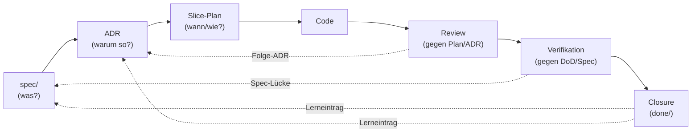

# Modul 1 — Der Entwicklungszyklus

> **Aufwand:** ca. 60 Min Lesen · 60 Min Übung.

## Engage

Drei Stunden Diskussion mit deinem Reviewer-Agent, am Ende setzt er den
PR auf "approve". Eine Woche später läuft Verifikation rot, weil das
Feature gegen ADR-3 verstößt. *Warum ist Review grün und Verifikation
rot?* Antwort am Ende dieses Moduls — und sie liegt im Diagramm unten.

## Mini-Glossar für dieses Modul

Modul 0 hat acht Grundbegriffe eingeführt; dieses Modul fügt acht weitere
hinzu. Die vollständigen Definitionen stehen in
[`../grundlagen/konventionen.md`](../grundlagen/konventionen.md#kernbegriffe);
für die ersten Seiten reichen die folgenden Ein-Satz-Anker:

| Begriff | Ein-Satz-Definition | Bild im Kopf |
|---|---|---|
| **Spec** | Lastenheft-Artefakt unter `spec/`. Quelle der Wahrheit für *was* gelten muss. | der Vertrag, gegen den geliefert wird. |
| **ADR** | Architecture Decision Record. Quelle der Wahrheit für *warum so* gebaut wird. | das versiegelte Protokoll einer Entscheidung. |
| **Slice** | Kleinste lieferbare Einheit eines Features mit eigenem Plan und eigener DoD. | eine Scheibe, die ein Agent in einem Lauf abschließen kann. |
| **DoD** | Definition of Done. Die Liste der Bedingungen, die ein Slice erfüllen muss. | "fertig" mit Häkchen, nicht nach Gefühl. |
| **Source Precedence** | Geordnete Liste der kanonischen Quellen. Bei Konflikt gewinnt die höher rangierende. | eine Rangordnung, die Konflikte *vor* dem Streit entscheidet. |
| **Fitness Function** | Maschinell prüfbare Architektur-Aussage (z. B. Modulgrenze, Latenzbudget). | ein Test, der nicht Code, sondern Architektur prüft. |
| **Closure-Eintrag** | Notiz im Slice, die festhält, *was beim Abschluss gelernt wurde*. | das letzte Stück Beleg, das eine Welle wirklich schließt. |
| **Steering Loop** | Wiederkehrendes Muster: Versagen beobachten → Guide/Sensor verbessern → Wiederholung reduzieren. | die Lernschleife, mit der der Harness mitwächst. |

Diese acht Begriffe trägt das Modul. Wenn beim ersten Lesen ein Begriff
unklar bleibt, ist die einsatzklare Tiefe später in den Modulen 2–4 (Spec,
ADR, Plan) verankert — nicht hier.

## Lernziele

Nach diesem Modul kannst du:

* den Lebenszyklus Spec → ADR → Plan → Code → Review → Verifikation → Closure als gerichteten Graphen *zeichnen* (Anwenden),
* sechs Artefakte und sechs Rollen einander *zuordnen* und Kreuzungen *begründen* (Analysieren),
* die Traceability-Kette für einen realen Slice *prüfen* (Analysieren),
* eine Source Precedence für ein eigenes Repo *entwerfen* (Erschaffen).

## Lebenszyklus als Diagramm

Die durchgezogenen Pfeile sind der *Vorwärtspfad* (was wird gebaut), die
gestrichelten der *Rückwärtspfad* (was lernt der Harness daraus). Beide
Richtungen sind Pflicht — eine Kette ohne Rückverweise ist nicht
auditierbar.

**Auflösung des Engage-Falls:** Review prüft Code gegen *Plan und ADR*.
Wenn der Plan die ADR-Verletzung nicht antizipiert hat, sieht Review
sie nicht. Verifikation prüft Code gegen *DoD und Spec* (und dort
referenzierte ADRs). Das ist genau der Grund, warum Review und
Verifikation getrennte Rollen sind — siehe [Modul 7](../03-agenten/modul-07-agentenrollen.md).

## Lab-Bezug

* `docs/plan/planning/in-progress/roadmap.md`
* Verzeichnisstruktur des Begleit-Repos (siehe [`../grundlagen/konventionen.md`](../grundlagen/konventionen.md))

## Themen

* Lebenszyklus
* Rollen
* Verantwortlichkeiten
* Artefakte
* Traceability

## Kernidee

Jedes Artefakt verweist nach oben (Begründung) und nach unten
(Konsequenz). Eine Kette ohne Rückverweise ist nicht auditierbar.

## Typische Fehlvorstellungen

- **"Plan ist nur eine Liste von Tickets."** — Plan ist die Stelle, an der Spec und ADR auf einen Code-Diff zusammenfallen. Ohne Bezugs-IDs zu Spec/ADR ist der Plan nicht prüfbar (und damit kein Plan, sondern eine Liste).
- **"Closure ist Schließen des Tickets."** — Closure verlangt einen Lerneintrag im Slice. Ohne Lerneintrag wird die Welle nicht "fertig", sondern nur "weg".
- **"Source Precedence kann man später festlegen."** — Wer das erste Mal ein Konflikt zwischen AGENTS.md und Spec hat und dann erst überlegt, hat den Konflikt bereits in den Code laufen lassen.

## Übungen

* Zeichne den Zyklus für ein Mini-Feature auf einem Blatt
* Identifiziere im Begleit-Repo einen Slice und folge der Kette Spec → ADR → Plan → PR
* Schreibe einen Source-Precedence-Block für ein eigenes Repo als ersten Abschnitt einer neuen `harness/README.md` (Vorlage in [`/lab/templates/harness/README.template.md`](../../../lab/templates/harness/README.template.md))

Nach den Übungen: [Reflexionsvorlage](../grundlagen/reflexion-vorlage.md).

## Selbstcheck

* **(Erinnern)** Nenne die sieben Stationen des Lebenszyklus in der Reihenfolge des Vorwärtspfads (Spec → … → Closure).
* Welche Information darf nur in der Spec stehen, welche nur im ADR?
* Was passiert, wenn ein Slice fertig ist, aber kein Closure-Eintrag existiert?

### Selbstcheck-Rubrik

| Frage | rudimentär | solide | exzellent |
|---|---|---|---|
| Sieben Stationen in Reihenfolge? | drei oder vier Stationen, ohne Reihenfolge | Spec → ADR → Plan → Code → Review → Verifikation → Closure. Vorwärtspfad sauber, Closure als eigene Station. | + Rückwärtspfade benannt: Closure → Spec/ADR (Lerneintrag), Verifikation → Spec (Spec-Lücke), Review → ADR (Folge-ADR). Wer die Rückwärtspfade nicht kennt, hat eine Liste, keine Kette. |
| Spec vs. ADR — wo welche Info? | "Spec = was, ADR = warum." | Spec = vertragliche Anforderung mit Akzeptanzkriterien; ADR = Lösungsbegründung; Bezug per ID. | + Spec-Stratifizierung (Lastenheft/Spezifikation/Architektur), inkl. Regel "ADR darf Spezifikation, nicht Lastenheft schärfen". |
| Slice fertig, aber kein Closure-Eintrag? | "Ist nicht fertig." | Slice gilt nicht als `done/`, weil Lerneintrag fehlt; Welle kann nicht schließen. | + Folge für Steering Loop: ohne Closure-Eintrag wird das Versagensmuster nicht beobachtbar, also wird derselbe Fehler dreimal gemacht (Lücke wird unsichtbar). |

## Weiterlesen

* Source Precedence im Detail: [`../grundlagen/konventionen.md#source-precedence`](../grundlagen/konventionen.md#source-precedence)
* Nächstes Modul: [Modul 2 — Lastenheft und Spezifikation](modul-02-lastenheft.md)
