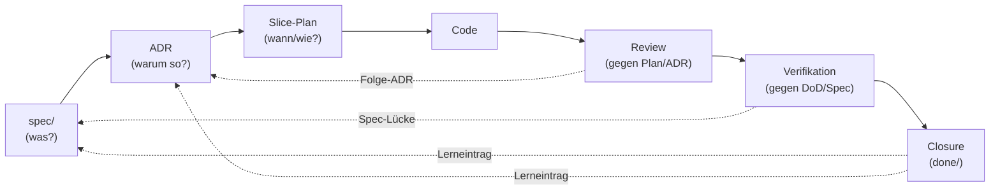

# Modul 1 — Der Entwicklungszyklus

> **Aufwand:** ca. 60 Min Lesen · 60 Min Übung.

## Engage

Drei Stunden Diskussion mit deinem Reviewer-Agent, am Ende setzt er den
PR auf "approve". Eine Woche später läuft Verifikation rot, weil das
Feature gegen ADR-3 verstößt. *Warum ist Review grün und Verifikation
rot?* Antwort am Ende dieses Moduls — und sie liegt im Diagramm unten.

## Mini-Glossar für dieses Modul

Modul 0 hat acht Grundbegriffe eingeführt; dieses Modul fügt acht weitere
hinzu. Die vollständigen Definitionen stehen in
[`../grundlagen/konventionen.md`](../grundlagen/konventionen.md#kernbegriffe);
für die ersten Seiten reichen die folgenden Ein-Satz-Anker:

| Begriff | Ein-Satz-Definition | Bild im Kopf |
|---|---|---|
| **Spec** | Lastenheft-Artefakt unter `spec/`. Quelle der Wahrheit für *was* gelten muss. | der Vertrag, gegen den geliefert wird. |
| **ADR** | Architecture Decision Record. Quelle der Wahrheit für *warum so* gebaut wird. | das versiegelte Protokoll einer Entscheidung. |
| **Slice** | Kleinste lieferbare Einheit eines Features mit eigenem Plan und eigener DoD. | eine Scheibe, die ein Agent in einem Lauf abschließen kann. |
| **DoD** | Definition of Done. Die Liste der Bedingungen, die ein Slice erfüllen muss. | "fertig" mit Häkchen, nicht nach Gefühl. |
| **Source Precedence** | Geordnete Liste der kanonischen Quellen. Bei Konflikt gewinnt die höher rangierende. | eine Rangordnung, die Konflikte *vor* dem Streit entscheidet. |
| **Fitness Function** | Maschinell prüfbare Architektur-Aussage (z. B. Modulgrenze, Latenzbudget). | ein Test, der nicht Code, sondern Architektur prüft. |
| **Closure-Eintrag** | Notiz im Slice, die festhält, *was beim Abschluss gelernt wurde*. | das letzte Stück Beleg, das eine Welle wirklich schließt. |
| **Steering Loop** | Wiederkehrendes Muster: Versagen beobachten → Guide/Sensor verbessern → Wiederholung reduzieren. | die Lernschleife, mit der der Harness mitwächst. |

Diese acht Begriffe trägt das Modul. Wenn beim ersten Lesen ein Begriff
unklar bleibt, ist die einsatzklare Tiefe später in den Modulen 2–4 (Spec,
ADR, Plan) verankert — nicht hier.

## Lernziele

Nach diesem Modul kannst du:

* den Lebenszyklus Spec → ADR → Plan → Code → Review → Verifikation → Closure als gerichteten Graphen *zeichnen* (Anwenden · konzeptuell),
* sechs Artefakte und sechs Rollen einander *zuordnen* und Kreuzungen *begründen* (Analysieren · konzeptuell),
* die Traceability-Kette für einen realen Slice *prüfen* (Analysieren · prozedural),
* eine Source Precedence für ein eigenes Repo *entwerfen* (Erschaffen · prozedural).

## Lebenszyklus als Diagramm



Die durchgezogenen Pfeile sind der *Vorwärtspfad* (was wird gebaut), die
gestrichelten der *Rückwärtspfad* (was lernt der Harness daraus). Beide
Richtungen sind Pflicht — eine Kette ohne Rückverweise ist nicht
auditierbar.

**Auflösung des Engage-Falls:** Review prüft Code gegen *Plan und ADR*.
Wenn der Plan die ADR-Verletzung nicht antizipiert hat, sieht Review
sie nicht. Verifikation prüft Code gegen *DoD und Spec* (und dort
referenzierte ADRs). Das ist genau der Grund, warum Review und
Verifikation getrennte Rollen sind — siehe [Modul 7](../03-agenten/modul-07-agentenrollen.md).

## Lab-Bezug

* `docs/plan/planning/in-progress/roadmap.md`
* Verzeichnisstruktur des Begleit-Repos (siehe [`../grundlagen/konventionen.md`](../grundlagen/konventionen.md))

## Themen

* Lebenszyklus
* Rollen
* Verantwortlichkeiten
* Artefakte
* Traceability

## Kernidee

Jedes Artefakt verweist nach oben (Begründung) und nach unten
(Konsequenz). Eine Kette ohne Rückverweise ist nicht auditierbar.

## Typische Fehlvorstellungen

- **"Plan ist nur eine Liste von Tickets."** — Plan ist die Stelle, an der Spec und ADR auf einen Code-Diff zusammenfallen. Ohne Bezugs-IDs zu Spec/ADR ist der Plan nicht prüfbar (und damit kein Plan, sondern eine Liste).
- **"Closure ist Schließen des Tickets."** — Closure verlangt einen Lerneintrag im Slice. Ohne Lerneintrag wird die Welle nicht "fertig", sondern nur "weg".
- **"Source Precedence kann man später festlegen."** — Wer das erste Mal ein Konflikt zwischen AGENTS.md und Spec hat und dann erst überlegt, hat den Konflikt bereits in den Code laufen lassen.

## Worked Example: einen Source-Precedence-Block aus einem konfliktbehafteten Repo destillieren

> **Wenn du Source-Precedence-Tabellen routiniert für neue Repos schreibst und Konflikte zwischen `AGENTS.md`, `README.md` und Spec/ADR ohne Rückfrage entscheidest, springe zu [§Übungen](#übungen).** Worked Example zeigt den ersten Aufbau für ein Repo, das *vor* Modul 1 nur lose Dokumente hatte; ist die Disziplin bereits da, kostet das Mitlesen Last (Expertise-Reversal).

**Ausgangssituation:** Dein Repo hat — typischer Bestand vor diesem
Modul — folgende Doku-Artefakte:

| Datei | Stand |
|---|---|
| `README.md` | "Projekt-Überblick", 2 Jahre alt, einige Befehle veraltet |
| `AGENTS.md` | vor 6 Wochen für einen Agenten geschrieben, mit drei Hard Rules |
| `docs/architecture.md` | Architektur-Diagramm, ohne ID-Schema |
| `spec/lastenheft.md` | gerade erst angelegt, vier Akzeptanzkriterien |
| `docs/plan/adr/0001-...md` | eine erste ADR (Accepted), zwei weitere im Entwurf |

Drei Probleme schwelen: (1) Wenn `AGENTS.md` einen Befehl nennt, den
das `Makefile` nicht hat, wer hat recht? (2) Wenn die ADR eine
Architekturregel verschärft, die im `README.md` lockerer steht, welche
gilt? (3) Wenn ein neuer Implementer kommt und beide widersprechen, an
welcher Quelle hört er zuerst?

Ohne Source Precedence beantwortet jede dieser Fragen die letzte
Person, die etwas sagt. Mit Source Precedence beantwortet sie die
Tabelle.

**Schritt 1 — Kanonische Quellen sammeln, Mehrfach-Quellen erkennen.**
Liste alle Dokumente, die *normativ* etwas behaupten ("so soll es
sein"). Marketing-Texte, Tutorials, externe Wiki-Seiten gehören nicht
dazu. Ergebnis-Form: eine flache Liste *vor* der Ranking-Diskussion.

```
spec/lastenheft.md
spec/spezifikation.md            (existiert noch nicht — anlegen?)
spec/architecture.md             (Umbenennung von docs/architecture.md)
docs/plan/adr/*.md
docs/plan/planning/in-progress/roadmap.md
docs/user/operations.md          (existiert noch nicht — verschieben?)
README.md
AGENTS.md
harness/README.md                (neue Datei dieses Moduls)
```

Beobachtung: zwei Lücken (`spezifikation.md`, `docs/user/*`) und eine
Umbenennung (`docs/architecture.md` → `spec/architecture.md`) tauchen
*durch* das Listing auf. Das ist kein Nebenprodukt — das ist die
Hauptwirkung von Schritt 1.

**Schritt 2 — Rangkriterien festlegen, nicht erfinden.** Die Reihenfolge
ist nicht Geschmacksfrage; sie folgt zwei Achsen:

1. **Vertragliche Bindung absteigend.** Lastenheft (Abnahme-bindend) →
   Spezifikation (technisch fortschreibbar) → Architektur (Konstanten
   der Lösung) → ADRs (Einzelentscheidungen) → Roadmap (aktuelle Welle)
   → Operativ-Doku → Allgemein-Doku.
2. **Schreib-Frequenz absteigend.** Lastenheft wird selten geändert
   (jedes Update ist Spec-Disziplin). `AGENTS.md` wird oft angepasst.
   Wer die Reihenfolge umdreht, lässt die Agent-Briefing-Datei
   stillschweigend die Spec überschreiben — exakt die Drift, gegen die
   Source Precedence erfunden wurde.

Die `harness/README.md` selbst rangiert *unten*: sie ist ein
Einstiegspunkt, keine neue Quelle.

**Schritt 3 — Tabelle entwerfen.** In `harness/README.md`:

```markdown
## Source precedence

| Rang | Datei | Charakter |
|---|---|---|
| 1 | [`spec/lastenheft.md`](../spec/lastenheft.md) | vertraglich abnahmebindend |
| 2 | [`spec/spezifikation.md`](../spec/spezifikation.md) | technisch fortschreibbar |
| 3 | [`spec/architecture.md`](../spec/architecture.md) | Komponenten/Sequenzen, meilensteinfrei |
| 4 | [`docs/plan/adr/`](../docs/plan/adr/) | Architekturentscheidungen |
| 5 | [`docs/plan/planning/in-progress/roadmap.md`](../docs/plan/planning/in-progress/roadmap.md) | aktuelle Welle |
| 6 | [`docs/user/*`](../docs/user/) | Operations, Quality, Releasing |
| 7 | [`README.md`](../README.md) | Projekt-Überblick |
| 8 | [`AGENTS.md`](../AGENTS.md) | Agent-Briefing |
| 9 | diese Datei | Harness-Einstieg |
```

Vorlage:
[`/lab/templates/harness/README.template.md`](../../../lab/templates/harness/README.template.md).
Neun Ränge sind ein Maximum — wer mehr braucht, hat
Mehrfach-Repräsentationen, die in den Schichten 1–3 gebündelt werden
sollten.

**Schritt 4 — Konfliktauflösungs-Klausel daneben setzen.** Eine
Tabelle allein wirkt nicht; sie braucht den Satz, der ihre Anwendung
*erzwingt*:

```markdown
Wenn diese Datei einer kanonischen Quelle widerspricht, **gewinnt die
kanonische Quelle**, und diese Datei wird angepasst.
```

Derselbe Satz gehört spiegelbildlich in `AGENTS.md` (mit
"AGENTS.md" statt "diese Datei"). Damit hat jeder Implementer und jeder
Agent ein eindeutiges Verfahren: bei Konflikt → höher rangierende
Quelle, niedriger rangierende anpassen.

**Schritt 5 — Bezug zur Spec-Stratifizierung herstellen.** Die drei
Spec-Ebenen (Lastenheft / Spezifikation / Architektur) haben *intern*
ebenfalls eine Precedence: das Lastenheft schärft die Spezifikation,
die Spezifikation schärft die Architektur — niemals andersherum. Diese
Regel kommt als Kurzhinweis in den Block, weil sie sonst beim ersten
Konflikt verloren geht:

```markdown
**Spec-Stratifizierung.** Innerhalb der Spec gilt: Lastenheft (1) →
Spezifikation (2) → Architektur (3). Eine ADR darf die Spezifikation
schärfen, niemals das Lastenheft. Wer das Lastenheft per ADR ändern
will, ändert in Wahrheit die Spec — und das ist ein eigener Slice.
```

Volldefinition siehe
[`../grundlagen/konventionen.md`](../grundlagen/konventionen.md#source-precedence).

**Schritt 6 — Bewusstes Brechen: einen Konflikt provozieren.** Ändere
in `AGENTS.md` eine Hard Rule, die einer ADR widerspricht (z. B.
"Direkt-DB-Zugriff erlaubt", obwohl ADR-0001 hexagonale Architektur
festschreibt). Beobachte:

| Beobachtung | Diagnose |
|---|---|
| Implementer fragt nicht nach, schreibt Code gegen AGENTS.md | Source Precedence ist nicht *durchgesetzt* — Konfliktauflösungs-Klausel fehlt im AGENTS.md-Header. |
| Implementer stoppt, weist auf Konflikt hin | Source Precedence wirkt — der Konflikt wird sichtbar, bevor er Code wird. |
| Implementer ändert die ADR | Falsche Auflösungsrichtung: ADRs sind Rang 4, AGENTS.md Rang 8 — die niedrigere Quelle muss angepasst werden. |

Erwartete Reflexion: *Welche der drei Beobachtungen war deine?* Genau
diese verrät, wo die Source Precedence im Repo heute *gelebt* wird —
und wo sie nur Papier ist.

Sechs Schritte, ein Block in `harness/README.md`, eine Konfliktauflösung
mit Spiegelung in `AGENTS.md`. Der Test, ob er funktioniert, ist der
nächste Konflikt — nicht der nächste Lesedurchgang.

## Übungen

* Zeichne den Zyklus für ein Mini-Feature auf einem Blatt
* Identifiziere im Begleit-Repo einen Slice und folge der Kette Spec → ADR → Plan → PR
* Schreibe einen Source-Precedence-Block für ein eigenes Repo als ersten Abschnitt einer neuen `harness/README.md` (Vorlage in [`/lab/templates/harness/README.template.md`](../../../lab/templates/harness/README.template.md))

## Reflexion

Nach jeder Übung dieses Moduls kurz **schriftlich**:

1. **Was ist beobachtbar passiert?** — welche Diagramm-Kante hat gefehlt, welcher Rückverweis brach, welche ID war ohne Bezug?
2. **Welcher 2×2-Quadrant war Ursache?** — Computational/Inferential × Feedforward/Feedback (siehe [`konzeptkarte.md §2x2-Schnellanker`](../grundlagen/konzeptkarte.md#2x2-schnellanker)).
3. **Welche konkrete Steering-Loop-Aktion folgt?** — eine konkrete Harness-Änderung, keine vage Absicht.
4. **Welche eigene Vorstellung wurde unzufriedenstellend?** — Conceptual Change; Kandidaten in [`lernervorstellungen.md`](../grundlagen/lernervorstellungen.md).

Eintragsformat, "Wann *nicht* reagieren" und Anti-Antworten: [`reflexion-vorlage.md`](../grundlagen/reflexion-vorlage.md).

## Selbstcheck

* **(Erinnern)** Nenne die sieben Stationen des Lebenszyklus in der Reihenfolge des Vorwärtspfads (Spec → … → Closure).
* Welche Information darf nur in der Spec stehen, welche nur im ADR?
* Was passiert, wenn ein Slice fertig ist, aber kein Closure-Eintrag existiert?

### Selbstcheck-Rubrik

| Frage | rudimentär | solide | exzellent |
|---|---|---|---|
| Sieben Stationen in Reihenfolge? | drei oder vier Stationen, ohne Reihenfolge | Spec → ADR → Plan → Code → Review → Verifikation → Closure. Vorwärtspfad sauber, Closure als eigene Station. | + Rückwärtspfade benannt: Closure → Spec/ADR (Lerneintrag), Verifikation → Spec (Spec-Lücke), Review → ADR (Folge-ADR). Wer die Rückwärtspfade nicht kennt, hat eine Liste, keine Kette. |
| Spec vs. ADR — wo welche Info? | "Spec = was, ADR = warum." | Spec = vertragliche Anforderung mit Akzeptanzkriterien; ADR = Lösungsbegründung; Bezug per ID. | + Spec-Stratifizierung (Lastenheft/Spezifikation/Architektur), inkl. Regel "ADR darf Spezifikation, nicht Lastenheft schärfen". |
| Slice fertig, aber kein Closure-Eintrag? | "Ist nicht fertig." | Slice gilt nicht als `done/`, weil Lerneintrag fehlt; Welle kann nicht schließen. | + Folge für Steering Loop: ohne Closure-Eintrag wird das Versagensmuster nicht beobachtbar, also wird derselbe Fehler dreimal gemacht (Lücke wird unsichtbar). |

## Weiterlesen

* Source Precedence im Detail: [`../grundlagen/konventionen.md#source-precedence`](../grundlagen/konventionen.md#source-precedence)
* Nächstes Modul: [Modul 2 — Lastenheft und Spezifikation](modul-02-lastenheft.md)
