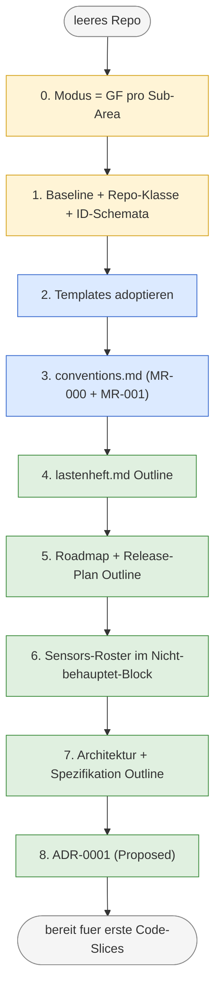
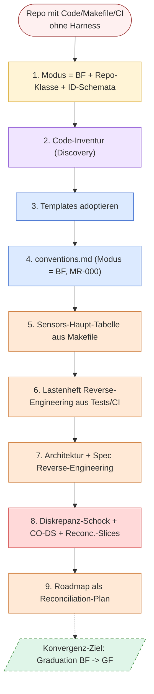

# Modul 2 — Harness-Bootstrap

> **Aufwand:** ca. 150 Min Lesen · 90 Min Übung. Spiralcurriculum:
> *Harness-Bootstrap*, *GF/BF-Modus* und *Phase-Reife* sind dir aus
> [Modul 1 Mini-Glossar](modul-01-entwicklungszyklus.md#mini-glossar-für-dieses-modul)
> dem Namen nach bekannt — hier werden sie zum Arbeitswerkzeug.

## Mini-Glossar für dieses Modul

Vier Begriffe — *Sub-Area* ist modul-eigen, die anderen drei sind
Vorgriffe auf später vertiefte Konzepte (Volldefinitionen in
[`../grundlagen/konventionen.md` §Kernbegriffe](../grundlagen/konventionen.md#kernbegriffe);
*BF-Sub-Area-Markierung* in
[Modul 7 §Worked Example A Schritt 6](../02-planung/modul-07-carveouts.md#worked-example-a-einen-carveout-dokumentieren)).
Der zentrale Begriff *Bootstrap-Modus (GF/BF/Hybrid)* wird im
Lehrtext §Kernidee und §Phasen×Modus-Matrix systematisch entwickelt
— sein "Bild im Kopf" ist die Matrix selbst und steht hier
bewusst nicht im Glossar.

| Begriff | Ein-Satz-Definition | Bild im Kopf |
|---|---|---|
| **Sub-Area** | Doku-/Code-Sektion, die als Träger einer Modus-Entscheidung dient — mit eigener Konventions-Härte (eigene `MR-NNN` möglich), eigener Inventur-Linie und eigener Pfad-/Datei-Familie im Repo. Qualifikations-Maßstab (drei Inklusions-Achsen, Schwelle ≥ 2) und Beispiele: [`../grundlagen/konventionen.md` §Was ist eine Sub-Area?](../grundlagen/konventionen.md#was-ist-eine-sub-area), §Übung 1 und §Worked Example 1. | nicht das Repo, nicht der Slice — die Strecke, die *ein* `MR-NNN` normiert. |
| **Adaptions-Block** *(Vorgriff auf konventionen.md)* | Sektion in `harness/conventions.md`, in der das Repo seine Baseline-Adaptionen als `MR-NNN`-Einträge deklariert. | das Notizbuch, in dem das Repo seine Abweichungen von der Baseline aufschreibt. |
| **BF-Sub-Area-Markierung** *(Vorgriff auf Modul 7)* | Modus-Deklaration im Adaptions-Block, die eine ganze Sub-Area als BF mit Graduation-Plan markiert — Alternative zur Carveout-Kaskade. | ein "hier wächst Wiese"-Schild für ein ganzes Beet, mit Datum für die Rasen-Graduierung. |
| **MR-NNN** *(Vorgriff auf konventionen.md)* | ID-Schema für *Module Rules* — die Konventions-Adaptionen im Adaptions-Block (Schwester zu `LH-FA-*` für Anforderungen). | Anker-Nummer einer einzelnen Konventions-Härtung. |

## Optionale Explorations-Vorab-Übung (Kapur-Stil)

Wenn du eine *echte* Productive-Failure-Variante (Kapur 2008, 2014)
ausprobieren willst: **vor** dem Lesen dieses Moduls 20 Minuten ohne
Anleitung klassifizieren.

> **Aufgabe (optional, 20 Min):** Liste drei *Sub-Areas* deines
> aktuellen Repos auf (z. B. *Konventionen*, *Spec-Schreibung*,
> *Test-Infrastruktur*, *Build-Pipeline*, *Architektur-Diagramme*).
> Notiere zu jeder:
>
> 1. *Was führt — Doku oder Code?* (Wenn die Doku führt und der Code
>    folgt: Greenfield-Modus. Wenn der Code führt und die Doku
>    folgt: Brownfield-Modus. Wenn unklar oder gemischt: Hybrid.)
> 2. *Woran erkennst du das?* (Ein konkretes Beobachtungs-Indiz pro
>    Sub-Area.)
> 3. *Wo bist du dir unsicher?* (Was würdest du nachschlagen müssen,
>    um die Klassifikation festzulegen?)
>
> Erfolg ist *nicht*, dass deine Klassifikation richtig ist. Erfolg
> ist, dass du fühlst, wo die Grenze zwischen GF und BF verläuft —
> und an welcher Stelle deine bisherige Intuition unsicher wird.

Nach dem Modul-Lesen: vergleiche deine Klassifikation mit dem
GF-Walkthrough (Worked Example 1) und dem BF-Walkthrough (Worked
Example 2) unten. Reflektiere mit
[`../grundlagen/reflexion-vorlage.md`](../grundlagen/reflexion-vorlage.md) —
insbesondere mit Frage 4 (welche Vorstellung von "klarer Modus" wurde
unzufriedenstellend?).

Wenn du keine Zeit hast: überspringen ist okay. Die Worked Examples
tragen das Modul auch ohne Vorab-Übung.

## Engage

Drei Antworten aus drei Projekten auf dieselbe Frage *"Wie war euer
Bootstrap?"*:

- **Greenfield-Erfahrene**: "Lastenheft schreiben, ADR ableiten,
  Konventionen anlegen, dann coden."
- **Brownfield-Erfahrene**: "Den Bestand auseinanderlesen, die
  Diskrepanz zur gewünschten Norm sehen, Reconciliation-Plan
  machen."
- **Skeptiker**: "Brauchen wir das wirklich, wenn das Repo eh schon
  läuft?"

Alle drei Stimmen treffen einen realen Punkt — aber jeweils für
unterschiedliche *Sub-Areas desselben* Repos. Wer das nicht trennt,
kommentiert die falschen Symptome: dem GF-Erfahrenen erscheint jeder
BF-Modus als Versagen; die Skeptiker-Frage ist legitim, hat aber eine
*sub-area-spezifische* Antwort (nicht "ja/nein für das Repo", sondern
"ja für diese, nein für jene Sub-Area"). Dieses Modul trennt.

## Lernziele

Nach diesem Modul kannst du:

* GF-, BF- und Hybrid-Modus *unterscheiden* und gegen die vier
  Harness-Linsen *verorten* (Verstehen · konzeptuell),
* dein eigenes Repo nach Modus pro Sub-Area *klassifizieren* und die
  Klassifikation in einer Tabelle *dokumentieren* (Anwenden ·
  prozedural),
* einen beobachteten Auslöser einer der vier Trigger-Klassen
  *zuordnen* und gegen die Phase-Reife des berührten Artefakts
  *spiegeln* (Analysieren · konzeptuell),
* eine Phasen-Karte für ein eigenes Artefakt *erstellen* oder einen
  Reconciliation-Plan für eine konkret beobachtete BF-Diskrepanz
  *entwerfen* (Erschaffen · prozedural),
* den eigenen Bootstrap-Modus pro Sub-Area aktiv *überwachen* und
  Modus-Wechsel als Signal *lesen* (Überwachen · metakognitiv) —
  Bootstrap-Diagnose ist eine Selbstführungs-Praxis, kein
  einmaliges Audit.

## Lab-Bezug

* `harness/conventions.md` und `harness/README.md` (Beispiel im
  Lab unter
  [`../../../lab/example/harness/`](../../../lab/example/harness/) —
  Bootstrap-Quelle für Modus-Deklaration pro Sub-Area).
* Vier Beispiel-Repos in BF-Modus klassifiziert:
  [`../grundlagen/fallstudien.md` §Beobachtung aus dem Ist-Zustand](../grundlagen/fallstudien.md#beobachtung-aus-dem-ist-zustand).

> **TODO-Anker:** Ein dediziertes Bootstrap-Lab folgt in einer
> späteren Welle (geplanter Pfad: unter
> [`../../../lab/example/exercises/`](../../../lab/example/exercises/);
> exakter Dateiname noch offen). Bis dahin sind die Übungen am
> eigenen Repo oder am vollausgefüllten Beispiel-Lab unter
> [`../../../lab/example/`](../../../lab/example/) durchführbar.

## Themen

* GF/BF/Hybrid-Modus pro Sub-Area: Definition, Abgrenzung gegen
  Repo-Klasse und Phase-Reife.
* Die vier Trigger-Klassen (siehe
  [`../grundlagen/konventionen.md` §Vier Trigger-Klassen](../grundlagen/konventionen.md#vier-trigger-klassen)):
  Sync, Promotion, Cross-Reference, Acceptance.
* Phasen-Karte als didaktisches Instrument: sektionsweise
  Reife-Visualisierung eines Artefakts.
* GF-Walkthrough: vom Modus-Beschluss bis zur ersten
  Konventionen-Iteration.
* BF-Walkthrough: Inventur, Diskrepanz-Schock, Reconciliation-Plan,
  Graduation-Trigger.
* Drei Anzeichen für einen Modus-Wechsel im laufenden Betrieb.

## Harness-Einordnung

Bootstrap ist die **initiale Anwendung des Steering-Loops**, laufend
ausgeführt, bis das Repo *steady state* erreicht. Was
[Modul 11 — Verification Harness](../04-qualitaet/modul-11-verification.md)
als laufende Praxis lehrt (Beobachtung → Guide/Sensor → Diff →
Closure), lehrt dieses Modul als *initiale Aufsetzungs-Praxis*:
gleiche Sensoren und Guides, andere Anwendungsphase. Die abstrakte
Verbindung steht in
[`../grundlagen/konventionen.md` §Verbindung zum Steering-Loop](../grundlagen/konventionen.md#verbindung-zum-steering-loop).

[Modul 1 §Schritt 0](modul-01-entwicklungszyklus.md#kernidee) hat den
Bootstrap-Modus als Kurz-Vorgriff eingeführt (Baseline und Modus als
Voraussetzung für den Lebenszyklus); dieses Modul ist die Vollform —
die *Diagnose-Praxis*, die Schritt 0 zur Vorbedingung jeder
modusabhängigen Aktion macht.

Gegen die vier Harness-Linsen aus
[`../grundlagen/konzeptkarte.md`](../grundlagen/konzeptkarte.md):

* **Drift** — Bootstrap ist der erste *Drift-Sensor*: ohne formellen
  Bootstrap bleibt jede spätere Drift unmessbar.
* **Reproduzierbarkeit** — der dokumentierte Modus pro Sub-Area ist
  Voraussetzung dafür, dass ein zweiter Lauf am selben Repo dieselben
  Klassifikationsentscheidungen trifft.
* **Auditierbarkeit** — der Bootstrap-Modus macht die *Begründung*
  jeder Folge-Entscheidung explizit.
* **Steering-Loop** — Bootstrap = initiale Steering-Loop-Anwendung
  (siehe oben).

## Vorab — was hältst du heute für wahr?

*Bevor du die Kernidee liest:* notiere in einem Satz deine spontane
Antwort auf jede dieser drei Fragen.

1. *"Bootstrap — ist das ein einmaliges Setup oder ein laufender
   Modus?"*
2. *"Wenn ein Repo in einer Sub-Area Greenfield ist, gilt das dann
   für das ganze Repo?"*
3. *"Wenn du sauber im Greenfield arbeitest, sind Trigger-Klassen
   Overhead — stimmt das?"*

Lass die Notiz neben dem Modul liegen. Am Modul-Ende prüft der
Selbstcheck genau diese drei Punkte — und vergleicht mit der scharfen
Konfrontation in §Typische Fehlvorstellungen.

## Kernidee

**Bootstrap ist ein fortlaufender Modus, kein einmaliges Event — und
er gilt pro Sub-Area, nicht pro Repo.** Der Modus ist ein beobachtbares
Verhältnis zwischen Code und Doku, kein Etikett auf dem Repo. Wer den
Modus pro Sub-Area diagnostizieren kann, weiß, *welcher* Trigger die
nächste sinnvolle Aktion auslöst — und spart sich das Ausprobieren auf
der Phasen-Ebene. Genau dieses Diagnose-Vermögen ist das
Lehr-Ergebnis dieses Moduls; die Modus-Wahl als Planungs-Entscheidung
(also: *welcher Modus gilt für jede vom nächsten Slice berührte
Sub-Area — und warum?* — der Slice selbst trägt keinen Modus, er
berührt nur Sub-Areas, die je einen tragen) folgt später in
[Modul 5 — Planning Harness](../02-planung/modul-05-planning-harness.md).

### Wann wechselt der Modus? Drei Anzeichen

Im laufenden Betrieb verändern sich Sub-Areas zwischen den Modi. Drei
beobachtbare Anzeichen, an denen sich ein Modus-Wechsel ankündigt:

1. **Diskrepanz-Häufung ändert sich** (Indikator in beide
   Richtungen). *BF → GF Graduation:* der Reconciliation-Backlog
   einer BF-Sub-Area schrumpft über mehrere Slices, neue Inventur-
   Schritte melden keine Diskrepanzen mehr. *GF → BF Drift:* in
   einer als GF gemeldeten Sub-Area werden plötzlich Diskrepanzen
   sichtbar (Tests ohne Spec-Anker, ADRs ohne Code-Bezug).
2. **Test-Bestand übertrifft Spec-Anker.** Wenn das Test-Bestand
   strukturell mehr prüft als die Spec behauptet (z. B. Edge-Case-
   Tests ohne `LH-*`-ID), ist die Sub-Area de facto **von GF nach BF
   gedriftet** — der Code "weiß" mehr als die Doku. Symptom: bei
   jeder Code-Änderung muss die Spec nachgezogen werden, statt
   umgekehrt.
3. **Carveout-Auflösung schließt eine BF-Sub-Area.** Wenn ein
   `CO-DS-*`-Carveout durch einen Reconciliation-Slice geschlossen
   wird (orphan code bekommt nachträglich seinen Anforderungs-Anker
   in der Spec oder als retroaktiver ADR), nähert sich die zugehörige
   Sub-Area der **Graduation zu GF**. Symptom: der
   Reconciliation-Backlog sinkt um genau einen Eintrag, der
   schließende Slice trägt einen "CO-DS-NNN aufgelöst durch
   LH-FA-MMM"-Hinweis im Closure-Block, und die nächste Inventur
   meldet die Sub-Area mit einer Diskrepanz weniger.

   **Umgekehrt: eine Diskrepanz-Häufung *eröffnet* eine BF-Sub-Area.**
   Wenn mehrere Carveouts denselben Geltungsbereich tragen oder sich
   ein systemisches "Code existiert vor Doku"-Muster zeigt, ist die
   richtige Antwort eine BF-Sub-Area-Markierung mit Graduation-Plan,
   nicht eine Carveout-Kaskade — siehe
   [Modul 7 §Worked Example A Schritt 6](../02-planung/modul-07-carveouts.md#worked-example-a-einen-carveout-dokumentieren)
   (Vorgriff — vertieft in Modul 7, kann beim ersten Lesen
   übersprungen werden).
   Die Carveout↔BF-Klammer trägt damit in beide Richtungen: Auflösung
   schließt eine BF-Sub-Area, Häufung eröffnet eine.

Diese drei Anzeichen sind die Sensor-Seite der Bootstrap-Diagnose
und das Werkzeug für die metakognitive Reflexionsfrage am Modul-Ende.

## Typische Fehlvorstellungen

* **FV1:** *"Bootstrap ist ein einmaliges Initialisierungs-Event,
  kein laufender Modus."* — Korrektur: Bootstrap ist ein fortlaufender
  Modus, der sich über Sub-Areas und Phase-Reife entwickelt. Jeder
  Trigger ist ein Bootstrap-Mikro-Event. Wer Bootstrap als Setup
  versteht, übersieht die Modus-Wechsel, die im laufenden Betrieb
  passieren, und produziert daher dauerhaft Findings ohne
  Modus-Bewusstsein.
* **FV2:** *"GF/BF ist eine Eigenschaft des Repos als Ganzes."* —
  Korrektur: Modus gilt **pro Sub-Area**. Ein Repo kann in den
  *Konventionen* BF und in der *Spec-Schreibung* GF sein. Die vier
  Beispiele in
  [`../grundlagen/fallstudien.md` §Beobachtung aus dem Ist-Zustand](../grundlagen/fallstudien.md#beobachtung-aus-dem-ist-zustand)
  zeigen diese Sub-Area-Heterogenität explizit.
* **FV3:** *"Wer im Greenfield arbeitet, kann auf die Trigger-Klassen
  verzichten."* — Korrektur: auch im GF-Modus entstehen Trigger
  (Diskrepanz, Promotion-Auslöser etc.), nur nicht aus
  *Bestandsinventur*, sondern aus *Konsistenzprüfung des neu
  Geschaffenen*. Die vier Klassen gelten in jedem Modus; was sich
  ändert, ist die Frequenz und die typische Auslöse-Quelle.
* **FV4:** *"Brownfield ist eine Notlage, die man möglichst schnell
  überwindet."* — Korrektur: BF ist der *typische* Ausgangspunkt
  realer Repos. Die vier Fallstudien sind alle in BF (siehe oben).
  BF kann systematisch in Richtung GF graduieren — *Graduation* ist
  eine ausgewiesene Bedingung mit Konvergenz-Auftrag, kein
  Wunschdenken. Die Frage ist nicht *ob* graduiert wird, sondern
  *wie weit* das Repo schon ist und *welche Sub-Area* als nächstes
  graduations-reif wird.
* **FV5:** *"Jede Struktur (Verzeichnis/Sektion) ist automatisch eine
  Sub-Area — eine Granularitäts-Prüfung erübrigt sich."* — Korrektur:
  Eine Struktur qualifiziert erst über die drei Inklusions-Achsen
  (Schwelle ≥ 2, siehe
  [`../grundlagen/konventionen.md` §Was ist eine Sub-Area?](../grundlagen/konventionen.md#was-ist-eine-sub-area)).
  Der übersprungene Qualifikations-Schritt erzeugt **beide**
  Granularitäts-Fehler zugleich: *zu grob* — ein Aggregat wie *"Backend"*
  wird als *eine* Sub-Area gelabelt, statt in mehrere aufgeteilt; *zu
  fein* — ein substanzloses Verzeichnis (*"Struktur ohne Substanz"*, nur
  eine Achse erfüllt) wird zur Sub-Area erhoben, obwohl es eine
  Sub-Area-*Aspirantin* bleibt. Lernerursprung: dieselbe Wurzel wie die
  Modul-5-Vorstellung *"wenn der Slice klein ist, ist die Sub-Area GF"*
  ([`../grundlagen/lernervorstellungen.md` §Über Planung](../grundlagen/lernervorstellungen.md#über-planung-modul-57))
  — Reife/Substanz wird aus einem Oberflächenmerkmal (Existenz, Größe)
  *abgelesen* statt über die Achsen *geprüft*. (Die Modul-5-Vorstellung
  bleibt eine *Modus*-FV; FV5 teilt nur die kognitive Wurzel, nicht die
  Achse.)

(Weitere Fehlvorstellungen ergänzen sich aus der
Überzeugungs-Check-Ausbeute oben — wer mit "Bootstrap = Setup"
gestartet ist, trägt FV1 implizit.)

## Worked Example 1: Greenfield-Bootstrap (DocSearch-Walkthrough)

**Story.** Ein neues Repo `docsearch` soll mit dem Kurs-Harness von
Grund auf aufgesetzt werden — eine Such-Engine über interne
Dokumente. Es gibt noch keinen Code, kein Lastenheft, keine ADRs.
Die Sub-Areas (Konventionen, Spec, Architektur, ADR) starten alle
im GF-Modus: Doku führt, Code wird daran gemessen. Neun Schritte
führen vom leeren Repo zum ersten Code-Slice.

### Übersicht: GF-Walkthrough als Mermaid-Diagramm



Drei Phasen sind farbig sichtbar: *Orient* (gelb, Schritte 0–1),
*Action* (blau, Schritte 2–3), *Content* (grün, Schritte 4–8).

### Detail-Tabelle (Schritte 0–4: Setup-Phase)

Trigger-Anker (T1, T2, T4, T5, T6, T7) sind Instanz-Beispiele der
vier Trigger-Klassen aus
[`../grundlagen/konventionen.md` §Vier Trigger-Klassen](../grundlagen/konventionen.md#vier-trigger-klassen) —
die abstrakten Definitionen stehen dort, hier nur die Instanzen.

*Hinweis zur T-Nummerierung:* Die Trigger sind durch das
DocSearch-Beispiel nummeriert (T1 = Pointer in README,
T2 = Pointer in AGENTS, T4 = Promotion, T5 = erste ADR-Vorschläge,
T6 = Cross-Reference Spec ↔ ADR, T7 = ADR-Review-Auslöser).
**T3 ist BF-spezifisch** und tritt im Greenfield-Walkthrough nicht
auf — er erscheint in Worked Example 2 als Sync-Trigger in
BF-Diskrepanz-Auslöse-Variante.

| # | Aktion | Berührte Dateien (Phasen-Übergang) | Trigger |
|---|---|---|---|
| 0 | Modus pro Sub-Area entscheiden: GF für *Konventionen*, *Spec*, *Architektur*, *ADR* (alle vier Doku-führt). | keine | keine — Vorbedingung |
| 1 | Baseline-Auswahl (Kurs-Harness) + Repo-Klasse (Tooling) + ID-Schemata festlegen (`LH-*`, `ARC-*`, `SPEC-*`, `MR-*`) | keine | reift 2/3 |
| 2 | Templates aus [`../../../lab/templates/`](../../../lab/templates/) kopieren | alle Skelette **0 → 1** | keine |
| 3 | `harness/conventions.md` mit MR-000 (Baseline) + MR-001 (`ARC-*`/`SPEC-*` als Adaption) | `conventions.md` 0 → 1 | **T1** (Pointer auf `conventions.md` in `harness/README.md`), **T2** (Pointer in `AGENTS.md`) |
| 4 | `spec/lastenheft.md` Outline mit `LH-FA-*`/`LH-QA-*` | `lastenheft.md` 1 → 2 | keine direkt |

### Detail-Tabelle (Schritte 5–8: Inhalts-Phase)

| # | Aktion | Berührte Dateien (Phasen-Übergang) | Trigger |
|---|---|---|---|
| 5 | `docs/plan/planning/roadmap.md` mit Welle + Release-Mapping; `releasing.md` mit Release-Strategie | `roadmap.md` 1 → 2; `releasing.md` 1 → 2 | keine |
| 6 | Sensors-Roster im "Nicht behauptet"-Block (Prosa-Pointer-Liste, kein Status) | `harness/README.md` §Sensors Sub-1 → Sub-2; `AGENTS.md` §4 Sub-1 → Sub-2 | **T4** (Promotion-Auslöser bei erstem Code-Slice) |
| 7 | `spec/architecture.md` + `spec/spezifikation.md` Outline mit `ARC-*`/`SPEC-*` | beide 1 → 2 | **T5** (erste ADR-Vorschläge aus Architektur-Outline) |
| 8 | `docs/plan/adr/0001-doc-source-of-truth.md` mit Status *Proposed* | `0001-…md` 0 → 2; ADR-Index 1 → 2 | **T6** (Cross-Reference Spec ↔ ADR), **T7** (ADR-Review-Auslöser) |
| Bootstrap-Ende | Bereit für ersten Code-Slice — Workflow-Übergang | — | — |

**Anmerkung zur Tabellen-Splittung.** Die Setup-Phase (0–4) etabliert
*was wo lebt*; die Inhalts-Phase (5–8) füllt mit *normativem Inhalt*.
Trigger entstehen ab Schritt 3 (Konventionen-Adoption); die Setup-Phase
legt die *Quellen* an, die Inhalts-Phase erzeugt die *Folge-Bezüge*
zwischen Dokumenten und ADRs. Die Tabellen-Trennung macht das
kognitiv lesbar — die Phasen verschwimmen sonst.

### Wie sehen T1 und T2 konkret aus?

Schritt 3 ist die erste Stelle, an der Trigger entstehen — Lerner
arbeiten danach oft mit der abstrakten Aussage *"T1 = Pointer in
harness/README.md auf conventions.md"*, ohne ein Bild davon zu haben,
wie der Pointer im Markdown aussieht. Drei kurze Code-Blöcke machen
das konkret:

**Schritt 3 — neu angelegte `harness/conventions.md`** (Phase 0 → 1):

```markdown
# Konventionen — docsearch

## Adaptions-Block

MR-000: Baseline = ai-harness-course/0.4
MR-001: Spec-Stratifizierung mit ARC-*/SPEC-*/LH-* (Adaption)
```

**T1 — Pointer in `harness/README.md`** (existierende Sektion ergänzen):

```markdown
<!-- harness/README.md, Sektion "Konventionen" -->
Strukturregeln und Adaptionen siehe [`conventions.md`](conventions.md).
```

**T2 — Pointer in `AGENTS.md`** (Source-Precedence-Liste ergänzen):

```markdown
<!-- AGENTS.md §Source Precedence -->
1. spec/lastenheft.md
2. harness/conventions.md      <!-- neu ergänzt, T2 -->
3. docs/plan/adr/*.md
...
```

Die zwei Pointer sind das, was die abstrakte Trigger-Klasse *Sync*
konkret macht: sobald `conventions.md` existiert, müssen die zwei
Dokumente, die *auf* `conventions.md` verweisen, einen entsprechenden
Eintrag bekommen. Wer den Eintrag vergisst, hat einen klassischen
**Sync-Drift** — der Doku-Konsistenz-Agent
([Modul 15 §Observability](../05-betrieb/modul-15-observability.md))
findet das später als Inkonsistenz.

## Worked Example 2: Brownfield-Bootstrap mit Discovery und Reconciliation

> **Last-Reduktion für den ersten Durchgang:** Wer den Kurs mit
> Greenfield-Fokus liest (neues Repo, kein Altbestand), kann Worked
> Example 2 beim *ersten* Durchgang aufschieben und nach der
> Phasen×Modus-Matrix (§unten) zurückkehren — der BF-Walkthrough trägt
> die *Diskrepanz-Schock*- und *Reconciliation*-Mechanik, die erst greift,
> sobald du ein bestehendes Repo bootstrappst. **Aufschub, keine
> Auslassung:** Übung 2 (Trigger-Klassen) und der Selbstcheck setzen WE2
> voraus — vor ihnen zurückkehren.

**Story.** Ein bestehendes Repo `legacy-search` (Code, Makefile, CI,
Tests) soll formellen Harness-Einstieg bekommen. Es gibt keine
Spec, keine ADRs, kein `harness/conventions.md` — wohl aber
Build-Pipeline, Tests, dokumentierte Konventionen (verstreut in
README, Commit-Messages, Code-Kommentaren). Die Sub-Areas starten
alle im BF-Modus: Code führt, Doku folgt mit Inventur-Auftrag. Neun
Schritte führen vom inventur-bedürftigen Repo zum Reconciliation-
Backlog mit sichtbarem Konvergenzpfad zu GF.

### Übersicht: BF-Walkthrough als Mermaid-Diagramm



Vier Phasen sind farbig sichtbar: *Orient* (gelb), *Discover* (lila,
neu in BF), *Action* (blau), *Content-BF* (orange), *Diskrepanz-
Schock* (rot, neu in BF), *Goal/Graduation* (grün gestrichelt).

### Detail-Tabelle (Schritte 1–4: Inventur-Phase, was bei BF anders ist)

*Hinweis zur Schritt-Nummerierung:* BF nimmt die Modus-Setzung in
Schritt 1 mit (wo GF Schritt 0 trägt), weil in BF die
Repo-Klassen-Wahl und die Modus-Antizipation zusammenfallen — beide
hängen von der ersten Inventur-Beobachtung ab und können nicht *vor*
dem ersten Hinschauen entschieden werden. Daher die asymmetrische
Nummerierung GF 0–8 vs. BF 1–9.

| # | Aktion | BF-Besonderheit gegenüber GF |
|---|---|---|
| 1 | GF-Schritte 0 und 1 in einem Schritt zusammengefasst: Modus-Antizipation "BF pro Sub-Area" + Baseline-Auswahl + Repo-Klasse + ID-Schemata festlegen | + explizite Modus-Setzung mit Sub-Area-Aufzählung; Repo-Klassen-Wahl und Modus-Antizipation fallen zusammen |
| 2 | **Code-Inventur (Discovery):** Makefile, CI, Tests, README, Commit-Messages inventarisieren als Lerner-Schritt | **neu in BF** — kein Repo-Artefakt entsteht, nur Lerner-Wissen |
| 3 | Templates adoptieren | wie GF |
| 4 | `harness/conventions.md` mit Modus = BF pro Sub-Area, MR-000-Aussage | Modus-Block anders strukturiert (BF-Deklarationen + Konvergenz-Auftrag pro Sub-Area) |

### Detail-Tabelle (Schritte 5–9: Reconciliation-Phase)

| # | Aktion | BF-Besonderheit gegenüber GF |
|---|---|---|
| 5 | Sensors-Haupt-Tabelle direkt aus Makefile-Kommentaren entstehen lassen | **gegenteilig zu GF** — Targets existieren, keine "Nicht behauptet"-Promotion nötig; **T3** (Sync-Trigger in BF-Diskrepanz-Auslöse-Variante: Sensor-Lücke = impliziter Pointer-Mismatch zwischen Makefile-Realität und Sensor-Tabelle) wird sichtbar |
| 6 | Lastenheft aus Code/Tests/CI rückbauen | Inventur-Umkehr; Diskrepanz-Material entsteht (Code ohne Anforderung, Test ohne LH-Bezug) |
| 7 | Architektur + Spezifikation aus `src/` rückbauen; **retroaktive ADRs** für implizite Entscheidungen | ADRs teils retroaktiv mit Status *Accepted* (oder *Superseded*, falls Entscheidung schon revidiert) |
| 8 | **Diskrepanz-Schock:** Diskrepanzen klassifizieren als (a) `CO-DS-*` (orphan code ohne Anforderung), (b) Reconc.-Slice (orphan requirement ohne Code), (c) retro-ADR (implicit decision) | **BF-spezifischer Schritt** — die Reconciliation-Pflicht macht hier den Modus-Übergang sichtbar; **T3** (Sync-Trigger zwischen Code-Realität und Anforderungs-Anker, in BF-typischer Diskrepanz-Auslöse-Variante) als typische Trigger-Quelle |
| 9 | Roadmap als Reconciliation-Plan; letzte Welle = Graduation pro Sub-Area | Inhalt anders als GF-Roadmap — Plan ist Diskrepanz-Auflösungs-Sequenz, nicht Feature-Sequenz |
| Bootstrap-Ende | Reconciliation-Backlog steht, Konvergenzpfad zu GF pro Sub-Area sichtbar | — |

**Diskrepanz-Schock als didaktischer Anker.** Schritt 8 ist die Stelle,
an der BF-Erfahrene merken, dass die Inventur-Arbeit der vorigen
Schritte überhaupt einen Sinn hat: sie macht die Diskrepanzen
*explizit*, statt sie als implizite Last weiter zu tragen. Genau
diesen Moment werden Lernende im eigenen Repo wiedererkennen — der
Schock ist eine pädagogisch wertvolle Erfahrung, keine
Pannenerscheinung.

## Phasen × Modus — die zweidimensionale Reife-Matrix

Beide Walkthroughs bewegen Artefakte durch **Phase-Reife** (0–5)
pro Sektion (sechs Stufen, siehe
[`../grundlagen/konventionen.md` §Sektionsweise Reife](../grundlagen/konventionen.md#sektionsweise-reife-phasen-pro-dokument)).
Die folgende Matrix macht sichtbar, *was Phase-N in GF bedeutet
versus was sie in BF bedeutet* — dieselbe Phase-Stufe,
unterschiedliche Bewegungsrichtung:

| | Greenfield (Doc → Code) | Brownfield (Code → Doc) |
|---|---|---|
| **Phase 0 leer** | Datei existiert nicht — Pflicht zur Anlage aus Konvention | Datei existiert nicht — Inventur stellt fest, dass Doku-Anker fehlt |
| **Phase 1 Skelett** | Template kopiert, *Versprechen* zu füllen | Template kopiert, *Inventur-Auftrag* an Code |
| **Phase 2 Outline** | Top-Level-Wunschbild | Top-Level-Bestandsaufnahme |
| **Phase 3 partiell** | Sektionen versprochen, Code folgt | Sektionen dokumentiert, andere unentdeckt |
| **Phase 4 kohärent** | Vertrag steht, Code wird daran gemessen | Inventur abgeglichen, **Diskrepanz-Schock sichtbar** |
| **Phase 5 stabil** | Change-Process aktiv | Reconciliation-Slice oder Carveout aktiv |

Die Matrix ist *die* Lesart für jede Bootstrap-Aktion: erst
identifizieren, *welche Sub-Area* sich bewegt; dann *welche Phase*
sie erreicht; dann *in welchem Modus* — daraus folgt der nächste
Schritt fast deterministisch. In Übung 3 (siehe §Übungen) füllst du
selbst eine Phasen-Karte für ein eigenes Artefakt aus.

## Übungen

Drei Übungen, jede gegen genau ein Lernziel aus dem §Lernziele-Block
verankert. Das Lernziel *Verstehen · konzeptuell* wird durch die
Klassifikations-Vorstufe von Übung 1 implizit geprüft — wer korrekt
klassifiziert, hat die GF/BF/Hybrid-Unterscheidung verstanden.

### Übung 1 — Modus pro Sub-Area klassifizieren (LZ Anwenden · prozedural)

Klassifiziere dein eigenes Repo nach Modus pro Sub-Area. Tabellen-
Vorlage:

> **Granularität zuerst prüfen.** Nutze die drei Inklusions-Achsen aus
> §Mini-Glossar ([`../grundlagen/konventionen.md` §Was ist eine
> Sub-Area?](../grundlagen/konventionen.md#was-ist-eine-sub-area):
> Konventions-Härte · Inventur-Linie · Pfad-Cluster, Schwelle ≥ 2) zur
> Prüfung deiner Sub-Area-Wahl. Wer *"Backend"* als Sub-Area nennt,
> bündelt typischerweise drei verschiedene Sub-Areas — ausdifferenzieren.
> Die Kehrseite — nie getrennt feuernde Strukturen *nicht* künstlich
> trennen — heißt **Aggregation**
> ([`konventionen.md` §Was ist eine Sub-Area?](../grundlagen/konventionen.md#was-ist-eine-sub-area)).

| Sub-Area | Modus (GF/BF/Hybrid) | Beobachtungs-Indiz | Unsicherheit? |
|---|---|---|---|
| Konventionen | … | … | … |
| Spec-Schreibung | … | … | … |
| Architektur | … | … | … |
| Test-Infrastruktur | … | … | … |
| Build/CI | … | … | … |

*Mindestens drei Sub-Areas befüllen.* Pro Zeile:

1. **Modus** — GF, BF oder Hybrid.
2. **Beobachtungs-Indiz** — konkretes Indiz (z. B. *"Tests-Verzeichnis
   nutzt strukturell ein eigenes Pfadnaming-Schema, das in keiner
   Konventions-Datei dokumentiert ist — Code-Pattern statt
   Doku-Pattern"* → BF in *Test-Infrastruktur*).
3. **Unsicherheit** — was du nachschlagen musst, um die Wahl
   abschließend zu treffen.

Notiere zusätzlich pro Zeile **welche der drei Inklusions-Achsen** die
Sub-Area trägt — das prüft die Granularität deiner Wahl, bevor du den
Modus bestimmst.

*Erfolgskriterium:* mindestens *eine* Sub-Area, die du anders
klassifizierst, als du vor dem Modul-Lesen vermutet hättest. Wenn
deine Kapur-Vorab-Übung komplett mit dieser Übung übereinstimmt,
hast du wahrscheinlich oberflächlich klassifiziert.

### Übung 2 — Trigger-Klassen zuordnen (LZ Analysieren · konzeptuell)

**Alternativ-Vorlage (Standard für dieses Modul, weil Modul 2 vor
dem ersten Slice liegt):** Identifiziere fünf Trigger aus der
DocSearch-Beispiel-Trigger-Liste in §Worked Example 1 und ordne sie
den vier Trigger-Klassen aus
[`../grundlagen/konventionen.md` §Vier Trigger-Klassen](../grundlagen/konventionen.md#vier-trigger-klassen)
zu:

| Trigger | Klasse | Begründung |
|---|---|---|
| T1 (Pointer in `harness/README.md` auf `conventions.md`) | Sync-Trigger | … |
| T2 (Pointer in `AGENTS.md`) | … | … |
| T4 (Promotion bei Code-Slice) | … | … |
| T5 (erste ADR-Vorschläge aus Architektur-Outline) | … | … |
| T6 oder T7 (Cross-Reference Spec↔ADR / ADR-Review) | … | … |

*Optional, falls du schon einen Slice durchlaufen hast:* Nimm fünf
Trigger aus deinem letzten Slice statt aus dem DocSearch-Beispiel.
Diese Variante setzt eigene Slice-Erfahrung voraus — sie ist die
Transfer-Form der Übung.

### Übung 3 — Phasen-Karte ausfüllen (LZ Erschaffen · prozedural)

Erstelle eine Phasen-Karte für ein Artefakt deiner Wahl (z. B.
`harness/conventions.md`, `spec/lastenheft.md`,
`docs/plan/planning/roadmap.md`). **Faded scaffolding** — vier von
sechs Vorlage-Zeilen sind gefüllt (eine pro Phase 0/1/2/4), die
restlichen zwei füllst du selbst.

Die Beispiel-Sektionen unten stammen aus `harness/conventions.md`;
für ein anderes Artefakt eigene Sektions-Namen einsetzen:

| Sektion | Aktuelle Phase (0–5) | Begründung | Nächster Modus-/Trigger-Anker |
|---|---|---|---|
| §Kernidee | 4 | "Vertrag steht, Code wird daran gemessen" | bei Spec-Änderung → T6 Cross-Reference-Trigger zur ADR |
| §Sensors | … | … | … |
| §Source Precedence | 2 | "Top-Level-Wunschbild, noch nicht durchverbunden" | … |
| §Adaptions-Block | 1 | "Template kopiert, Versprechen zu füllen" | T1 Sync-Trigger setzen, sobald MR-001 ergänzt wird |
| §Closure-Regel | 0 | "Datei führt die Sektion noch nicht — Pflicht zur Anlage aus Konvention" | bei Anlage → T1 + T2 Sync-Trigger zu README und AGENTS.md |

*Mindestens drei Zeilen vollständig ausfüllen* (auch die noch nicht
gestarteten — Phase 0 ist eine legitime Reife, *"existiert nicht,
sollte aber"* ist ein gültiger Befund). Die Phase-Stufen 0–5 stehen
in der Phase × Modus-Matrix weiter oben.

*Erfolgskriterium:* mindestens eine Sektion in einer anderen Phase
als die übrigen — sektionsweise Reife ist das Lehr-Ergebnis, und
genau diese Heterogenität ist der Punkt der Übung.

## Reflexion

Verwende die vier Standardfragen aus
[`../grundlagen/reflexion-vorlage.md`](../grundlagen/reflexion-vorlage.md)
(Beobachtung · 2×2-Quadrant · Steering-Loop · Conceptual Change)
nach den Übungen.

*Hinweis zur Vorlage:* Modul 2 hat Diagnose-Übungen, keine
Fehler-Provokation. Verwende für Frage 2 und 3 die **Diagnose-Variante**
der Vorlage ([Frage 2](../grundlagen/reflexion-vorlage.md#2-welche-harness-lücke-war-ursache),
[Frage 3](../grundlagen/reflexion-vorlage.md#3-welche-steering-loop-aktion-folgt)) —
die allgemeine Umdeutung steht dort, nicht mehr hier. Modul-spezifisch
heißt das: Frage 2 → *"Welche Sub-Area-Annahme war ungeprüft?"*, Frage 3
→ *"Welche Klassifikations-Verfeinerung folgt aus der Diagnose?"* (z. B.
*"Sub-Area 'Test-Infrastruktur' weiter aufsplitten in 'Unit-Tests' und
'Property-Based-Sensors', weil sie unterschiedliche Modi tragen"*).

Modul-spezifische Trigger:

- **Beobachtung:** Welche Sub-Area-Klassifikation in Übung 1 hat
  dich überrascht — und was hat dich vorher in eine andere Lesart
  kippen lassen?
- **2×2-Quadrant:** Bootstrap-Diagnose ist klassisch *inferential
  feedforward* (siehe
  [`../grundlagen/klassifikation.md`](../grundlagen/klassifikation.md)) —
  die Diagnose wirkt *vor* der Aktion, nicht *nach*.
- **Steering-Loop:** Welche Sub-Area in deinem Repo trägt heute
  eine Modus-Aussage, die du beim nächsten Slice prüfen lässt?
  Welcher Sensor (Make-Target, Doc-Konsistenz-Agent, Closure-Note)
  würde das prüfen?
- **Conceptual Change:** Vergleiche deinen Überzeugungs-Check
  (§Vorab — was hältst du heute für wahr?) mit deiner heutigen
  Antwort. Welche Vorstellung hat sich verschoben? Primäre
  Kandidaten: FV1–FV5 in §Typische Fehlvorstellungen weiter oben
  (FV5 = die Granularitäts-Vorstellung, ein häufiger Conceptual-Change-
  Anlass nach Übung 1), plus die *FV3-Variante* "Trigger-Klassen sind generell
  Bürokratie-Overhead" (häufig bei GF-erfahrenen Lernenden; zielt
  nicht auf "GF braucht keine Trigger", sondern auf "auch in GF nur
  Aufwand"). Erweiterte Sammlung in
  [`../grundlagen/lernervorstellungen.md` §Über Harness-Bootstrap (Modul 2)](../grundlagen/lernervorstellungen.md#über-harness-bootstrap-modul-2).

**Metakognitive Reflexionsfrage** (Träger für Lernziel
*Überwachen · metakognitiv*):

> In welcher Sub-Area deines Repos bist du dir *gerade jetzt*
> unsicher, welcher Modus gilt — und was wäre dein nächster Schritt,
> diese Unsicherheit aufzulösen?

Die Frage prüft nicht *was du weißt*, sondern *ob du beobachten
kannst, was du nicht weißt*. Diese Selbstüberwachung ist die
metakognitive Kompetenz, ohne die Bootstrap-Diagnose im laufenden
Betrieb still verfällt.

## Selbstcheck

Die metakognitive Selbstüberwachung (Lernziel *Überwachen ·
metakognitiv*) wird in §Reflexion geprüft, nicht im Selbstcheck.
Der Selbstcheck deckt die übrigen vier Lernziele plus die
Conceptual-Change-Selbstvalidierung ab.

* **(Verstehen, durch Übung 1)** Was unterscheidet GF-Modus von
  BF-Modus? Warum gilt der Modus *pro Sub-Area* und nicht pro Repo?
* **(Verstehen, Vorstufe für Übung 2)** Welche vier Trigger-Klassen
  gibt es laut
  [`../grundlagen/konventionen.md` §Vier Trigger-Klassen](../grundlagen/konventionen.md#vier-trigger-klassen)?
  Nenne pro Klasse ein Beispiel aus den beiden Worked Examples.
* **(Analysieren, durch Worked Example 2)** Welcher Trigger in Worked
  Example 2 macht den BF-Modus-Übergang sichtbar — und warum gerade
  dieser? (T3 ist BF-spezifisch und erscheint nur in WE2, nicht in
  Übung 2.)
* **(Erschaffen, durch Übung 3)** Was bedeutet *Phase 4 kohärent* in
  GF gegenüber BF? Nenne pro Modus ein konkretes Indiz aus der
  Phase × Modus-Matrix.
* **(Conceptual Change)** Vergleiche jetzt deine Spontanantworten
  zu den drei §Vorab-Fragen mit deiner heutigen Antwort. Welche hat
  sich verschoben? Welche ist gleich geblieben — und warum hält sie?

### Selbstcheck-Rubrik

Die generische Erklärung der drei Stufen steht in
[`../grundlagen/selbstcheck-rubrik.md`](../grundlagen/selbstcheck-rubrik.md);
die modulspezifischen Indikatoren sind:

| Frage | rudimentär | solide | exzellent |
|---|---|---|---|
| GF vs. BF, pro Sub-Area? | "GF = Doku führt, BF = Code führt." | Plus Sub-Area-Argument mit Beispiel ("ein Repo kann in *Konventionen* BF und in *Spec-Schreibung* GF sein"), Verweis auf `fallstudien.md` §Beobachtung. Sub-Area-Wahl ist mit mindestens *einer* der drei Inklusions-Achsen begründet (Konventions-Härte / Inventur-Linie / Pfad-Cluster). | + Hybrid-Fall benannt; Erklärung, warum die Repo-Ebene zu grob für die Modus-Entscheidung ist (Verweis auf die vier Trigger-Klassen als kontextuelle Differenzierung). Alle drei Inklusions-Achsen sind pro Sub-Area benennbar. |
| Vier Trigger-Klassen, je ein Beispiel? | Drei Klassen genannt, ohne Worked-Example-Bezug. | Alle vier Klassen genannt + je ein Trigger aus WE1 oder WE2 als Beispiel. | + Begründung, warum die vier Klassen *erschöpfend* sind (was würde nicht in eine der vier passen?); Verweis auf `konventionen.md` §Vier Trigger-Klassen für die Definition. |
| Trigger in WE2, der BF-Übergang sichtbar macht? | "T3" oder "Diskrepanz". | T3 als **Sync-Trigger in BF-Diskrepanz-Auslöse-Variante** bei Schritt 5 oder 8 — Begründung: weil dort die Inventur-Umkehr (Code → Doc) auf Bestand trifft, der keinem Anforderungs-Anker entspricht (impliziter Pointer-Mismatch). | + Pointe: T3 ist *keine fünfte Klasse*, sondern eine BF-typische Auslöse-Variante von Sync (die vier Klassen aus konventionen.md bleiben erschöpfend). Plus: Diskrepanz-Schock ist der pädagogisch wertvolle Moment, an dem die Inventur-Arbeit der vorigen Schritte einen sichtbaren Sinn bekommt. |
| Phase 4 kohärent in GF vs. BF? | "In GF steht der Vertrag, in BF die Inventur." | GF Phase 4: *Vertrag steht, Code wird daran gemessen* (z. B. CI-Gates greifen). BF Phase 4: *Inventur abgeglichen, Diskrepanz-Schock sichtbar* (z. B. CO-DS-* oder Reconc.-Slice-Backlog). | + Begründung, warum *Phase 4* die kritische Stufe in BF ist (vorher: Inventur arbeitet, nachher: Reconciliation läuft); Verweis auf Modul 7 §Carveouts für die `CO-DS-*`-Konvention. |
| Überzeugungs-Check: welche Verschiebung? | Keine Verschiebung benannt oder pauschal "alles klarer". | Eine konkrete Antwort: welche §Vorab-Frage hat sich um welchen Halbsatz verschoben? Verweis auf eine Fehlvorstellung (FV1–FV5), die deine Spontanantwort getragen hat. | + Pointe: welche Vorstellung gleich geblieben ist und *warum sie hält* — Conceptual-Change-Reflexion verlangt, beides zu zeigen, nicht nur Verschiebung. |

## Weiterlesen

* Konzept-Anker für alle Bootstrap-Begriffe und die vier
  Trigger-Klassen:
  [`../grundlagen/konventionen.md` §Harness-Bootstrap](../grundlagen/konventionen.md#harness-bootstrap).
* Verbindung zum Steering-Loop (Bootstrap = initiale
  Steering-Loop-Anwendung):
  [`../grundlagen/konventionen.md` §Verbindung zum Steering-Loop](../grundlagen/konventionen.md#verbindung-zum-steering-loop).
* Die vier Beispiel-Repos in GF/BF-Klassifikation:
  [`../grundlagen/fallstudien.md` §Beobachtung aus dem Ist-Zustand](../grundlagen/fallstudien.md#beobachtung-aus-dem-ist-zustand).
* Modus-*Wahl* als Planungs-Entscheidung (Diagnose aus diesem Modul
  → Begründungs-Pflicht pro Sub-Area im nächsten Slice-Plan):
  [Modul 5 §Worked Mini-Example "Bootstrap-Modus pro Sub-Area für einen Slice begründen"](../02-planung/modul-05-planning-harness.md#worked-mini-example-bootstrap-modus-pro-sub-area-für-einen-slice-begründen)
  (Übungs-Auftrag direkt darunter in §Übungen).
* Werkzeug-*Wahl* bei gelockerter Gate-Disziplin (Sensor
  *Diskrepanz-Häufung* aus diesem Modul → Wahl zwischen Carveout,
  BF-Sub-Area-Markierung und Bootstrap-aware Gate; das Spiegelbild
  zur Schließungs-Richtung im dritten Anzeichen oben):
  [Modul 7 §Worked Example A Schritt 6](../02-planung/modul-07-carveouts.md#worked-example-a-einen-carveout-dokumentieren).
* Steering-Loop im Steady-State (was Bootstrap *nach* Graduation
  wird):
  [Modul 11 — Verification Harness](../04-qualitaet/modul-11-verification.md).
* Lernervorstellungen-Sammlung für Conceptual-Change-Reflexion:
  [`../grundlagen/lernervorstellungen.md`](../grundlagen/lernervorstellungen.md).
* Vorheriges Modul: [Modul 1 — Der Entwicklungszyklus](modul-01-entwicklungszyklus.md).
* Nächstes Modul: [Modul 3 — Lastenheft und Spezifikation](modul-03-lastenheft.md).
