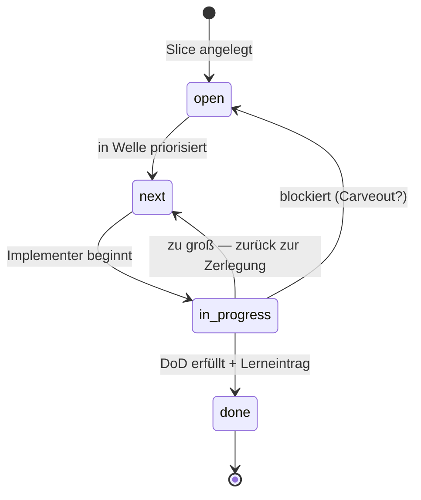

# Modul 4 — Planning Harness

> **Aufwand:** ca. 75 Min Lesen · 90 Min Übung. Anschluss: erster [Phasen-Checkpoint A](../grundlagen/checkpoints.md#checkpoint-a-nach-phase-01-spec-und-architektur) sollte vor diesem Modul liegen.

## Mini-Glossar für dieses Modul

Vier neue Begriffe in diesem Modul. Volldefinitionen in
[`../grundlagen/konventionen.md`](../grundlagen/konventionen.md#kernbegriffe);
für die ersten Seiten reichen die Ein-Satz-Anker:

| Begriff | Ein-Satz-Definition | Bild im Kopf |
|---|---|---|
| **Welle** | Bündel von Slices, das gemeinsam geplant und abgeschlossen wird. | eine Welle bricht — alle ihre Slices liegen am Strand. |
| **Trigger** | Beobachtbare Bedingung, bei der ein Slice/Welle/Carveout in den nächsten Status wandert. | nicht der Tag, sondern das Ereignis. |
| **Closure** | Abschluss eines Slice oder einer Welle mit Lerneintrag in `done/`. | das Türklappen *mit* Notiz, was beim Schließen klemmte. |
| **Lifecycle-Verzeichnis** | Eines von `open/`, `next/`, `in-progress/`, `done/` — die vier Stationen eines Slice. | vier Schubladen mit Einbahnstraße — und zwei Rückwege. |

## Engage

Ein Slice mit dem Titel *"Authentifizierung implementieren"* landet in
`in-progress/`. Drei Tage später ist er nicht fertig. Eine Woche später
auch nicht. Eine Welle später lebt er als Zombie zwischen drei PRs. Was
ist passiert? Er war von Anfang an zu groß. Aber *woran erkennst du das,
bevor* er drei Tage Zombie ist?

## Lernziele

Nach diesem Modul kannst du:

* Slices durch die Lifecycle-Verzeichnisse `open → next → in-progress → done` *bewegen* und Triggerbedingungen je Übergang *benennen* (Anwenden · prozedural),
* einen Slice anhand zweier Größen-Kriterien *bewerten* (in einem Agenten-Lauf abschließbar, in einer Review-Sitzung prüfbar) (Bewerten · konzeptuell),
* einen zu großen Slice schnittfrei in zwei umsetzbare *zerlegen* und die Schnittentscheidung *begründen* (Erschaffen · prozedural),
* Closure-Kriterien mit Lerneintrag *formulieren* (Erschaffen · prozedural).

## Lifecycle als State Machine

Drei Übergänge sind nichttrivial: `in_progress → next` (Rückführung bei
Größen-Erkenntnis) und `in_progress → open` (Blocker — meist mit
Carveout, siehe [Modul 6](modul-06-carveouts.md)). Der einzige Übergang
nach `done` verlangt *Lerneintrag*, nicht nur "Tests grün".

## Lab-Bezug

* `docs/plan/planning/{open,next,in-progress,done}/`
* `make plan-status`

## Themen

* Slice-Planung
* Wellen
* Trigger
* Closure
* Was ein Plan enthalten muss, damit ein Agent ihn umsetzen kann

## Kernidee

Ein Slice ist klein, wenn ein Agent ihn in *einem* Lauf abschließen kann
und ein Reviewer den Diff *in einer Sitzung* prüfen kann. Größer ist
falsch.

## Typische Fehlvorstellungen

- **"Slice = Ticket = Feature."** — Drei verschiedene Granularitäten. Feature ist Spec-Ebene, Slice ist Implementations-Einheit, Ticket ist Projektmanagement. Slice ist die kleinste *agentisch abschließbare* Einheit.
- **"Erst plan ich alle Slices, dann fange ich an."** — Wer alle Slices vor der ersten Implementation plant, plant tote Slices. Plan und Implementation alternieren — Welle für Welle.
- **"Wenn ein Slice in `done/` ist, ist er fertig."** — Ohne Lerneintrag ist er nur *abgelegt*. Closure ist eine bewusste Reflexionsleistung: was hat funktioniert, was war Friktion, was geht in den Steering Loop?

## Worked Example: einen zu großen Slice schneiden

**Ausgangs-Slice:** `SL-014 — Authentifizierung implementieren`. DoD:
"Login funktioniert, JWT wird ausgegeben, Refresh-Token-Flow läuft,
Token-Revocation per Admin-Endpoint, Audit-Log auf Login-Versuche."

**Diagnose:** zu groß. Anzeichen:
1. Mehr als drei DoD-Punkte (Faustregel).
2. Mehrere Schichten betroffen (Adapter + Service + UI + DB-Schema).
3. Kann nicht in einer Review-Sitzung geprüft werden.

**Schnitt nach Schichten oder nach Lieferwert?** Lieferwert. Schnitte
nach Schichten führen oft zu Zombie-Slices, die "fast fertig" sind.

**Schnitt-Vorschlag (drei Slices):**

| ID | DoD | Liefert |
|---|---|---|
| `SL-014a` | Login-Endpoint akzeptiert User/Passwort, gibt JWT zurück, Audit-Log-Eintrag entsteht. | Funktion |
| `SL-014b` | Refresh-Token-Flow gegen JWT, mit Ablauf-Tests. | Sicherheit |
| `SL-014c` | Admin-Endpoint zur Token-Revocation, mit Architekturtest gegen Direkt-DB-Zugriff. | Operativität |

**Begründung:** Jeder Schnitt-Slice ist einzeln lieferbar (kein Slice
wartet auf den nächsten). Jeder hat ≤3 DoD-Punkte. Jeder berührt
höchstens zwei Schichten.

**Was *nicht* geht:** "Schicht-Slice" wie `SL-014-db`, `SL-014-service`,
`SL-014-ui` — diese sind voneinander abhängig und einzeln nutzlos. Sie
landen mit hoher Wahrscheinlichkeit als Zombie in `in-progress/`.

## Übungen

* Planung eines Features über mehrere Wellen
* Bewege einen Slice durch alle vier Verzeichnisse
* Schneide einen zu großen Slice in zwei umsetzbare Slices

## Reflexion

Vier Standardfragen aus [`reflexion-vorlage.md`](../grundlagen/reflexion-vorlage.md)
nach dem Slice-Schnitt-Versuch und der Lifecycle-Bewegung.
Modul-spezifische Trigger:

- **Beobachtung:** Wie groß war dein erster Schnitt? Welche Schicht hat den Zombie-Slice erzeugt? Welcher Trigger war unscharf?
- **2×2-Quadrant:** Größen-Diagnose ist meist *inferential* (Planner-Skill), DoD-Pflichtfeld könnte aber *computational feedforward* sein.
- **Steering-Loop:** DoD-Punkte-Maximum als Skill? Lifecycle-Verzeichnis-Pflicht als CI-Check?
- **Conceptual Change:** Kandidaten in [`lernervorstellungen.md`](../grundlagen/lernervorstellungen.md) (z. B. "Slice = Ticket = Feature", "Wenn ein Slice in done/ ist, ist er fertig").

## Selbstcheck

* **(Erinnern)** Nenne die vier Lifecycle-Verzeichnisse in der Reihenfolge eines normalen Slice-Durchlaufs.
* Welcher Trigger bewegt einen Slice von `next/` nach `in-progress/`?
* Wann darf ein Slice in `done/` landen, obwohl ein Gate rot ist?

### Selbstcheck-Rubrik

| Frage | rudimentär | solide | exzellent |
|---|---|---|---|
| Vier Lifecycle-Verzeichnisse in Reihenfolge? | zwei oder drei genannt | `open/` → `next/` → `in-progress/` → `done/`. Plus Rückführungen: `in-progress/ → next/` (zu groß), `in-progress/ → open/` (Blocker). | + Hinweis: WIP-Limit pro Implementer auf 1 — wer mehrere Slices gleichzeitig in `in-progress/` hat, hat keine Lifecycle, sondern ein Buffet. |
| Trigger `next/ → in-progress/`? | "Wenn jemand anfängt." | Konkreter Trigger: Implementation-Agent (oder Person) übernimmt, Slice ist in `next/` priorisiert, Abhängigkeiten gelöst. | + Abgrenzung "WIP-Limit pro Implementer ist eine harte Größe, kein Vorschlag" — ein Implementer hat höchstens *einen* Slice in `in-progress/`. |
| Slice in `done/` bei rotem Gate — wann? | "Gar nicht." | Nur mit dokumentiertem Carveout (Modul 6), der den roten Gate-Status auf Trigger schaltet. | + Unterscheidung Carveout (Ausnahme, mit Folge-Slice) vs. bootstrap-aware Gate (Stufung, mit Hochschalt-Trigger, Modul 12). |

## Weiterlesen

* Welle-Self-Close-Konvention als Hard Rule: `pt9912/grid-gym` in [`../grundlagen/fallstudien.md`](../grundlagen/fallstudien.md)
* Nächstes Modul: [Modul 5 — Roadmap Engineering](modul-05-roadmap.md)
