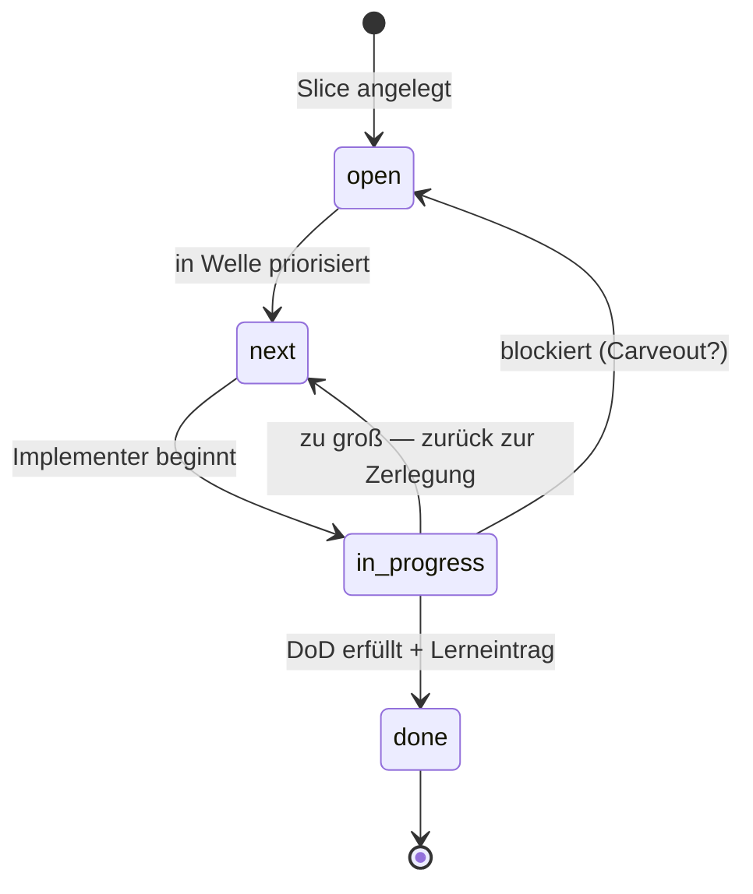

# Modul 5 — Planning Harness

> **Aufwand:** ca. 90 Min Lesen · 110 Min Übung. Anschluss: erster [Phasen-Checkpoint A](../grundlagen/checkpoints.md#checkpoint-a-nach-phase-01-spec-und-architektur) sollte vor diesem Modul liegen.

## Mini-Glossar für dieses Modul

Fünf Begriffe — vier neu, einer als Vorwissens-Anker aus
[Modul 2 — Harness-Bootstrap](../01-spec-und-architektur/modul-02-harness-bootstrap.md).
Volldefinitionen der vier neuen Begriffe in
[`../grundlagen/konventionen.md`](../grundlagen/konventionen.md#kernbegriffe);
für die ersten Seiten reichen die Ein-Satz-Anker:

| Begriff | Ein-Satz-Definition | Bild im Kopf |
|---|---|---|
| **Welle** | Bündel von Slices, das gemeinsam geplant und abgeschlossen wird. | eine Welle bricht — alle ihre Slices liegen am Strand. |
| **Trigger** | Beobachtbare Bedingung, bei der ein Slice/Welle/Carveout in den nächsten Status wandert. | nicht der Tag, sondern das Ereignis. |
| **Closure** | Abschluss eines Slice oder einer Welle mit Lerneintrag in `done/`. | das Türklappen *mit* Notiz, was beim Schließen klemmte. |
| **Lifecycle-Verzeichnis** | Eines von `open/`, `next/`, `in-progress/`, `done/` — die vier Stationen eines Slice. | vier Schubladen mit Einbahnstraße — und zwei Rückwege. |
| **Bootstrap-Modus** *(Vorwissen aus Modul 2)* | Eigenschaft *pro Sub-Area*, die die Trigger-Richtung Doc↔Code festlegt (GF: Doc→Code, BF: Code→Doc, Hybrid: gemischt). Volldefinition in [Modul 2 §Kernidee](../01-spec-und-architektur/modul-02-harness-bootstrap.md#kernidee). | nicht eine Eigenschaft des Slice oder des Repos — der Slice ist *Anlass*, die Sub-Area ist *Träger*. |

## Engage

Ein Slice mit dem Titel *"Authentifizierung implementieren"* landet in
`in-progress/`. Drei Tage später ist er nicht fertig. Eine Woche später
auch nicht. Eine Welle später lebt er als Zombie zwischen drei PRs. Was
ist passiert? Er war von Anfang an zu groß. Aber *woran erkennst du das,
bevor* er drei Tage Zombie ist?

## Lernziele

Nach diesem Modul kannst du:

* Slices durch die Lifecycle-Verzeichnisse `open → next → in-progress → done` *bewegen* und Triggerbedingungen je Übergang *benennen* (Anwenden · prozedural),
* einen Slice anhand zweier Größen-Kriterien *bewerten* (in einem Agenten-Lauf abschließbar, in einer Review-Sitzung prüfbar) (Bewerten · konzeptuell),
* einen zu großen Slice schnittfrei in zwei umsetzbare *zerlegen* und die Schnittentscheidung *begründen* (Erschaffen · prozedural),
* Closure-Kriterien mit Lerneintrag *formulieren* (Erschaffen · prozedural),
* für die von einem Slice berührten Sub-Areas den Bootstrap-Modus gegen das Kriterien-Set *begründen* (Bewerten · konzeptuell — Transfer aus Modul 2).

## Lifecycle als State Machine



Drei Übergänge sind nichttrivial: `in_progress → next` (Rückführung bei
Größen-Erkenntnis) und `in_progress → open` (Blocker — meist mit
Carveout, siehe [Modul 7](modul-07-carveouts.md)). Der einzige Übergang
nach `done` verlangt *Lerneintrag*, nicht nur "Tests grün".

## Lab-Bezug

* `docs/plan/planning/{open,next,in-progress,done}/`
* `make plan-status`

## Themen

* Slice-Planung
* Wellen
* Trigger
* Closure
* Was ein Plan enthalten muss, damit ein Agent ihn umsetzen kann
* Bootstrap-Modus pro Sub-Area als Wahl-Entscheidung im Slice-Plan

## Kernidee

Ein Slice ist klein, wenn ein Agent ihn in *einem* Lauf abschließen kann
und ein Reviewer den Diff *in einer Sitzung* prüfen kann. Größer ist
falsch.

## Typische Fehlvorstellungen

- **"Slice = Ticket = Feature."** — Drei verschiedene Granularitäten. Feature ist Spec-Ebene, Slice ist Implementations-Einheit, Ticket ist Projektmanagement. Slice ist die kleinste *agentisch abschließbare* Einheit.
- **"Erst plan ich alle Slices, dann fange ich an."** — Wer alle Slices vor der ersten Implementation plant, plant tote Slices. Plan und Implementation alternieren — Welle für Welle.
- **"Wenn ein Slice in `done/` ist, ist er fertig."** — Ohne Lerneintrag ist er nur *abgelegt*. Closure ist eine bewusste Reflexionsleistung: was hat funktioniert, was war Friktion, was geht in den Steering Loop?
- **"Ein Slice hat einen Bootstrap-Modus."** — Nein. Der Modus ist Eigenschaft *pro Sub-Area* (Modul 2 §Kernidee). Ein Slice berührt mehrere Sub-Areas und kann GF, BF und Hybrid gleichzeitig involvieren. Die Verwechslung entsteht typisch nach der Klassifikations-Übung in Modul 2 (Anwenden · prozedural, Ist-Zustand pro Sub-Area): Wer Modi zuvor Sub-Areas zugeordnet hat, überträgt das Schema unbewusst auf den Slice, sobald dieser hier als Aufhänger ins Spiel kommt — und mischt damit *Anlass* (Slice) mit *Träger der Modus-Entscheidung* (Sub-Area).
- **"Wenn der Slice klein ist, ist die berührte Sub-Area GF."** — Nein, transitive Vereinfachung. Slice-Größe und Sub-Area-Modus sind orthogonale Achsen: Slice-Größe misst, ob der Schnitt in einer Review-Sitzung prüfbar ist; Sub-Area-Modus misst den Reifegrad der berührten Doku-/Code-Sektion. Ein kleiner Slice kann eine BF-Sub-Area berühren (Beispiel: Login-Endpoint ist klein, aber das Test-Layout für die Auth-Schicht ist nicht in `harness/conventions.md` verankert).

Erweiterte Sammlung mit Conceptual-Change-Anker in
[`../grundlagen/lernervorstellungen.md` §Über Planung (Modul 5–7)](../grundlagen/lernervorstellungen.md#über-planung-modul-57).

## Worked Example: einen zu großen Slice schneiden

> **Wenn du Slices schon routinemäßig nach Vertikal-Schnitt schneidest und einen Lifecycle mit `open/next/in-progress/done/` einsetzt, springe zu [§Übungen](#übungen).** (Expertise-Reversal-Schutz: das Beispiel zeigt elementar, was du dann bereits internalisiert hast.)

**Ausgangs-Slice:** `SL-014 — Authentifizierung implementieren`. DoD:
"Login funktioniert, JWT wird ausgegeben, Refresh-Token-Flow läuft,
Token-Revocation per Admin-Endpoint, Audit-Log auf Login-Versuche."

> **ID-Hinweis:** `SL-014` (und die Sub-Slices `SL-014a/b/c`) sind ein
> kurs-interner Anker für dieses Worked Example und Modul 9 §Worked
> Example. Der ID-Raum *im Kurs* ist eigenständig — das DocSearch-
> Lab-Beispiel in `lab/example/` führt unter `slice-014-ann-suche.md`
> einen ganz anderen Slice (ANN-Suche). Die numerische Überlappung
> ist Zufall der Beispielwahl, kein gemeinsamer Slice.

**Diagnose:** zu groß. Anzeichen:
1. Mehr als drei DoD-Punkte (Faustregel).
2. Mehrere Schichten betroffen (Adapter + Service + UI + DB-Schema).
3. Kann nicht in einer Review-Sitzung geprüft werden.

**Schnitt nach Schichten oder nach Lieferwert?** Lieferwert. Schnitte
nach Schichten führen oft zu Zombie-Slices, die "fast fertig" sind.

**Schnitt-Vorschlag (drei Slices):**

| ID | DoD | Liefert |
|---|---|---|
| `SL-014a` | Login-Endpoint akzeptiert User/Passwort, gibt JWT zurück, Audit-Log-Eintrag entsteht. | Funktion |
| `SL-014b` | Refresh-Token-Flow gegen JWT, mit Ablauf-Tests. | Sicherheit |
| `SL-014c` | Admin-Endpoint zur Token-Revocation, mit Architekturtest gegen Direkt-DB-Zugriff. | Operativität |

**Begründung:** Jeder Schnitt-Slice ist einzeln lieferbar (kein Slice
wartet auf den nächsten). Jeder hat ≤3 DoD-Punkte. Jeder berührt
höchstens zwei Schichten.

**Was *nicht* geht:** "Schicht-Slice" wie `SL-014-db`, `SL-014-service`,
`SL-014-ui` — diese sind voneinander abhängig und einzeln nutzlos. Sie
landen mit hoher Wahrscheinlichkeit als Zombie in `in-progress/`.

## Worked Mini-Example: Bootstrap-Modus pro Sub-Area für einen Slice begründen

> **Wenn du Bootstrap-Modi schon routinemäßig pro Sub-Area gegen Kriterien wählst, springe zu [§Übungen](#übungen).** (Expertise-Reversal-Schutz analog zum Slice-Schnitt-Beispiel oben — wer das Modus-Konzept aus [Modul 2](../01-spec-und-architektur/modul-02-harness-bootstrap.md) bereits in der Slice-Planung einsetzt, zahlt sonst extraneous Load fürs Nochmal-Durchgehen.)

**Voraussetzung:** Du kennst das Modus-Konzept aus
[Modul 2 §Kernidee](../01-spec-und-architektur/modul-02-harness-bootstrap.md#kernidee).
Hier wird keine neue Modus-Theorie eingeführt — das Konzept wandert von
der *Diagnose* (Klassifikation des Ist-Zustands, Modul 2 §Übung 1) in die
*Wahl* (Begründung pro Sub-Area für einen kommenden Slice).

**Beispiel-Slice:** `SL-014a` aus dem Worked Example oben. Spec-Anker
und ADR werden in [Modul 9 §Worked Example](../03-agenten/modul-09-implementierung.md#worked-example-ein-slice-durch-den-8-schritt-workflow)
mit `LH-FA-AUTH-001` und `ADR-0007` (Service-Adapter-Layer)
konkretisiert; wir nutzen dieselben IDs hier konsistent.

**Berührte Sub-Areas (Schritt 0 der Übung — Vorbedingung):** vier
Sub-Areas — *Konventionen* (API-Pattern), *Test-Infrastruktur*,
*Audit-Logging* und *Spec-Schreibung* (Authentifizierungs-Anforderung).
Die DoD verlangt jede einzelne (Login-Endpoint → API-Pattern;
Login-Tests → Test-Infrastruktur; Audit-Log-Eintrag → Audit-Logging;
`LH-FA-AUTH-001`/`ADR-0007` → Spec-Schreibung). Identifikation ist
Klassifikations-Vorarbeit (Anwenden auf Modul-2-Vorwissen), nicht
Bewertungsleistung — Letztere folgt in Schritt 1.

**Pflichtkriterien** (vier, nicht erweitern):

1. **Konventionen-Dichte** — wieviel der berührten Doku-/Code-Sektion ist
   durch `harness/conventions.md` (oder ein gleichwertiges Artefakt) als
   Strukturregel verankert?
2. **Phase-Reife der berührten Artefakt-Sektionen** — Phase 0–5 aus der
   Phase × Modus-Matrix in [Modul 2](../01-spec-und-architektur/modul-02-harness-bootstrap.md#phasen-modus-die-zweidimensionale-reife-matrix).
3. **Evidenz- und Diskrepanz-Risiko** — wie groß ist die Gefahr, dass
   Inventur den Code-Bestand und die Doku-Aussage als divergent
   ausweist? Bei GF meist niedrig (Doc führt — Inventur prüft nur
   Code-Konformität); bei BF/Hybrid das Hauptrisiko und der Grund, warum
   das Kriterium dort die Reconciliation-Schätzung trägt.
4. **Reconciliation-Aufwand inklusive Graduation-/Folge-Slice-Trigger** —
   wieviel Slice-Aufwand bringt BF/Hybrid mit sich, und welcher Trigger
   (eine der vier Klassen aus
   [`konventionen.md` §Vier Trigger-Klassen](../grundlagen/konventionen.md#vier-trigger-klassen)
   — Sync, Promotion, Cross-Reference, Acceptance — oder eine
   Folge-Slice-ID) schaltet die Sub-Area Richtung GF?

**Sub-Area 1 — Konventionen (vollständig ausformuliert, GF):**

- *Konventionen-Dichte:* hoch. `harness/conventions.md` führt `MR-014`
  *REST-Endpunkt-Pattern* mit URL-Struktur, Status-Code-Regeln und einer
  Negativ-Bedingung gegen Direkt-DB-Zugriffe aus dem Adapter.
- *Phase-Reife:* Phase 4. Konvention steht, Code wird daran gemessen,
  Reviews zitieren `MR-014`.
- *Evidenz-/Diskrepanz-Risiko:* niedrig. Das `make lint-conventions`-
  Target prüft die Pattern-Konformität automatisch und ist als Sensor
  in `harness/README.md` §Sensors gelistet (Sensor-Zeile zitiert
  `MR-014`).
- *Reconciliation-Aufwand:* keiner. Kein Folge-Slice.
- **Modus: GF.**

**Sub-Area 2 — Test-Infrastruktur (vollständig ausformuliert, BF):**

- *Konventionen-Dichte:* niedrig. `tests/auth/` zeigt zwei abweichende
  Pfadnaming-Schemata (`test_*.py` vs. `*_test.py`); keines steht in
  `harness/conventions.md`.
- *Phase-Reife:* Phase 1 BF — Skelett-Sektion *Test-Layout* in
  `harness/conventions.md` ist mit Inventur-Auftrag kopiert (leere
  Pflicht-Felder), der Code-Bestand in `tests/auth/` füllt sie noch
  nicht (Matrix: *"Template kopiert, Inventur-Auftrag an Code"*).
- *Evidenz-/Diskrepanz-Risiko:* mittel. Inventur kann sichtbar machen,
  dass die bestehenden Tests an die Authentifizierungs-Schicht andere
  Annahmen tragen als die noch zu schreibenden — z. B. ob Mocking auf
  Adapter- oder Service-Ebene zulässig ist.
- *Reconciliation-Aufwand:* 1 Slice (`SL-RC-014t` Inventur + `MR-002`
  *Test-Layout pro Sub-Schicht* in `harness/conventions.md` ergänzen).
  Graduation-Trigger: **Sync-Trigger** setzt `MR-002` in
  `harness/README.md` und `AGENTS.md` als Quelle für künftige
  Test-Konventionen.
- **Modus: BF.**

**Sub-Area 3 — Audit-Logging (faded scaffolding, Hybrid — du
ergänzt die letzten zwei Kriterien):**

- *Konventionen-Dichte:* mittel. `harness/conventions.md` führt im
  Adaptions-Block `MR-008` *Audit-Log-Pflicht für Auth-Endpunkte* als
  abstrakte Pflicht-Adaption ("jeder Login-Versuch muss ein
  Audit-Event erzeugen"), aber kein konkretes Event-Schema. Code in
  `services/audit/` zeigt zwei unterschiedliche Event-Formate aus
  früheren Slices.
- *Phase-Reife:* Phase 3 (GF-Lesart aus der Matrix: *"Sektionen
  versprochen, Code folgt"* — die Doku verspricht eine Audit-Pflicht,
  der Code folgt erst teilweise). Die Hybrid-Diagnose entsteht **nicht
  aus der Phase**, sondern beim Modus: die Doku führt für die
  Pflicht-Aussage (GF-Richtung), aber für den Format-Standard zeigt
  der Code-Bestand Divergenz ohne Doku-Korrespondenz (BF-Symptom).
  Phase und Modus sind orthogonal — eine Sub-Area sitzt in genau
  einer Phase-Zelle, der Modus ergibt sich aus der Trigger-Richtung
  pro Kriterium.
- *Evidenz-/Diskrepanz-Risiko:* **du**.
- *Reconciliation-Aufwand:* **du**.
- **Modus: Hybrid (GF in der Pflicht-Adaption `MR-008`, BF im
  fehlenden Format-Standard).**

**Sub-Area 4 — Spec-Schreibung (knapp, GF — kein voller Block):**
`spec/lastenheft.md` §`LH-FA-AUTH-001` trägt drei Akzeptanzkriterien;
`ADR-0007` *Service-Adapter-Layer* bindet die Architektur; in Modul 9
§Worked Example werden Tests gegen `LH-FA-AUTH-001` annotiert. Damit
sind Konventionen-Dichte hoch, Phase 4, Risiko niedrig, kein
Reconciliation — **Modus: GF.** Hier reicht ein Verweis; die volle
Begründungs-Tiefe demonstrieren Sub-Areas 1–3.

**Template für den Begründungsblock** — kanonisch in
[§8 Sub-Area-Modus-Begründung](../../../lab/templates/docs/plan/planning/slice.template.md)
des Slice-Plan-Templates; hier zum Lesen abgedruckt, **byte-identisch
mit dem dortigen Format**, damit Kopieren von hier oder vom Template
denselben Block ergibt:

```markdown
### Sub-Area: <Name>

- **Modus:** GF | BF | Hybrid
- **Konventionen-Dichte:** <Beleg aus `harness/conventions.md`,
  Adaptions-Block oder Code>
- **Phase-Reife:** Phase 0–5 <Begründung gegen die Phase × Modus-Matrix>
- **Evidenz-/Diskrepanz-Risiko:** <bei BF/Hybrid: was kann die
  Inventur sichtbar machen? bei GF: meist niedrig>
- **Reconciliation-Aufwand:** <Slice-Schätzung;
  Graduation-/Folge-Slice-Trigger>
```

Pro berührter Sub-Area einen Block in §8 des Slice-Plans. So läuft die
Modus-Entscheidung im Planning-Harness-Slice mit und wird in der
Closure-Notiz prüfbar.

## Übungen

* Planung eines Features über mehrere Wellen
* Bewege einen Slice durch alle vier Verzeichnisse
* Schneide einen zu großen Slice in zwei umsetzbare Slices
* **Bestimme und begründe Bootstrap-Modus für die vom nächsten Slice berührten Sub-Areas** — nimm einen kommenden Slice aus deinem eigenen Repo (Transferform) *oder* arbeite am Beispiel-Slice `SL-014a` weiter (Fallback). Schritt 0: berührte Sub-Areas identifizieren. Schritt 1: pro Sub-Area Modus bestimmen und gegen alle vier Pflichtkriterien begründen. Schritt 2: für die Hybrid-Sub-Area `Audit-Logging` aus dem Worked Mini-Example die zwei offenen Kriterien-Zeilen (*Evidenz-/Diskrepanz-Risiko*, *Reconciliation-Aufwand*) ergänzen. Output: Begründungsblock je Sub-Area aus dem Template oben, in §8 des Slice-Plans (siehe [`slice.template.md`](../../../lab/templates/docs/plan/planning/slice.template.md)). Lösungshinweise in [`../loesungen/modul-05-loesung.md`](../loesungen/modul-05-loesung.md#bestimme-und-begründe-bootstrap-modus-pro-sub-area).

## Reflexion

Vier Standardfragen aus [`reflexion-vorlage.md`](../grundlagen/reflexion-vorlage.md)
nach dem Slice-Schnitt-Versuch, der Lifecycle-Bewegung und der
Sub-Area-Modus-Begründungs-Übung. Modul-spezifische Trigger:

- **Beobachtung:** Wie groß war dein erster Schnitt? Welche Schicht hat den Zombie-Slice erzeugt? Welcher Trigger war unscharf? **Welche Sub-Area war beim Modus-Begründungsblock am schwersten zu bewerten — und woran lag das (Konventionen-Dichte unklar? Phase-Reife strittig? Trigger ohne Heimat?)?**
- **2×2-Quadrant:** Größen-Diagnose ist meist *inferential* (Planner-Skill), DoD-Pflichtfeld könnte aber *computational feedforward* sein. Modus-Begründung pro Sub-Area ist klar *inferential* — die Pflichtkriterien strukturieren die Beobachtung, ersetzen sie nicht.
- **Steering-Loop:** DoD-Punkte-Maximum als Skill? Lifecycle-Verzeichnis-Pflicht als CI-Check? **§8-Pflicht-Sektion bei BF/Hybrid als Closure-Sensor (PR-Check: "wenn berührte Sub-Area BF/Hybrid und §8 leer, blockieren")?**
- **Conceptual Change:** Kandidaten in [`lernervorstellungen.md`](../grundlagen/lernervorstellungen.md) (z. B. "Slice = Ticket = Feature", "Wenn ein Slice in done/ ist, ist er fertig", "Ein Slice hat einen Bootstrap-Modus", "Wenn der Slice klein ist, ist die berührte Sub-Area GF").

## Selbstcheck

* **(Erinnern)** Nenne die vier Lifecycle-Verzeichnisse in der Reihenfolge eines normalen Slice-Durchlaufs.
* Welcher Trigger bewegt einen Slice von `next/` nach `in-progress/`?
* Wann darf ein Slice in `done/` landen, obwohl ein Gate rot ist?
* **(Bewerten — Transfer aus Modul 2)** Welche Sub-Areas berührt der nächste anstehende Slice — und welcher Modus passt für jede dieser Sub-Areas? Begründe je gegen mindestens zwei der vier Pflichtkriterien (Konventionen-Dichte · Phase-Reife · Evidenz-/Diskrepanz-Risiko · Reconciliation-Aufwand).

### Selbstcheck-Rubrik

| Frage | rudimentär | solide | exzellent |
|---|---|---|---|
| Vier Lifecycle-Verzeichnisse in Reihenfolge? | zwei oder drei genannt | `open/` → `next/` → `in-progress/` → `done/`. Plus Rückführungen: `in-progress/ → next/` (zu groß), `in-progress/ → open/` (Blocker). | + Hinweis: WIP-Limit pro Implementer auf 1 — wer mehrere Slices gleichzeitig in `in-progress/` hat, hat keine Lifecycle, sondern ein Buffet. |
| Trigger `next/ → in-progress/`? | "Wenn jemand anfängt." | Konkreter Trigger: Implementation-Agent (oder Person) übernimmt, Slice ist in `next/` priorisiert, Abhängigkeiten gelöst. | + Abgrenzung "WIP-Limit pro Implementer ist eine harte Größe, kein Vorschlag" — ein Implementer hat höchstens *einen* Slice in `in-progress/`. |
| Slice in `done/` bei rotem Gate — wann? | "Gar nicht." | Nur mit dokumentiertem Carveout (Modul 7), der den roten Gate-Status auf Trigger schaltet. | + Vollständige Werkzeug-Triade Carveout ↔ BF-Sub-Area-Markierung ↔ bootstrap-aware Gate disambiguiert in [Modul 7 §Worked Example A Schritt 6](../02-planung/modul-07-carveouts.md#worked-example-a-einen-carveout-dokumentieren). **Die BF-Sub-Area-Markierung ist nicht selbst ein Closure-Werkzeug**, sondern der Sub-Area-Kontext (Konzept-Anker [Modul 2 §Kernidee](../01-spec-und-architektur/modul-02-harness-bootstrap.md#kernidee); Aktion-Noun-Schärfung "Markierung" in [Modul 7 §Mini-Glossar](../02-planung/modul-07-carveouts.md#mini-glossar-für-dieses-modul)), in dem Carveout oder bootstrap-aware Gate als Closure-Antworten strukturell legitim werden — die in dieser Modul-Übung trainierte Sub-Area-Modus-Diagnose findet damit ihr Werkzeug-Pendant in Modul 7. |
| Modus pro Sub-Area für den nächsten Slice? | berührte Sub-Areas nur teilweise identifiziert; Modus genannt ohne Kriterien-Bezug ("BF, weil Doku fehlt"). | berührte Sub-Areas vollständig identifiziert; Modus je Sub-Area bestimmt; Begründung nutzt mindestens zwei der vier Pflichtkriterien (Konventionen-Dichte, Phase-Reife, Evidenz-/Diskrepanz-Risiko, Reconciliation-Aufwand). | + Begründung nutzt *alle vier* Pflichtkriterien · BF/Hybrid benennt expliziten Reconciliation- oder Graduation-Trigger (Trigger-Klasse nach [`konventionen.md` §Vier Trigger-Klassen](../grundlagen/konventionen.md#vier-trigger-klassen) — Sync/Promotion/Cross-Reference/Acceptance — oder Folge-Slice-ID) · Evidenz aus Code, Doku oder `harness/conventions.md` namentlich genannt. |

## Weiterlesen

* Welle-Self-Close-Konvention als Hard Rule: `pt9912/grid-gym` in [`../grundlagen/fallstudien.md`](../grundlagen/fallstudien.md)
* Nächstes Modul: [Modul 6 — Roadmap Engineering](modul-06-roadmap.md)
