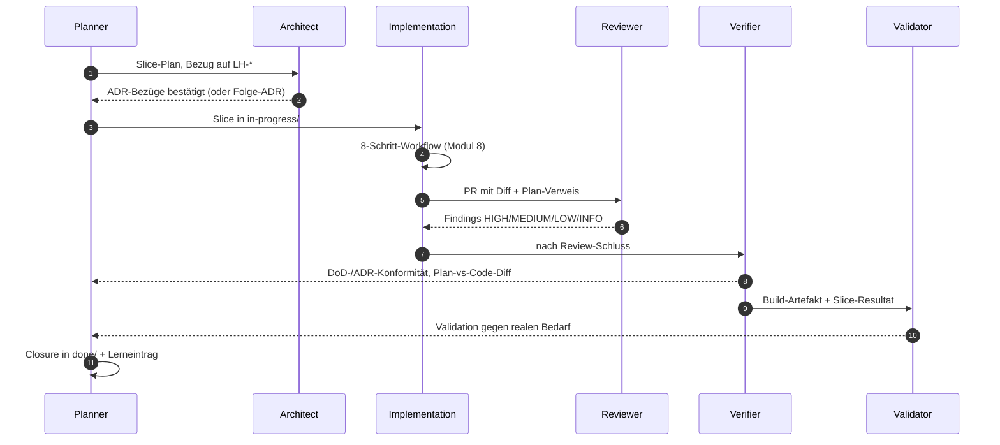

# Modul 7 — Agentenrollen

> **Aufwand:** ca. 90 Min Lesen · 75 Min Übung. Spiralcurriculum: Verifikation vs. Validation kennst du aus [Modul 1](../01-spec-und-architektur/modul-01-entwicklungszyklus.md) — hier werden sie zu eigenen Rollen mit eigenem Kontext.

## Engage

Drei Stunden Implementation, dann reviewt der *selbe* Agent seinen
eigenen Code — und findet nichts. Dasselbe Setup mit getrenntem Reviewer:
zwei HIGH-Findings, eines davon ein ADR-Verstoß. Was hat sich geändert?
Der Code nicht. Aber der *Kontext*. Selber Kontext → selbe blinde
Flecken. Genau das ist der Grund, warum es Rollen gibt.

## Lernziele

Nach diesem Modul kannst du:

* zehn typische Tätigkeiten den sechs Rollen *zuordnen* und Mehrfachzuweisungen *begründen* (Analysieren),
* Übergaben zwischen den Rollen als Sequenz *modellieren* (Erschaffen),
* einen Konfliktfall (Reviewer lehnt, Implementer widerspricht) *strukturiert auflösen* (Bewerten),
* den Unterschied Verifikation vs. Validation an einem realen Fall *erklären* (Analysieren).

## Rollen-Sequenz für einen Slice

Wesentlich: keine Rolle springt rückwärts in eine vorhergehende, ohne
*Übergabe-Artefakt* (Findings, Folge-ADR-Vorschlag, Carveout). Der
Eingabe-Kontext jeder Rolle ist eingeschränkt — das verhindert, dass
dieselbe Sicht denselben Fehler übersieht.

## Lab-Bezug

* `agents/{planner,architect,implementation,reviewer,verifier,validator}.md`
* Replay eines kompletten Rollendurchlaufs in `evals/`

## Themen

* Planner Agent
* Architect Agent
* Implementation Agent
* Reviewer Agent
* Verifier Agent (Verification)
* Validator Agent (Validation)
* Verantwortlichkeiten
* Übergaben
* Konfliktlösung (z. B. Reviewer findet ADR-Lücke)

## Kernidee

Rollentrennung verhindert, dass derselbe Kontext zweimal denselben Fehler
macht. Wer geplant hat, prüft nicht; wer geschrieben hat, reviewt nicht.

## Typische Fehlvorstellungen

- **"Eine Person spielt alle Rollen."** — Geht — *aber mit unterschiedlichem Eingabe-Kontext und unterschiedlichen Skill-Dateien*. Sonst wiederholen sich die blinden Flecken. Rollen-Trennung ist Kontext-Trennung, nicht Personen-Trennung.
- **"Reviewer macht das Verification gleich mit."** — Nein. Reviewer prüft gegen Plan/ADR (Maintainability). Verification prüft gegen DoD/Spec (Behaviour/Architecture Fitness). Zwei Fragen, zwei Antworten.
- **"Validation machen wir vor Release."** — Zu spät. Validation gehört *vor* die Implementation größerer Wellen (Spec-Validierung beim Kunden) und nach jedem MVP-Slice.
- **"Architect entscheidet, Implementation widerspricht nicht."** — Implementation darf Folge-ADRs vorschlagen. Was sie *nicht* darf: stillschweigend einer ADR widersprechen.

## Übungen

* Ordne 10 typische Tätigkeiten den Rollen zu
* Spiele einen Konfliktfall durch: Reviewer lehnt ab, Implementer widerspricht — wer entscheidet?

Nach den Übungen: [Reflexionsvorlage](../grundlagen/reflexion-vorlage.md).

## Selbstcheck

* Warum braucht es Verification *und* Validation?
* Welche Rolle besitzt ein ADR — wer darf es ändern?

### Selbstcheck-Rubrik

| Frage | rudimentär | solide | exzellent |
|---|---|---|---|
| Warum Verification *und* Validation? | "Verschiedene Prüfungen." | Verification: "built the thing right" (gegen Plan/DoD); Validation: "built the right thing" (gegen realen Bedarf). | + Gefährlichster Fall: Verifikation grün, Validation rot — Team baut *perfekt das Falsche*. Umgekehrter Fall (Verifikation rot, Validation grün) ist Prozess-Drift, auch wenn das Ergebnis zufällig passt. |
| Wer darf ein ADR ändern? | "Der Architekt." | Architect schreibt; Reviewer prüft auf Konsistenz; Implementer liest als Constraint; Accepted-ADRs *niemand* überschreibt — Folge-ADR mit `supersedes`. | + Konfliktpfad: Implementer darf höchstens Folge-ADR vorschlagen, niemals stillschweigend einer ADR widersprechen. Das wäre Drift, kein "pragmatisches Implementieren". |

## Weiterlesen

* Nächstes Modul: [Modul 8 — Implementierung durch KI-Agenten](modul-08-implementierung.md)
