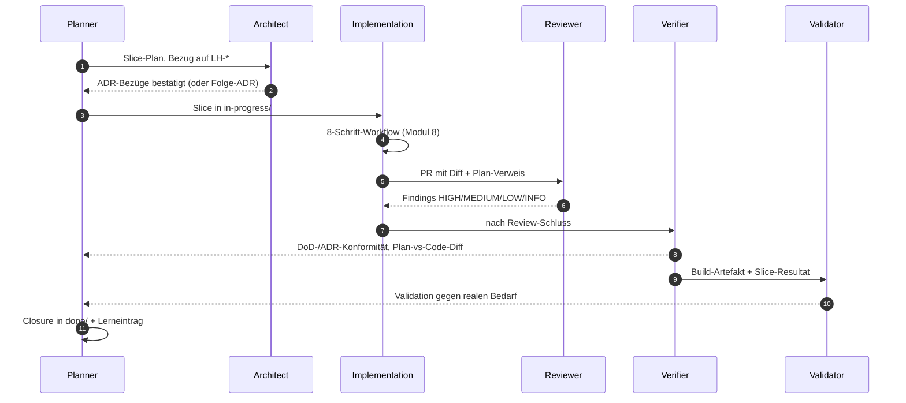

# Modul 7 — Agentenrollen

> **Aufwand:** ca. 90 Min Lesen · 75 Min Übung. Spiralcurriculum: Verifikation vs. Validation kennst du aus [Modul 1](../01-spec-und-architektur/modul-01-entwicklungszyklus.md) — hier werden sie zu eigenen Rollen mit eigenem Kontext.

## Engage

Drei Stunden Implementation, dann reviewt der *selbe* Agent seinen
eigenen Code — und findet nichts. Dasselbe Setup mit getrenntem Reviewer:
zwei HIGH-Findings, eines davon ein ADR-Verstoß. Was hat sich geändert?
Der Code nicht. Aber der *Kontext*. Selber Kontext → selbe blinde
Flecken. Genau das ist der Grund, warum es Rollen gibt.

## Lernziele

Nach diesem Modul kannst du:

* zehn typische Tätigkeiten den sechs Rollen *zuordnen* und Mehrfachzuweisungen *begründen* (Analysieren),
* Übergaben zwischen den Rollen als Sequenz *modellieren* (Erschaffen),
* einen Konfliktfall (Reviewer lehnt, Implementer widerspricht) *strukturiert auflösen* (Bewerten),
* den Unterschied Verifikation vs. Validation an einem realen Fall *erklären* (Analysieren).

## Rollen-Sequenz für einen Slice

Wesentlich: keine Rolle springt rückwärts in eine vorhergehende, ohne
*Übergabe-Artefakt* (Findings, Folge-ADR-Vorschlag, Carveout). Der
Eingabe-Kontext jeder Rolle ist eingeschränkt — das verhindert, dass
dieselbe Sicht denselben Fehler übersieht.

## Lab-Bezug

* `agents/{planner,architect,implementation,reviewer,verifier,validator}.md`
* Replay eines kompletten Rollendurchlaufs in `evals/`

## Themen

* Planner Agent
* Architect Agent
* Implementation Agent
* Reviewer Agent
* Verifier Agent (Verification)
* Validator Agent (Validation)
* Verantwortlichkeiten
* Übergaben
* Konfliktlösung (z. B. Reviewer findet ADR-Lücke)

## Kernidee

Rollentrennung verhindert, dass derselbe Kontext zweimal denselben Fehler
macht. Wer geplant hat, prüft nicht; wer geschrieben hat, reviewt nicht.

## Typische Fehlvorstellungen

- **"Eine Person spielt alle Rollen."** — Geht — *aber mit unterschiedlichem Eingabe-Kontext und unterschiedlichen Skill-Dateien*. Sonst wiederholen sich die blinden Flecken. Rollen-Trennung ist Kontext-Trennung, nicht Personen-Trennung.
- **"Reviewer macht das Verification gleich mit."** — Nein. Reviewer prüft gegen Plan/ADR (Maintainability). Verification prüft gegen DoD/Spec (Behaviour/Architecture Fitness). Zwei Fragen, zwei Antworten.
- **"Validation machen wir vor Release."** — Zu spät. Validation gehört *vor* die Implementation größerer Wellen (Spec-Validierung beim Kunden) und nach jedem MVP-Slice.
- **"Architect entscheidet, Implementation widerspricht nicht."** — Implementation darf Folge-ADRs vorschlagen. Was sie *nicht* darf: stillschweigend einer ADR widersprechen.

## Übungen

* Ordne 10 typische Tätigkeiten den Rollen zu
* Spiele einen Konfliktfall durch: Reviewer lehnt ab, Implementer widerspricht — wer entscheidet?

## Reflexion

Nach der Rollen-Zuordnung und dem Konfliktfall-Durchspiel kurz **schriftlich**:

1. **Was ist beobachtbar passiert?** — Hast du eine Tätigkeit nur einer Rolle zugeordnet, obwohl Mehrfachzuweisung sinnvoll war? Wer hat im Konfliktfall *zuerst* entschieden — und was war das Übergabe-Artefakt?
2. **Welcher 2×2-Quadrant war Ursache?** — siehe [`konzeptkarte.md §2x2-Schnellanker`](../grundlagen/konzeptkarte.md#2x2-schnellanker). Rollen-Trennung ist Kontext-Trennung, primär *inferential feedforward*.
3. **Welche konkrete Steering-Loop-Aktion folgt?** — Skill-Datei pro Rolle? Tool-Allowlist pro Rolle? Übergabe-Artefakt-Pflicht im 8-Schritt-Workflow?
4. **Welche eigene Vorstellung wurde unzufriedenstellend?** — Conceptual Change; Kandidaten in [`lernervorstellungen.md`](../grundlagen/lernervorstellungen.md) (z. B. "Eine Person spielt alle Rollen", "Reviewer macht das Verification gleich mit").

Eintragsformat, "Wann *nicht* reagieren" und Anti-Antworten: [`reflexion-vorlage.md`](../grundlagen/reflexion-vorlage.md).

## Selbstcheck

* **(Erinnern)** Nenne die sechs Rollen in der Reihenfolge, in der ein Slice sie typischerweise durchläuft.
* **(Erinnern)** Welches *Übergabe-Artefakt* gehört zu jeder der sechs Übergaben in der Rollen-Sequenz (z. B. Planner → Architect)?
* Warum braucht es Verification *und* Validation?
* Welche Rolle besitzt ein ADR — wer darf es ändern?
* **(Analysieren)** Welche Rolle bearbeitet (a) einen Folge-ADR-Vorschlag, (b) eine DoD-Verletzung, (c) ein Replay-Set-Update? Begründe je eine sinnvolle Mehrfachzuweisung — eine Tätigkeit, die *zwei* Rollen mit unterschiedlichem Kontext sehen müssen.
* **(Bewerten)** Konfliktfall: Reviewer lehnt mit HIGH (ADR-Verstoß), Implementer widerspricht mit Verweis auf einen vermeintlich veralteten ADR-Stand. Wer entscheidet, in welcher Reihenfolge — und was ist das *Übergabe-Artefakt* der Entscheidung?

### Selbstcheck-Rubrik

| Frage | rudimentär | solide | exzellent |
|---|---|---|---|
| Sechs Rollen in Reihenfolge? | Rollen genannt, aber Reihenfolge unklar | Planner → Architect → Implementation → Reviewer → Verifier → Validator. Übergaben jeweils mit Artefakt (Plan, ADR-Bezug, PR, Findings, Verifikationsbeleg, Validierungsbeleg). | + Hinweis: Rollen-Trennung ist Kontext-Trennung, nicht Personen-Trennung. Eine Person kann mehrere Rollen spielen — aber nicht im selben Kontextfenster, sonst wiederholen sich blinde Flecken. |
| Sechs Übergabe-Artefakte? | drei oder weniger genannt | Planner→Architect: Slice-Plan mit LH-Bezug · Architect→Planner: ADR-Bezug/Folge-ADR · Planner→Implementation: Slice in `in-progress/` · Implementation→Reviewer: PR mit Diff + Plan-Verweis · Reviewer→Implementation: Findings HIGH/MEDIUM/LOW/INFO · Implementation→Verifier: DoD-Bestätigung + Sensor-Belege · Verifier→Validator: Build-Artefakt + Slice-Resultat · Validator→Planner: Validierungsbeleg gegen realen Bedarf. | + Pointe: ohne *jedes* dieser Artefakte gibt es keinen Rollenwechsel — nur einen Kontext-Switch ohne Übergabe. Ein Rollen-Sprung ohne Artefakt ist der häufigste Pfad zu blinden Flecken. |
| Warum Verification *und* Validation? | "Verschiedene Prüfungen." | Verification: "built the thing right" (gegen Plan/DoD); Validation: "built the right thing" (gegen realen Bedarf). | + Gefährlichster Fall: Verifikation grün, Validation rot — Team baut *perfekt das Falsche*. Umgekehrter Fall (Verifikation rot, Validation grün) ist Prozess-Drift, auch wenn das Ergebnis zufällig passt. |
| Wer darf ein ADR ändern? | "Der Architekt." | Architect schreibt; Reviewer prüft auf Konsistenz; Implementer liest als Constraint; Accepted-ADRs *niemand* überschreibt — Folge-ADR mit `supersedes`. | + Konfliktpfad: Implementer darf höchstens Folge-ADR vorschlagen, niemals stillschweigend einer ADR widersprechen. Das wäre Drift, kein "pragmatisches Implementieren". |
| Drei Tätigkeiten → Rollen-Zuordnung + Mehrfachzuweisung? | eine Rolle pro Tätigkeit ohne Begründung | (a) Folge-ADR-Vorschlag: Implementer schlägt vor → Architect entscheidet → Reviewer prüft auf Konsistenz. (b) DoD-Verletzung: Verifier *erkennt*, Planner *entscheidet* (Plan-Update vs. Slice-Rückführung). (c) Replay-Set-Update: Validator pflegt, Verifier nutzt — Mehrfachzuweisung, weil beide unterschiedlichen Kontext brauchen (Validator: Realität; Verifier: DoD/Spec). | + Hinweis: Mehrfachzuweisung ist *nur dann* sauber, wenn jede beteiligte Rolle einen *anderen Eingabe-Kontext* hat. Sonst ist es keine Mehrfachzuweisung, sondern doppelte Arbeit (und blinde Flecken). |
| Konflikt Reviewer↔Implementer — wer entscheidet? | "Der Architekt." | Architect klärt: hat Reviewer gegen veralteten ADR-Stand geprüft, oder verstößt der Code wirklich? Übergabe-Artefakt: entweder Folge-ADR (mit `supersedes`) oder bestätigter HIGH mit Begründungs-Verweis. *Nicht*: Reviewer-Finding herabstufen, weil Implementer widerspricht. | + Reihenfolge: Architect *prüft zuerst die ADR-Aktualität*, dann den Code — sonst belohnt das System "schnell widersprechen". Wenn der Konflikt-Typ dreimal auftritt, liegt eine Lücke in der ADR-Verteilung an die Implementer (Steering-Loop-Aktion: ADR-Bezug in 8-Schritt-Workflow Schritt 2 verschärfen). |

## Weiterlesen

* Nächstes Modul: [Modul 8 — Implementierung durch KI-Agenten](modul-08-implementierung.md)
