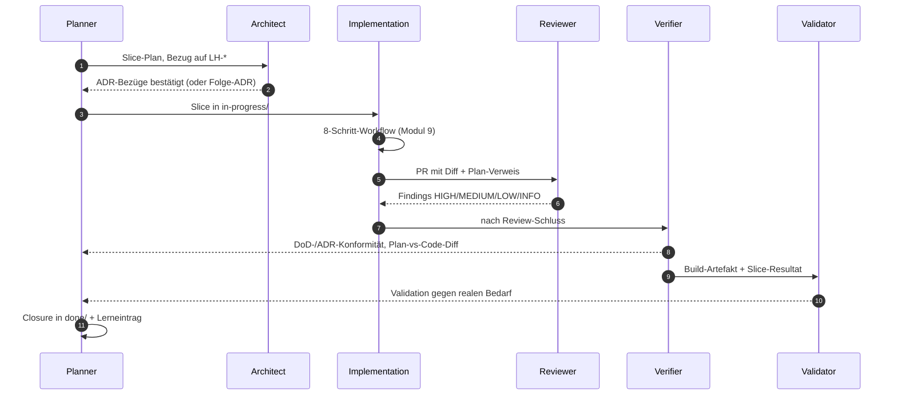
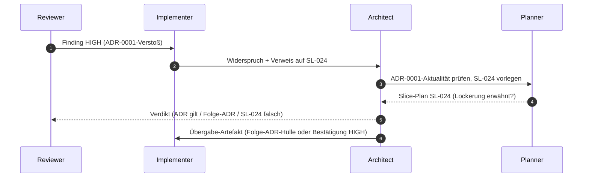

# Modul 8 — Agentenrollen

> **Aufwand:** ca. 90 Min Lesen · 75 Min Übung. Anschluss: zweiter [Phasen-Checkpoint B](../grundlagen/checkpoints.md#checkpoint-b--nach-phase-02-planung) sollte vor diesem Modul liegen. Spiralcurriculum: Verifikation vs. Validation kennst du aus [Modul 1](../01-spec-und-architektur/modul-01-entwicklungszyklus.md) — hier werden sie zu eigenen Rollen mit eigenem Kontext.

## Vorgriff: 8-Schritt-Workflow

Die Rollen-Sequenz und der Konfliktfall verweisen mehrfach auf den
*Minimal Agent Workflow* (acht Schritte), den der Implementation-Agent
durchläuft. **Für Modul 8 reichen drei Anker:**

| Anker | Was dahintersteht | Vollform |
|---|---|---|
| **Plan vor Code** | Implementation-Agent gibt vor dem ersten Diff einen Plan mit Akzeptanzkriterien aus. | [Modul 9 §Minimal Agent Workflow](modul-09-implementierung.md#minimal-agent-workflow-8-schritte) |
| **Pre-completion Checklist** | Selbstprüfung des Agenten *vor* der Übergabe an Reviewer — Schritt 7/8 des Workflows. | [Modul 9 §Minimal Agent Workflow](modul-09-implementierung.md#minimal-agent-workflow-8-schritte), Schritte 7–8 |
| **Steering-Loop-Eintrag** | Jeder Lauf endet mit einem expliziten Notiz-Block, der das nächste Sensor-/Guide-Wachstum vorbereitet. | [Modul 9 §Worked Example](modul-09-implementierung.md#worked-example-ein-slice-durch-den-8-schritt-workflow) (Schluss-Block) und [Reflexionsvorlage](../grundlagen/reflexion-vorlage.md) |

Wenn dir die drei Anker reichen, lies Modul 8 zuende. Wenn nicht: kurzer
Sprung in Modul 9 §Workflow, dann zurück.

## Engage

Drei Stunden Implementation, dann reviewt der *selbe* Agent seinen
eigenen Code — und findet nichts. Dasselbe Setup mit getrenntem Reviewer:
zwei HIGH-Findings, eines davon ein ADR-Verstoß. Was hat sich geändert?
Der Code nicht. Aber der *Kontext*. Selber Kontext → selbe blinde
Flecken. Genau das ist der Grund, warum es Rollen gibt.

## Lernziele

Nach diesem Modul kannst du:

* zehn typische Tätigkeiten den sechs Rollen *zuordnen* und Mehrfachzuweisungen *begründen* (Analysieren · konzeptuell),
* Übergaben zwischen den Rollen als Sequenz *modellieren* (Erschaffen · konzeptuell),
* einen Konfliktfall (Reviewer lehnt, Implementer widerspricht) *strukturiert auflösen* (Bewerten · prozedural),
* den Unterschied Verifikation vs. Validation an einem realen Fall *erklären* (Analysieren · konzeptuell).

## Rollen-Sequenz für einen Slice

Wesentlich: keine Rolle springt rückwärts in eine vorhergehende, ohne
*Übergabe-Artefakt* (Findings, Folge-ADR-Vorschlag, Carveout). Der
Eingabe-Kontext jeder Rolle ist eingeschränkt — das verhindert, dass
dieselbe Sicht denselben Fehler übersieht.

## Lab-Bezug

* `AGENTS.md` an der Lab-Wurzel plus die `AGENTS.md`-Dateien der
  Sprach-Skelette (`go/`, `python/`, `kotlin/`, `java/`, `csharp/`, `cpp/`) —
  der Eingabe-Kontext, den ein Implementation-Agent geladen bekommt
* `make agent-implement SLICE=…` — Kontextpaket der Implementer-Rolle
* `make agent-review` — Review-Fixture unter
  `exercises/09-review-fixture/` (Reviewer-Rolle; Übung in Modul 10)

> *Lab-Grenze:* Das Lab enthält *keine* Skill-Dateien pro Rolle
> (`agents/planner.md` etc.) und *kein* Replay eines kompletten
> Rollendurchlaufs — von den sechs Rollen werden nur Implementer
> (Kontextpaket) und Reviewer (Fixture) an Lab-Artefakten konkret.
> Die Übergabe-Sequenz selbst modellierst du in den Übungen als
> Mermaid-Diagramm, nicht gegen ein Lab-Artefakt.

## Themen

* Planner Agent
* Architect Agent
* Implementation Agent
* Reviewer Agent
* Verifier Agent (Verification)
* Validator Agent (Validation)
* Verantwortlichkeiten
* Übergaben
* Konfliktlösung (z. B. Reviewer findet ADR-Lücke)

## Kernidee

Rollentrennung verhindert, dass derselbe Kontext zweimal denselben Fehler
macht. Wer geplant hat, prüft nicht; wer geschrieben hat, reviewt nicht.

## Typische Fehlvorstellungen

- **"Eine Person spielt alle Rollen."** — Geht — *aber mit unterschiedlichem Eingabe-Kontext und unterschiedlichen Skill-Dateien*. Sonst wiederholen sich die blinden Flecken. Rollen-Trennung ist Kontext-Trennung, nicht Personen-Trennung.
- **"Reviewer macht das Verification gleich mit."** — Nein. Reviewer prüft gegen Plan/ADR (Maintainability). Verification prüft gegen DoD/Spec (Behaviour/Architecture Fitness). Zwei Fragen, zwei Antworten.
- **"Validation machen wir vor Release."** — Zu spät. Validation gehört *vor* die Implementation größerer Wellen (Spec-Validierung beim Kunden) und nach jedem MVP-Slice.
- **"Architect entscheidet, Implementation widerspricht nicht."** — Implementation darf Folge-ADRs vorschlagen. Was sie *nicht* darf: stillschweigend einer ADR widersprechen.

## Worked Example: einen Konflikt-Pfad als Rollen-Sequenz mit Übergabe-Artefakten modellieren

> **Wenn du Konflikte zwischen Rollen routiniert über Übergabe-Artefakte auflöst (und nicht über "wer setzt sich durch?"), springe zu [§Übungen](#übungen).** Worked Example zeigt die Sequenz-Modellierung an einem typischen Konflikt; ist das Schema vertraut, kostet das Mitlesen Last (Expertise-Reversal).

**Ausgangs-Konflikt:** Reviewer-Agent gibt ein HIGH-Finding: *"Slice
verstößt gegen ADR-0001 (hexagonale Architektur) — Optimizer schreibt
direkt aufs Device."* Implementer-Agent widerspricht: *"ADR-0001 wurde
in der letzten Welle gelockert; ich verweise auf die Diskussion in
Slice-Plan SL-024."*

Wer entscheidet? Wer übergibt was an wen? Der naive Pfad — *"Reviewer
hat mehr Senioritätsgefühl, also Reviewer"* — wiederholt blinde Flecken
und entspricht *keiner* der sechs Rollen. Die saubere Form modelliert
den Konflikt als Sequenz mit Übergabe-Artefakten.

**Schritt 1 — Beteiligte Rollen identifizieren.** Nicht jeder Konflikt
betrifft alle sechs. Hier: *Reviewer* (hat das Finding), *Implementer*
(widerspricht), *Architect* (hütet die ADR), *Planner* (besitzt den
Slice-Plan, der angeblich die ADR lockert). Verifier und Validator
sind *nicht* beteiligt — sie kommen später, nach der Konfliktauflösung.
Wer sie früher hineinzieht, lädt blinde Flecken aus deren Kontext in
die Auflösung.

**Schritt 2 — Sequenz zeichnen.** Mermaid-Form:

Sechs Pfeile, keine Rückwärts-Schleife ohne Artefakt. Wer einen Pfeil
nicht beschriften kann, hat einen blinden Übergang — exakt die Stelle,
an der Konflikte später aufbrechen.

**Schritt 3 — Übergabe-Artefakte pro Pfeil benennen.** Sequenz wirkt
nur, wenn jeder Pfeil ein *konkretes* Artefakt trägt. Tabelle:

| Pfeil | Übergabe-Artefakt | Inhalt minimal |
|---|---|---|
| R → I | Finding HIGH | Datei:Zeile · ADR-ID · Kategorie HIGH · ein-Satz-Begründung |
| I → A | Widerspruchs-Notiz | Verweis auf Slice-Plan + behauptete Lockerung + Position des Implementers |
| A → P | ADR-Aktualitäts-Anfrage | ADR-ID · Welle, in der gelockert worden sein soll · konkrete Frage |
| P → A | Slice-Plan-Auszug | exakte Textstelle aus SL-024, die die Lockerung enthält *oder nicht enthält* |
| A → R | Verdikt | ADR-Stand bestätigt / Folge-ADR-Hülle / SL-024-Korrektur |
| A → I | Folge-Übergabe | Folge-ADR-Hülle ODER Pflicht zur Korrektur ODER Bestätigung der Lockerung mit ID |

Die zentrale Disziplin: das Verdikt von Architect nach Reviewer (Pfeil
A → R) *muss* ein Artefakt sein, das Reviewer in seine Skill-Datei
übernehmen kann. *"Mündliche Klärung"* ist keine Übergabe; sie ist
Drift mit Kaffeepause.

**Schritt 4 — Drei mögliche Verdikte mit Folge-Sequenzen.** Konflikt
hat drei Auflösungs-Klassen, jede mit eigener Folge-Sequenz. Wer das
nicht vorab durchdenkt, fällt im realen Konflikt in die bequemste —
typischerweise *"wir nehmen das mildere Finding"*, die *keine* der
drei sauberen Klassen ist:

| Verdikt | Folge-Sequenz | Übergabe-Artefakt |
|---|---|---|
| ADR-0001 gilt unverändert, SL-024 hat falsch behauptet | A → P: Slice-Plan-Korrektur; P → I: aktualisierter Plan; I implementiert ADR-konform neu | Plan-Diff mit Korrektur-Begründung |
| ADR-0001 wird per Folge-ADR `supersedes`d | A → R: Folge-ADR mit `supersedes: ADR-0001`; R aktualisiert Skill-Datei (welche Regel jetzt gilt) | Folge-ADR (Accepted) · Skill-Patch |
| Lockerung war legitim, aber nicht dokumentiert | A → P → I: Sofort-PR, der die Lockerung als Folge-ADR nachzieht; bestehender Slice darf trotzdem nicht stillschweigend abgeschlossen werden | Folge-ADR + Erinnerungs-Slice in `next/` |

*Keine* dieser Sequenzen enthält "Reviewer-Finding herabstufen, weil
Implementer widerspricht". Das wäre der vierte, *falsche* Pfad — und
er existiert nur, weil Übergabe-Artefakte fehlen.

**Schritt 5 — Sequenz auf "kein Sprung ohne Artefakt" prüfen.** Lege
die gezeichnete Sequenz aus Schritt 2 neben die Tabelle aus Schritt 3.
Für jeden Pfeil: hast du das Artefakt benennen können? Wenn ein Pfeil
übrig bleibt, ist die Sequenz *nicht* fertig — sondern dort liegt der
nächste blinde Fleck. Häufige Lücken:

- *"Reviewer → Implementer: schnelles Update im Chat"* — kein
  Artefakt, kein dokumentierbarer Übergang, kein Re-Run gegen die
  Sequenz möglich.
- *"Architect entscheidet — fertig"* — Verdikt ohne `supersedes`-ADR
  oder Plan-Korrektur ist eine Erklärung, kein Akt.

**Schritt 6 — Folge-ADR-Hülle vorbereiten, *bevor* der Konflikt
auftritt.** Damit Verdikt 2 (Folge-ADR) keine Stundenarbeit bei jeder
Konfliktwiederholung wird, lebt unter `docs/plan/adr/templates/` eine
Hülle mit `supersedes`-Feld, leerem Begründungsblock, leerem
Fitness-Function-Anker. Der Architect füllt sie in fünf Zeilen aus,
Reviewer kann den Skill-Patch ableiten. Ohne Hülle wird Verdikt 2 das
Verdikt mit dem höchsten Aufwand — und damit das, das *nicht* gewählt
wird, auch wenn es das richtige wäre.

**Schritt 7 — Wann *nicht* eine Sequenz modellieren?** Bei isolierten
LOW/INFO-Findings ist die Sequenz Overkill — Implementer akzeptiert
oder begründet, Reviewer schließt das Finding. Die Sequenz greift ab
*HIGH*-Findings mit Rollen-Widerspruch oder ab dem dritten Mal, dass
derselbe Konflikttyp auftritt. Dreimal derselbe Konflikt ist ein
Steering-Loop-Signal (siehe [`../grundlagen/reflexion-vorlage.md`](../grundlagen/reflexion-vorlage.md#wann-darf-eine-reflexion-nicht-zu-einer-harness-änderung-führen)):
die Sequenz wird *Pflicht* im 8-Schritt-Workflow ([Modul 9](modul-09-implementierung.md#minimal-agent-workflow-8-schritte)).

Sieben Schritte, eine Sequenz, sechs benannte Übergaben. Der Test, ob
die Modellierung trägt: der nächste Konflikt durchläuft die Pfeile
*ohne* dass jemand neu erfindet, wer wem was übergibt.

## Übungen

* **(Analysieren — aktiviert LZ 1)** Ordne die folgenden 10 typischen
  Tätigkeiten den sechs Rollen zu — Mehrfachzuweisungen sind erlaubt,
  brauchen aber eine Begründung (zwei Rollen, zwei verschiedene
  Eingabe-Kontexte):
  1. "Prüfe, ob der PR die ADR-7-Schichtung einhält"
  2. "Schneide das Feature in drei Slices"
  3. "Aktualisiere AGENTS.md mit einer neuen Hard Rule"
  4. "Prüfe, ob alle Akzeptanzkriterien aus LH-FA-3 erfüllt sind"
  5. "Schreibe den Adapter für PostgreSQL"
  6. "Entscheide, ob `coverage-gate` 70 % oder 80 % verlangt"
  7. "Prüfe, ob das Feature das Benutzerbedürfnis trifft"
  8. "Schreibe einen Replay-Test gegen das Golden Set"
  9. "Wähle zwischen REST und gRPC"
  10. "Identifiziere, dass dieselbe Halluzination dreimal aufgetreten ist"
* **(Erschaffen — aktiviert LZ 2)** Modelliere die Übergabe-Sequenz für einen *zweiten* Konflikttyp (z. B. der Verifier findet eine DoD-Lücke erst *nach* dem Review-Schluss) als gerichtete Sequenz und benenne an *jeder* Kante das Übergabe-Artefakt. Erwartung: keine Kante ohne Artefakt.
* **(Bewerten — aktiviert LZ 3)** Spiele einen Konfliktfall durch: Reviewer lehnt ab, Implementer widerspricht — wer entscheidet, in welcher Reihenfolge, und mit welchem Übergabe-Artefakt? Löse ihn *strukturiert* auf (drei Verdikte: bestätigt · zurückgewiesen · eskaliert), nicht durch "der Strengere gewinnt".

## Reflexion

Vier Standardfragen aus [`reflexion-vorlage.md`](../grundlagen/reflexion-vorlage.md)
nach der Rollen-Zuordnung und dem Konfliktfall-Durchspiel.
Modul-spezifische Trigger:

- **Beobachtung:** Hast du eine Tätigkeit nur einer Rolle zugeordnet, obwohl Mehrfachzuweisung sinnvoll war? Wer hat im Konfliktfall *zuerst* entschieden — und was war das Übergabe-Artefakt?
- **2×2-Quadrant:** Rollen-Trennung ist Kontext-Trennung, primär *inferential feedforward*.
- **Steering-Loop:** Skill-Datei pro Rolle? Tool-Allowlist pro Rolle? Übergabe-Artefakt-Pflicht im 8-Schritt-Workflow?
- **Conceptual Change:** Kandidaten in [`lernervorstellungen.md`](../grundlagen/lernervorstellungen.md) (z. B. "Eine Person spielt alle Rollen", "Reviewer macht das Verification gleich mit").

## Selbstcheck

* **(Erinnern)** Nenne die sechs Rollen in der Reihenfolge, in der ein Slice sie typischerweise durchläuft.
* **(Erinnern)** Welches *Übergabe-Artefakt* gehört zu jeder der neun Übergaben in der Rollen-Sequenz (z. B. Planner → Architect)?
* **(Analysieren — aktiviert LZ 4)** Warum braucht es Verification *und* Validation — erkläre den Unterschied (gegen Plan/DoD vs. gegen realen Bedarf) und nenne den *gefährlichsten* Fall, in dem Verification grün ist, Validation aber fehlschlägt.
* Welche Rolle besitzt ein ADR — wer darf es ändern?
* **(Analysieren)** Welche Rolle bearbeitet (a) einen Folge-ADR-Vorschlag, (b) eine DoD-Verletzung, (c) ein Replay-Set-Update? Begründe je eine sinnvolle Mehrfachzuweisung — eine Tätigkeit, die *zwei* Rollen mit unterschiedlichem Kontext sehen müssen.
* **(Bewerten)** Konfliktfall: Reviewer lehnt mit HIGH (ADR-Verstoß), Implementer widerspricht mit Verweis auf einen vermeintlich veralteten ADR-Stand. Wer entscheidet, in welcher Reihenfolge — und was ist das *Übergabe-Artefakt* der Entscheidung?

### Selbstcheck-Rubrik

| Frage | rudimentär | solide | exzellent |
|---|---|---|---|
| Sechs Rollen in Reihenfolge? | Rollen genannt, aber Reihenfolge unklar | Planner → Architect → Implementation → Reviewer → Verifier → Validator. Übergaben jeweils mit Artefakt (Plan, ADR-Bezug, PR, Findings, Verifikationsbeleg, Validierungsbeleg). | + Hinweis: Rollen-Trennung ist Kontext-Trennung, nicht Personen-Trennung. Eine Person kann mehrere Rollen spielen — aber nicht im selben Kontextfenster, sonst wiederholen sich blinde Flecken. |
| Neun Übergabe-Artefakte? | vier oder weniger genannt | Planner→Architect: Slice-Plan mit LH-Bezug · Architect→Planner: ADR-Bezug/Folge-ADR · Planner→Implementation: Slice in `in-progress/` · Implementation→Reviewer: PR mit Diff + Plan-Verweis · Reviewer→Implementation: Findings HIGH/MEDIUM/LOW/INFO · Implementation→Verifier: DoD-Bestätigung + Sensor-Belege · Verifier→Planner: DoD-/ADR-Konformitätsbericht + Plan-vs-Code-Diff · Verifier→Validator: Build-Artefakt + Slice-Resultat · Validator→Planner: Validierungsbeleg gegen realen Bedarf. | + Pointe: ohne *jedes* dieser Artefakte gibt es keinen Rollenwechsel — nur einen Kontext-Switch ohne Übergabe. Ein Rollen-Sprung ohne Artefakt ist der häufigste Pfad zu blinden Flecken. |
| Warum Verification *und* Validation? | "Verschiedene Prüfungen." | Verification: "Bauen wir es richtig?" (gegen Plan/DoD); Validation: "Bauen wir das Richtige?" (gegen realen Bedarf). | + Gefährlichster Fall: Verifikation grün, Validation rot — Team baut *perfekt das Falsche*. Umgekehrter Fall (Verifikation rot, Validation grün) ist Prozess-Drift, auch wenn das Ergebnis zufällig passt. |
| Wer darf ein ADR ändern? | "Der Architekt." | Architect schreibt; Reviewer prüft auf Konsistenz; Implementer liest als Constraint; Accepted-ADRs *niemand* überschreibt — Folge-ADR mit `supersedes`. | + Konfliktpfad: Implementer darf höchstens Folge-ADR vorschlagen, niemals stillschweigend einer ADR widersprechen. Das wäre Drift, kein "pragmatisches Implementieren". |
| Drei Tätigkeiten → Rollen-Zuordnung + Mehrfachzuweisung? | eine Rolle pro Tätigkeit ohne Begründung | (a) Folge-ADR-Vorschlag: Implementer schlägt vor → Architect entscheidet → Reviewer prüft auf Konsistenz. (b) DoD-Verletzung: Verifier *erkennt*, Planner *entscheidet* (Plan-Update vs. Slice-Rückführung). (c) Replay-Set-Update: Validator pflegt, Verifier nutzt — Mehrfachzuweisung, weil beide unterschiedlichen Kontext brauchen (Validator: Realität; Verifier: DoD/Spec). | + Hinweis: Mehrfachzuweisung ist *nur dann* sauber, wenn jede beteiligte Rolle einen *anderen Eingabe-Kontext* hat. Sonst ist es keine Mehrfachzuweisung, sondern doppelte Arbeit (und blinde Flecken). |
| Konflikt Reviewer↔Implementer — wer entscheidet? | "Der Architekt." | Architect klärt: hat Reviewer gegen veralteten ADR-Stand geprüft, oder verstößt der Code wirklich? Übergabe-Artefakt: entweder Folge-ADR (mit `supersedes`) oder bestätigter HIGH mit Begründungs-Verweis. *Nicht*: Reviewer-Finding herabstufen, weil Implementer widerspricht. | + Reihenfolge: Architect *prüft zuerst die ADR-Aktualität*, dann den Code — sonst belohnt das System "schnell widersprechen". Wenn der Konflikt-Typ dreimal auftritt, liegt eine Lücke in der ADR-Verteilung an die Implementer (Steering-Loop-Aktion: ADR-Bezug in 8-Schritt-Workflow Schritt 2 verschärfen). |

## Weiterlesen

* Nächstes Modul: [Modul 9 — Implementierung durch KI-Agenten](modul-09-implementierung.md)
