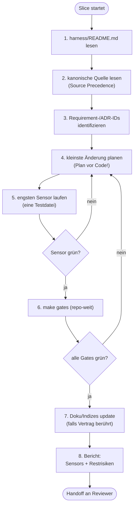

# Modul 8 — Implementierung durch KI-Agenten

> **Aufwand:** ca. 120 Min Lesen · 120 Min Übung. Dieses Modul ist absichtlich tief — der 8-Schritt-Workflow und die Hard Rules sind die operative Brücke zwischen Theorie (Module 1–7) und Gates (Module 9–12).

## Engage

Du gibst deinem Implementation-Agent einen Slice. Er liefert in vier
Minuten 800 Zeilen Diff. Du prüfst — und findest, dass er die Hälfte aus
einem ähnlichen Repo erfunden hat, weil deine AGENTS.md schwieg. Hätte
er stattdessen erst einen *Plan* ausgegeben, hätte er nach 30 Sekunden
einräumen müssen, dass er den Kontext nicht hat. Plan → Diff → Code ist
nicht eine Empfehlung; es ist *die Reihenfolge*, die "schreiben" von
"raten" trennt.

## Lernziele

Nach diesem Modul kannst du:

* einen Slice nach dem 8-Schritt-Workflow *umsetzen* und die Reihenfolge Plan → Diff → Code *einhalten* (Anwenden),
* drei Hard Rules für ein Beispiel-Repo *formulieren*, jeweils mit Falsch/Richtig-Beispiel und Begründung (Erschaffen),
* eine Hard Rule einem Quadranten der 2×2-Matrix *zuordnen* (Analysieren),
* die Wirkung von AGENTS.md auf einen Agentenlauf *messen*, indem du den Lauf mit und ohne AGENTS.md vergleichst (Bewerten).

## Lab-Bezug

* [`../../../lab/example/Makefile`](../../../lab/example/Makefile), Target `make agent-implement SLICE=slice-009`
* [`../../../lab/example/exercises/08-implementation.md`](../../../lab/example/exercises/08-implementation.md)

## Themen

* Codegenerierung
* Änderungsplanung vor Code
* Refactoring
* Architekturkonformität
* Werkzeugbindung (welche Tools darf der Agent benutzen)
* AGENTS.md als zentrale, maschinell lesbare Konventionsdatei
* Pre-completion Checklist Middleware (Self-Check vor PR-Open)

## Kernidee

Ein Agent ohne Plan schreibt Code. Ein Agent mit Plan schreibt das
*Richtige*. Die Reihenfolge Plan → Diff → Code ist nicht optional.

## Minimal Agent Workflow (8 Schritte)

Der Pfad, den jeder Implementation-Agent pro Slice durchläuft — und der
in `harness/README.md` als Vertrag dokumentiert wird:

1. `harness/README.md` lesen.
2. Relevante kanonische Quelle lesen (Source Precedence beachten).
3. Betroffene Requirement-/ADR-IDs identifizieren.
4. Kleinste sinnvolle Änderung planen.
5. Engsten nützlichen Sensor laufen lassen (z. B. nur eine Testdatei).
6. Repo-weiten Gate-Lauf vor Handoff (`make gates`).
7. Doku/Indizes aktualisieren, falls ein öffentlicher Vertrag berührt ist.
8. Ausgeführte Sensors und verbleibende Risiken berichten — keine Erfolgsmeldung ohne Gate-Ausführung.

### Workflow als Diagramm



Zwei Rücksprungkanten sind didaktisch wesentlich: 5→4 und 6→4. Nicht
zurück zu Schritt 1 — der Plan wird *verfeinert*, nicht der Kontext neu
gelesen.

## Hard Rules (repo-spezifisch)

Negativregeln, die der Agent nie brechen darf. Eine gute Hard Rule hat
*Falsch/Richtig*-Beispiele **und** eine *technische Begründung*.
Beispiele aus realen Repos (siehe
[`../grundlagen/fallstudien.md`](../grundlagen/fallstudien.md)):

* **Docker-only** (grid-gym): kein lokales `.venv`, kein `pip install` außerhalb von Dockerfile-Stages.
  *Falsch:* `uv run python tools/foo.py`.
  *Richtig:* `docker compose run --rm test-runner uv run python tools/foo.py`.
  *Begründung:* Toolchain-Reproduzierbarkeit + Supply-Chain-Defense.
* **`# noqa` ist verboten** (grid-gym): bricht das `noqa-gate` in `make gates`. Ausnahmen werden in `pyproject.toml` mit Begründung dokumentiert.
* **Suppression-Verbot pro Sprache** — derselbe Mechanismus, andere Syntax:
  * Python: `# noqa` (grid-gym `noqa-gate`)
  * Go: `//nolint`
  * C#: `#pragma warning disable`, `[SuppressMessage]` (bess-ems `solid-suppression-gate`)
  * Kotlin: `@Suppress("...")`
  * Java: `@SuppressWarnings("...")`
  In jeder Sprache gilt: Inline-Suppression bricht das Suppression-Gate; Ausnahmen wandern in eine zentrale Konfigurations-Datei mit Begründung.
* **git mv + Inhaltsänderung = zwei Commits** (grid-gym): erst reiner `git mv` (Git erkennt R-Rename), dann Inhalt umschreiben.
  *Begründung:* Sonst fällt die Rename-Detection unter die 50 %-Similarity-Schwelle und `git log --follow` wird unzuverlässig.
* **Architektur ist sprach- und meilensteinfrei** (grid-gym, c-hsm-doc): `spec/architecture.md` referenziert ADRs und Modul-Pfade, aber keine Wellen, Slices oder Closure-Daten. Die zeitliche Schicht lebt in `docs/plan/planning/`.
* **Optimierer darf nie direkt aufs Gerät schreiben** (bess-ems-Klasse): Output fließt durch Statemachine, Constraint-Limiter, Ramp-Limiter.
* **Gates dürfen nicht ohne ADR gelockert werden**: jede Schwellen-Senkung ist ein ADR, kein PR-Kommentar.

Hard Rules sind *computational + inferential feedforward* zugleich: sie
stehen in AGENTS.md (Agent liest sie) **und** werden idealerweise durch
eine Fitness Function geprüft (Linter schlägt an). Wenn nur eines von
beiden existiert, ist die Regel nur halb durchgesetzt.

## Typische Fehlvorstellungen

- **"Agent liefert schnell, also ist der Workflow Overhead."** — Geschwindigkeit ohne Plan produziert Diffs, die später als Review-Last anfallen. Plan + Diff + Code kostet 20 % länger und spart 50 % Review.
- **"Hard Rules schreibe ich in AGENTS.md, und das reicht."** — Eine Hard Rule, die nur in AGENTS.md steht (inferential feedforward), ist halbgesetzt. Erst mit Fitness Function (computational feedback) ist sie *durchgesetzt*. Beides ist Pflicht.
- **"Wenn die Tests grün sind, ist der Slice fertig."** — Schritt 8 verlangt einen Bericht über *Sensors und verbleibende Risiken*. Grüne Tests sind notwendig, nicht hinreichend.
- **"Die Pre-completion Checklist ist Bürokratie."** — Sie ist der einzige Schritt, der vor Übergabe an Reviewer/Verifier eine *Selbstaussage* erzwingt. Wer keinen Selbst-Check macht, lädt jedes Risiko in die nächste Rolle.
- **"Mehr Kontext ist immer besser — siehe Lopopolo."** — Lopopolos *"anything it can't access in-context doesn't exist"* sagt: *fehlender* Kontext schadet. Es sagt **nicht**: *jeder zusätzliche* Kontext nützt. Siehe nächster Block.

## Kontext-Verdichtung (Kehrseite der Lopopolo-Maxime)

Die Maxime *"anything it can't access in-context doesn't exist"* ist im
Kurs eine Hebellinse — sie erklärt, warum Spec, ADR und AGENTS.md *die
Hauptkontrolle* sind, nicht Beiwerk. Aber sie hat eine Kehrseite, die der
Reflex "mehr Kontext rein" gerne überliest:

- **Kontext-Pollution.** Wenn ein 14 Wochen alter ADR-Entwurf im Kontext
  steht, der mit `superseded` markiert ist, erfindet der Agent
  Begründungen *aus dem alten ADR*. Der Kontext besteht — die
  Information ist falsch. Mehr Tokens, schlechteres Ergebnis.
- **Lost in the Middle.** Auch bei großen Kontext-Fenstern fallen
  Informationen in der Mitte des Prompts deutlich seltener in den
  Output zurück als Anfang und Ende. Wer wichtige Anforderungen
  ungeordnet "dazwischen" platziert, hat sie technisch im Kontext und
  praktisch nicht.
- **Token-Kosten.** Jedes Token im Eingangskontext wird abgerechnet —
  pro Lauf, pro Tool-Call, pro Replay. Ein 30-zeiliger irrelevanter
  Block, der in 1500 PRs mitläuft (siehe Lopopolos empirischer Beleg in
  [`../abschluss/quellen.md`](../abschluss/quellen.md)), ist eine
  Rechnung mit vier Stellen vor dem Komma.

Folge: Context Engineering ist *auch* eine Reduktions-Aufgabe.
Konkret gehört in den Lauf-Kontext:

| Pflicht | Wer? |
|---|---|
| `harness/README.md` | jeder Lauf |
| relevante kanonische Quelle (Source Precedence) | jeder Lauf, gezielt |
| Requirement-/ADR-IDs des Slice | jeder Lauf |
| AGENTS.md (Hard Rules + Konventionen) | jeder Lauf |
| Tool-Allowlist | jeder Lauf |

| Nicht in den Lauf-Kontext (Anti-Pattern) |
|---|
| `superseded`/`deprecated` ADRs ohne Folge-Bezug |
| historische Spec-Diff-Notizen, die jetzt in ADR-Form gegossen sind |
| Skills, die nicht zu dieser Rolle gehören |
| ältere Carveouts, deren Auflösungs-Trigger bereits eingetreten ist |

Die Verdichtungs-Sensoren dafür sind in [Modul 14](../05-betrieb/modul-14-observability.md):
Token-Eingabe-Metrik pro Slice, Cache-Hit-Rate (siehe Mini-Glossar in
Modul 14), und der **Doku-Konsistenz-Agent** als Drift-Detektor für tote
Kontext-Stücke.

Faustregel für den 8-Schritt-Workflow: Schritt 2 ist *"kanonische Quelle
lesen"*, nicht *"alles lesen, was im Repo liegt"*. Wenn der Plan in
Schritt 4 nicht ohne Verweis auf einen Kontext-Block auskommt, gehört
dieser Block in den nächsten Lauf — alle anderen nicht.

## Worked Example: ein Slice durch den 8-Schritt-Workflow

> **Wenn du den 8-Schritt-Workflow in deinem eigenen Repo bereits routiniert läufst (Plan-vor-Code als Reflex, Sensor-Verfeinerung statt Kontext-Neulesen), springe zu [§Übungen](#übungen).** Das Worked Example unten ist die Schablone für den ersten oder zweiten Durchgang — wer den Workflow verinnerlicht hat, gewinnt durch erneutes Mitlesen wenig (Expertise-Reversal).

**Ausgangs-Slice:** `SL-014a` aus dem Worked Example in
[Modul 4](../02-planung/modul-04-planning-harness.md#worked-example-einen-zu-großen-slice-schneiden) —
*"Login-Endpoint akzeptiert User/Passwort, gibt JWT zurück,
Audit-Log-Eintrag entsteht. Bezug: LH-FA-AUTH-001 + ADR-0007
(Service-Adapter-Layer)."*

**Schritt 1 — `harness/README.md` lesen.**
Implementer-Agent öffnet `harness/README.md`. Stellt fest: Source
Precedence sagt *Spec → ADRs → Roadmap → AGENTS.md*. Tool-Allowlist
enthält keinen direkten HTTP-Client (folgt ADR-7).

**Schritt 2 — Kanonische Quelle lesen (gezielt).**
`spec/lastenheft.md` Abschnitt `LH-FA-AUTH-001` (drei
Akzeptanzkriterien). ADR-0007 (Service-Adapter-Layer). *Nicht* gelesen:
ältere ADRs, irrelevante Skills — siehe oben "Kontext-Verdichtung".

**Schritt 3 — Requirement-/ADR-IDs identifizieren.**
`LH-FA-AUTH-001`, `ADR-0007`. Diese zwei IDs werden in den
Make-Target-Kommentar (für `make verify`) und in die Commit-Message
eingewoben.

**Schritt 4 — Kleinste Änderung planen.** Agent gibt **Plan vor Code**
aus:
> **Plan SL-014a:**
> 1. `service/auth/login.go` — Funktion `Login(creds)` mit
>    JWT-Erzeugung. Import nur aus `adapter/jwt/` (ADR-0007).
> 2. `adapter/audit/file.go` — `WriteLoginAttempt(ev)`.
> 3. Tests: `service/auth/login_test.go` (Happy/Boundary/Negative
>    nach LH-FA-AUTH-001).
> *Out-of-Scope dieses Slice:* Refresh-Token (SL-014b), Revocation
> (SL-014c).

**Schritt 5 — Engsten Sensor laufen (eine Testdatei).**
`make test FILE=service/auth/login_test.go`. Erste Iteration rot
(Negativtest schlägt durch). Plan in 4 verfeinern, *nicht* mehr Kontext
laden. Zweite Iteration: grün.

**Schritt 6 — `make gates` (repo-weit).**
Erste Iteration: `arch-check` rot, weil `service/auth/login.go` einen
direkten Import aus `net/http` trägt. Rückkante zu Schritt 4: Plan
korrigieren — Adapter-Wrapper in `adapter/jwt/sign.go`. Zweite
Iteration: grün.

**Schritt 7 — Doku/Indizes aktualisieren.**
`spec/lastenheft.md` — `LH-FA-AUTH-001` als implementiert markiert (mit
Slice-ID-Bezug). `harness/README.md` unverändert (keine neue
Tool-Familie). AGENTS.md unverändert (keine neue Hard Rule).

**Schritt 8 — Bericht: Sensors + Restrisiken.**
> **Sensors gelaufen:** `make test` (3 neue Tests, alle grün), `make
> gates` (alle grün, inkl. arch-check). **Restrisiken:**
> Refresh-Token-Flow (SL-014b) noch nicht implementiert — JWT läuft
> ohne Erneuerungspfad ab; das ist im Plan dokumentiert, *aber* das
> Audit-Log braucht später eine Rotations-Regel. Vorschlag: Folge-Slice
> SL-014b zuerst, Audit-Rotation als Hinweis in dessen DoD aufnehmen.

Sieben Iterationen, ein nachvollziehbarer Slice. Beachte: **kein
Rücksprung zu Schritt 1**, sondern nur 5→4 (Plan verfeinern) und 6→4
(Plan korrigieren wegen Gate). Wer in Schritt 1 zurückspringt, hat einen
Kontext-Defekt, keinen Plan-Defekt — das ist eine andere Ursache und
gehört in den nächsten Steering-Loop-Eintrag.

Vergleich:
[`../../../lab/example/Makefile`](../../../lab/example/Makefile) Target
`make agent-implement SLICE=slice-009` zeigt das Kontextpaket aus
Schritten 1–3, bevor Schritt 4 anfängt.

## Übungen

* Implementierung eines Features aus einem Slice-Plan
* Lass den Agenten ohne ADR-Kontext laufen und vergleiche mit dem Lauf *mit* ADR-Kontext
* Formuliere drei Hard Rules für ein Beispiel-Repo und prüfe, ob mindestens eine maschinell durchsetzbar ist

### Minimaler Übungspfad

```bash
cd lab/example
make agent-implement SLICE=slice-009
```

Erwartete Beobachtung: Das Target erzeugt keinen Code. Es zeigt das
Kontextpaket, das ein Implementation-Agent vor dem Plan lesen muss. Erst
wenn du dieses Paket benennen kannst, ist der freie Agentenlauf sinnvoll.

## Reflexion

Nach dem Slice-Umsetzungs-Lauf, dem AGENTS.md-Vergleich und den drei Hard Rules kurz **schriftlich**:

1. **Was ist beobachtbar passiert?** — Welcher Schritt brauchte 5→4-Rücksprung? Wo war der Lauf *mit* AGENTS.md inhaltlich anders als ohne? Welche Hard Rule blieb halb durchgesetzt (kein Gate)?
2. **Welcher 2×2-Quadrant war Ursache?** — siehe [`konzeptkarte.md §2x2-Schnellanker`](../grundlagen/konzeptkarte.md#2x2-schnellanker). Hard Rules liegen typisch in *zwei* Quadranten gleichzeitig.
3. **Welche konkrete Steering-Loop-Aktion folgt?** — AGENTS.md schärfen? Tool-Allowlist enger? Fitness Function für die schwächste Hard Rule?
4. **Welche eigene Vorstellung wurde unzufriedenstellend?** — Conceptual Change; Kandidaten in [`lernervorstellungen.md`](../grundlagen/lernervorstellungen.md) (z. B. "Agent liefert schnell, also ist der Workflow Overhead", "Hard Rules in AGENTS.md reichen", "Mehr Kontext ist immer besser").

Eintragsformat, "Wann *nicht* reagieren" und Anti-Antworten: [`reflexion-vorlage.md`](../grundlagen/reflexion-vorlage.md).

## Selbstcheck

* **(Erinnern)** Nenne die acht Schritte des Minimal Agent Workflow in Reihenfolge.
* Welche Eingaben braucht ein Implementation-Agent minimal, um nicht zu halluzinieren?
* Wann ist ein Implementation-Agent fertig — wenn der Code kompiliert, oder wenn die DoD erfüllt ist?
* Welche deiner Hard Rules wandert in welche Quadranten der 2×2-Matrix?
* **(Bewerten + Metakognition)** Welcher Schritt des 8-Schritt-Workflows ist in deinem eigenen Repo heute am schwächsten verankert — und woran erkennst du das?

### Selbstcheck-Rubrik

| Frage | rudimentär | solide | exzellent |
|---|---|---|---|
| Acht Workflow-Schritte in Reihenfolge? | fünf oder weniger genannt | (1) `harness/README.md` lesen · (2) kanonische Quelle · (3) Requirement-/ADR-IDs · (4) kleinste Änderung planen · (5) engster Sensor · (6) `make gates` · (7) Doku/Indizes · (8) Bericht über Sensors + Restrisiken. | + Rücksprungkanten benannt: 5→4 und 6→4 (Plan wird *verfeinert*, nicht Kontext neu gelesen). Wer rückläufig zu Schritt 1 springt, hat keinen Plan-Defekt, sondern einen Kontext-Defekt — das ist eine andere Ursache. |
| Minimale Eingaben gegen Halluzination? | "Klare Anweisung." | `harness/README.md` + relevante kanonische Quelle + Requirement/ADR-IDs + AGENTS.md + Tool-Allowlist. | + Hinweis Lopopolo: "anything it can't access in-context doesn't exist" — fehlende Eingaben werden *durch Raten ersetzt*, nicht durch Schweigen. |
| Fertig: Code kompiliert oder DoD erfüllt? | "DoD." | DoD-erfüllt + Schritt 8 ausgeführt (Bericht über Sensors + Restrisiken). Kompilierender Code ist notwendig, nicht hinreichend. | + Folge: ohne Schritt-8-Bericht wird jedes Risiko in die nächste Rolle (Reviewer/Verifier) verlagert — das bricht die Kontext-Trennung der Rollen. |
| Hard Rules ↔ Quadranten der 2×2-Matrix? | "Inferentielle Feedforward." | Jede Hard Rule liegt in *zwei* Quadranten: inferential feedforward (steht in AGENTS.md) + computational feedback (Fitness Function/Linter-Gate). | + Hard Rule nur in einem Quadranten ist halb durchgesetzt; nur in AGENTS.md vergisst der Agent sie unter Druck, nur als Fitness Function ohne AGENTS.md-Eintrag versteht der Agent das *Warum* nicht. |
| Schwächster Schritt im eigenen Repo? | konkret benannt, aber ohne Beleg | Konkret benannter Schritt (z. B. Schritt 7: Doku-Update bleibt liegen) + Beleg (z. B. `harness/README.md` wurde seit 6 Wochen nicht angepasst, obwohl drei Gate-Targets sich änderten). | + Steering-Loop-Eintrag formuliert: was im Harness verändert wird, damit Schritt X beim nächsten Lauf nicht mehr schwächster Schritt ist (z. B. Doku-Konsistenz-Agent als Drift-Sensor, Modul 14). |

## Weiterlesen

* 2×2-Matrix für Quadranten-Zuordnung: [`../grundlagen/klassifikation.md`](../grundlagen/klassifikation.md)
* Nächstes Modul: [Modul 9 — Review Harness](../04-qualitaet/modul-09-review-harness.md)
