# Agents-Regelwerk — der Kurs als Betriebsregelwerk

**Stand:** Kurs-Welle 18 · 2026-06-11 · 21:08 CEST

> **Was diese Datei ist.** Der Kurs ohne Didaktik-Schicht: sein
> operatives Regelwerk — Konventionen, Regeln, Abläufe, Schemata — in
> **Quellformulierung**, für Code-Agenten. Weggelassen sind Engage,
> Lernziele, Übungen, Selbstchecks, Lösungen, Reflexionen und die
> Erzählprosa der Worked Examples; der operative Inhalt selbst ist
> *nicht* verdichtet, sondern steht wortgleich zur Quelle (einzige
> Eingriffe: Link-Pfade auf diese Datei-Ebene angepasst, generische
> Überschriften pro Modul disambiguiert, Regel-Extrakte aus sonst
> weggelassenen Abschnitten als solche überschrieben). Ein Mensch, der
> den Kurs lernen will, liest die [Module](README.md#lernfortschritt).
>
> **Was diese Datei NICHT ist.** Eine Quelle der Wahrheit. Sie ist ein
> **derivatives Sicht-Artefakt** ohne eigene Normativität — bei
> Konflikt gilt die Quelle (Rang unten). Wer hier eine Regel ändert,
> ohne die Quelle zu ändern, erzeugt genau die Drift, die das
> Regelwerk selbst verbietet.

## Quellen-Rang dieses Regelwerks

1. [`grundlagen/konventionen.md`](grundlagen/konventionen.md) — normative Strukturregeln.
2. [`grundlagen/klassifikation.md`](grundlagen/klassifikation.md) und [`grundlagen/durchsetzungsschicht.md`](grundlagen/durchsetzungsschicht.md) — Kernmodell.
3. Die Modultexte der Phasen 01–05 — pro Abschnitt unten als *Quelle* verlinkt.
4. **Dieses Regelwerk** — derivativ; nie normative Grundlage einer Entscheidung.

Verkörperte Form zum Kopieren: [`/lab/templates/`](../../lab/templates/)
(AGENTS.md, harness/, spec/, ADR, Slice, Welle, Review-Report).
Außerhalb des Kurs-Repos als ZIP (login-frei, Stand = letzter `templates-v*`-Tag):
<https://github.com/pt9912/ai-harness-course/releases/latest/download/lab-templates.zip>.
Lauffähiges Beispiel: [`/lab/example/`](../../lab/example/).

---
## Konventionen
*Quelle: [grundlagen/konventionen.md](grundlagen/konventionen.md)*

### Kernbegriffe

| Begriff | Bedeutung im Kurs |
|---|---|
| LLM | Modell, das Text → Text abbildet. Stateless. |
| Agent | LLM + Tool-Schnittstelle + Schleife. Hält Zustand über mehrere Turns. |
| Tool-Call | Strukturierter Aufruf einer Funktion durch das LLM (`name`, `arguments`, `result`). |
| Spec | Lastenheft-Artefakt unter `spec/`. Quelle der Wahrheit für *was*. |
| ADR | Architecture Decision Record unter `docs/plan/adr/`. Quelle der Wahrheit für *warum so*. |
| Slice | Kleinste lieferbare Einheit eines Features. Hat eigenen Plan, eigene DoD. |
| Welle | Bündel von Slices, das gemeinsam geplant und abgeschlossen wird. |
| Trigger | Beobachtbare Bedingung, bei der ein Slice/Welle/Carveout in den nächsten Status wandert. |
| Closure | Abschluss eines Slice oder einer Welle, dokumentiert mit Lerneintrag in `done/`. |
| Gate | Automatisch prüfbares Qualitätskriterium (Linter, Typecheck, Architekturtest, Coverage). |
| Carveout | Dokumentierte Ausnahme von einem Gate oder einer Architekturregel. |
| Skill | Repo-spezifisches Markdown/JSON-Artefakt, das einer Agenten-Rolle Checkliste oder Verhalten beibringt. Lebt typischerweise in `.harness/`. |
| Replay | Deterministisch wiederholbarer Agentenlauf gegen fixierte Inputs. |
| Golden Set | Kuratiertes Eingabe/Erwartungs-Paar für Regressionstests. |
| Finding | Einzelne Beobachtung eines Reviewers, kategorisiert HIGH/MEDIUM/LOW/INFO. |
| DoD | Definition of Done. Liste der Bedingungen, die ein Slice erfüllen muss. |
| Guide | Feedforward-Kontrolle: lenkt den Agenten *vor* der Handlung (Spec, ADR, AGENTS.md, Skill, Tool-Constraint). |
| Sensor | Feedback-Kontrolle: prüft *nach* der Handlung (Linter, Test, ArchUnit, Reviewer-Agent). |
| Fitness Function | Maschinell prüfbare Architektur-Aussage (z. B. Modulgrenze, Latenzbudget). |
| Steering Loop | Wiederkehrendes Muster: beobachtetes Agenten-Versagen → Guide/Sensor verbessern → Wiederholung reduzieren. |
| AGENTS.md | Maschinell lesbare Projekt-Konventionen für Agenten (Codestil, Tool-Regeln, Layering, Verbote). Quasi-Standard nach OpenAI/Codex. |
| Constrain / Inform | OpenAI-Doppelaufgabe des Harness: *constrain* = Grenzen ziehen (Architektur, Tools, Layer), *inform* = Kontext liefern (Spec, ADR, AGENTS.md, Skills). |
| Entropy Management | Aktive Pflege des Harness gegen Doku-Drift, tote Constraints und veraltete Konventionen. |
| Harness-Lüge | Der Harness behauptet eine Kontrolle, die real nicht (mehr) greift — halluziniertes oder undeklariertes Gate, stille Setzung, Pointer auf nicht existierende Mechanik. Häufigste Form: behauptete Gates ohne Make-Target. |
| Source Precedence | Geordnete Liste der kanonischen Quellen. Bei Konflikt gewinnt die höher rangierende. |
| `harness/README.md` | Pro-Repo-Einstiegspunkt: bündelt Source Precedence, Guides, Sensors, Traceability- und Safety-Regeln. Dupliziert keine Spec-Inhalte. |
| `harness/conventions.md` | Repo-lokaler Konventionsspeicher: trägt Strukturregeln und Adaptionen ggü. der adoptierten Baseline (`MR-<NNN>`-Liste, Zusatzklassen für Sensors-Bindung, Modus-Deklaration pro Sub-Area). Pflicht; Form (Einzeldatei/Verzeichnis) ist Wahl. |
| Hard Rule | Negativregel, die der Agent nie brechen darf (z. B. "Optimierer darf nie direkt aufs Gerät schreiben"). Repo-spezifisch. |
| Repo-Klasse | Charakter eines Repos im Harness: *Referenz* · *Safety/Control* · *Policy/Compliance*. Bestimmt, wie scharf Hard Rules und Sensors gesetzt werden. |
| ID-Schema | Stabile Präfix-Klammer (`LH-*`, `HSM-*`, `GG-*`), die Spec-Anforderungen, Make-Target-Kommentare, ADRs und Commits verbindet. |
| Referenz-Richtung (SDP) | Normative Referenzen zeigen nur volatil→stabil (`lastenheft.md` › ADR › Slice); Abwärts-/Seitwärts-Verweise sind Kontext, keine Spezifikation. Siehe [§Referenz-Richtung](#referenz-richtung-sdp-wer-darf-wen-referenzieren). |
| Spec-Stratifizierung | Aufteilung der Spec in *vertraglich* (Lastenheft) und *technisch* (Spezifikation) mit eigener Precedence-Regel. |
| Stratum | Rollen-Klasse eines Spec-Dokuments — *Vertrag* (Decke) · *Technik* · *Sicht* —, bestimmt über normativen Gehalt und Änderungs-Prozess, nicht über den Dateinamen. Rang: Vertrag › Technik › Sicht; nur Vertrag und Sicht sind obligatorisch. Siehe [§Spec-Straten](#spec-straten-mehr-als-ein-spec-dokument). |
| Bootstrap-aware Gate | Gate mit weicher Frühphase: kennt eine Reifestufe und greift erst ab Trigger hart. Dokumentiert, was die Stufe ist. |

### Verzeichniskonvention

```
spec/                       # Lastenhefte
docs/plan/adr/              # Architecture Decision Records
docs/plan/planning/open/    # geplante, noch nicht gestartete Slices
docs/plan/planning/next/    # priorisiert für die nächste Welle
docs/plan/planning/in-progress/  # aktive Slices
docs/plan/planning/done/    # abgeschlossene Slices
docs/plan/planning/in-progress/roadmap.md   # Meilensteine, Wellen, aktive Welle
docs/plan/carveouts/        # Ausnahmen mit Plan zur Auflösung
docs/reviews/               # Review-Reports, ein Report pro Lauf (Modul 10)
AGENTS.md                   # maschinell lesbare Projekt-Konventionen für Agenten
harness/README.md           # Repo-Einstiegspunkt: Source Precedence, Guides, Sensors, Safety
harness/conventions.md      # repo-lokale Strukturregeln und Adaptionen ggü. Baseline (MR-NNN, Modus pro Sub-Area)
.harness/                   # Skills, Tool-Allowlists, Checklisten-Middlewares
```

### Trennschärfen

- *Spec* beschreibt **was**, *ADR* begründet **warum so**, *Plan* legt **wann und wie** fest.
- *Review* prüft, ob Code gegen Plan und ADR konform ist; *Verifikation* prüft, ob das Ergebnis die DoD und die Spec erfüllt; *Validation* prüft, ob das Ergebnis den realen Bedarf trifft.
- *Linter*-Findings sind keine *Review*-Findings. Gates sind maschinell; Reviews sind agentisch.

### Source Precedence

Sobald mehr als ein Dokument existiert, gibt es Konflikte. Der Harness
muss vorher festlegen, wer gewinnt. Eine pragmatische Default-Reihenfolge
für ein typisches Repo:

1. `spec/lastenheft.md`
2. `spec/architecture.md`
3. `docs/plan/adr/README.md` und die darin referenzierten ADRs
4. `docs/plan/planning/in-progress/roadmap.md`
5. `docs/user/*.md` (Betriebs-/Operations-Docs — Quality-Definitionen, Releasing, Runbooks)
6. `README.md`
7. `AGENTS.md`
8. `harness/README.md`

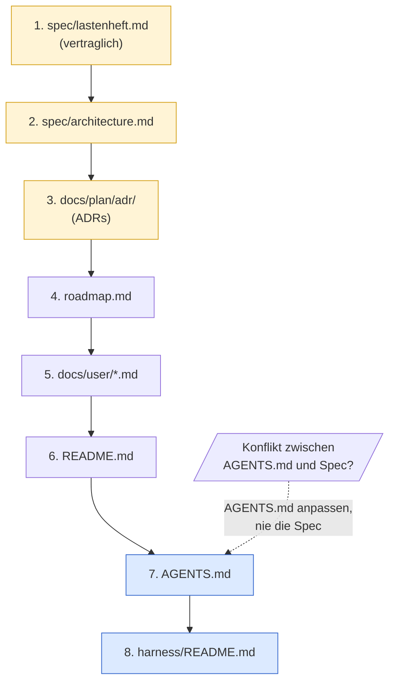

Gelb: kanonische Quellen — Spec, Architektur, ADRs. Blau: Harness-Index
und Agenten-Konventionen — sie *beschreiben* die kanonischen Quellen,
sie *ersetzen* sie nicht.

Regel: Widerspricht `AGENTS.md` oder `harness/README.md` einer kanonischen
Quelle, wird `AGENTS.md`/`harness/README.md` angepasst — nie die kanonische
Quelle. Der Harness folgt der Spec, nicht umgekehrt.

**Universal vs projektabhängig.** *Dass* eine Source Precedence existiert
und dass bei Konflikt die niedriger rangierte Quelle angepasst wird, ist
universal (Hard Rule). *Welche* Rangordnung konkret gilt, ist
projektspezifische Entscheidung — die obige Liste ist eine pragmatische
Default-Reihenfolge für ein typisches Referenz/Tooling-Repo, kein
Gesetz. Andere Repo-Klassen können abweichende Rangordnungen begründen:
ein Safety/Control-Repo kann Hardware-Specs vor Software-Specs ranken;
ein Policy/Compliance-Repo kann Regulatorik-Anforderungen vor das
Lastenheft ranken (weil "wir versprechen" durch "wir müssen" begrenzt
wird). Die konkret getroffene Rangwahl und ihre Begründung gehören in
den Adaptions-Block des repo-lokalen Konventionsdokuments (Default-Pfad
`harness/conventions.md`).

#### Spec-Stratifizierung

In reiferen Repos zerfällt `spec/` selbst in mehrere Tiefen mit eigener
Precedence:

| Datei | Charakter | Änderungs-Prozess |
|---|---|---|
| `spec/lastenheft.md` | **vertraglich abnahmebindend** (`LH-*` / `HSM-*`-IDs) | Change Request |
| `spec/spezifikation.md` | **technisch verbindlich, fortschreibbar** (Algorithmen, Defaults, Protokolle) | ADR-Schärfung erlaubt |
| `spec/architecture.md` | Diagramme, Komponentensicht, **keine eigenen Anforderungen** | Diagramm-Update |

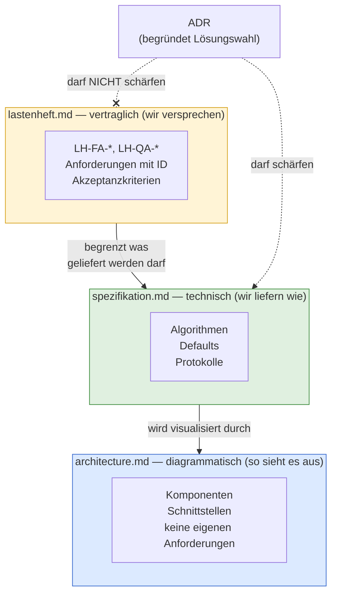

Drei Schichten, drei Änderungs-Prozesse. Die kritische Hard Rule
(Beispiel `c-hsm-doc`, siehe [`fallstudien.md`](grundlagen/fallstudien.md)):
**ADRs DÜRFEN die Spezifikation schärfen, DÜRFEN NICHT das Lastenheft
schärfen.** Diese eine Regel kapselt die gesamte Trennung von
"wir liefern" und "wir versprechen".

#### ID-Schema als Klammer

Ein konsistentes Präfix (`LH-*`, `HSM-*`, `GG-*`) verbindet:

* Anforderung in `spec/lastenheft.md`
* Make-Target-Kommentar (`coverage-gate: ## LH-FA-BUILD-008`)
* ADR-Body (`Bezug: HSM-LESE-004`)
* Commit-Message
* PR-Beschreibung

Damit wird der Traceability-Constraint maschinell prüfbar.

#### Referenz-Richtung (SDP): wer darf wen referenzieren

Das ID-Schema *verbindet* Artefakte — aber nicht jede Verbindung ist
erlaubt. Welche Referenz *normativ* wirken darf, regelt eine einzige
Asymmetrie, das **Stable Dependencies Principle**: Abhängigkeiten zeigen
zum Stabileren. Die [§Spec-Stratifizierung](#spec-stratifizierung) oben
ist der Spezialfall *innerhalb* von `spec/` ("ADR darf Spezifikation
schärfen, nie das Lastenheft"); die folgende Matrix dehnt dieselbe Logik
auf die ganze Artefakt-Kette aus.

**Stabilitäts-Rang** (stabil → volatil): **Vertrag › ADR › Slice** — die
Hauptmatrix zeigt die Primär-Typen; zwischen Vertrag und ADR liegen die
weiteren Spec-Straten **Technik › Sicht** (`spezifikation.md`,
`architecture.md`), entfaltet in [§Spec-Straten](#spec-straten-mehr-als-ein-spec-dokument).
`lastenheft.md` instanziiert das Vertrags-Stratum. Carveout liegt auf
Slice-Ebene, Roadmap/Welle außerhalb. Wir kollabieren
Martins kontinuierliche Instabilitäts-Metrik (`I = Ce/(Ca+Ce)`) bewusst
auf einen **Typ-Rang** — die Artefakt-Taxonomie ist endlich und benannt,
damit wird die Regel lehr- und prüfbar.

> **Die Matrix-Zeilen sind Stratum-*Klassen*, nicht Dateinamen.** Die Zeile
> „Lastenheft" steht für das **Vertrags-Stratum** (die Decke); ein Projekt
> kann mehrere Vertrags-, Technik- und Sicht-Dokumente haben. Wie ein neues
> Spec-Dokument einem Stratum zugeordnet wird — und warum die Decke nicht
> fix `lastenheft.md` ist — regelt [§Spec-Straten](#spec-straten-mehr-als-ein-spec-dokument)
> unten.

| Dokument ↓ referenziert → | Lastenheft | ADR | Slice | Carveout | Roadmap/Welle |
|---|---|---|---|---|---|
| **Lastenheft** | Normativ: nur intra-`LH-*` | ❌ | ❌ | ❌ | ❌ |
| **ADR** | Normativ: `LH-*`-Grundlage | Normativ/Lineage: aktive ADRs als Grundlage; superseded nur ADR-interne Historie | Kontext: Status-Provenance, Verifikations-Zeiger — *keine* Entscheidungsgrundlage | ❌ | ❌ |
| **Slice** | Normativ: `LH-*`-Scope | Normativ: nur aktive ADRs | Kontext: triggered-by, blocked-by, follow-up-of | Kontext: eigener/offener Carveout, Debt-/Closure-Rückverweis | Kontext: Einordnung in Welle/Roadmap |
| **Carveout** | Normativ: betroffene `LH-*` | Normativ: betroffene aktive ADRs | Kontext/Traceability: owner/verursachender/schließender Slice | Kontext: ersetzt/zusammengeführt/abhängig | Kontext: Welle/Planungseinordnung |
| **Roadmap/Welle** | Kontext: Zielbild/Scope | Kontext: Architekturhintergrund | Kontext: Orchestrierung/Sequenz | Kontext: Risiko-/Debt-Übersicht | Kontext: Hierarchie/Sequenz |

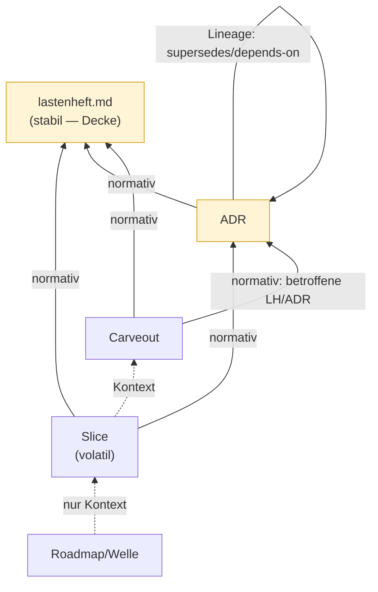

Solide Kanten = normativ (immer aufwärts + die eine ADR-interne Lineage-
Schleife). Gestrichelt = Kontext. **Die normativen Kanten bilden einen
strikt aufwärts gerichteten azyklischen Graphen (DAG) plus genau eine
Selbstkante** — kein Baum, denn Slice, Carveout und ADR haben je *zwei*
normative Eltern (Slice/Carveout → ADR *und* `LH-*`; ADR → `LH-*` *und*
Spec-§). Das ist die ganze Theorie in einem Bild.

**Tragende Regeln:**

1. **Normativ nur volatil → stabil.** Alles Richtung Slice oder zwischen
   Slices ist Planungskontext, keine Spezifikation.
2. **Autorität schlägt Stabilität.** Eine superseded ADR ist historisch
   stabil, aber nicht autoritativ — Slices referenzieren nur *aktive*
   ADRs. Die Supersedes-Kette bleibt ADR-intern.
3. **Carveout → Slice ist keine normative Abhängigkeit** — Schuld-,
   Ablauf- und Traceability-Buchführung (owner, Ursache, Closure). Die
   fachliche Begründung läuft nie über den Slice, sondern über `LH-*`
   oder aktive ADR.
4. **Roadmap/Welle steht außerhalb der normativen Klammer** — darf Slices
   orchestrieren und gruppieren, erzeugt aber keine Spezifikation.
5. **Provenance: Body vs. Changelog.** Ein Abwärts-Zeiger im
   *Anforderungs-/Entscheidungs-Text* ist verboten. Provenance in einer
   abgegrenzten *Versions-/Historie-Tabelle am Dokument-Rand* ist Kontext
   und für alle Artefakte erlaubt (die Slice-ID bleibt ein stabiler
   Token, auch nachdem die Datei nach `done/` wandert). Der Unterschied
   ist nicht der Stabilitätsrang, sondern *ob die Referenz Teil der
   Spezifikations-Logik ist*.

**ADR-Lineage vs. Carveout-Lineage — gleiche Form, andere Normativität.**
Die Diagonalzellen ADR→ADR und Carveout→Carveout sehen identisch aus
(supersede / depends-on / merged), tragen aber entgegengesetzte Kraft:

| | Form | Normativ? | Warum |
|---|---|:---:|---|
| ADR→ADR | Supersedes, Depends-on | **ja** (Lineage) | ADRs sind *Entscheidungen* → tragen Autorität |
| Carveout→Carveout | ersetzt, zusammengeführt | **nein** (Kontext) | Carveouts sind *Schuld* → tragen nur Buchführung |

Die Matrix entscheidet damit nicht über *Linktypen*, sondern über
*Artefaktnatur* — derselbe Pfeil bedeutet je nach Quell-Artefakt etwas
anderes.

**Prüfung — zwei Ebenen.** Die Referenz-Regeln zerfallen in *mechanisch
entscheidbare* und *semantische* Kanten; ein einzelner grep deckt nur die
erste Hälfte ab.

*Maschineller Gate (`check-references`, fail-closed in `make verify`)* —
eine *computational feedforward*-Kontrolle wie der
[Traceability-Constraint](#traceability-constraint):

- ein Spec-Stratum (`lastenheft.md`, `spezifikation.md`, `architecture.md`) enthält `ADR-` oder `slice-` *außerhalb* der Historie-/Versions-Tabelle → fail
- Slice referenziert eine ADR mit `Status: Superseded` → fail

Damit Regel 5 mechanisch greift, lebt Provenance nur unterhalb einer
designierten Überschrift (z. B. `## Geschichte` oder die Versions-Tabelle),
die der Check von der Prüfung ausnimmt.

*Aufwärts-Kanten als klickbare Links — und ihre Reifestufe.* Die erlaubten
Aufwärts-Referenzen — die ADR-Felder `**Bezug:**` und `**Schärft:**`
([§Spec-Straten](#spec-straten-mehr-als-ein-spec-dokument)) — werden als
**Markdown-Link** geschrieben, nicht als nackte ID, so kommt der Leser
direkt zur Quelle. Der
`check-references`-Gate hier prüft aber nur die *Token-Richtung* (kein
`ADR-`/`slice-` abwärts im Spec-Körper), **nicht** die Link-/Anker-Auflösung:
Wird eine Ziel-Überschrift umbenannt, rottet der Aufwärts-Link *still* — die
gleiche Rot-Klasse, die wir abwärts verboten haben, nur unbewacht. Die
mechanisch erzwungene Reifestufe löst Links auf, prüft Anker-Existenz und
erzwingt die volle Matrix am Zielknoten; Referenz-Implementierung ist
`tools/check_refs.py` aus dem u-boot-Harness (gleiche Build-Familie). <!-- d-check:ignore (Datei liegt im u-boot-Repo) --> Das Lab
bleibt bewusst bei der grep-Variante, um die mechanische Hälfte minimal und
lesbar zu halten.

*Agentischer Review-Sensor (nicht grep-bar).* Ob eine ADR→Slice-Referenz
ein erlaubter *Verifikations-Zeiger/Provenance* oder eine verbotene
*Entscheidungsgrundlage* ist, ist eine semantische Unterscheidung — sie
gehört zum Reviewer-Agenten, nicht zum Linter. Ein grep, der jedes
`slice-NNN` im ADR-Body fängt, würde legitime Verifikations-Zeiger (etwa
„`make test-determinism` (slice-009) verifiziert auch LH-FA-IDX-003")
falsch-positiv flaggen. Faustregel für den Reviewer: *referenziert die
ADR den Slice, um eine Entscheidung zu **begründen** (verboten) oder um
zu zeigen, wo sie **verifiziert/entstanden** ist (erlaubt)?*

Bereits `Accepted`-ADRs sind immutable: vor Einführung dieser Konvention
entstandene Grenzfälle werden **grandfathered**, nicht durch eine
superseding ADR nachgezogen. Der Gate prüft nur ab Einführung neu.

##### Spec-Straten: mehr als ein Spec-Dokument

Reale Projekte haben mehr als drei Spec-Dateien — `api-spec.md`,
`data-model.md`, `sla.md`, `compliance.md`. Die Matrix operiert deshalb
auf **Stratum-Klassen** (Rolle), nicht auf Dateinamen. Jedes Spec-Dokument
fällt über zwei Achsen — *normativer Gehalt* und *Änderungs-Prozess* — in
genau ein Stratum:

| Stratum | Normativer Gehalt | Änderungs-Prozess | Lab | typisch auch |
|---|---|---|---|---|
| **Vertrag** (Decke) | eigene Anforderungen, abnahmebindend | Change Request | `lastenheft.md` | `compliance.md`, `sla.md` |
| **Technik** | eigene technische Festlegungen | fortschreibbar, ADR-Schärfung erlaubt | `spezifikation.md` | `api-spec.md`, `data-model.md` |
| **Sicht** | *keine* eigenen Anforderungen, derivativ | Diagramm-/View-Update | `architecture.md` | `deployment.md`, Sequenz-Views |

**Nur Vertrag und Sicht sind obligatorisch; das Technik-Stratum ist
optional.** Repos, die ihre technischen Festlegungen direkt in Vertrag
oder Sicht falten, enforcen real nur zwei Klassen — das u-boot-Harness
etwa klassifiziert ausschließlich `contract_spec` (`lastenheft.md`) und
`view_spec` (`architecture.md`), ohne separates Technik-Stratum. Die Rang-
*Ordnung* bleibt dieselbe; ein nicht vorhandenes Stratum fällt einfach aus
der Kette.

Generalisierter Rang: **Vertrag › Technik › Sicht › ADR › Slice** —
deckungsgleich mit „Lastenheft sticht Spezifikation sticht Architektur"
([§Spec-Stratifizierung](#spec-stratifizierung), [§Source Precedence](#source-precedence))
und der [Konzeptkarten-Artefaktkette](grundlagen/konzeptkarte.md#artefaktkette). (Die
drei Ordnungen — Herleitung, Konflikt-Autorität, Referenz-Stabilität —
fallen für diese Kette *zusammen*; sie divergieren nur an der
superseded-ADR-Grenze, Regel 2.)

Die ADR ist die *Begründungs*-Schicht **unter** den Spec-Straten — und
**ihre Kanten zeigen aufwärts**:

- **ADR → `LH-*`**: die ADR referenziert die Anforderung, die sie begründet
  (wie in der Hauptmatrix).
- **ADR → Spec-§**: die ADR *deklariert, was sie schärft* (Acceptance-
  Trigger, [§Vier Trigger-Klassen](#vier-trigger-klassen)). **Hier wohnt
  die Änderungskopplung**: wer die ADR ändert, liest aus ihr selbst, welche
  Spec-Stellen nachzuziehen sind.

Die Gegenrichtung **Spec → ADR existiert im bindenden Text nicht** — und
auch nicht als geduldete Quellen-Spalte: der Wert steht für sich, das Warum
findet man über die *aufwärts* zeigende ADR. Die einzige tolerierte
Provenance ist die Historie-/Changelog-Tabelle am Dokument-Rand (Regel 5),
sonst nichts — ein Abwärts-Zeiger im Spec-Körper rottet, sobald ADRs
superseded werden, und die Discovery läuft ohnehin von der ADR-Seite. Damit
zeigt **jede** Kante strikt aufwärts; null Abwärts-Kanten im bindenden Text,
Provenance nur unter `## Historie`. Der `check-references`-Gate setzt diese
Decken-Regel über *alle* Spec-Straten durch, nicht nur über das Lastenheft.
**Innerhalb** eines Stratums sind Dokumente *Peers*: Intra-Referenzen
erlaubt (wie intra-`LH-*`), keine normative Querabhängigkeit, die Zyklen
baut.

Reference-Regeln je Stratum — verfeinert die „Lastenheft"-Zeile der
Hauptmatrix in drei Zeilen:

| Doc ↓ ref → | Vertrag | Technik | Sicht | ADR |
|---|---|---|---|---|
| **Vertrag** | intra (Peers) | ❌ | ❌ | ❌ ¹ |
| **Technik** | Normativ: präzisiert Vertrag, Vertrag gewinnt | intra (Peers) | ❌ | ❌ ¹ |
| **Sicht** | Normativ: Use-Case ↔ Vertrags-ID | Normativ: visualisiert | intra (Peers) | ❌ ¹ |

¹ Spec → ADR existiert im bindenden Text nicht — auch nicht als Quellen-
Spalte. Die aufwärts zeigende ADR trägt alles (ADR → `LH-*` bzw. ADR →
Spec-§, *siehe oben*); das Lastenheft wird dabei *nie* geschärft. Provenance
lebt allein in der Historie-Tabelle (Regel 5); `check-references` erzwingt
das über alle Straten.

Die Spalten **Slice/Carveout/Roadmap** sind für *alle* Spec-Straten ❌ —
das Spec-Layer referenziert nie abwärts (wie die „Lastenheft"-Zeile der
Hauptmatrix); darum hier weggelassen.

**Platzierung wird deklariert, nicht geraten** — über zwei bestehende
Mechanismen:

1. **ID-Präfix kodiert das Stratum.** Die Matrix operiert auf Präfixen:
   `LH-*` → Vertrag, `SPEC-*` → Technik, `ARC-*` → Sicht (Bootstrap-Beleg
   in `modul-02`). Eine Sicht-Datei trägt sehr wohl `ARC-*`-*Struktur*-IDs
   (Komponenten, Schnittstellen), nur keine eigenen *Anforderungs*-IDs —
   das macht sie derivativ. Siehe [§ID-Schema](#id-schema-als-klammer).
2. **Deklaration in `harness/conventions.md`** (Adaptions-Block, wie die
   Zusatzklassen für Sensors-Bindung). Ein Spec-Dokument ohne deklariertes
   Stratum ist eine *stille Setzung* — dieselbe Harness-Lüge-Klasse wie ein
   undeklariertes Gate — und **nicht normativ zitierbar**, bis es deklariert
   ist (analog Phase 4 „freigegeben für Verweise von außen").

**Die Decke ist nicht fix.** Ein Policy/Compliance-Repo rankt Regulatorik
*über* das Lastenheft („wir müssen" begrenzt „wir versprechen", siehe
[§Source Precedence](#source-precedence)). Die Stratum-*Klassen* sind
universal; die konkrete Rangwahl innerhalb des Vertrags-Stratums ist
projektspezifisch und gehört in `harness/conventions.md`.

### harness/README.md als Einstiegspunkt

Pro Repo bündelt eine einzige Datei alles, was ein Agent oder ein neuer
Mensch zuerst lesen muss. Pflichtgliederung:

```
# Harness

## Purpose                  # ein Absatz, was diese Datei ist (und was nicht)
## Source precedence        # die obige Tabelle, repo-spezifisch
## Guides                   # Tabelle der Feedforward-Quellen
## Sensors                  # Tabelle der Feedback-Gates (nur real existierende!)
## Traceability rules       # Welche IDs müssen in Commits/PRs auftauchen?
## Safety and scope boundaries  # repo-spezifische Hard Rules
## Minimal agent workflow   # der 8-Schritt-Pfad (siehe Modul 9)
```

Wichtig: Die Sensors-Tabelle darf keine Befehle behaupten, die es im Repo
nicht gibt. Halluzinierte Gates sind die häufigste Form von Harness-Lüge.

Die Sensors-Tabelle trägt **keinen Lauf-Status** ("grün"/"rot"):
Lauf-Wahrheit pro Commit lebt in CI (Badges/Dashboard), also in höher
rangierten Quellen, nicht in `harness/README.md` (Rang 9). Strukturell
rote Gates werden als Carveout in `docs/plan/carveouts/` dokumentiert
(Modul 7); die Bindung-Spalte der Tabelle (`Target | Vertrag | Bindung`)
verweist auf die `CO-<NNN>`-ID, die Begründung lebt im Carveout, nicht
hier. Damit ist "rot dokumentieren, nicht verstecken" ortsdiszipliniert:
es geschieht im Carveout-Index, nicht in einer Status-Spalte, die sich
selbst grünfärben kann.

Die Bindung-Spalte trägt vier **kanonische Klassen**:

- **ADR-Bindung** (`ADR-<NNN>`) — Gate setzt eine Architektur-Entscheidung
  durch.
- **Carveout-Bindung** (`CO-<NNN>`) — Gate bewusst geschwächt, mit
  Auflösungs-Trigger und Folge-Slice (Modul 7).
- **Kalibrierungs-Bindung** (`Schwelle X %, M<n> → Y %`) — bewegliche
  Eichung mit Meilenstein-Schaltplan.
- **Reproduzierbarkeits-Bindung** (Image-Hash, Toolchain-Pin) — Gate
  hängt an bit-identischem Artefakt (Modul 14).

Repos können **weitere Klassen** einführen — etwa Anforderungs-Bindung
(`LH-…`), Compliance-Bindung (Regulatorik-Artikel) oder
Modell-Version-Bindung (für KI-Evals). Diese werden im **repo-lokalen
Konventionsdokument** deklariert (Default-Pfad `harness/conventions.md`,
Form projektabhängig), damit ein Reviewer sie als legitim erkennt und
nicht als Tippfehler abtut. Eine Bindung ohne Deklaration ist eine
stille Setzung — und damit eine Harness-Lüge in derselben Klasse wie
ein halluziniertes Gate.

### harness/conventions.md als Konventionsspeicher

`harness/conventions.md` trägt die **repo-lokalen Strukturregeln** und
Adaptionen ggü. der adoptierten Baseline (Kurs, interner Standard,
Industrie-Norm). Sie ist **Pflicht** (Existenz), ihre Form (Einzeldatei
vs. Verzeichnis, ADR-artig vs. Prosa) ist **Wahl** — projektabhängig
nach Projektgröße, Adaptions-Frequenz, Audit-Tiefe.

Pflichtgliederung (Default-Form als Einzeldatei):

| Abschnitt | Inhalt |
|---|---|
| Purpose | was die Datei trägt, was nicht |
| Baseline | welche Konvention adoptiert, mit Stand/Version |
| Adoptierte Konventions-Quellen | Pointer extern (Kurs/Standard) und in-Repo (Templates) |
| Adaptions-Block | ADR-artige Liste der Abweichungen ggü. Baseline (`MR-<NNN>` mit Datum, Geltungsbereich, Begründung, Auflösungs-Trigger oder "permanent") |
| Zusatzklassen-Deklaration für Sensors-Bindung | repo-spezifische Bindung-Klassen jenseits der vier kanonischen (`LH-…`, Compliance, Modell-Version) |
| Modus-Deklaration pro Sub-Area | Greenfield · Brownfield (mit Konvergenz-Auftrag) · Hybrid |
| Glossar (optional) | repo-spezifische Begriffe, die nicht im Kurs-Glossar stehen |

Wichtig: `harness/conventions.md` dupliziert keinen Baseline-Text — sie
verweist und ergänzt. Eine Kopie ginge gegen die Baseline in Drift,
sobald letztere sich weiterentwickelt. Zwei Quellen derselben
Konvention sind dasselbe Drift-Risiko, das die Source-Precedence-Regel
für Spec/ADR adressiert — hier in der Form-Ebene.

Vorlage:
[`/lab/templates/harness/conventions.template.md`](../../lab/templates/harness/conventions.template.md).
Worked Example:
[`/lab/example/harness/conventions.md`](../../lab/example/harness/conventions.md).

### Harness-Bootstrap

*Harness-Bootstrap* bezeichnet den **Einstiegsprozess** in den
Harness-Lebenszyklus eines Repos — der Weg von "leeres Repo" oder
"Repo ohne Harness" bis zur Stelle, an der inhaltliche Arbeit (Slices,
Code) auf einem etablierten Harness aufsetzt. Es ist eine *Trajektorie
durch Dokument-Zustände*, kein *Ereignis*. Konkreter Walkthrough mit
Schritten in [Modul 1](01-spec-und-architektur/modul-01-entwicklungszyklus.md#worked-example-einen-source-precedence-block-aus-einem-konfliktbehafteten-repo-destillieren).

> **Begriffsklärung:** "Harness-Bootstrap" meint hier den
> Einstiegsprozess in den Harness. Nicht zu verwechseln mit
> *Bootstrap-aware Gate* ([Modul 13](04-qualitaet/modul-13-quality-gates.md)) — das ist ein
> einzelnes Gate mit Reifestufe und Hochschalt-Trigger (Coverage 0 →
> 70 %). Beide Begriffe teilen das Wort, sind strukturell verschieden:
> *Harness-Bootstrap* betrifft den **Repo-Lebenszyklus**,
> *Bootstrap-aware Gate* die **Reifestufe eines Sensors**.

#### Was ist eine Sub-Area?

Eine *Sub-Area* ist eine **Doku-/Code-Sektion, die als Träger einer
Modus-Entscheidung dient** — mit eigener Konventions-Härte (eigene
`MR-NNN` möglich), eigener Inventur-Linie und eigener Pfad-/Datei-Familie
im Repo. Sie ist nicht das Repo (zu grob) und nicht der Slice (ein Slice
*berührt* Sub-Areas, *trägt* aber keinen Modus).

*Modul, Verzeichnis, Komponente* (siehe §Modus pro Sub-Area unten) sind
die **typischen Träger** — sie nennen, *welche Strukturen* eine Sub-Area
sein können. Ob eine konkrete Struktur als Sub-Area **qualifiziert**,
entscheiden drei Inklusions-Achsen (bottom-up):

| Achse | Test | erfüllt, wenn … |
|---|---|---|
| **1 — Konventions-Härte** | Ist eine eigene `MR-NNN`-Adaption plausibel formulierbar? | … die Sektion eine eigene Strukturregel tragen *könnte* (nicht: schon trägt). |
| **2 — Inventur-Linie** | Ist eine eigene Diskrepanz-Bericht-Zeile sinnvoll? | … Code-Bestand und Doku-Aussage dieser Sektion als Paar abgleichbar sind, ohne dass eine Nachbar-Sub-Area mitgezogen werden muss. |
| **3 — Struktureller Cluster** | Gibt es eine eigene Pfad-/Datei-Familie? | … ein eigenes Verzeichnis, Dateimuster oder Konventions-Präfix die Sektion trägt. |

**Schwelle: mindestens zwei der drei Achsen.** Eine Achse allein ist zu
schwach — der typische Fall ist *Struktur ohne Substanz*: ein Verzeichnis
existiert (Achse 3), hat aber keine eigene Konvention (Achse 1) und keine
eigenständig abgleichbare Inventur-Linie (Achse 2). Das ist noch keine
Sub-Area, sondern eine **Sub-Area-Aspirantin** — in winzigen Repos
normal, mit wachsender Struktur wird daraus eine Sub-Area.

**Positiv-Beispiele:**

- *Audit-Logging* — eigene MR-Adaption denkbar (Format-Standard für
  Log-Einträge, Achse 1), eigene Inventur-Linie (entstehen alle
  Audit-Events wie spezifiziert?, Achse 2), eigener `services/audit/`-
  Pfad-Cluster (Achse 3). Alle drei → klar Sub-Area.
- *Test-Infrastruktur* — eigenes Pfadnaming-Schema (Achse 3) und eine
  eigene Inventur-Linie (Tests ohne `LH-*`-ID als Diskrepanz, Achse 2).
  Zwei von drei → Sub-Area.

**Negativ-Beispiele:**

- *"Backend"* ist zu grob — verletzt Achse 1 (keine *einzelne*
  `MR-NNN`-Adaption denkbar; API-Pattern, Persistence-Layout und
  Hintergrund-Jobs bräuchten je eigene) und Achse 3 (mehrere
  Pfad-Familien). *"Backend"* bündelt typischerweise *drei* Sub-Areas.
- *"Frontend"* — analog: eigene Konventionen pro Schicht (Komponenten,
  State, Styling), keine gemeinsame Inventur-Linie. Auch hier:
  ausdifferenzieren, nicht als *eine* Sub-Area führen.

> **Abgrenzung zu den vier Modus-Pflichtkriterien.** Die drei Achsen
> hier beantworten *ob eine Struktur eine Sub-Area ist* (Granularitäts-
> Gate). Sie sind **nicht** zu verwechseln mit den vier Pflichtkriterien,
> mit denen [Modul 5](02-planung/modul-05-planning-harness.md#worked-mini-example-bootstrap-modus-pro-sub-area-für-einen-slice-begründen)
> begründet, *welcher Modus* (GF/BF/Hybrid) für eine bereits erkannte
> Sub-Area gilt (Konventionen-Dichte · Phase-Reife · Evidenz-/Diskrepanz-
> Risiko · Reconciliation-Aufwand). Erst Inklusion (hier), dann
> Modus-Wahl (Modul 5).

**Aggregation — die Kehrseite der Inklusion.** Wie die Schwelle ein
*Zuviel an Struktur* abweist (die Aspirantin oben), weist dieselbe Logik
rückwärts gelesen ein *Zuwenig an Trennung* ab: Zwei Sub-Areas, die
**permanent dieselben Trigger** erzeugen *und* **dieselbe Modus-Aussage**
tragen, sind in Wahrheit *eine* — sie getrennt zu führen erzeugt zwei
Inventur-Linien ohne eigene Diskrepanz (Anti-Refactoring). Die
Diagnose-Frage ist die Achsen-Frage rückwärts: *„Feuern die beiden je
**unabhängig** — eigener Trigger, eigene `MR-NNN`?"* Über mehrere Wellen
nein → zusammenführen; sobald eine Hälfte eine eigene Adaption oder
Inventur-Linie bekommt (Achse 1/2 divergiert) → trennen. Aggregation ist
damit keine Einmal-Entscheidung, sondern eine wiederkehrende
Wartungs-Praxis. Faustregel: *was nie getrennt feuert, ist
eine Sub-Area; eine Sub-Area, deren Hälften auseinanderdriften, sind
zwei.* Beispiel aus dem Lab: die sechs Sprach-Skelette (`go/`, `python/`,
…) werden *nicht* als sechs `Implementierung`-Sub-Areas geführt, sondern
als *eine* — sie teilen Spec und Modus (alle GF) und tragen nie eine
*unabhängige* Modus- oder Trigger-Entscheidung; die per-Sprache-Stilunterschiede
(`gofmt` vs. `black`) sind Sub-Sub-Area-Nuancen, keine eigenen
Inventur-Linien. Split-Trigger: kippte ein Skelett nach BF (etwa ein
Alt-Port mit Bestandscode), bekäme es eine eigene Modus-Aussage — und
*dann* wäre es eine eigene Sub-Area. Die Gegenrichtung zeigt
`harness/conventions.md`: `Test-Infrastruktur`, `Verifikation` und
`Replay-/Eval-Infrastruktur` sehen ähnlich aus („Korrektheits-Sensoren"),
sind aber *drei* Sub-Areas, weil Achse 1 divergiert — sie zu mergen wäre
der „zu grob"-Fehler.

#### Modus pro Sub-Area: Greenfield vs Brownfield

Pro Sub-Area eines Repos (Modul, Verzeichnis, Komponente) wird ein
**Modus** deklariert (im Adaptions-Block von
`harness/conventions.md`). Die Modus-Wahl bestimmt die
*Trigger-Richtung* — wer wem folgt:

| Modus | Trigger-Richtung | Bild im Kopf |
|---|---|---|
| **Greenfield** (GF) | Doc → Code | Spec führt, Code folgt. "Wir versprechen X, dann liefern wir X." Steady-State. |
| **Brownfield** (BF) | Code → Doc | Code existiert, Doku folgt. Inventur des Bestands. **Übergangs-Modus mit Konvergenz-Auftrag** zu GF. |
| **Hybrid** | gemischt pro Sub-Sub-Area | Realistisch: alte Komponenten BF, neue GF. |

**Konvergenz-Auftrag.** BF ist *keine Daueroption*. Jede BF-Sub-Area
trägt eine **Graduation-Bedingung** (im Adaptions-Block dokumentiert):
*was muss erfüllt sein, damit die Sub-Area in GF-Modus wechselt?*
Typisch: alle entdeckten Diskrepanzen aufgelöst (als Carveouts oder
Reconciliation-Slices); Spec/ADR/Sensors decken Code-Stand ab;
ID-Schema retrofitted. Eine BF-Sub-Area ohne Graduation-Plan ist eine
*permanente Ausnahme als temporär getarnt* — analog zur
Carveout-Disziplin in [Modul 7](02-planung/modul-07-carveouts.md).

Permanente BF-Erklärung (für Code, der absehbar entfernt wird —
Legacy, Drittsystem-Adapter) ist möglich, mit Begründung und
Folge-Slice.

#### Sektionsweise Reife: Phasen pro Dokument

Ein Harness-Dokument ist während Bootstrap nicht "entweder leer oder
fertig". Sektionen reifen mit unterschiedlichem Tempo durch fünf
Phasen:

| Phase | Beschreibung |
|---|---|
| 0 — leer | Datei existiert nicht |
| 1 — Skelett | Template kopiert, Pflichtgliederung mit Platzhaltern |
| 2 — Outline | Top-Level ausformuliert, Details `<…>` |
| 3 — partiell | einige Sektionen voll, andere noch `<…>` |
| 4 — kohärent | alle Sektionen gefüllt, intern konsistent — *freigegeben* für Verweise von außen |
| 5 — stabil | Änderungen nur über Change-Process |

*Sektionen* eines Dokuments können in unterschiedlichen Phasen sein.
Beispiel: §Source precedence von `harness/README.md` kann durch
Template-Adoption früh auf Phase 2 sein, während §Sensors auf Phase 1
verharrt, bis das Makefile existiert. **Sektionsweise Reife ist Regel,
nicht Ausnahme** — Schreibreife wird sektionsweise beurteilt, nicht
dateiweise.

#### Vier Trigger-Klassen

Während Bootstrap (und auch danach im Steering-Loop) lösen Änderungen
in einem Dokument *Folgeaktionen* in anderen aus. Vier Klassen:

| Klasse | Wirkung | Beispiel |
|---|---|---|
| **Sync-Trigger** | Pointer in einem Dokument muss in einem anderen ergänzt werden | Neuer Eintrag in `conventions.md` → Pointer in `harness/README.md` |
| **Promotion-Trigger** | Eintrag wandert aus "Nicht behauptet"-Block in Haupt-Tabelle | Make-Target real im Makefile entstanden → Sensor-Zeile gepromoted |
| **Cross-Reference-Trigger** | Verlinkung zwischen Dokumenten, normativ **nur volatil→stabil** ([§Referenz-Richtung](#referenz-richtung-sdp-wer-darf-wen-referenzieren)) | Neue ADR *deklariert aufwärts, was sie schärft* (ADR → Spec-§) und referenziert die Anforderung; der Acceptance-Trigger zieht die Spec nach. Ein Spec→ADR-Rückzeiger im bindenden Text existiert nicht (auch nicht als Quellen-Spalte) — Provenance nur in der Historie-Tabelle (Regel 5); `check-references` erzwingt das über alle Straten |
| **Acceptance-Trigger** | Phase-Übergang via Sign-off (z. B. ADR Proposed → Accepted) | ADR-Review-Runde abgeschlossen → bindend |

Trigger werden zwischen Bootstrap-Schritten ausgewertet — sie sind die
"Inbox" der nicht-Vorderscene-Arbeit. Eine zwischen Schritten
übersehene Trigger-Pflicht ist ein häufiges Drift-Symptom.

#### Harness-Bootstrap-Ende vs Workflow-Beginn

Harness-Bootstrap ist *abgeschlossen*, wenn der Repo bereit ist für
inhaltliche Slices. In **Greenfield**: erster ADR akzeptiert,
Roadmap-Outline mit Welle-Sequenz, Sensors-Roster als "Nicht
behauptet"-Block. In **Brownfield**: Reconciliation-Backlog steht,
Konvergenzpfad zu GF ist sichtbar (mit ersten Reconciliation-Slices in
`open/`). Ab dann übernimmt der **Workflow** (Slice-Lebenszyklus,
Modul 5–9). Bootstrap und Workflow sind getrennte Lebenszyklen — kein
Übergang ohne Sichtbarkeit.

#### Verbindung zum Steering-Loop

Harness-Bootstrap ist im Grunde der **Steering-Loop ([Modul 11](04-qualitaet/modul-11-verification.md)),
einmal in Folge angewendet, bis Graduation erreicht ist**. Das
Werkzeug ist identisch (Beobachtung → Guide/Sensor); was sich
unterscheidet, ist die Anwendungsphase: Bootstrap = initial bis
Steady-State; Steering-Loop = laufend im Steady-State. Wer den
Steering-Loop versteht, versteht Bootstrap — und umgekehrt.

#### Querverweise

- **[Modul 2 — Harness-Bootstrap](01-spec-und-architektur/modul-02-harness-bootstrap.md)**: ausgearbeiteter Lehrtext mit GF/BF-Walkthroughs, Trigger-Klassen-Inline-Ankern und Phasen-Karten-Übung — Vollform des Bootstrap-Konzepts.
- **Modul 1 §Schritt 0** ([§Source precedence](01-spec-und-architektur/modul-01-entwicklungszyklus.md#worked-example-einen-source-precedence-block-aus-einem-konfliktbehafteten-repo-destillieren)): kompakter Vorgriff auf das Modus-Konzept als Eingang in den Lebenszyklus (Baseline und Modus festlegen plus den sechs Folge-Schritten); Vollform in Modul 2.
- **[`fallstudien.md` §Beobachtung aus dem Ist-Zustand](grundlagen/fallstudien.md#beobachtung-aus-dem-ist-zustand)**: die vier Beispiel-Repos in GF-/BF-Modus klassifiziert.
- **§harness/conventions.md als Konventionsspeicher** (oben): Adaptions-Block trägt Modus-Deklaration pro Sub-Area; Graduation-Bedingung wird dort dokumentiert.

### Traceability-Constraint

Keine relevante Änderung ohne Bezug zu mindestens einem der folgenden Punkte:

* Requirement-ID
* Architektur-ID oder Architekturprinzip
* ADR-ID
* Test, Gate oder Demo-Artefakt
* Dokumentations-Update, falls ein öffentlicher Vertrag betroffen ist

Das ist eine *computational feedforward*-Kontrolle (siehe
[`klassifikation.md`](#klassifikation-und-steering-loop)): ein Commit-Hook prüft, dass
die Nachricht mindestens eine ID enthält. Billig, deterministisch, und
sie zwingt den Implementation-Agent in die Source-Precedence-Kette zurück.

## Klassifikation und Steering Loop
*Quelle: [grundlagen/klassifikation.md](grundlagen/klassifikation.md)*

Wir klassifizieren jede Kontrolle, die der Harness bereitstellt, entlang
mehrerer Achsen. Zwei Schulen prägen das Vokabular: **Böckeler/Thoughtworks**
liefert den konzeptuellen Rahmen, **Lopopolo/OpenAI** das empirische
Playbook (siehe [`fallstudien.md`](grundlagen/fallstudien.md) und
[`../abschluss/quellen.md`](abschluss/quellen.md)).

### Die 2×2-Matrix (Böckeler)

|  | **Feedforward** (Guide, präventiv) | **Feedback** (Sensor, detektiv) |
|---|---|---|
| **Computational** (deterministisch) | Typsignaturen, JSON-Schema, Tool-Allowlists, generierte Skeletons | Linter, Typecheck, ArchUnit, Coverage Gate, Schema-Validierung |
| **Inferential** (LLM-gestützt) | Spec, ADR, AGENTS.md, Skills, Beispiel-Korpora | Reviewer-Agent, Verifier-Agent, Validator-Agent, semantischer Diff |

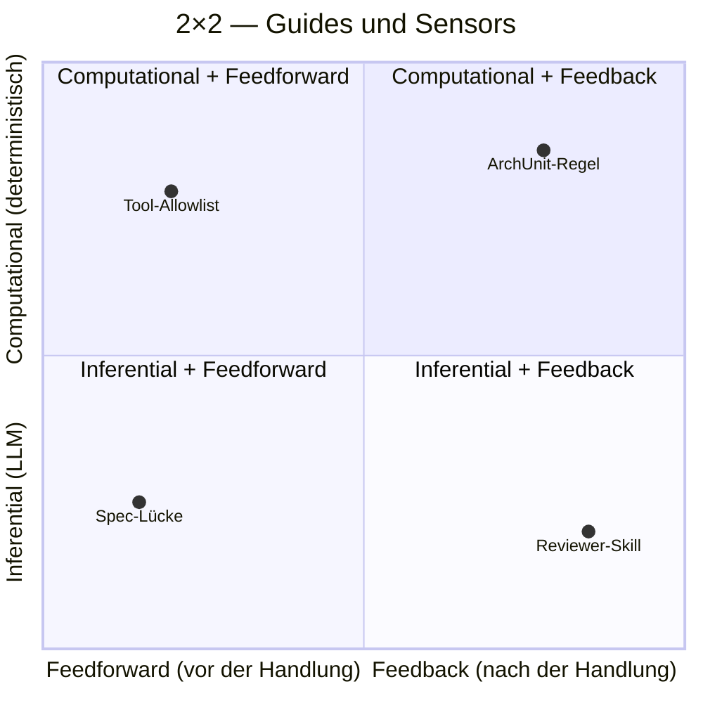

Die Punkte zeigen, wo typische Maßnahmen liegen. Faustregel: **so weit
links und oben wie möglich** — präventive, deterministische Kontrollen
sind die billigsten. Punkte rechts unten (Reviewer-Skill) sind teuer und
sollten erst greifen, was die linken Quadranten nicht abdecken können.

#### Lesart

* *Computational + Feedforward*: macht falsche Aktionen **technisch unmöglich**. Billigste Kontrolle.
* *Computational + Feedback*: erkennt falsche Aktionen **schnell und deterministisch**. Das sind die Gates aus [Modul 13](04-qualitaet/modul-13-quality-gates.md).
* *Inferential + Feedforward*: gibt dem Agenten Kontext, **bevor** er handelt. Das sind Spec, ADR, Carveouts — die Hebel aus [Modul 3](01-spec-und-architektur/modul-03-lastenheft.md), [Modul 4](01-spec-und-architektur/modul-04-architektur-adrs.md), [Modul 7](02-planung/modul-07-carveouts.md).
* *Inferential + Feedback*: prüft semantisch nach. Das sind Review, Verifikation, Validation — die Hebel aus [Modul 10](04-qualitaet/modul-10-review-harness.md), [Modul 11](04-qualitaet/modul-11-verification.md), [Modul 8](03-agenten/modul-08-agentenrollen.md).

Die Faustregel: **so weit links und oben wie möglich**. Eine Regel, die
der Typchecker erzwingt, braucht keinen Reviewer-Agent. Ein ADR, das den
Agenten gar nicht erst in die falsche Richtung schickt, spart das
nachgelagerte Review.

### Sprach-übergreifende Konkretion

Die 2×2-Matrix ist sprach-neutral; die Sensoren in jedem Quadranten
sind es nicht. Das Begleit-Lab wird das für sechs Sprachen
(Go, Python, Kotlin, Java, C#/.NET, C++) zeigen — jeweils mit eigener
Linter/Typecheck/Architekturtest/Coverage-Werkzeugkette. Die sechs
Sprach-Skelette sind als Phase C der Lab-Roadmap ausgeliefert und
liegen unter [`/lab/example/`](../../lab/example/) (`go/`,
`python/`, `kotlin/`, `java/`, `csharp/`, `cpp/`); die Module 2, 9, 13 und 14
verweisen auf die Sprach-Varianten.

### Drei Harness-Kategorien (Böckeler)

Jede Kontrolle adressiert genau eine der drei Kategorien:

| Kategorie | Frage | Typische Werkzeuge | Schwerpunkt-Module |
|---|---|---|---|
| **Maintainability Harness** | Ist der Code lesbar, modular, wartbar? | Linter, Komplexitätsmetriken, ArchUnit, Reviewer-Agent | 10, 13 |
| **Architecture Fitness Harness** | Hält die Lösung Architektur-, Performance- und Observability-Constraints ein? | Fitness Functions, Latenz-Budgets, OTel-Assertions | 4, 11, 15 |
| **Behaviour Harness** | Tut die Lösung das Richtige? | Tests, Replay, Golden Sets, Validation-Agent | 11, 12 |

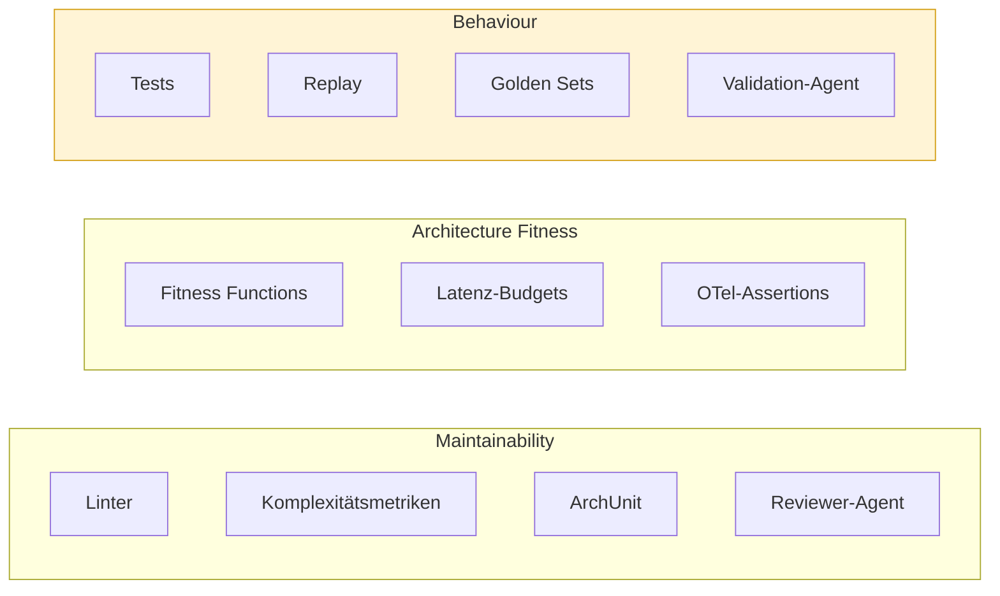

Die Behaviour-Kategorie (gelb) ist die schwierigste — Böckeler nennt sie
offen die am wenigsten entwickelte. Sie ist der eigentliche Grund, warum
Replay und Golden Sets im Kurs ein eigenes Modul bekommen
([Modul 12](04-qualitaet/modul-12-replay-evaluierung.md)).

### Drei operative Säulen (OpenAI)

Lopopolo zerlegt die tägliche Harness-Arbeit in drei Säulen, die
orthogonal zu Böckelers Kategorien stehen:

| Säule | Was sie tut | Werkzeuge | Schwerpunkt-Module |
|---|---|---|---|
| **Context Engineering** | dem Agenten das Richtige zur Verfügung stellen | Spec, ADR, AGENTS.md, Skills, dynamisches Verzeichnis-Mapping beim Start | 3, 4, 5 |
| **Architectural Constraints** | dem Agenten das Falsche unmöglich machen | Layering-Regeln, Import-Allowlists, Tool-Allowlists, ArchUnit | 4, 13 |
| **Entropy Management** | den Harness gegen Verfall pflegen | Doku-Konsistenz-Agent, Carveout-Audit, Golden-Set-Rotation | 7, 12, 15 |

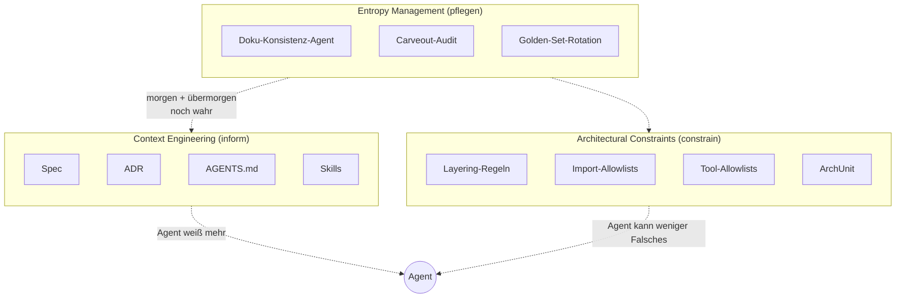

Lesart: **Context Engineering** schiebt Information *zum* Agenten;
**Architectural Constraints** ziehen Grenzen *um* den Agenten;
**Entropy Management** pflegt beides, damit es nicht verrottet.

Maxime von Lopopolo: *"Aus Sicht des Agenten existiert alles nicht,
worauf er im Kontext nicht zugreifen kann."* (Original: *"From the
agent's perspective, anything it can't access in-context doesn't
exist."*) — daraus folgt direkt, warum Spec und AGENTS.md kein Beiwerk
sind, sondern die Hauptkontrolle.

**Constrain + Inform** sind die Linsen, durch die Lopopolo die drei
Säulen liest: *Context Engineering* ist primär **inform** (Agent weiß
mehr), *Architectural Constraints* ist primär **constrain** (Agent kann
weniger Falsches), *Entropy Management* sorgt, dass beide auch
übermorgen noch stimmen. Glossar-Eintrag in
[`konventionen.md`](#kernbegriffe).

### Entropy Management

Ein Harness, der nicht aktiv gepflegt wird, verrottet schneller als der
Code, den er schützen soll. Die typischen Verfallsformen:

* **Doku-Drift** — AGENTS.md sagt X, Code macht Y. Lösung: Konsistenz-Agent in CI.
* **Tote Constraints** — ADR-Regel hat keinen Codepfad mehr. Lösung: regelmäßiger Constraint-Scan.
* **Carveout-Wildwuchs** — temporäre Ausnahmen, deren Trigger längst eingetreten ist. Lösung: Carveout-Audit als geplante Welle.
* **Golden-Set-Überfitting** — Replay grün, Realität rot. Lösung: Golden Sets rotieren, neue Beispiele ziehen.

Entropy Management ist nicht ein eigenes Modul, sondern eine Pflicht, die
durch [Modul 7 (Carveouts)](02-planung/modul-07-carveouts.md),
[Modul 12 (Replay)](04-qualitaet/modul-12-replay-evaluierung.md)
und [Modul 15 (Observability)](05-betrieb/modul-15-observability.md)
verteilt ist.

### Steering Loop

Der Harness ist nicht statisch. Das wiederkehrende Muster:

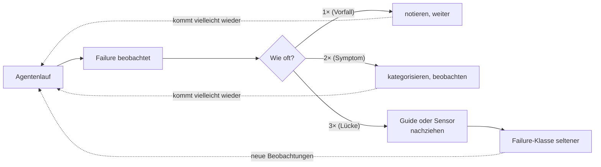

Wenn dasselbe Versagen zweimal auftritt, ist es ein Symptom; das *dritte*
Mal ist es eine Lücke im Harness. Konkret heißt das:

* Wiederkehrender Spec-Bug → Spec-Template erweitern (Feedforward, inferential)
* Wiederkehrender ADR-Verstoß → ArchUnit-Regel (Feedback, computational)
* Wiederkehrender Tool-Missbrauch → Tool-Allowlist verschärfen (Feedforward, computational)
* Wiederkehrendes Halluzinations-Muster → Reviewer-Skill schreiben (Feedback, inferential)

Der Steering Loop ist die einzige Stelle im Kurs, an der **der Mensch
unersetzbar bleibt**: er entscheidet, wo der Harness wächst.

### Lifecycle-Verteilung

Kontrollen werden über den Lebenszyklus verteilt — je früher und billiger,
desto besser:

| Stufe | Kontrollen | Begründung |
|---|---|---|
| Pre-commit / IDE | LSP, Linter, schnelle Tests, einfacher Review-Agent | billig, sofort |
| Pre-integration | volle Testsuite, ArchUnit, Reviewer-Agent | vor Merge, noch billig genug |
| Post-integration | Mutation Tests, vollständige Verifikation, Validator-Agent | teurer, aber tolerierbar |
| Continuous | Drift-Detection, SLO-Monitoring, Dead-Code, Replay-Regressionen | außerhalb des Change-Lifecycles |

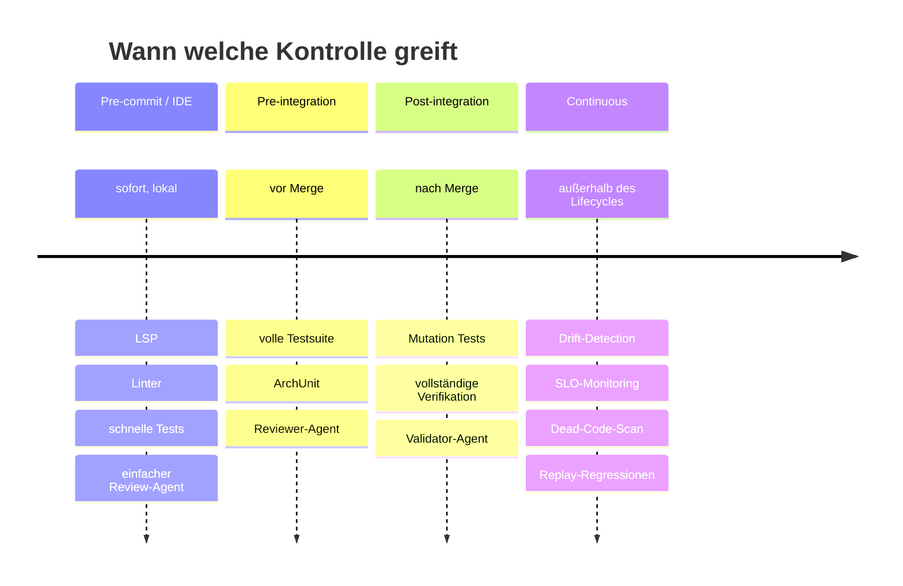

Kosten steigen von links nach rechts. Faustregel: jede Kontrolle, die
zwei Stufen nach links wandern könnte (ohne Schaden), sollte das tun.
Eine Coverage-Prüfung, die erst im "Continuous"-Lauf greift, ist faktisch
keine Coverage-Prüfung — die Information kommt zu spät, um auf den
Slice zurückzuwirken.

## Durchsetzungsschicht
*Quelle: [grundlagen/durchsetzungsschicht.md](grundlagen/durchsetzungsschicht.md)*

Konventionen, Hard Rules und Sensors sind *aspirativ*, bis etwas sie an
die Agent-Schleife **bindet**. Diese Seite beschreibt die
**Durchsetzungsschicht** — die fail-closed Mechanik, die aus „die Doku
sagt X" ein „der Harness erzwingt X" macht. Erst das tool-neutrale
Prinzip, dann eine konkrete Realisierung (Claude-Code-Hooks).

### Die Lücke: aspirativ vs. bindend

Ein Guide, der „make/Docker-only" oder „Gates vor dem Handoff" sagt, ist
*inferential feedforward* — er **informiert**. Ein driftender oder
vergesslicher Agent kann ihn ignorieren, ohne dass etwas passiert. Die
Durchsetzungsschicht verschiebt dieselbe Regel in die **computational**-
Spalte der [2×2-Matrix](grundlagen/konzeptkarte.md#2x2-schnellanker): die falsche
Handlung wird *technisch erschwert* (feedforward) oder *deterministisch
erkannt* (feedback) — nicht bloß abgeraten. Es ist dieselbe Bewegung wie
beim `check-references`-Gate ([Traceability-Constraint](#traceability-constraint)):
eine Doku-Regel bekommt einen mechanischen Wächter.

### Drei Bindepunkte

Jeder bindet einen anderen Punkt der Agent-Schleife — und fällt in einen
Quadranten, den du schon kennst:

| Bindepunkt | Wann | 2×2-Quadrant | Wirkung |
|---|---|---|---|
| **Tool-Call-Gate** | vor jedem Tool-Call | computational **feedforward** | falsche Handlung technisch verhindern (Tool-Allowlist / Befehls-Guard) |
| **Handoff-Gate** | bevor der Agent „fertig" meldet | computational **feedback** | deterministisch prüfen, dass die Gates wirklich liefen |
| **Workflow-Skelett** | beim Start einer Aufgabe | inferential feedforward | den Ablauf vorgeben (Slice-Workflow als feste Schrittfolge) |

Zwei der drei *erzwingen* (computational); das **Workflow-Skelett ist der
schwächste Bindepunkt** — es gibt den Ablauf vor, erzwingt ihn aber nicht
(inferential), und bleibt das einzige der drei, das ein Agent noch
ignorieren kann. Die fail-closed Klammer aus der Einleitung sind die zwei
Gates; das Skelett ist das Gerüst, das sie absichern.

Realisierung in Claude Code: ein `PreToolUse`-Hook (Tool-Call-Gate), ein
`Stop`-Hook (Handoff-Gate) und ein Slash-Command (Workflow-Skelett),
verdrahtet in `.claude/settings.json`. Portierbar: andere Harnesses haben
äquivalente Punkte (Pre-/Post-Tool-Hooks, Pre-Commit-Hooks, Pflicht-CI-
Jobs). Der Bindepunkt ist das Konzept, der Hook nur eine Form.

### Vier Design-Eigenschaften

1. **fail-closed.** Fehlt das Prüfmittel (Interpreter nicht da, Input
   unlesbar, zu tiefe Verschachtelung), wird **blockiert**, nicht
   durchgewunken. Ein Gate, das im Zweifel passieren lässt, ist keiner.
2. **Nachweis über Inhalt, nicht Diff.** Ein Content-Hash des Arbeitsbaums
   belegt „die Gates liefen auf *genau diesem* Stand". Inhaltsbasiert (statt
   diff-/status-basiert) hält der Nachweis über Commits hinweg — und ein
   Commit *ohne* vorherigen Gate-Lauf bleibt trotzdem erkennbar. Das ist
   die Mechanik gegen die [Harness-Lüge](#kernbegriffe)
   „ich hab die Gates laufen lassen".
3. **Loop-Guard.** Ein Handoff-Gate muss erkennen, ob es sich in derselben
   Runde schon einmal blockiert hat — sonst Endlosschleife bei dauerhaft
   rotem Gate. Der Hook gibt sich beim zweiten Anlauf frei.
4. **bootstrap-aware.** Der Gate erzwingt nur die Gates, die *schon
   existieren*. Ein [Bootstrap-aware Gate](#kernbegriffe)
   wächst mit der Reife; ein harter Handoff-Gate ab Schritt 0 bekämpft die
   weiche Frühphase des [Harness-Bootstraps](#harness-bootstrap).
   Erst binden, wenn es etwas zu binden gibt.

### Grenzen — ehrlich benannt

- Ein Befehls-Guard, der nur **Befehlspositionen** prüft, ist ein
  *Stolperdraht, keine Sandbox*: Interpreter-Umwege (`python -c "…"`)
  bleiben möglich. Sein Wert ist, *versehentliche* Drift zu verhindern,
  nicht böswillige.
- Der Inhalts-Nachweis hat eine Lücke bei frischem Klon bzw. gelöschtem
  State mit cleanem Tree (kein Nachweis prüfbar) — dort ist **CI das Netz**.
- Diese Grenzen zu *benennen* ist Pflicht. Ein Gate, das so tut, als decke
  es mehr ab, als es tut, ist selbst eine [Harness-Lüge](#kernbegriffe)
  — dieselbe Klasse wie ein undeklariertes Gate.

### Die Schicht wird selbst gesteuert

Die Durchsetzungsschicht ist Code *im* Harness — also unterliegt sie
demselben [Steering-Loop](#verbindung-zum-steering-loop)
wie alles andere. Ein Befehls-Guard etwa reift in Wellen: zuerst nur die
Befehlsposition, dann Sub-Shell-Rekursion (`bash -c "…"`), dann
kombinierte Flags (`-lc`, `-ec`). Genau diese Härtung *am Wächter selbst*
ist der Steering-Loop, auf den Harness angewandt. Der ausführliche Worked
Example dazu gehört nach [Modul 13](04-qualitaet/modul-13-quality-gates.md)
(folgt).

### Referenz-Implementierung

Das vollständige Artefakt-Set einer Durchsetzungsschicht:

- `.claude/settings.json` — Hook-Verdrahtung (welcher Hook an welchem Punkt)
- `.claude/hooks/*.sh` — Tool-Call-Gate (Befehls-Guard) und Handoff-Gate
  (Stop-/Gate-Nachweis)
- `.claude/commands/*.md` — Workflow-Skelett als Slash-Command
- `tools/harness/working-tree-hash.sh` + `record-gates.sh` — gemeinsame, <!-- d-check:ignore (Referenz-Artefakt im Fallstudien-Repo) -->
  inhaltsbasierte Nachweis-Quelle für Gate-Lauf *und* Handoff-Gate (eine
  Wahrheit, keine Logik-Dopplung)

Die Gate- und Traceability-Mechanik, an die das andockt, läuft in den
Fallstudien-Repos ([`fallstudien.md`](grundlagen/fallstudien.md)) bereits real; die
Skripte werden hier **referenziert, nicht inline ausgerollt** — die
mechanische Hälfte bleibt klein und lesbar, die Details holt man aus der
Referenz.
## Modul 0 — Einführung

*Quelle: [00-einfuehrung/modul-00-einfuehrung.md](00-einfuehrung/modul-00-einfuehrung.md)*

### Kernidee (Modul 0)

Ein Chatbot antwortet. Ein Agent handelt. Engineering-Systeme handeln
**reproduzierbar** und **auditierbar** — das ist nicht dasselbe wie
"antwortet besser". Der Harness ist genau das System, das aus einem
handelnden Agenten einen reproduzierbar handelnden Agenten macht.

### Regeln gegen typische Fehlannahmen (Modul 0)

- In den dokumentierten Scheiterfällen war meist nicht das Modell die Ursache, sondern eine Spec-Lücke oder ein fehlender Sensor. Das Modell rät, *weil nichts in der Eingabe widerspricht*. Lopopolo (OpenAI 2026) und die Fallstudien in [`grundlagen/fallstudien.md`](grundlagen/fallstudien.md) belegen das.
- Der Prompt wird zur Anti-Spec, die niemand pflegt. Was in *jedem* Lauf relevant ist, gehört in AGENTS.md oder eine Fitness Function, nicht in den Prompt.
- Genau das macht Auditierbarkeit unmöglich. Engineering-Systeme sind *reproduzierbar*, nicht kreativ.
- Falsche Attribution. Eine Halluzination ist ein *Output-Symptom*, dessen *Ursache fast immer im Kontext liegt*: fehlende Spec-Aussage, fehlende ADR, fehlende AGENTS.md-Regel, fehlende Tool-Allowlist. Die richtige Frage ist nicht "warum hat das Modell das erfunden", sondern "was *im Kontext* hätte das Erfinden verhindert" — und genau das ist eine Harness-Frage. Wer Halluzinationen als Modell-Bug klassifiziert, kann sie nur durch Modellwechsel adressieren; wer sie als Kontext-Bug klassifiziert, kann sie durch Spec/ADR/Sensor reduzieren. Empirie: dieselbe Klasse von Halluzinationen kommt nach Modellwechsel oft *wieder* — weil das Kontext-Loch nicht zugefüllt wurde.

## Modul 1 — Der Entwicklungszyklus

*Quelle: [01-spec-und-architektur/modul-01-entwicklungszyklus.md](01-spec-und-architektur/modul-01-entwicklungszyklus.md)*

### Lebenszyklus als Diagramm

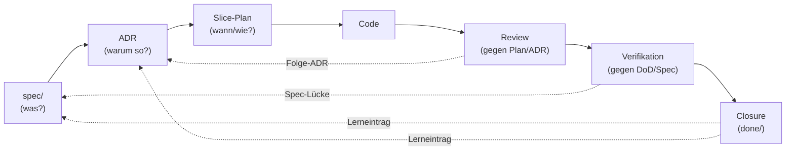

Die durchgezogenen Pfeile sind der *Vorwärtspfad* (was wird gebaut), die
gestrichelten der *Rückwärtspfad* (was lernt der Harness daraus). Beide
Richtungen sind Pflicht — eine Kette ohne Rückverweise ist nicht
auditierbar.

Review prüft Code gegen *Plan und ADR*.
Wenn der Plan die ADR-Verletzung nicht antizipiert hat, sieht Review
sie nicht. Verifikation prüft Code gegen *DoD und Spec* (und dort
referenzierte ADRs). Das ist genau der Grund, warum Review und
Verifikation getrennte Rollen sind — siehe [Modul 8](03-agenten/modul-08-agentenrollen.md).

### Kernidee (Modul 1)

Jedes Artefakt verweist nach oben (Begründung) und nach unten
(Konsequenz). Eine Kette ohne Rückverweise ist nicht auditierbar.

### Regeln gegen typische Fehlannahmen (Modul 1)

- Plan ist die Stelle, an der Spec und ADR auf einen Code-Diff zusammenfallen. Ohne Bezugs-IDs zu Spec/ADR ist der Plan nicht prüfbar (und damit kein Plan, sondern eine Liste).
- Closure verlangt einen Lerneintrag im Slice. Ohne Lerneintrag wird die Welle nicht "fertig", sondern nur "weg".
- Wer das erste Mal ein Konflikt zwischen AGENTS.md und Spec hat und dann erst überlegt, hat den Konflikt bereits in den Code laufen lassen.

### Worked Example: einen Source-Precedence-Block aus einem konfliktbehafteten Repo destillieren

**Schritt 0 — Baseline und Modus festlegen.** Vor dem Sammeln
kanonischer Quellen muss klar sein: *welche Harnesskonvention* adoptiert
wird (AI-Harness-Kurs, interner Standard, Industrie-Norm), *welche
Repo-Klasse* angesetzt wird (Referenz, Safety/Control, Policy/Compliance,
Tooling) und *welcher Modus pro Sub-Area* gilt (Greenfield: Doc führt,
Code folgt; Brownfield: Code führt, Doku folgt — mit Konvergenz-Auftrag
zu Greenfield). Diese drei Entscheidungen prägen jede Folge-Aktion: in
Brownfield ist der nächste Schritt *Inventur des Bestands*, in Greenfield
*Auflisten zu schaffender Quellen*. Volldefinitionen und Phasen-Modell
in [`grundlagen/konventionen.md` §Harness-Bootstrap](grundlagen/konventionen.md#harness-bootstrap)
(Konzept-Anker) und im ausgearbeiteten
[Modul 2 — Harness-Bootstrap](01-spec-und-architektur/modul-02-harness-bootstrap.md) (Lehrtext
mit GF/BF-Walkthroughs).
Die folgenden sechs Schritte 1–6 beschreiben den Greenfield-Pfad; in
Brownfield-Modus läuft jeder Schritt als Code → Doc-Inventur mit
parallelem Diskrepanz-Backlog (siehe
[`grundlagen/fallstudien.md` §Beobachtung aus dem Ist-Zustand](grundlagen/fallstudien.md#beobachtung-aus-dem-ist-zustand)).

**Schritt 1 — Kanonische Quellen sammeln, Mehrfach-Quellen erkennen.**
Liste alle Dokumente, die *normativ* etwas behaupten ("so soll es
sein"). Marketing-Texte, Tutorials, externe Wiki-Seiten gehören nicht
dazu. Ergebnis-Form: eine flache Liste *vor* der Ranking-Diskussion.

```
spec/lastenheft.md
spec/spezifikation.md            (existiert noch nicht — anlegen?)
spec/architecture.md             (Umbenennung von docs/architecture.md)
docs/plan/adr/*.md
docs/plan/planning/in-progress/roadmap.md
docs/user/operations.md          (existiert noch nicht — verschieben?)
README.md
AGENTS.md
harness/README.md                (neue Datei dieses Moduls)
```

Beobachtung: zwei Lücken (`spezifikation.md`, `docs/user/*`) und eine
Umbenennung (`docs/architecture.md` → `spec/architecture.md`) tauchen
*durch* das Listing auf. Das ist kein Nebenprodukt — das ist die
Hauptwirkung von Schritt 1.

**Schritt 2 — Rangkriterien festlegen, nicht erfinden.** Die Reihenfolge
ist nicht Geschmacksfrage; sie folgt zwei Achsen:

1. **Vertragliche Bindung absteigend.** Lastenheft (Abnahme-bindend) →
   Spezifikation (technisch fortschreibbar) → Architektur (Konstanten
   der Lösung) → ADRs (Einzelentscheidungen) → Roadmap (aktuelle Welle)
   → Operativ-Doku → Allgemein-Doku.
2. **Schreib-Frequenz absteigend.** Lastenheft wird selten geändert
   (jedes Update ist Spec-Disziplin). `AGENTS.md` wird oft angepasst.
   Wer die Reihenfolge umdreht, lässt die Agent-Briefing-Datei
   stillschweigend die Spec überschreiben — exakt die Drift, gegen die
   Source Precedence erfunden wurde.

Die `harness/README.md` selbst rangiert *unten*: sie ist ein
Einstiegspunkt, keine neue Quelle.

**Schritt 3 — Tabelle entwerfen.** In `harness/README.md`:

```markdown
## Source precedence

| Rang | Datei | Charakter |
|---|---|---|
| 1 | [`spec/lastenheft.md`](../spec/lastenheft.md) | vertraglich abnahmebindend |
| 2 | [`spec/spezifikation.md`](../spec/spezifikation.md) | technisch fortschreibbar |
| 3 | [`spec/architecture.md`](../spec/architecture.md) | Komponenten/Sequenzen, meilensteinfrei |
| 4 | [`docs/plan/adr/`](../docs/plan/adr/) | Architekturentscheidungen |
| 5 | [`docs/plan/planning/in-progress/roadmap.md`](../docs/plan/planning/in-progress/roadmap.md) | aktuelle Welle |
| 6 | [`docs/user/*`](../docs/user/) | Operations, Quality, Releasing |
| 7 | [`README.md`](../README.md) | Projekt-Überblick |
| 8 | [`AGENTS.md`](../AGENTS.md) | Agent-Briefing |
| 9 | diese Datei | Harness-Einstieg |
```

Vorlage:
[`/lab/templates/harness/README.template.md`](../../lab/templates/harness/README.template.md).
Neun Ränge sind ein Maximum — wer mehr braucht, hat
Mehrfach-Repräsentationen, die in den Schichten 1–3 gebündelt werden
sollten. Die konkrete Rangordnung selbst ist projektspezifisch
(Safety/Control- und Policy/Compliance-Repos können abweichen); Wahl
und Begründung gehören in den Adaptions-Block des repo-lokalen
Konventionsdokuments (siehe
[`grundlagen/konventionen.md#source-precedence`](grundlagen/konventionen.md#source-precedence)).

**Schritt 4 — Konfliktauflösungs-Klausel daneben setzen.** Eine
Tabelle allein wirkt nicht; sie braucht den Satz, der ihre Anwendung
*erzwingt*:

```markdown
Wenn diese Datei einer kanonischen Quelle widerspricht, **gewinnt die
kanonische Quelle**, und diese Datei wird angepasst.
```

Derselbe Satz gehört spiegelbildlich in `AGENTS.md` (mit
"AGENTS.md" statt "diese Datei"). Damit hat jeder Implementer und jeder
Agent ein eindeutiges Verfahren: bei Konflikt → höher rangierende
Quelle, niedriger rangierende anpassen.

**Schritt 5 — Bezug zur Spec-Stratifizierung herstellen.** Die drei
Spec-Ebenen (Lastenheft / Spezifikation / Architektur) haben *intern*
ebenfalls eine Precedence: das Lastenheft schärft die Spezifikation,
die Spezifikation schärft die Architektur — niemals andersherum. Diese
Regel kommt als Kurzhinweis in den Block, weil sie sonst beim ersten
Konflikt verloren geht:

```markdown
**Spec-Stratifizierung.** Innerhalb der Spec gilt: Lastenheft (1) →
Spezifikation (2) → Architektur (3). Eine ADR darf die Spezifikation
schärfen, niemals das Lastenheft. Wer das Lastenheft per ADR ändern
will, ändert in Wahrheit die Spec — und das ist ein eigener Slice.
```

Volldefinition siehe
[`grundlagen/konventionen.md`](grundlagen/konventionen.md#source-precedence).

**Schritt 6 — Bewusstes Brechen: einen Konflikt provozieren.** Ändere
in `AGENTS.md` eine Hard Rule, die einer ADR widerspricht (z. B.
"Direkt-DB-Zugriff erlaubt", obwohl ADR-0001 hexagonale Architektur
festschreibt). Beobachte:

| Beobachtung | Diagnose |
|---|---|
| Implementer fragt nicht nach, schreibt Code gegen AGENTS.md | Source Precedence ist nicht *durchgesetzt* — Konfliktauflösungs-Klausel fehlt im AGENTS.md-Header. |
| Implementer stoppt, weist auf Konflikt hin | Source Precedence wirkt — der Konflikt wird sichtbar, bevor er Code wird. |
| Implementer ändert die ADR | Falsche Auflösungsrichtung: ADRs sind Rang 4, AGENTS.md Rang 8 — die niedrigere Quelle muss angepasst werden. |

Sechs Schritte, ein Block in `harness/README.md`, eine Konfliktauflösung
mit Spiegelung in `AGENTS.md`. Der Test, ob er funktioniert, ist der
nächste Konflikt — nicht der nächste Lesedurchgang.

## Modul 2 — Harness-Bootstrap

*Quelle: [01-spec-und-architektur/modul-02-harness-bootstrap.md](01-spec-und-architektur/modul-02-harness-bootstrap.md)*

### Harness-Einordnung (Modul 2)

Bootstrap ist die **initiale Anwendung des Steering-Loops**, laufend
ausgeführt, bis das Repo *steady state* erreicht. Was
[Modul 11 — Verification Harness](04-qualitaet/modul-11-verification.md)
als laufende Praxis lehrt (Beobachtung → Guide/Sensor → Diff →
Closure), lehrt dieses Modul als *initiale Aufsetzungs-Praxis*:
gleiche Sensoren und Guides, andere Anwendungsphase. Die abstrakte
Verbindung steht in
[`grundlagen/konventionen.md` §Verbindung zum Steering-Loop](grundlagen/konventionen.md#verbindung-zum-steering-loop).

[Modul 1 §Worked Example, Schritt 0](01-spec-und-architektur/modul-01-entwicklungszyklus.md#worked-example-einen-source-precedence-block-aus-einem-konfliktbehafteten-repo-destillieren)
hat den Bootstrap-Modus als Kurz-Vorgriff eingeführt (Baseline und Modus als
Voraussetzung für den Lebenszyklus); dieses Modul ist die Vollform —
die *Diagnose-Praxis*, die Schritt 0 zur Vorbedingung jeder
modusabhängigen Aktion macht.

Gegen die vier Harness-Linsen aus
[`grundlagen/konzeptkarte.md`](grundlagen/konzeptkarte.md):

* **Drift** — Bootstrap ist der erste *Drift-Sensor*: ohne formellen
  Bootstrap bleibt jede spätere Drift unmessbar.
* **Reproduzierbarkeit** — der dokumentierte Modus pro Sub-Area ist
  Voraussetzung dafür, dass ein zweiter Lauf am selben Repo dieselben
  Klassifikationsentscheidungen trifft.
* **Auditierbarkeit** — der Bootstrap-Modus macht die *Begründung*
  jeder Folge-Entscheidung explizit.
* **Steering-Loop** — Bootstrap = initiale Steering-Loop-Anwendung
  (siehe oben).

### Kernidee (Modul 2)

**Bootstrap ist ein fortlaufender Modus, kein einmaliges Event — und
er gilt pro Sub-Area, nicht pro Repo.** Der Modus ist ein beobachtbares
Verhältnis zwischen Code und Doku, kein Etikett auf dem Repo. Wer den
Modus pro Sub-Area diagnostizieren kann, weiß, *welcher* Trigger die
nächste sinnvolle Aktion auslöst — und spart sich das Ausprobieren auf
der Phasen-Ebene. Genau dieses Diagnose-Vermögen ist das
Lehr-Ergebnis dieses Moduls; die Modus-Wahl als Planungs-Entscheidung
(also: *welcher Modus gilt für jede vom nächsten Slice berührte
Sub-Area — und warum?* — der Slice selbst trägt keinen Modus, er
berührt nur Sub-Areas, die je einen tragen) folgt später in
[Modul 5 — Planning Harness](02-planung/modul-05-planning-harness.md).

#### Wann wechselt der Modus? Drei Anzeichen

Im laufenden Betrieb verändern sich Sub-Areas zwischen den Modi. Drei
beobachtbare Anzeichen, an denen sich ein Modus-Wechsel ankündigt:

1. **Diskrepanz-Häufung ändert sich** (Indikator in beide
   Richtungen). *BF → GF Graduation:* der Reconciliation-Backlog
   einer BF-Sub-Area schrumpft über mehrere Slices, neue Inventur-
   Schritte melden keine Diskrepanzen mehr. *GF → BF Drift:* in
   einer als GF gemeldeten Sub-Area werden plötzlich Diskrepanzen
   sichtbar (Tests ohne Spec-Anker, ADRs ohne Code-Bezug).
2. **Test-Bestand übertrifft Spec-Anker.** Wenn das Test-Bestand
   strukturell mehr prüft als die Spec behauptet (z. B. Edge-Case-
   Tests ohne `LH-*`-ID), ist die Sub-Area de facto **von GF nach BF
   gedriftet** — der Code "weiß" mehr als die Doku. Symptom: bei
   jeder Code-Änderung muss die Spec nachgezogen werden, statt
   umgekehrt.
3. **Carveout-Auflösung schließt eine BF-Sub-Area.** Wenn ein
   `CO-DS-*`-Carveout durch einen Reconciliation-Slice geschlossen
   wird (orphan code bekommt nachträglich seinen Anforderungs-Anker
   in der Spec oder als retroaktiver ADR), nähert sich die zugehörige
   Sub-Area der **Graduation zu GF**. Symptom: der
   Reconciliation-Backlog sinkt um genau einen Eintrag, der
   schließende Slice trägt einen "CO-DS-NNN aufgelöst durch
   LH-FA-MMM"-Hinweis im Closure-Block, und die nächste Inventur
   meldet die Sub-Area mit einer Diskrepanz weniger.

   **Umgekehrt: eine Diskrepanz-Häufung *eröffnet* eine BF-Sub-Area.**
   Wenn mehrere Carveouts denselben Geltungsbereich tragen oder sich
   ein systemisches "Code existiert vor Doku"-Muster zeigt, ist die
   richtige Antwort eine BF-Sub-Area-Markierung mit Graduation-Plan,
   nicht eine Carveout-Kaskade — siehe
   [Modul 7 §Worked Example A Schritt 6](02-planung/modul-07-carveouts.md#worked-example-a-einen-carveout-dokumentieren).
   Die Carveout↔BF-Klammer trägt damit in beide Richtungen: Auflösung
   schließt eine BF-Sub-Area, Häufung eröffnet eine.

Diese drei Anzeichen sind die Sensor-Seite der Bootstrap-Diagnose
und das Werkzeug für die metakognitive Reflexionsfrage am Modul-Ende.

### Regeln gegen typische Fehlannahmen (Modul 2)

* Bootstrap ist ein fortlaufender
  Modus, der sich über Sub-Areas und Phase-Reife entwickelt. Jeder
  Trigger ist ein Bootstrap-Mikro-Event. Wer Bootstrap als Setup
  versteht, übersieht die Modus-Wechsel, die im laufenden Betrieb
  passieren, und produziert daher dauerhaft Findings ohne
  Modus-Bewusstsein.
* Modus gilt **pro Sub-Area**. Ein Repo kann in den
  *Konventionen* BF und in der *Spec-Schreibung* GF sein. Die vier
  Beispiele in
  [`grundlagen/fallstudien.md` §Beobachtung aus dem Ist-Zustand](grundlagen/fallstudien.md#beobachtung-aus-dem-ist-zustand)
  zeigen diese Sub-Area-Heterogenität explizit.
* auch im GF-Modus entstehen Trigger
  (Diskrepanz, Promotion-Auslöser etc.), nur nicht aus
  *Bestandsinventur*, sondern aus *Konsistenzprüfung des neu
  Geschaffenen*. Die vier Klassen gelten in jedem Modus; was sich
  ändert, ist die Frequenz und die typische Auslöse-Quelle.
* BF ist der *typische* Ausgangspunkt
  realer Repos. Die vier Fallstudien sind alle in BF (siehe oben).
  BF kann systematisch in Richtung GF graduieren — *Graduation* ist
  eine ausgewiesene Bedingung mit Konvergenz-Auftrag, kein
  Wunschdenken. Die Frage ist nicht *ob* graduiert wird, sondern
  *wie weit* das Repo schon ist und *welche Sub-Area* als nächstes
  graduations-reif wird.
* Eine Struktur qualifiziert erst über die drei Inklusions-Achsen
  (Schwelle ≥ 2, siehe
  [`grundlagen/konventionen.md` §Was ist eine Sub-Area?](grundlagen/konventionen.md#was-ist-eine-sub-area)).
  Der übersprungene Qualifikations-Schritt erzeugt **beide**
  Granularitäts-Fehler zugleich: *zu grob* — ein Aggregat wie *"Backend"*
  wird als *eine* Sub-Area gelabelt, statt in mehrere aufgeteilt; *zu
  fein* — ein substanzloses Verzeichnis (*"Struktur ohne Substanz"*, nur
  eine Achse erfüllt) wird zur Sub-Area erhoben, obwohl es eine
  Sub-Area-*Aspirantin* bleibt. Lernerursprung: dieselbe Wurzel wie die
  Modul-5-Vorstellung *"wenn der Slice klein ist, ist die Sub-Area GF"*
  ([`grundlagen/lernervorstellungen.md` §Über Planung](grundlagen/lernervorstellungen.md#über-planung-modul-57))
  — Reife/Substanz wird aus einem Oberflächenmerkmal (Existenz, Größe)
  *abgelesen* statt über die Achsen *geprüft*. (Die Modul-5-Vorstellung
  bleibt eine *Modus*-FV; FV5 teilt nur die kognitive Wurzel, nicht die
  Achse.)

### Worked Example 1: Greenfield-Bootstrap (DocSearch-Walkthrough)

#### Übersicht: GF-Walkthrough als Mermaid-Diagramm

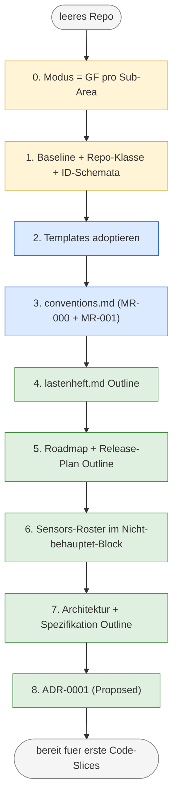

Drei Phasen sind farbig sichtbar: *Orient* (gelb, Schritte 0–1),
*Action* (blau, Schritte 2–3), *Content* (grün, Schritte 4–8).

#### Detail-Tabelle (Schritte 0–4: Setup-Phase)

Trigger-Anker (T1, T2, T4, T5, T6, T7) sind Instanz-Beispiele der
vier Trigger-Klassen aus
[`grundlagen/konventionen.md` §Vier Trigger-Klassen](grundlagen/konventionen.md#vier-trigger-klassen) —
die abstrakten Definitionen stehen dort, hier nur die Instanzen.

*Hinweis zur T-Nummerierung:* Die Trigger sind durch das
DocSearch-Beispiel nummeriert (T1 = Pointer in README,
T2 = Pointer in AGENTS, T4 = Promotion, T5 = erste ADR-Vorschläge,
T6 = Cross-Reference ADR → Spec (aufwärts), T7 = ADR-Review-Auslöser).
**T3 ist BF-spezifisch** und tritt im Greenfield-Walkthrough nicht
auf — er erscheint in Worked Example 2 als Sync-Trigger in
BF-Diskrepanz-Auslöse-Variante.

| # | Aktion | Berührte Dateien (Phasen-Übergang) | Trigger |
|---|---|---|---|
| 0 | Modus pro Sub-Area entscheiden: GF für *Konventionen*, *Spec*, *Architektur*, *ADR* (alle vier Doku-führt). | keine | keine — Vorbedingung |
| 1 | Baseline-Auswahl (Kurs-Harness) + Repo-Klasse (Tooling) + ID-Schemata festlegen (`LH-*`, `ARC-*`, `SPEC-*`, `MR-*`) | keine | reift 2/3 |
| 2 | Templates aus [`../../lab/templates/`](../../lab/templates/) kopieren | alle Skelette **0 → 1** | keine |
| 3 | `harness/conventions.md` mit MR-000 (Baseline) + MR-001 (`ARC-*`/`SPEC-*` als Adaption) | `conventions.md` 0 → 1 | **T1** (Pointer auf `conventions.md` in `harness/README.md`), **T2** (Pointer in `AGENTS.md`) |
| 4 | `spec/lastenheft.md` Outline mit `LH-FA-*`/`LH-QA-*` | `lastenheft.md` 1 → 2 | keine direkt |

#### Detail-Tabelle (Schritte 5–8: Inhalts-Phase)

| # | Aktion | Berührte Dateien (Phasen-Übergang) | Trigger |
|---|---|---|---|
| 5 | `docs/plan/planning/roadmap.md` mit Welle + Release-Mapping; `releasing.md` mit Release-Strategie | `roadmap.md` 1 → 2; `releasing.md` 1 → 2 | keine |
| 6 | Sensors-Roster im "Nicht behauptet"-Block (Prosa-Pointer-Liste, kein Status) | `harness/README.md` §Sensors Sub-1 → Sub-2; `AGENTS.md` §4 Sub-1 → Sub-2 | **T4** (Promotion-Auslöser bei erstem Code-Slice) |
| 7 | `spec/architecture.md` + `spec/spezifikation.md` Outline mit `ARC-*`/`SPEC-*` | beide 1 → 2 | **T5** (erste ADR-Vorschläge aus Architektur-Outline) |
| 8 | `docs/plan/adr/0001-doc-source-of-truth.md` mit Status *Proposed* | `0001-…md` 0 → 2; ADR-Index 1 → 2 | **T6** (Cross-Reference: ADR → Spec, aufwärts), **T7** (ADR-Review-Auslöser) |
| Bootstrap-Ende | Bereit für ersten Code-Slice — Workflow-Übergang | — | — |

**Anmerkung zur Tabellen-Splittung.** Die Setup-Phase (0–4) etabliert
*was wo lebt*; die Inhalts-Phase (5–8) füllt mit *normativem Inhalt*.
Trigger entstehen ab Schritt 3 (Konventionen-Adoption); die Setup-Phase
legt die *Quellen* an, die Inhalts-Phase erzeugt die *Folge-Bezüge*
zwischen Dokumenten und ADRs. Die Tabellen-Trennung macht das
kognitiv lesbar — die Phasen verschwimmen sonst.

#### Wie sehen T1 und T2 konkret aus?

**Schritt 3 — neu angelegte `harness/conventions.md`** (Phase 0 → 1):

```markdown
# Konventionen — docsearch

## Adaptions-Block

MR-000: Baseline = ai-harness-course/0.4
MR-001: Spec-Stratifizierung mit ARC-*/SPEC-*/LH-* (Adaption)
```

**T1 — Pointer in `harness/README.md`** (existierende Sektion ergänzen):

```markdown
<!-- harness/README.md, Sektion "Konventionen" -->
Strukturregeln und Adaptionen siehe [`conventions.md`](conventions.md).
```

**T2 — Pointer in `AGENTS.md`** (Source-Precedence-Liste ergänzen):

```markdown
<!-- AGENTS.md §Source Precedence -->
1. spec/lastenheft.md
2. harness/conventions.md      <!-- neu ergänzt, T2 -->
3. docs/plan/adr/*.md
...
```

Die zwei Pointer sind das, was die abstrakte Trigger-Klasse *Sync*
konkret macht: sobald `conventions.md` existiert, müssen die zwei
Dokumente, die *auf* `conventions.md` verweisen, einen entsprechenden
Eintrag bekommen. Wer den Eintrag vergisst, hat einen klassischen
**Sync-Drift** — der Doku-Konsistenz-Agent
([Modul 15 §Observability](05-betrieb/modul-15-observability.md))
findet das später als Inkonsistenz.

### Worked Example 2: Brownfield-Bootstrap mit Discovery und Reconciliation

#### Übersicht: BF-Walkthrough als Mermaid-Diagramm

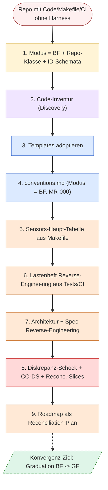

Vier Phasen sind farbig sichtbar: *Orient* (gelb), *Discover* (lila,
neu in BF), *Action* (blau), *Content-BF* (orange), *Diskrepanz-
Schock* (rot, neu in BF), *Goal/Graduation* (grün gestrichelt).

#### Detail-Tabelle (Schritte 1–4: Inventur-Phase, was bei BF anders ist)

*Hinweis zur Schritt-Nummerierung:* BF nimmt die Modus-Setzung in
Schritt 1 mit (wo GF Schritt 0 trägt), weil in BF die
Repo-Klassen-Wahl und die Modus-Antizipation zusammenfallen — beide
hängen von der ersten Inventur-Beobachtung ab und können nicht *vor*
dem ersten Hinschauen entschieden werden. Daher die asymmetrische
Nummerierung GF 0–8 vs. BF 1–9.

| # | Aktion | BF-Besonderheit gegenüber GF |
|---|---|---|
| 1 | GF-Schritte 0 und 1 in einem Schritt zusammengefasst: Modus-Antizipation "BF pro Sub-Area" + Baseline-Auswahl + Repo-Klasse + ID-Schemata festlegen | + explizite Modus-Setzung mit Sub-Area-Aufzählung; Repo-Klassen-Wahl und Modus-Antizipation fallen zusammen |
| 2 | **Code-Inventur (Discovery):** Makefile, CI, Tests, README, Commit-Messages inventarisieren als Lerner-Schritt | **neu in BF** — kein Repo-Artefakt entsteht, nur Lerner-Wissen |
| 3 | Templates adoptieren | wie GF |
| 4 | `harness/conventions.md` mit Modus = BF pro Sub-Area, MR-000-Aussage | Modus-Block anders strukturiert (BF-Deklarationen + Konvergenz-Auftrag pro Sub-Area) |

#### Detail-Tabelle (Schritte 5–9: Reconciliation-Phase)

| # | Aktion | BF-Besonderheit gegenüber GF |
|---|---|---|
| 5 | Sensors-Haupt-Tabelle direkt aus Makefile-Kommentaren entstehen lassen | **gegenteilig zu GF** — Targets existieren, keine "Nicht behauptet"-Promotion nötig; **T3** (Sync-Trigger in BF-Diskrepanz-Auslöse-Variante: Sensor-Lücke = impliziter Pointer-Mismatch zwischen Makefile-Realität und Sensor-Tabelle) wird sichtbar |
| 6 | Lastenheft aus Code/Tests/CI rückbauen | Inventur-Umkehr; Diskrepanz-Material entsteht (Code ohne Anforderung, Test ohne LH-Bezug) |
| 7 | Architektur + Spezifikation aus `src/` rückbauen; **retroaktive ADRs** für implizite Entscheidungen | ADRs teils retroaktiv mit Status *Accepted* (oder *Superseded*, falls Entscheidung schon revidiert) |
| 8 | **Diskrepanz-Schock:** Diskrepanzen klassifizieren als (a) `CO-DS-*` (orphan code ohne Anforderung), (b) Reconc.-Slice (orphan requirement ohne Code), (c) retro-ADR (implicit decision) | **BF-spezifischer Schritt** — die Reconciliation-Pflicht macht hier den Modus-Übergang sichtbar; **T3** (Sync-Trigger zwischen Code-Realität und Anforderungs-Anker, in BF-typischer Diskrepanz-Auslöse-Variante) als typische Trigger-Quelle |
| 9 | Roadmap als Reconciliation-Plan; letzte Welle = Graduation pro Sub-Area | Inhalt anders als GF-Roadmap — Plan ist Diskrepanz-Auflösungs-Sequenz, nicht Feature-Sequenz |
| Bootstrap-Ende | Reconciliation-Backlog steht, Konvergenzpfad zu GF pro Sub-Area sichtbar | — |

### Phasen × Modus — die zweidimensionale Reife-Matrix

Beide Walkthroughs bewegen Artefakte durch **Phase-Reife** (0–5)
pro Sektion (sechs Stufen, siehe
[`grundlagen/konventionen.md` §Sektionsweise Reife](grundlagen/konventionen.md#sektionsweise-reife-phasen-pro-dokument)).
Die folgende Matrix macht sichtbar, *was Phase-N in GF bedeutet
versus was sie in BF bedeutet* — dieselbe Phase-Stufe,
unterschiedliche Bewegungsrichtung:

| | Greenfield (Doc → Code) | Brownfield (Code → Doc) |
|---|---|---|
| **Phase 0 leer** | Datei existiert nicht — Pflicht zur Anlage aus Konvention | Datei existiert nicht — Inventur stellt fest, dass Doku-Anker fehlt |
| **Phase 1 Skelett** | Template kopiert, *Versprechen* zu füllen | Template kopiert, *Inventur-Auftrag* an Code |
| **Phase 2 Outline** | Top-Level-Wunschbild | Top-Level-Bestandsaufnahme |
| **Phase 3 partiell** | Sektionen versprochen, Code folgt | Sektionen dokumentiert, andere unentdeckt |
| **Phase 4 kohärent** | Vertrag steht, Code wird daran gemessen | Inventur abgeglichen, **Diskrepanz-Schock sichtbar** |
| **Phase 5 stabil** | Change-Process aktiv | Reconciliation-Slice oder Carveout aktiv |

Die Matrix ist *die* Lesart für jede Bootstrap-Aktion: erst
identifizieren, *welche Sub-Area* sich bewegt; dann *welche Phase*
sie erreicht; dann *in welchem Modus* — daraus folgt der nächste
Schritt fast deterministisch.

## Modul 3 — Lastenheft und Spezifikation

*Quelle: [01-spec-und-architektur/modul-03-lastenheft.md](01-spec-und-architektur/modul-03-lastenheft.md)*

### Harness-Einordnung (Modul 3)

Spec = *inferential feedforward* (siehe
[`grundlagen/klassifikation.md`](grundlagen/klassifikation.md)).
Sie ist die billigste Kontrolle: Was die Spec sauber ausschließt, kommt
im Review nicht mehr vor.

### Kernidee (Modul 3)

Ein Agent ist ein extrem buchstabengetreuer Praktikant. Was nicht in der
Spec steht, existiert für ihn nicht — Lopopolos Maxime: *"Was der Agent
nicht im Kontext erreicht, existiert für ihn nicht."* Was zweideutig in der Spec
steht, wird auf die für dich ungünstigste Weise interpretiert.

**Grenze der Metapher.** Die Praktikant-Metapher trägt nur die
*Buchstabentreue*. Anders als ein echter Praktikant **vergisst** der
Agent zwischen den Aufgaben — was nicht im Kontext steht, war für ihn
nie da (siehe Glossar in
[`grundlagen/konventionen.md#kernbegriffe`](grundlagen/konventionen.md#kernbegriffe):
LLM ist *stateless*). Wer die Metapher zu weit treibt, erwartet
"Mitlernen" — und plant Reviews, als würden sie *einmal* erklärt
ausreichen. Sie reichen nicht. Jeder Lauf beginnt bei Null.

### Regeln gegen typische Fehlannahmen (Modul 3)

- Happy Path widerlegt nur die These "es funktioniert gar nicht". Boundary und Negative widerlegen die stillen Annahmen, *die ein Agent am liebsten als selbstverständlich behandelt*.
- Im Gegenteil: ein Satz "das System *darf nicht* …" spart später drei Reviews. Negativ ist genauso präzise wie positiv.
- Nein, Performance gehört in den nichtfunktionalen Block der Spec (oder in `spec/spezifikation.md`, wenn stratifiziert). Der ADR begründet, *wie* man die Schwelle einhält.
- Was nicht explizit ausgeschlossen ist, baut der Agent plausibel mit. Das ist die häufigste Quelle für "wir hatten das nie gefordert"-PRs.
- Falsch. Lopopolos Maxime *"Was der Agent nicht im Kontext erreicht, existiert für ihn nicht"* ist ein Plädoyer *für* Kontext-Verfügbarkeit — und sagt damit, dass Spec und Prompt *unterschiedliche* Lebenszyklen haben: Spec wird *gepflegt* (Versions-Geschichte, Bezüge, Audit), Prompt wird *für einen Lauf zusammengestellt*. Was im Prompt steht, aber nicht in der Spec, gilt nur für *diesen* Lauf — der nächste Agent sieht es nicht. Engage-Geschichte oben (Spec sagte *speichert*, Agent baute PostgreSQL) wäre mit einem Mega-Prompt nicht besser geworden — der Prompt würde im nächsten Lauf vergessen.

### Worked Example: vom vagen Satz zum prüfbaren Akzeptanzkriterium

**Ausgangstext (vage):**
> "Das System speichert die Konfiguration."

**Schritt 1 — Mehrdeutigkeiten markieren:** *speichert* (DB? Datei? Cache?), *die* (welche?), *Konfiguration* (welche Felder?).

**Schritt 2 — ID vergeben:** `LH-FA-CFG-001`.

**Schritt 3 — Happy Path konkret:**
> Given eine gültige Konfigurationsdatei `config.yaml` mit den Pflichtfeldern `name`, `version`,
> When das System startet,
> Then liest es die Datei *aus dem Arbeitsverzeichnis* und gibt `name@version` auf stdout aus.

**Schritt 4 — Boundary:**
> Given `config.yaml` ist leer,
> When das System startet,
> Then bricht es mit Exit-Code 2 ab und meldet `LH-FA-CFG-001: empty config`.

**Schritt 5 — Negative (zwei Sätze):**
> Given keine `config.yaml` existiert,
> When das System startet,
> Then bricht es mit Exit-Code 1 ab und schreibt keine Datei.
>
> Das System *darf nicht* Konfiguration in Datenbanken, externen APIs oder versteckten Verzeichnissen ablegen.

**Schritt 6 — Out-of-Scope:**
> Out-of-Scope (LH-FA-CFG-001): Schreiboperationen, Migration zwischen Versionen, Verschlüsselung.

Sechs Schritte, ein vollständig prüfbares Akzeptanzkriterium. Vergleich
mit dem Lab-Beispiel: [`/lab/example/spec/lastenheft.md`](../../lab/example/spec/lastenheft.md).

### Spec-Stratifizierung — Drei Schichten (Modul 3)

Nimm dein Mini-Feature aus der ersten Übung und
verteile seinen Inhalt auf drei Dateien — `lastenheft.md` (vertragliches
*Was*), `spezifikation.md` (präzisiertes *Wie genau*), `architektur.md`
(strukturelles *Wodurch*). Pflicht pro Schicht: *ein* Inhalt, der dort
zwingend gehört, und *ein* Inhalt, der dort fehl am Platz wäre (z. B.
gehört "Antwort als gültiges JSON" ins Lastenheft, "Service-Layer ruft
nie direkt die DB" in die Architektur). Formuliere zum Schluss die
*Konfliktregel*: Was gilt, wenn dieselbe Aussage in zwei Schichten
auftaucht (Lastenheft sticht Spezifikation sticht Architektur — die
untere Schicht darf *präzisieren*, nie *erweitern*)? Vorbild:
Spec-Stratifizierung in `c-hsm-doc`
([`grundlagen/fallstudien.md`](grundlagen/fallstudien.md)).
Vorlagen: [`spec/`-Templates](../../lab/templates/spec/).

## Modul 4 — Architektur und ADRs

*Quelle: [01-spec-und-architektur/modul-04-architektur-adrs.md](01-spec-und-architektur/modul-04-architektur-adrs.md)*

### Mini-Glossar für dieses Modul (Modul 4)

| Begriff | Ein-Satz-Definition | Bild im Kopf |
|---|---|---|
| **MADR** | Markdown-basiertes ADR-Format mit Kopf-Feldern (Status, Datum, Bezug, Supersedes) und Body-Blöcken (Kontext, Optionen mit Trade-offs, Entscheidung, Konsequenzen). | ein Formular, das die Entscheidung zwingt, ihre Belege mitzubringen. |
| **Nygard-Format** | Das ursprüngliche, schlankere ADR-Format nach Michael Nygard: Kontext, Entscheidung, Konsequenzen. | der Urahn von MADR — gleiche Idee, weniger Felder. |
| **superseded** | ADR-Status: Entscheidung ist durch eine *neue* ADR abgelöst — der Bedarf bleibt, die Antwort wechselt. | Schild "ersetzt durch Nr. N" am alten Protokoll. |
| **deprecated** | ADR-Status: Entscheidung entfällt *ersatzlos* — der zugrunde liegende Bedarf existiert nicht mehr. | Akte geschlossen, kein Nachfolger nötig. |
| **Fitness-Function-Werkzeuge** | ArchUnit (Java), dep-cruiser (JS/TS), import-linter (Python) — prüfen Architektur-Aussagen maschinell, z. B. Layer-Importregeln. | der Prüfstand, auf den die ADR-Aussage geschnallt wird. |

### Harness-Einordnung (Modul 4)

ADR = *inferential feedforward* (für den Implementation-Agent) und
gleichzeitig Quelle für *computational feedback* (ArchUnit/Fitness
Functions, wenn die Entscheidung maschinell prüfbar ist). Eine ADR ohne
Fitness Function ist eine Absichtserklärung.

### Kernidee (Modul 4)

Ein ADR ist die einzige Stelle, an der "weil" gegen "ist halt so" gewinnt.
Wenn dein Reviewer-Agent den Grund nicht findet, kann er die Entscheidung
nicht verteidigen.

### Hard Rule (Beispiel aus c-hsm-doc, ADR 0001)

Begriff *Hard Rule* siehe Glossar in
[`grundlagen/konventionen.md`](grundlagen/konventionen.md).

*"Eine ADR mit Status `Accepted` wird nicht inhaltlich überschrieben.
Spätere Korrekturen oder Schärfungen entstehen als neue ADR mit
explizitem Verweis auf die abgelöste oder geschärfte Vorgängerin."*

Wirkung: ADRs sind Geschichtsdokumente, kein Wiki. Reviewer-Agent kann
auf ältere Entscheidungen vertrauen, ohne Versionsstände zu vergleichen.

### Regeln gegen typische Fehlannahmen (Modul 4)

- Nein. ADRs begründen die *Lösung*. Anforderungen begründet die Spec. Wer ADRs zur Spec macht, kann später keine Architektur ohne Lastenheft-Änderung wechseln.
- Hard Rule: Accepted-ADRs werden nicht überschrieben. Folge-ADR mit `supersedes ADR-N`. Sonst kann der Reviewer-Agent nicht auf ältere Entscheidungen vertrauen.
- Eine ADR ohne Fitness Function ist eine Absichtserklärung. Wer architecture fitness im Kopf hat, schreibt parallel den ArchUnit-Test.
- MADR ist ein Format unter mehreren (auch Nygard, Tyree/Akerman). Wichtig ist, dass dein Repo *eines* konsequent benutzt.
- Diagramme sind *eine* Output-Form, nicht die Sache selbst. Architektur in diesem Kurs heißt: *Entscheidungen mit Begründung (ADR), prüfbar gemacht (Fitness Function), versioniert (Accepted-Hard-Rule)*. Ein Diagramm ohne ADRs hinter sich ist Wandtapete; eine ADR ohne Fitness Function ist Absichtserklärung. `spec/architecture.md` ist explizit *diagrammatisch und enthält keine eigenen Anforderungen* (siehe Spec-Stratifizierung in [`grundlagen/konventionen.md#spec-stratifizierung`](grundlagen/konventionen.md#spec-stratifizierung)) — genau weil sonst Bilder anfangen würden, die ADR-Schicht zu ersetzen.
- Eine ADR ohne maschinelle Durchsetzung ist eine *Absichtserklärung*, die der Implementation-Agent freundlich liest und dann ignoriert, wenn ein anderer Pfad "einfacher" wirkt. Eine ADR *mit* Fitness Function ist ein Constraint — die Layering-Regel, die ArchUnit dem Agenten als roten Build entgegenhält. Worked Example in [Modul 13 §Worked Example "ADR → import-linter"](04-qualitaet/modul-13-quality-gates.md#worked-example-vom-adr-satz-zur-fitness-function) zeigt, was die Übersetzung kostet (kleine Tabelle: ADR-Satz, Werkzeug, Make-Target, Failure-Beispiel). Wer das nicht macht, dokumentiert *Hoffnung*.

### Worked Example: vom Diskussionsfaden zum prüfbaren ADR

**Schritt 1 — Triggerschwelle erreichen.** Drei Vorfälle = Symptom →
Lücke im Harness. Architect-Agent legt ADR-Entwurf an: `0007-service-adapter-layer.md`.

**Schritt 2 — MADR-Kopf:**
```markdown
# ADR-0007 — Service-Schicht spricht externe APIs nur über Adapter

* Status: Accepted
* Datum: 2026-06-15
* Bezug: LH-QA-COUPLING-002
* Supersedes: —
```

**Schritt 3 — Kontext (Spec-Verweis statt -Wiederholung):**
> Wiederholter Wunsch, im `service/`-Layer direkt `http.Client` zu
> instanziieren. LH-QA-COUPLING-002 verlangt, dass externe Abhängigkeiten
> austauschbar bleiben (für Replay und für Provider-Wechsel).

**Schritt 4 — Optionen mit Trade-offs:**
> 1. **Direkt-Calls in Service-Schicht** — minimal Boilerplate; bricht LH-QA-COUPLING-002 (kein Replay ohne API-Mocks).
> 2. **Adapter-Schicht mit Interface** — etwas Boilerplate; erfüllt LH-QA-COUPLING-002; Replay-fähig.
> 3. **Service-Mesh / Sidecar** — verschiebt das Problem in Infrastruktur; überdimensioniert für aktuelle Repo-Größe.

**Schritt 5 — Entscheidung:**
> Option 2. Service-Layer importiert ausschließlich aus `adapter/`-Paket.
> HTTP-Client lebt unter `adapter/http/`.

**Schritt 6 — Konsequenz mit Fitness Function:**
> ArchUnit-Test `arch_no_direct_http_in_service`:
> Keine Klasse in `service.*` darf `java.net.http.*` oder `okhttp.*`
> importieren.
> Gate: `make arch-check` (vergleichbar mit dep-cruiser/dep-rule für
> Python/Go).

**Schritt 7 — Lerneintrag in `done/`** (nach Schließen der Welle, in
der ADR-7 implementiert wird):
> Steering-Loop-Beleg: drei Vorfälle in zwei Wochen → ADR-7 →
> ArchUnit-Test → kein weiterer Vorfall in 6 Wochen.

Sieben Schritte, eine geprüfte Entscheidung. Vergleich:
[`/lab/example/docs/plan/adr/`](../../lab/example/docs/plan/adr/).
## Modul 5 — Planning Harness

*Quelle: [02-planung/modul-05-planning-harness.md](02-planung/modul-05-planning-harness.md)*

### Kernidee (Modul 5)

Ein Slice ist klein, wenn ein Agent ihn in *einem* Lauf abschließen kann
und ein Reviewer den Diff *in einer Sitzung* prüfen kann. Größer ist
falsch.

### Lifecycle als State Machine

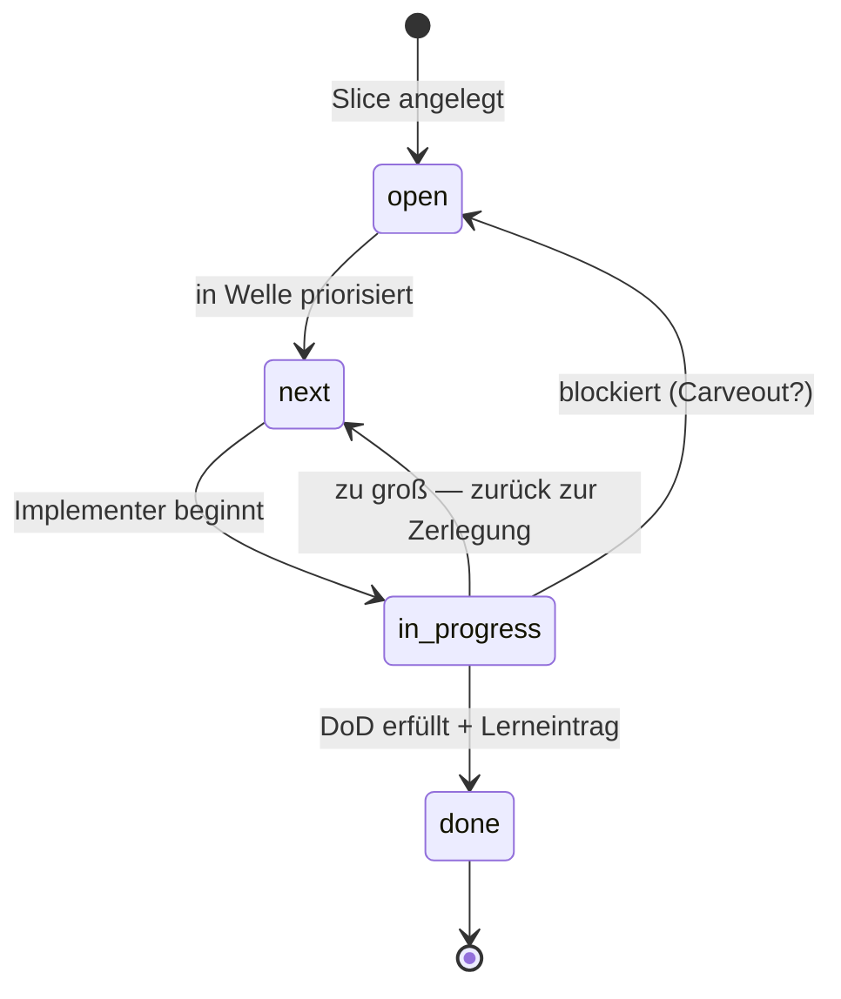

Drei Übergänge sind nichttrivial: `in_progress → next` (Rückführung bei
Größen-Erkenntnis) und `in_progress → open` (Blocker — meist mit
Carveout, siehe [Modul 7](02-planung/modul-07-carveouts.md)). Der einzige Übergang
nach `done` verlangt *Lerneintrag*, nicht nur "Tests grün".

### Trigger je Lifecycle-Übergang und WIP-Limit (Modul 5)

Alle fünf Übergänge mit Triggerbedingung:

- `open→next` — priorisiert/eingeplant.
- `next→in-progress` — Implementer übernimmt, Abhängigkeiten gelöst, WIP-Limit frei.
- `in-progress→done` — Closure-Kriterien erfüllt.
- `in-progress→next` — Slice zu groß, zurück zum Schneiden.
- `in-progress→open` — Blocker, Priorität offen.

Am leichtesten übersehen werden die *Rückführungen* — `in-progress→next`
und `in-progress→open` —, weil sie wie "Scheitern" aussehen, in Wahrheit
aber die Lifecycle-Disziplin tragen: ein Slice, der zu groß war, gehört
sichtbar zurück, nicht still weitergeschoben.

WIP-Limit pro Implementer = 1 ist eine harte Größe, kein Vorschlag — wer
mehrere Slices gleichzeitig in `in-progress/` hat, hat keine Lifecycle,
sondern ein Buffet.

### Closure- und Lerneintrag-Regeln (Modul 5)

- Übergang nach `done/` verlangt zwei beobachtbare Closure-Kriterien
  (z. B. Replay grün, DoD-Punkte als Test verlinkt) *und* einen
  Lerneintrag in einer der drei Formen (geschärfte Regel · neuer Sensor ·
  benannte Spec-Lücke).
- Der Lerneintrag schließt den Steering Loop — ohne ihn bleibt das
  Versagensmuster unsichtbar und wiederholt sich.
- Ein Slice darf bei rotem Gate nur mit dokumentiertem Carveout
  (Modul 7) in `done/` landen, der den roten Gate-Status auf Trigger
  schaltet. Unterscheidung: Carveout (Ausnahme, mit Folge-Slice) vs.
  bootstrap-aware Gate (Stufung, mit Hochschalt-Trigger, Modul 13). Die
  volle Werkzeug-Triade inkl. *BF-Sub-Area-Markierung* (Sub-Area-Kontext,
  kein Closure-Werkzeug) wird in
  [Modul 7 §Worked Example A Schritt 6](#worked-example-a-einen-carveout-dokumentieren)
  disambiguiert.

### Worked Example: einen zu großen Slice schneiden

**Ausgangs-Slice:** `SL-014 — Authentifizierung implementieren`. DoD:
"Login funktioniert, JWT wird ausgegeben, Refresh-Token-Flow läuft,
Token-Revocation per Admin-Endpoint, Audit-Log auf Login-Versuche."

**Diagnose:** zu groß. Anzeichen:
1. Mehr als drei DoD-Punkte (Faustregel).
2. Mehrere Schichten betroffen (Adapter + Service + UI + DB-Schema).
3. Kann nicht in einer Review-Sitzung geprüft werden.

**Schnitt nach Schichten oder nach Lieferwert?** Lieferwert. Schnitte
nach Schichten führen oft zu Zombie-Slices, die "fast fertig" sind.

**Schnitt-Vorschlag (drei Slices):**

| ID | DoD | Liefert |
|---|---|---|
| `SL-014a` | Login-Endpoint akzeptiert User/Passwort, gibt JWT zurück, Audit-Log-Eintrag entsteht. | Funktion |
| `SL-014b` | Refresh-Token-Flow gegen JWT, mit Ablauf-Tests. | Sicherheit |
| `SL-014c` | Admin-Endpoint zur Token-Revocation, mit Architekturtest gegen Direkt-DB-Zugriff. | Operativität |

**Begründung:** Jeder Schnitt-Slice ist einzeln lieferbar (kein Slice
wartet auf den nächsten). Jeder hat ≤3 DoD-Punkte. Jeder berührt
höchstens zwei Schichten.

**Was *nicht* geht:** "Schicht-Slice" wie `SL-014-db`, `SL-014-service`,
`SL-014-ui` — diese sind voneinander abhängig und einzeln nutzlos. Sie
landen mit hoher Wahrscheinlichkeit als Zombie in `in-progress/`.

### Worked Mini-Example: Bootstrap-Modus pro Sub-Area für einen Slice begründen

**Beispiel-Slice:** `SL-014a` aus dem Worked Example oben. Spec-Anker
und ADR werden in [Modul 9 §Worked Example](03-agenten/modul-09-implementierung.md#worked-example-ein-slice-durch-den-8-schritt-workflow)
mit `LH-FA-AUTH-001` und `ADR-0007` (Service-Adapter-Layer)
konkretisiert; wir nutzen dieselben IDs hier konsistent.

**Berührte Sub-Areas:** vier
Sub-Areas — *Konventionen* (API-Pattern), *Test-Infrastruktur*,
*Audit-Logging* und *Spec-Schreibung* (Authentifizierungs-Anforderung).
Die DoD verlangt jede einzelne (Login-Endpoint → API-Pattern;
Login-Tests → Test-Infrastruktur; Audit-Log-Eintrag → Audit-Logging;
`LH-FA-AUTH-001`/`ADR-0007` → Spec-Schreibung).

**Pflichtkriterien** (vier, nicht erweitern):

1. **Konventionen-Dichte** — wieviel der berührten Doku-/Code-Sektion ist
   durch `harness/conventions.md` (oder ein gleichwertiges Artefakt) als
   Strukturregel verankert?
2. **Phase-Reife der berührten Artefakt-Sektionen** — Phase 0–5 aus der
   Phase × Modus-Matrix in [Modul 2](01-spec-und-architektur/modul-02-harness-bootstrap.md#phasen--modus--die-zweidimensionale-reife-matrix).
3. **Evidenz- und Diskrepanz-Risiko** — wie groß ist die Gefahr, dass
   Inventur den Code-Bestand und die Doku-Aussage als divergent
   ausweist? Bei GF meist niedrig (Doc führt — Inventur prüft nur
   Code-Konformität); bei BF/Hybrid das Hauptrisiko und der Grund, warum
   das Kriterium dort die Reconciliation-Schätzung trägt.
4. **Reconciliation-Aufwand inklusive Graduation-/Folge-Slice-Trigger** —
   wieviel Slice-Aufwand bringt BF/Hybrid mit sich, und welcher Trigger
   (eine der vier Klassen aus
   [`konventionen.md` §Vier Trigger-Klassen](grundlagen/konventionen.md#vier-trigger-klassen)
   — Sync, Promotion, Cross-Reference, Acceptance — oder eine
   Folge-Slice-ID) schaltet die Sub-Area Richtung GF?

**Sub-Area 1 — Konventionen (GF):**

- *Konventionen-Dichte:* hoch. `harness/conventions.md` führt `MR-014`
  *REST-Endpunkt-Pattern* mit URL-Struktur, Status-Code-Regeln und einer
  Negativ-Bedingung gegen Direkt-DB-Zugriffe aus dem Adapter.
- *Phase-Reife:* Phase 4. Konvention steht, Code wird daran gemessen,
  Reviews zitieren `MR-014`.
- *Evidenz-/Diskrepanz-Risiko:* niedrig. Das `make lint-conventions`-
  Target prüft die Pattern-Konformität automatisch und ist als Sensor
  in `harness/README.md` §Sensors gelistet (Sensor-Zeile zitiert
  `MR-014`).
- *Reconciliation-Aufwand:* keiner. Kein Folge-Slice.
- **Modus: GF.**

**Sub-Area 2 — Test-Infrastruktur (BF):**

- *Konventionen-Dichte:* niedrig. `tests/auth/` zeigt zwei abweichende
  Pfadnaming-Schemata (`test_*.py` vs. `*_test.py`); keines steht in
  `harness/conventions.md`.
- *Phase-Reife:* Phase 1 BF — Skelett-Sektion *Test-Layout* in
  `harness/conventions.md` ist mit Inventur-Auftrag kopiert (leere
  Pflicht-Felder), der Code-Bestand in `tests/auth/` füllt sie noch
  nicht (Matrix: *"Template kopiert, Inventur-Auftrag an Code"*).
- *Evidenz-/Diskrepanz-Risiko:* mittel. Inventur kann sichtbar machen,
  dass die bestehenden Tests an die Authentifizierungs-Schicht andere
  Annahmen tragen als die noch zu schreibenden — z. B. ob Mocking auf
  Adapter- oder Service-Ebene zulässig ist.
- *Reconciliation-Aufwand:* 1 Slice (`SL-RC-014t` Inventur + `MR-002`
  *Test-Layout pro Sub-Schicht* in `harness/conventions.md` ergänzen).
  Graduation-Trigger: **Sync-Trigger** setzt `MR-002` in
  `harness/README.md` und `AGENTS.md` als Quelle für künftige
  Test-Konventionen.
- **Modus: BF.**

**Sub-Area 3 — Audit-Logging (Hybrid):**

- *Konventionen-Dichte:* mittel. `harness/conventions.md` führt im
  Adaptions-Block `MR-008` *Audit-Log-Pflicht für Auth-Endpunkte* als
  abstrakte Pflicht-Adaption ("jeder Login-Versuch muss ein
  Audit-Event erzeugen"), aber kein konkretes Event-Schema. Code in
  `services/audit/` zeigt zwei unterschiedliche Event-Formate aus
  früheren Slices.
- *Phase-Reife:* Phase 3 (GF-Lesart aus der Matrix: *"Sektionen
  versprochen, Code folgt"* — die Doku verspricht eine Audit-Pflicht,
  der Code folgt erst teilweise). Die Hybrid-Diagnose entsteht **nicht
  aus der Phase**, sondern beim Modus: die Doku führt für die
  Pflicht-Aussage (GF-Richtung), aber für den Format-Standard zeigt
  der Code-Bestand Divergenz ohne Doku-Korrespondenz (BF-Symptom).
  Phase und Modus sind orthogonal — eine Sub-Area sitzt in genau
  einer Phase-Zelle, der Modus ergibt sich aus der Trigger-Richtung
  pro Kriterium.
- **Modus: Hybrid (GF in der Pflicht-Adaption `MR-008`, BF im
  fehlenden Format-Standard).**

**Sub-Area 4 — Spec-Schreibung (GF):**
`spec/lastenheft.md` §`LH-FA-AUTH-001` trägt drei Akzeptanzkriterien;
`ADR-0007` *Service-Adapter-Layer* bindet die Architektur; in Modul 9
§Worked Example werden Tests gegen `LH-FA-AUTH-001` annotiert. Damit
sind Konventionen-Dichte hoch, Phase 4, Risiko niedrig, kein
Reconciliation — **Modus: GF.**

**Template für den Begründungsblock** — kanonisch in
[§8 Sub-Area-Modus-Begründung](../../lab/templates/docs/plan/planning/slice.template.md)
des Slice-Plan-Templates; hier zum Lesen abgedruckt, **byte-identisch
mit dem dortigen Format**, damit Kopieren von hier oder vom Template
denselben Block ergibt:

```markdown
### Sub-Area: <Name>

- **Modus:** GF | BF | Hybrid
- **Konventionen-Dichte:** <Beleg aus `harness/conventions.md`,
  Adaptions-Block oder Code>
- **Phase-Reife:** Phase 0–5 <Begründung gegen die Phase × Modus-Matrix>
- **Evidenz-/Diskrepanz-Risiko:** <bei BF/Hybrid: was kann die
  Inventur sichtbar machen? bei GF: meist niedrig>
- **Reconciliation-Aufwand:** <Slice-Schätzung;
  Graduation-/Folge-Slice-Trigger>
```

Pro berührter Sub-Area einen Block in §8 des Slice-Plans. So läuft die
Modus-Entscheidung im Planning-Harness-Slice mit und wird in der
Closure-Notiz prüfbar.

### Regeln gegen typische Fehlannahmen (Modul 5)

- **Gegen "Slice = Ticket = Feature":** Drei verschiedene Granularitäten. Feature ist Spec-Ebene, Slice ist Implementations-Einheit, Ticket ist Projektmanagement. Slice ist die kleinste *agentisch abschließbare* Einheit.
- **Gegen "Erst plan ich alle Slices, dann fange ich an":** Wer alle Slices vor der ersten Implementation plant, plant tote Slices. Plan und Implementation alternieren — Welle für Welle.
- **Gegen "Wenn ein Slice in `done/` ist, ist er fertig":** Ohne Lerneintrag ist er nur *abgelegt*. Closure ist eine bewusste Reflexionsleistung: was hat funktioniert, was war Friktion, was geht in den Steering Loop?
- **Gegen "Ein Slice hat einen Bootstrap-Modus":** Der Modus ist Eigenschaft *pro Sub-Area* ([Modul 2 §Kernidee](01-spec-und-architektur/modul-02-harness-bootstrap.md#kernidee)). Ein Slice berührt mehrere Sub-Areas und kann GF, BF und Hybrid gleichzeitig involvieren.
- **Gegen "Wenn der Slice klein ist, ist die berührte Sub-Area GF":** Transitive Vereinfachung. Slice-Größe und Sub-Area-Modus sind orthogonale Achsen: Slice-Größe misst, ob der Schnitt in einer Review-Sitzung prüfbar ist; Sub-Area-Modus misst den Reifegrad der berührten Doku-/Code-Sektion. Ein kleiner Slice kann eine BF-Sub-Area berühren (Beispiel: Login-Endpoint ist klein, aber das Test-Layout für die Auth-Schicht ist nicht in `harness/conventions.md` verankert).

## Modul 6 — Roadmap Engineering

*Quelle: [02-planung/modul-06-roadmap.md](02-planung/modul-06-roadmap.md)*

### Kernidee (Modul 6)

Eine Roadmap ist eine Reihenfolge von Wellen, keine Reihenfolge von
Terminen. Termine sind eine Folge der Wellen, nicht ihr Treiber.

### Roadmap-Regeln (Modul 6)

- Ein Welle-Eintrag braucht minimal drei Bestandteile: Slice-IDs (Inhalt) · Trigger als beobachtbare Bedingung (kein Datum) · Closure-Kriterien (z. B. Replay grün, alle Slices in `done/`). Datum darf *erwähnt* werden (Prognose), darf aber nie Trigger sein — sonst kappt die Welle halbfertige Slices am Kalendertag und das Auditierbarkeits-Versprechen bricht.
- Ein Trigger ist beobachtbar dann, wenn ein *anderer* Mensch ohne Rückfrage sagen kann, ob er eingetreten ist. "Sobald wir Zeit haben" scheitert daran; "SL-024 in `done/`" besteht. Beispiele für beobachtbare Trigger: "SL-024 liegt in `done/`" · "Replay-Lauf gegen Golden Set grün" · "Carveout `CO-007` aufgelöst".
- Welle 30 % über Schätzung — Diagnose vor Aktion: liegt es an Slice-Größe (→ neu schneiden), an Reihenfolge (→ neu planen), oder an unerwarteter Komplexität (→ Carveout)? 30 % früh können ein Steering-Loop-Signal sein (Slice-Sizing-Regel schärfen), 30 % spät (vor Welle-Closure) eher Carveout.

### Welle ≠ Meilenstein ≠ Release (Modul 6)

- **Welle** = Bündel paralleler/serialisierter Slices mit Closure-Kriterien. Eine Welle endet *durch* Closure-Kriterien.
- **Meilenstein** = extern beobachtbarer Zustand (Release, Audit-Punkt). Ein Meilenstein endet durch *Datum oder externe Bestätigung* — und genau deshalb leitet sich der Meilenstein aus Wellen ab, nicht umgekehrt.
- **Release** — Trigger: ein Artefakt verlässt das Repo in eine Umgebung (Tag + Staging). Ein Release kann mehrere Wellen umfassen, der Meilenstein liegt *neben* der Welle (externe Bestätigung), die Welle endet *durch* Closure.

### Worked Example: einen Datumswunsch in eine Trigger-Welle übersetzen

**Schritt 1 — Wunsch in Inhalt zerlegen.** Frage zurück: *Was muss
*beim Audit* gezeigt werden?* Die Antwort ist immer eine Liste von
beobachtbaren Zuständen — und genau diese werden zu Closure-Triggern.
Stakeholder antwortet konkret: "ANN-Suche funktioniert auf 100k
Einträgen unter 1 s p95; Multi-Sprach-Adapter ist konsolidiert; OTel-
Pipeline zeigt End-to-End-Traces."

Drei Zustände, drei Trigger-Anker — und keiner davon enthält ein
Datum.

**Schritt 2 — Inhalt in Slices binden.** Jeder Closure-Trigger muss auf
einen oder mehrere Slices mit eigenem DoD verweisen. Sonst ist der
Trigger ein Wunsch, kein Beleg.

| Trigger-Anker (Stakeholder) | Slice(s) (Implementer-Ebene) |
|---|---|
| ANN-Suche < 1 s p95 bei 100k | `slice-014` (ANN-Bibliothek-Integration) + `slice-019` (Latenz-Replay gegen 100k-Korpus) |
| Multi-Sprach-Adapter konsolidiert | `slice-015` (Adapter-Cleanup) |
| OTel-Pipeline E2E | `slice-017` (OTel-Collector) + `slice-018` (Trace-Schema-Pflicht) |

Mehrfachbezüge sind erlaubt — *fehlende* Bezüge nicht. Wer einen
Trigger ohne Slice formuliert, hat einen Wunsch ohne Plan.

**Schritt 3 — Abhängigkeiten gegen vorhandene Wellen messen.** Eine
Welle, die ohne fertige Vorgängerin nicht starten kann, ist eine
Phantom-Welle. Lab-Beispiel: Welle 3 (`welle-3-skalierung`) hängt an
Welle 2 (`welle-2-qualitaet`) — Property-Tests müssen *vor* der
Skalierungs-Welle stehen, weil sonst die Skalierungs-Gates auf einer
nicht-property-getesteten Basis laufen.

Im Abhängigkeitsgraphen wird das eine gerichtete Kante; in der
Roadmap-Tabelle ein expliziter Eintrag in der `Trigger`-Spalte.

**Schritt 4 — Welle-Eintrag mit den drei Pflicht-Bestandteilen
schreiben.** Closure-Kriterien · Slice-IDs · Abhängigkeits-Trigger.
Vorbild aus dem Lab
([`roadmap.md`](../../lab/example/docs/plan/planning/in-progress/roadmap.md)):

```markdown
## Aktuelle Welle

**Welle-ID:** welle-3-skalierung
**Geplantes Ende:** 2026-07-24 (Schätzung)

**Closure-Trigger:**
- slice-014 (ANN-Bibliothek) done in allen Sprachen.
- slice-015 (Multi-Sprach-Adapter-Cleanup) done.
- slice-019 (Latenz-Replay) grün: p95 < 1 s bei 100k Korpus.
- ADR-0004 (ANN-Bibliothek-Wahl) `Accepted`.

**Vorgänger-Trigger:** welle-2-qualitaet done.
```

Datum *erscheint* als "Geplantes Ende (Schätzung)" — es triggert
nichts, es prognostiziert. Wenn die Schätzung kippt, kippt sie als
Schätzung, nicht als Closure-Kriterium.

**Schritt 5 — Meilenstein neben die Welle setzen, nicht in sie.** Der
Audit-Termin ist *Meilenstein M3*, nicht *Welle 3*. Welle und
Meilenstein verhalten sich orthogonal:

| Welle | Meilenstein |
|---|---|
| endet durch Closure-Kriterien (intern) | endet durch externe Bestätigung (Audit, Release, Kunde) |
| Inhalt vollständig im Repo | Inhalt zeigt sich an einer Außengrenze |
| `welle-3-skalierung` | M3 — Skalierbar |

Tabelle aus dem Lab:

```markdown
| Meilenstein | Welle(n) | Trigger | Status |
|---|---|---|---|
| M3 — Skalierbar | welle-3-skalierung | p95 < 1 s auch bei 100k Einträgen | offen |
```

Der Audit-Termin (`2026-07-31`) ist Anhang im Meilenstein-Eintrag, nicht
Trigger der Welle. Das hat eine harte Konsequenz: wenn das Audit-Datum
gehalten werden *muss*, aber die Closure-Trigger nicht erreichbar sind,
ist die richtige Antwort ein *Carveout* (Modul 7), nicht ein halb
fertiges `done/`.

**Schritt 6 — Drift-Tabelle als Pflicht-Anhang.** Eine Roadmap, die
sich nie korrigiert, hat den Steering Loop nicht durchlaufen.
Pflicht-Block am Ende:

```markdown
## Historische Trigger-Verschiebungen

| Datum | Was wurde geändert? | Warum? |
|---|---|---|
| 2026-06-12 | slice-019 in welle-3 nachgenommen | Stakeholder ergänzte Audit-Anforderung; Trigger wäre sonst nicht beweisbar gewesen |
```

Diese Tabelle ist nicht Hilfsmittel; sie ist das Audit-Signal. Wer sie
leer hat, hat eine starre Roadmap. Wer sie *jeden* Eintrag voll hat,
hat eine treibende Roadmap.

**Schritt 7 — Datum als Trigger geschrieben: die drei möglichen
Ausgänge.** Ein Closure-Trigger als Datum formuliert (*"welle-3-
skalierung schließt am 2026-07-24"*) — am 24. Juli ist
slice-019 noch nicht grün. Drei mögliche Antworten:

| Antwort | Diagnose |
|---|---|
| Welle wird trotzdem geschlossen, slice-019 wandert in welle-4. | Datum hat Closure überschrieben — der Audit fällt durch, weil slice-019 nicht belegt ist. Trigger-Disziplin ist Theorie geblieben. |
| Welle bleibt offen, das Datum wird verschoben. | Trigger-Disziplin wirkt, aber die Roadmap-Drift-Tabelle muss den Eintrag bekommen — sonst ist die Verschiebung still. |
| Carveout `CO-009` für die fehlende Latenz, Welle schließt mit Carveout. | Sauber: das Versprechen wird offen reduziert, Folge-Slice ist verdrahtet, Audit weiß, was er ansieht. |

*Eine Roadmap ist nicht "wann?", sondern "in welcher Reihenfolge
wovon?"*. Vergleich:
[`roadmap.md`](../../lab/example/docs/plan/planning/in-progress/roadmap.md).

### Regeln gegen typische Fehlannahmen (Modul 6)

- **Gegen "Roadmap ist eine Datumsleiste":** Datum ist Output, nicht Input. Wer Datumsleisten plant, plant Wunschdenken.
- **Gegen "Burndown ist Fortschritt":** Burndown ist *Tempo*. Fortschritt ist, ob die Welle das verspricht, was sie sollte.
- **Gegen "Eine Roadmap ist statisch":** Eine Roadmap, die nach drei Wellen nicht angepasst wurde, hat den Steering Loop nicht durchlaufen.
- **Gegen "Welle = Sprint":** Ein Sprint endet durch *Datum* (zwei Wochen sind um). Eine Welle endet durch *Closure-Kriterien* (alle ihre Slices in `done/`, Replay-Lauf grün, Closure-Einträge geschrieben). Wer Wellen wie Sprints schneidet, kappt halbfertige Slices am Datum — und produziert genau die Auditierbarkeits-Lücke, die der Harness verhindern soll.
- **Gegen "Trigger = Datum":** Ein Trigger ist eine *beobachtbare Bedingung* ("SL-024 liegt in `done/`", "Replay-Lauf gegen Golden Set grün", "Carveout `CO-007` aufgelöst"). Ein Datum ist kein Trigger, sondern eine Prognose. Wenn das einzige Trigger-Kriterium ein Kalendertag ist, plant die Roadmap nicht — sie hofft.

## Modul 7 — Carveout Management

*Quelle: [02-planung/modul-07-carveouts.md](02-planung/modul-07-carveouts.md)*

### Harness-Einordnung (Modul 7)

Carveout-Pflege ist ein Pfeiler von *Entropy Management* (siehe
[`klassifikation.md`](grundlagen/klassifikation.md)):
ein Carveout-Audit pro Welle verhindert, dass temporäre Ausnahmen zu
permanenten Lügen werden.

### Kernidee (Modul 7)

Jeder temporäre Carveout benötigt einen Plan. Ein Carveout ohne
Auflösungs-Trigger ist ein permanenter Carveout, der lügt.

### Worked Example A: einen Carveout dokumentieren

**Ausgangssituation:** Das Coverage-Gate `coverage-gate-critical` ist
rot. Der Index-Layer (`internal/index/`) hat 76 % statt der geforderten
90 %. Grund: Binär-Format-Parser mit Fehlerpfaden (`E099` bei korrupter
Datei), die nur partiell durch Unit-Tests abgedeckt sind. Eine
Property-Test-Suite wird die verbleibenden Pfade abdecken — ist aber
erst in Welle 2 eingeplant.

Die Versuchung: das Gate in der CI-Konfiguration herunterdrehen. Das
ist eine *stille* Senkung — sie taucht weder in `harness/README.md`
noch in der Spec auf. Der bessere Weg: ein Carveout.

**Schritt 1 — Carveout-Datei anlegen.** Konvention:
`docs/plan/carveouts/CO-<NNN>-<kurztitel>.md`. ID läuft in `CO-*`-Reihe
(separat von `LH-`, `ADR-`, `SL-` — siehe
[`konventionen.md`](grundlagen/konventionen.md#id-schema-als-klammer)).
Für unseren Fall: `CO-001-index-coverage.md`.

**Schritt 2 — Pflichtfelder im Frontmatter / Header festlegen.** Ein
temporärer Carveout, der nicht heimlich permanent werden soll, braucht
sechs Felder:

```markdown
# CO-001: Bootstrap-Coverage `internal/index/`

**Status:** Aktiv.
**Datum angelegt:** 2026-05-20. **Letzte Prüfung:** 2026-06-01.
**Betroffenes Gate:** `coverage-gate-critical`.
**Geltungsbereich:** `internal/index/` (Index-Layer, alle Sprachen).
**Folge-Slice:** [`slice-013-property-tests.md`](../planning/in-progress/slice-013-property-tests.md)
```

Wenn `Folge-Slice` fehlt oder leer ist, ist der Carveout *de facto*
permanent — und gehört dann offen so markiert (siehe Schritt 6).

**Schritt 3 — Auflösungs-Trigger als beobachtbare Bedingung
formulieren.** Anti-Form: *"sobald wir Zeit haben"*, *"nach dem nächsten
Refactoring"*, *"wenn das Team Kapazität hat"*. Gute Form: eine
Bedingung, die ein anderer Mensch ohne Rückfrage als eingetreten oder
nicht eingetreten beurteilen kann.

```markdown
## Auflösungs-Trigger

Welle 2 (welle-2-qualitaet) done — Property-Test-Suite läuft 100
Generationen und deckt die Fehlerpfade.

Konkret: `internal/index/`-Coverage erreicht ≥ 90 %, geprüft in
`make coverage-gate-critical` ohne Ausnahmen.
```

Zwei Sätze: einer für den Welle-Bezug (Roadmap-Anker), einer für die
*messbare* Schwelle. Die messbare Schwelle ist der wichtigere — sie
ist es, was die CI prüft.

**Schritt 4 — Geltungs-Konfiguration mit ID-Kommentar verdrahten.** Die
Gate-Konfiguration *zeigt* auf den Carveout, damit der Carveout im
`make gates`-Output nicht versteckt ist:

```diff
  # <sprache>/coverage.config
  critical_paths:
-   exceptions: []
+   exceptions:
+     - "internal/index/"  # CO-001 — bis Welle 2 done
```

Der `# CO-001`-Kommentar ist nicht Kosmetik: er ist die Brücke zwischen
Gate-Konfiguration und Carveout-Datei. Ohne ihn weiß niemand, *warum*
diese Pfad-Ausnahme existiert.

**Schritt 5 — Verifikations-Checkliste für den Auflösungs-Zeitpunkt
hinterlegen.** Damit nach Trigger-Eintritt klar ist, was zu tun ist:

```markdown
## Verifikation (nach Auflösung)

- [ ] `internal/index/`-Coverage in allen Sprach-Skeletten ≥ 90 %.
- [ ] Carveout-Konfiguration aus Coverage-Config entfernt.
- [ ] `make coverage-gate-critical` grün ohne Ausnahmen.
- [ ] Diese Datei nach `done/CO-001-index-coverage.md` bewegt (reiner `git mv`).
- [ ] slice-013 Closure-Notiz schließt diese Auflösung mit ein.
```

Vier Häkchen, eines davon ein `git mv`. Auflösung ohne Verschiebung in
`done/` ist eine zweite Lüge — der Carveout wirkt "aufgelöst", liegt
aber weiter im aktiven Verzeichnis.

**Schritt 6 — Carveout, BF-Sub-Area-Markierung oder ADR?** Bevor du
Schritt 1–5 als endgültige Form annimmst, prüfe, ob das Werkzeug
*Carveout* überhaupt passt. Drei legitime Alternativen, getrennt durch
**zwei sequenzielle Wenn-Dann-Fragen** statt einen flachen
Drei-Wege-Vergleich — Granularität *vor* Temporalität (so vermeidest
du den Reflex, jede entdeckte Diskrepanz als Carveout zu führen):

1. **Granularität — einzelne Diskrepanz oder Cluster?** Trifft *eine*
   konkrete Gate-/Regelausnahme isoliert auf, oder zeigt sich ein
   Diskrepanz-Cluster im selben Geltungsbereich (mehrere Carveouts auf
   denselben Pfad/dieselbe Sub-Area) bzw. ein systemisches *"Code
   existiert vor Doku"*-Muster?

   - *Cluster oder Muster* → **BF-Sub-Area-Markierung mit
     Graduation-Plan** als Modus-Deklaration im Adaptions-Block von
     `harness/conventions.md` (Mechanik in
     [`konventionen.md` §Modus pro Sub-Area](grundlagen/konventionen.md#modus-pro-sub-area-greenfield-vs-brownfield)).
     Frage 2 entfällt — eine Sub-Area-weite Markierung ist eine
     andere Werkzeug-Klasse als ein punktueller Carveout.
   - *Einzelne Diskrepanz* → weiter zu Frage 2.

   *Kein harter Schwellwert für "Cluster"* — Faustregel, nicht Zahl:
   wer die Diskussion am Zähler aufhängt ("ab 3 Carveouts BF?"), hat
   das Symptom-Muster (gemeinsamer Geltungsbereich) mit einer Quote
   verwechselt.

2. **Temporalität — Trigger ernst zu erreichen?** Bei einer einzelnen
   Diskrepanz: wäre der Auflösungs-Trigger aus Schritt 3 mit
   absehbarem Aufwand zu erreichen, und stünde das in realistischem
   Verhältnis zum Nutzen?

   - *Ja* → **Carveout** (Schritt 1–5 wie eben durchgegangen — der
     Carveout dokumentiert die temporäre Ausnahme bis zum Trigger).
   - *Nein, ehrliche Antwort "nichts davon werden wir in absehbarer
     Zeit tun"* → **Permanent**, übergeführt in eine ADR. Permanente
     Carveouts gehören nicht in `carveouts/`, sondern als
     Architekturentscheidung mit Begründung in eine ADR.

Die folgende Tabelle bildet die drei Wahl-Pfade für eine *konkrete
Diskrepanz* ab. Bootstrap-aware Gate (Modul 13) erscheint hier
absichtlich nicht — es regelt *Gate-Reifestufung*, nicht
*Diskrepanz-Auflösung*. BF-Markierung wirkt eine Ebene höher als
Carveout und ADR: sie kippt den Sub-Area-Kontext, in dem die
Diskrepanz erst entsteht.

| Wahl                       | Symptom-Indikator                                                                                                  | Träger                            | Folge-Artefakt                                                                            |
|----------------------------|--------------------------------------------------------------------------------------------------------------------|-----------------------------------|-------------------------------------------------------------------------------------------|
| **Carveout**               | Eine konkrete Gate-/Regelausnahme, klar abgrenzbar, mit Folge-Slice und ernst erreichbarem Auflösungs-Trigger.     | einzelne Diskrepanz               | `docs/plan/carveouts/CO-<NNN>-*.md` (Schritt 1–5)                                          |
| **BF-Sub-Area-Markierung** | Diskrepanz-Cluster im selben Geltungsbereich, oder generelles *"Code-vor-Doku"*-Muster.                            | ganze Sub-Area                    | Modus-Deklaration im Adaptions-Block von `harness/conventions.md`, mit Graduation-Trigger |
| **ADR (permanent)**        | Trigger ist ehrlich nie zu erreichen — die Senkung ist Architekturentscheidung, nicht Übergang.                    | dauerhafte Architekturregel       | `docs/architecture/ADR-<NNNN>-*.md`; `Status: Permanent — übergeführt in ADR-<NNNN>`      |

Drei verwandte Begriffe waren hier nebeneinander im Spiel und meinen
Verschiedenes: *Disambiguierung* ist die kognitive Operation, die du in
Frage 1–2 gerade ausgeführt hast (Symptom auf Werkzeug abbilden);
*Werkzeug-Wahl* ist deren Ergebnis (Carveout, BF-Markierung oder ADR —
die linke Tabellenspalte); *Werkzeug-Klasse* ist die Achse, auf der sich
die drei unterscheiden (punktuell vs. Sub-Area-weit vs. dauerhaft — die
Träger-Spalte).

> **Hinweis zum Lab-Beispiel:** Das Lab unter
> [`lab/example/docs/plan/carveouts/`](../../lab/example/docs/plan/carveouts/)
> trägt heute nur den einzelnen `CO-001-index-coverage.md` — Frage 1
> führt dort folglich auf den Einzeldiskrepanz-Pfad und weiter zu
> Frage 2 (Trigger erreichbar — ja: Welle-2-Property-Tests). Ein
> echter Cluster entstünde, wenn zusätzlich `CO-002`/`CO-003` für
> Boundary-Tests und Type-Coverage auf demselben `internal/index/`-
> Pfad lägen; dann sprängen Frage 1 und Werkzeug-Wahl auf
> BF-Sub-Area-Markierung um. Die Markierungs-Mechanik selbst ist im
> Lab strukturell bereits vorhanden: [`lab/example/harness/conventions.md`](../../lab/example/harness/conventions.md)
> trägt einen `## Adaptions-Block` mit `MR-000` Baseline-Aussage und
> `MR-001` Source Precedence — die BF-Sub-Area-Markierung wäre ein
> neuer `MR-NNN`-Eintrag im selben Block. Konkret-Format:
>
> ```markdown
> ### MR-002 — `internal/index/`-Sub-Area im Brownfield-Modus
>
> **Modus:** Brownfield bis Welle-3-Graduation.
> **Geltungsbereich:** `internal/index/` (Index-Layer, alle Sprach-Skelette).
> **Graduation-Trigger:** Property-Test-Suite läuft + Coverage ≥ 90 %
> über alle Pfade.
> **Sync-Trigger:** nach Graduation einen Pointer-Eintrag in
> `harness/README.md` §Sensors, der die Sub-Area als GF-bewertet
> ausweist.
> **Folge-Slice (für Reconciliation):** `slice-014-bf-index-reconciliation.md` (legt die Inventur und die ersten Reconciliation-Häppchen fest).
> ```
>
> Das ersetzt eine Carveout-Kaskade (`CO-001`/`CO-002`/`CO-003` auf
> denselben Pfad) durch eine einzelne Sub-Area-weite Aussage mit
> klarem Graduations-Pfad.

**Was passiert mit dem Schritt-1–5-Entwurf, wenn der
Trichter nicht auf Carveout führt?** Der Inhalt ist nicht verloren, nur verschoben.
Trigger-Formulierung (Schritt 3), Geltungsbereichs-Präzision
(Schritt 2 Geltungsbereich-Feld), Verifikations-Checkliste (Schritt 5)
wandern in das gewählte andere Werkzeug:

- *BF-Sub-Area-Markierung*: der Geltungsbereich wird zum
  Sub-Area-Geltungsbereich, der Trigger wird zum Graduation-Trigger,
  die Verifikations-Checkliste zur Liste der
  Reconciliation-Akzeptanzkriterien.
- *ADR-Überführung*: der Geltungsbereich wird zum architektonischen
  Wirkungsbereich, der Trigger fällt weg (permanent), die
  Verifikations-Checkliste reduziert sich auf die Architektur-Folgen.

Der angelegte Schritt-1-Stub `CO-<NNN>-*.md` wird nicht aktiviert,
sondern entweder gelöscht (Inhalt vollständig in BF-Markierung/ADR
aufgegangen) oder mit einem `Status: Überführt in <Ziel>`-Header
nach `done/` verschoben, damit die Werkzeug-Wahl-Spur im Repo lesbar
bleibt.

Wenn die Wahl im Trichter auf "permanent" fällt, ist der
`Status:`-Wechsel:

```markdown
**Status:** Permanent — übergeführt in ADR-0009.
```

Das ist nicht Aufgabe; das ist Ehrlichkeit. Vergleich:
[`CO-001-index-coverage.md`](../../lab/example/docs/plan/carveouts/CO-001-index-coverage.md).

### Drei Werkzeuge für gelockerte Gate-Disziplin (Modul 7)

**Carveout** = punktuelle Ausnahme für *einen* Fall, mit Folge-Slice
und Auflösungs-Trigger. **BF-Sub-Area-Markierung** = Sub-Area-weiter
Übergangs-Modus mit Graduation-Plan im Adaptions-Block von
`harness/conventions.md` — *Sub-Area-Kontext, kein Closure-Werkzeug*
(siehe [Modul 13 §Bootstrap-aware Gates](04-qualitaet/modul-13-quality-gates.md#bootstrap-aware-gates)).
**Bootstrap-aware Gate** = Stufung *des Gates selbst* (z. B. 40 % heute
→ 70 % bei M2).

Disambiguierungs-Reflex: bei Diskrepanz-Häufung im selben
Geltungsbereich ist die Wahl BF-Markierung, nicht Carveout-Kaskade —
wer ein Dutzend Carveouts für dieselbe Sub-Area anlegt, hat den
Mechanismus auf das falsche Werkzeug skaliert. Bootstrap-aware Gate
skaliert mit dem Repo; Carveout ist punktueller Vertrag. Verwechslung
jeder Achse führt zu "Bootstrap-Schlupfloch" — Stufung ohne Trigger ist
Carveout-Wildwuchs, Carveout-Kaskade ohne BF-Markierung ist
verschleierte Sub-Area-BF.

### Worked Example B: ein Carveout-Audit als wiederkehrenden Slice entwerfen

**Ausgangssituation:** Das Repo hat sechs Carveouts. Drei sind seit
über sechs Monaten "aktiv". Niemand hat sie kürzlich geprüft. Faktisch
sind sie permanent — aber im Repo lügen sie weiter unter `aktiv`. Dies
ist die genaue Doku-Drift, die der Carveout-Mechanismus eigentlich
verhindern sollte.

**Schritt 1 — Audit-Slice als ID-Reihe einplanen.** Konvention: ein
Slice `SL-CO-AUDIT-<welle>` pro Welle-Closure, *bevor* die Welle nach
`done/` wandert. ID-Schema-Ergänzung in
[`konventionen.md`](grundlagen/konventionen.md): Audit-Slices haben
ein Präfix, das sie vom regulären Implementierungs-Slice unterscheidet
— sie liefern *keinen Code*, nur Doku-Updates.

```markdown
# SL-CO-AUDIT-welle-2: Carveout-Audit vor Welle-2-Closure

**DoD:**
- Jeder aktive Carveout in `docs/plan/carveouts/` hat ein aktuelles
  `Letzte Prüfung:`-Datum (≤ heute).
- Jeder Carveout, dessen Trigger eingetreten ist, ist nach `done/`
  verschoben.
- Jeder Carveout, der seit > 2 Wellen "aktiv" ist, wurde *explizit*
  entweder als weiter-gültig bestätigt oder in eine ADR überführt.
- Audit-Bericht als Closure-Notiz in `done/welle-2-results.md`.
```

Vier DoD-Punkte: drei Status-Aktionen plus ein Belegartefakt. Mehr
braucht es nicht — Audit ist *Disziplin*, nicht *Forschung*.

**Schritt 2 — Audit-Bericht-Schablone festlegen.** Damit der Audit
nicht jedes Mal neu erfunden wird, eine Tabelle als
Closure-Notiz-Block:

```markdown
## Carveout-Audit — Welle 2 (2026-06-12)

| Carveout | Status vorher | Status nachher | Aktion |
|---|---|---|---|
| CO-001 (Index-Coverage) | aktiv, Trigger Welle 2 | aufgelöst | git mv nach `done/`; coverage.config-Ausnahme entfernt |
| CO-004 (Compose-Devmode) | aktiv, Trigger "Compose v2.20" | permanent | überführt in ADR-0014 (Devmode als bewusste Architektur) |
| CO-005 (Lock-File-Pin) | aktiv, Letzte Prüfung 2025-12 | aktiv, geprüft | Datum 2026-06-12 nachgetragen, Folge-Slice slice-018 angelegt |
```

Drei Status-Übergänge sind möglich: *aufgelöst* (Trigger eingetreten),
*permanent* (Trigger wird nie eintreten — in ADR überführen),
*weiterhin aktiv* (Trigger weiterhin sinnvoll — Datum nachtragen).

**Schritt 3 — Wer führt den Audit aus?** Rollen-Bezug (Modul 8):
*Planner* identifiziert die fälligen Carveouts vor Welle-Closure,
*Architect* entscheidet bei "permanent" über die ADR-Überführung,
*Implementer* führt die `git mv`-Operationen und Config-Updates aus.
Der Audit-Slice landet damit über drei Rollen verteilt — was *nicht*
ein Defekt ist, sondern Absicht: Carveout-Aufräumen ohne Architect-Blick
verlängert das Lügen.

**Schritt 4 — Audit-Lauf-Gate optional einbauen.** Maschinell prüfbar
ist mindestens die "Letzte Prüfung"-Frische:

```makefile
verify-carveout-freshness:  ## Modul 7 — Audit-Pflicht pro Welle
	@python tools/check_carveout_freshness.py --max-age-days 90

verify: verify-carveout-freshness
```

Ein Carveout, dessen letzte Prüfung > 90 Tage zurückliegt, ist ein
HIGH-Warnsignal — egal, ob der Trigger nominell noch gilt. *Beobachtung
schlägt Behauptung*: ein nicht geprüfter Carveout ist ein nicht
existierender Audit.

**Schritt 5 — Audit-Slice als Schablone festschreiben.** Damit der
Slice in jeder Welle wiederverwendet wird, kommt eine Vorlage unter
`docs/plan/planning/templates/carveout-audit.md`. Der Planner kopiert
sie für jede neue Welle und passt nur das Datum, die betroffenen
Carveouts und den Welle-Bezug an. Ohne Vorlage wird der Audit-Slice
beim dritten Mal vergessen — und die Drift kehrt zurück.

Der Carveout-Mechanismus
hält nur, wenn er von einem *zweiten* Mechanismus auditiert wird;
sonst ist er eine schöne Konvention, die niemand prüft.

### Regeln gegen typische Fehlannahmen (Modul 7)

- **Gegen "Carveout = Workaround":** Carveout = *dokumentierter* Workaround mit Trigger. Ohne Trigger ist es eine versteckte Annahme.
- **Gegen "Carveouts gehören ins Issue-Tracker":** Sie gehören ins Repo, neben Spec und ADRs. Tracker können vergessen werden, Repo-Files kommen mit beim Klonen.
- **Gegen "Wenn der Trigger eintritt, lösen wir den Carveout auf":** Realität: er bleibt liegen. Deshalb braucht jeder temporäre Carveout einen *Folge-Slice mit ID*, der das Auflösen plant. Slice schlägt Memo.
- **Gegen "Jede entdeckte Diskrepanz ist ein eigener Carveout":** Carveouts sind für **punktuelle** Ausnahmen mit Folge-Slice. Eine Diskrepanz-**Häufung** in einer Sub-Area (Symptom: mehrere Carveouts mit demselben Geltungsbereich, oder die Diskrepanz folgt aus generellem *"Code existiert vor Doku"*-Muster) gehört nicht in eine Carveout-Kaskade, sondern in eine **BF-Sub-Area-Markierung mit Graduation-Plan** (siehe [Modul 2 §Kernidee](01-spec-und-architektur/modul-02-harness-bootstrap.md#kernidee)). Maßgeblich ist das **Symptom-Muster** (gemeinsamer Geltungsbereich), nicht die Carveout-Zahl; die Wahl, welches Werkzeug bei welchem Symptom greift, leistet [§Worked Example A Schritt 6](#worked-example-a-einen-carveout-dokumentieren).
- **Gegen "Wenn Diskrepanz-Häufung BF-Markierung verlangt, ist auch jede einzelne Diskrepanz eine BF-Markierung wert":** BF-Markierung lohnt sich erst beim **Cluster im selben Geltungsbereich** oder beim systemischen *"Code existiert vor Doku"*-Muster — eine einzelne, gut abgrenzbare Diskrepanz mit klarem Folge-Slice ist und bleibt ein Carveout. Das Frage-Schema in [§Worked Example A Schritt 6](#worked-example-a-einen-carveout-dokumentieren) trennt diese Fälle: Frage 1 leitet einzelne Diskrepanzen explizit auf den Carveout-/ADR-Pfad, nicht auf BF-Markierung.

## Modul 8 — Agentenrollen

*Quelle: [03-agenten/modul-08-agentenrollen.md](03-agenten/modul-08-agentenrollen.md)*

### Kernidee (Modul 8)

Rollentrennung verhindert, dass derselbe Kontext zweimal denselben Fehler
macht. Wer geplant hat, prüft nicht; wer geschrieben hat, reviewt nicht.

### Rollen-Sequenz für einen Slice

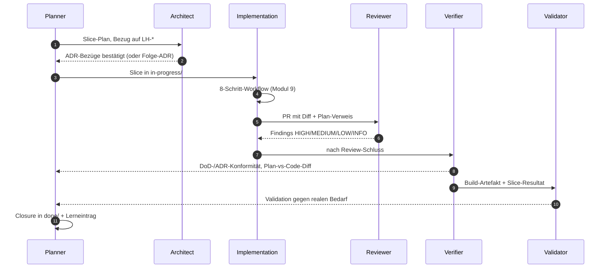

Wesentlich: keine Rolle springt rückwärts in eine vorhergehende, ohne
*Übergabe-Artefakt* (Findings, Folge-ADR-Vorschlag, Carveout). Der
Eingabe-Kontext jeder Rolle ist eingeschränkt — das verhindert, dass
dieselbe Sicht denselben Fehler übersieht.

### Die neun Übergaben und ihre Artefakte (Modul 8)

Sechs Rollen in der Reihenfolge, in der ein Slice sie typischerweise
durchläuft: Planner → Architect → Implementation → Reviewer → Verifier
→ Validator.

- Planner→Architect: Slice-Plan mit LH-Bezug
- Architect→Planner: ADR-Bezug/Folge-ADR
- Planner→Implementation: Slice in `in-progress/`
- Implementation→Reviewer: PR mit Diff + Plan-Verweis
- Reviewer→Implementation: Findings HIGH/MEDIUM/LOW/INFO
- Implementation→Verifier: DoD-Bestätigung + Sensor-Belege
- Verifier→Planner: DoD-/ADR-Konformitätsbericht + Plan-vs-Code-Diff
- Verifier→Validator: Build-Artefakt + Slice-Resultat
- Validator→Planner: Validierungsbeleg gegen realen Bedarf

Ohne *jedes* dieser Artefakte gibt es keinen Rollenwechsel — nur einen
Kontext-Switch ohne Übergabe. Ein Rollen-Sprung ohne Artefakt ist der
häufigste Pfad zu blinden Flecken.

### Rollen-Regeln (Modul 8)

- Rollen-Trennung ist Kontext-Trennung, nicht Personen-Trennung. Eine
  Person kann mehrere Rollen spielen — aber nicht im selben
  Kontextfenster, sonst wiederholen sich blinde Flecken.
- Verification: "Bauen wir es richtig?" (gegen Plan/DoD); Validation:
  "Bauen wir das Richtige?" (gegen realen Bedarf). Gefährlichster Fall:
  Verifikation grün, Validation rot — Team baut *perfekt das Falsche*.
  Umgekehrter Fall (Verifikation rot, Validation grün) ist
  Prozess-Drift, auch wenn das Ergebnis zufällig passt.
- ADR-Änderung: Architect schreibt; Reviewer prüft auf Konsistenz;
  Implementer liest als Constraint; Accepted-ADRs überschreibt
  *niemand* — Folge-ADR mit `supersedes`. Implementer darf höchstens
  Folge-ADR vorschlagen, niemals stillschweigend einer ADR
  widersprechen. Das wäre Drift, kein "pragmatisches Implementieren".
- Mehrfachzuweisung einer Tätigkeit an zwei Rollen ist *nur dann*
  sauber, wenn jede beteiligte Rolle einen *anderen Eingabe-Kontext*
  hat. Sonst ist es keine Mehrfachzuweisung, sondern doppelte Arbeit
  (und blinde Flecken).

### Worked Example: einen Konflikt-Pfad als Rollen-Sequenz mit Übergabe-Artefakten modellieren

**Ausgangs-Konflikt:** Reviewer-Agent gibt ein HIGH-Finding: *"Slice
verstößt gegen ADR-0001 (hexagonale Architektur) — Optimizer schreibt
direkt aufs Device."* Implementer-Agent widerspricht: *"ADR-0001 wurde
in der letzten Welle gelockert; ich verweise auf die Diskussion in
Slice-Plan SL-024."*

Wer entscheidet? Wer übergibt was an wen? Der naive Pfad — *"Reviewer
hat mehr Senioritätsgefühl, also Reviewer"* — wiederholt blinde Flecken
und entspricht *keiner* der sechs Rollen. Die saubere Form modelliert
den Konflikt als Sequenz mit Übergabe-Artefakten.

**Schritt 1 — Beteiligte Rollen identifizieren.** Nicht jeder Konflikt
betrifft alle sechs. Hier: *Reviewer* (hat das Finding), *Implementer*
(widerspricht), *Architect* (hütet die ADR), *Planner* (besitzt den
Slice-Plan, der angeblich die ADR lockert). Verifier und Validator
sind *nicht* beteiligt — sie kommen später, nach der Konfliktauflösung.
Wer sie früher hineinzieht, lädt blinde Flecken aus deren Kontext in
die Auflösung.

**Schritt 2 — Sequenz zeichnen.** Mermaid-Form:

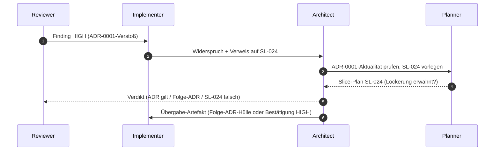

Sechs Pfeile, keine Rückwärts-Schleife ohne Artefakt. Wer einen Pfeil
nicht beschriften kann, hat einen blinden Übergang — exakt die Stelle,
an der Konflikte später aufbrechen.

**Schritt 3 — Übergabe-Artefakte pro Pfeil benennen.** Sequenz wirkt
nur, wenn jeder Pfeil ein *konkretes* Artefakt trägt. Tabelle:

| Pfeil | Übergabe-Artefakt | Inhalt minimal |
|---|---|---|
| R → I | Finding HIGH | Datei:Zeile · ADR-ID · Kategorie HIGH · ein-Satz-Begründung |
| I → A | Widerspruchs-Notiz | Verweis auf Slice-Plan + behauptete Lockerung + Position des Implementers |
| A → P | ADR-Aktualitäts-Anfrage | ADR-ID · Welle, in der gelockert worden sein soll · konkrete Frage |
| P → A | Slice-Plan-Auszug | exakte Textstelle aus SL-024, die die Lockerung enthält *oder nicht enthält* |
| A → R | Verdikt | ADR-Stand bestätigt / Folge-ADR-Hülle / SL-024-Korrektur |
| A → I | Folge-Übergabe | Folge-ADR-Hülle ODER Pflicht zur Korrektur ODER Bestätigung der Lockerung mit ID |

Die zentrale Disziplin: das Verdikt von Architect nach Reviewer (Pfeil
A → R) *muss* ein Artefakt sein, das Reviewer in seine Skill-Datei
übernehmen kann. *"Mündliche Klärung"* ist keine Übergabe; sie ist
Drift mit Kaffeepause.

**Schritt 4 — Drei mögliche Verdikte mit Folge-Sequenzen.** Konflikt
hat drei Auflösungs-Klassen, jede mit eigener Folge-Sequenz. Wer das
nicht vorab durchdenkt, fällt im realen Konflikt in die bequemste —
typischerweise *"wir nehmen das mildere Finding"*, die *keine* der
drei sauberen Klassen ist:

| Verdikt | Folge-Sequenz | Übergabe-Artefakt |
|---|---|---|
| ADR-0001 gilt unverändert, SL-024 hat falsch behauptet | A → P: Slice-Plan-Korrektur; P → I: aktualisierter Plan; I implementiert ADR-konform neu | Plan-Diff mit Korrektur-Begründung |
| ADR-0001 wird per Folge-ADR `supersedes`d | A → R: Folge-ADR mit `supersedes: ADR-0001`; R aktualisiert Skill-Datei (welche Regel jetzt gilt) | Folge-ADR (Accepted) · Skill-Patch |
| Lockerung war legitim, aber nicht dokumentiert | A → P → I: Sofort-PR, der die Lockerung als Folge-ADR nachzieht; bestehender Slice darf trotzdem nicht stillschweigend abgeschlossen werden | Folge-ADR + Erinnerungs-Slice in `next/` |

*Keine* dieser Sequenzen enthält "Reviewer-Finding herabstufen, weil
Implementer widerspricht". Das wäre der vierte, *falsche* Pfad — und
er existiert nur, weil Übergabe-Artefakte fehlen.

**Schritt 5 — Sequenz auf "kein Sprung ohne Artefakt" prüfen.** Lege
die gezeichnete Sequenz aus Schritt 2 neben die Tabelle aus Schritt 3.
Für jeden Pfeil: hast du das Artefakt benennen können? Wenn ein Pfeil
übrig bleibt, ist die Sequenz *nicht* fertig — sondern dort liegt der
nächste blinde Fleck. Häufige Lücken:

- *"Reviewer → Implementer: schnelles Update im Chat"* — kein
  Artefakt, kein dokumentierbarer Übergang, kein Re-Run gegen die
  Sequenz möglich.
- *"Architect entscheidet — fertig"* — Verdikt ohne `supersedes`-ADR
  oder Plan-Korrektur ist eine Erklärung, kein Akt.

**Schritt 6 — Folge-ADR-Hülle vorbereiten, *bevor* der Konflikt
auftritt.** Damit Verdikt 2 (Folge-ADR) keine Stundenarbeit bei jeder
Konfliktwiederholung wird, lebt unter `docs/plan/adr/templates/` eine
Hülle mit `supersedes`-Feld, leerem Begründungsblock, leerem
Fitness-Function-Anker. Der Architect füllt sie in fünf Zeilen aus,
Reviewer kann den Skill-Patch ableiten. Ohne Hülle wird Verdikt 2 das
Verdikt mit dem höchsten Aufwand — und damit das, das *nicht* gewählt
wird, auch wenn es das richtige wäre.

**Schritt 7 — Wann *nicht* eine Sequenz modellieren?** Bei isolierten
LOW/INFO-Findings ist die Sequenz Overkill — Implementer akzeptiert
oder begründet, Reviewer schließt das Finding. Die Sequenz greift ab
*HIGH*-Findings mit Rollen-Widerspruch oder ab dem dritten Mal, dass
derselbe Konflikttyp auftritt. Dreimal derselbe Konflikt ist ein
Steering-Loop-Signal (siehe [`reflexion-vorlage.md`](grundlagen/reflexion-vorlage.md#wann-darf-eine-reflexion-nicht-zu-einer-harness-änderung-führen)):
die Sequenz wird *Pflicht* im 8-Schritt-Workflow ([Modul 9](#minimal-agent-workflow-8-schritte)).

Sieben Schritte, eine Sequenz, sechs benannte Übergaben. Der Test, ob
die Modellierung trägt: der nächste Konflikt durchläuft die Pfeile
*ohne* dass jemand neu erfindet, wer wem was übergibt.

### Regeln gegen typische Fehlannahmen (Modul 8)

- **Gegen "Eine Person spielt alle Rollen":** Geht — *aber mit unterschiedlichem Eingabe-Kontext und unterschiedlichen Skill-Dateien*. Sonst wiederholen sich die blinden Flecken. Rollen-Trennung ist Kontext-Trennung, nicht Personen-Trennung.
- **Gegen "Reviewer macht das Verification gleich mit":** Reviewer prüft gegen Plan/ADR (Maintainability). Verification prüft gegen DoD/Spec (Behaviour/Architecture Fitness). Zwei Fragen, zwei Antworten.
- **Gegen "Validation machen wir vor Release":** Zu spät. Validation gehört *vor* die Implementation größerer Wellen (Spec-Validierung beim Kunden) und nach jedem MVP-Slice.
- **Gegen "Architect entscheidet, Implementation widerspricht nicht":** Implementation darf Folge-ADRs vorschlagen. Was sie *nicht* darf: stillschweigend einer ADR widersprechen.

## Modul 9 — Implementierung durch KI-Agenten

*Quelle: [03-agenten/modul-09-implementierung.md](03-agenten/modul-09-implementierung.md)*

### Kernidee (Modul 9)

Ein Agent ohne Plan schreibt Code. Ein Agent mit Plan schreibt das
*Richtige*. Die Reihenfolge Plan → Diff → Code ist nicht optional.

### Minimal Agent Workflow (8 Schritte)

Der Pfad, den jeder Implementation-Agent pro Slice durchläuft — und der
in `harness/README.md` als Vertrag dokumentiert wird. Strukturfragen
(Bindung-Klassen für die Sensors-Tabelle, Source-Precedence-Begründung,
Modus pro Sub-Area, Adaptionen ggü. der adoptierten Baseline) leben
in `harness/conventions.md`:

1. `harness/README.md` lesen.
2. Relevante kanonische Quelle lesen (Source Precedence beachten).
3. Betroffene Requirement-/ADR-IDs identifizieren.
4. Kleinste sinnvolle Änderung planen.
5. Engsten nützlichen Sensor laufen lassen (z. B. nur eine Testdatei).
6. Repo-weiter Gate-Lauf vor Handoff (`make gates`).
7. Doku/Indizes aktualisieren, falls ein öffentlicher Vertrag berührt ist.
8. Ausgeführte Sensors und verbleibende Risiken berichten — keine Erfolgsmeldung ohne Gate-Ausführung.

#### Workflow als Diagramm

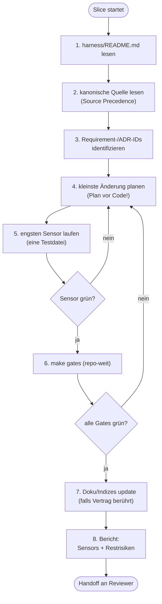

Zwei Rücksprungkanten sind wesentlich: 5→4 und 6→4. Nicht
zurück zu Schritt 1 — der Plan wird *verfeinert*, nicht der Kontext neu
gelesen.

### Rücksprungkanten-Regeln (Modul 9)

- **Kein Rücksprung zu Schritt 1**, sondern nur 5→4 (Plan verfeinern)
  und 6→4 (Plan korrigieren wegen Gate). Wer in Schritt 1 zurückspringt,
  hat einen Kontext-Defekt, keinen Plan-Defekt — das ist eine andere
  Ursache und gehört in den nächsten Steering-Loop-Eintrag.
- Roter `arch-check` in Schritt 6 (ADR-Verstoß durch direkten Import):
  Rücksprung zu **Schritt 4** (Plan verfeinern) — der ADR-Verstoß ist
  ein *Plan*-Defekt, nicht ein Kontext-Defekt; der Agent kannte die ADR,
  hat den Diff aber falsch geschnitten. Konkrete Korrektur: z. B.
  Adapter-Wrapper statt direktem Import, sodass die Schichtung gewahrt
  bleibt. Rücksprung zu Schritt 1 wäre nur richtig, wenn der Agent die
  ADR gar nicht *im Kontext* hatte (Kontext-Defekt) — dann fehlt die
  kanonische Quelle, nicht der Plan. Die Wahl der Kante ist die Diagnose
  der Ursache.

### Hard Rules (repo-spezifisch)

Negativregeln, die der Agent nie brechen darf. Eine gute Hard Rule hat
*Falsch/Richtig*-Beispiele **und** eine *technische Begründung*.
Beispiele aus realen Repos (siehe
[`fallstudien.md`](grundlagen/fallstudien.md)):

* **Docker-only** (grid-gym): kein lokales `.venv`, kein `pip install` außerhalb von Dockerfile-Stages.
  *Falsch:* `uv run python tools/foo.py`.
  *Richtig:* `docker compose run --rm test-runner uv run python tools/foo.py`.
  *Begründung:* Toolchain-Reproduzierbarkeit + Supply-Chain-Defense.
* **`# noqa` ist verboten** (grid-gym): bricht das `noqa-gate` in `make gates`. Ausnahmen werden in `pyproject.toml` mit Begründung dokumentiert.
* **Suppression-Verbot pro Sprache** — derselbe Mechanismus, andere Syntax:
  * Python: `# noqa` (grid-gym `noqa-gate`)
  * Go: `//nolint`
  * C#: `#pragma warning disable`, `[SuppressMessage]` (bess-ems `solid-suppression-gate`)
  * Kotlin: `@Suppress("...")`
  * Java: `@SuppressWarnings("...")`
  In jeder Sprache gilt: Inline-Suppression bricht das Suppression-Gate; Ausnahmen wandern in eine zentrale Konfigurations-Datei mit Begründung.
* **git mv + Inhaltsänderung = zwei Commits** (grid-gym): erst reiner `git mv` (Git erkennt R-Rename), dann Inhalt umschreiben.
  *Begründung:* Sonst fällt die Rename-Detection unter die 50 %-Similarity-Schwelle und `git log --follow` wird unzuverlässig.
* **Architektur ist sprach- und meilensteinfrei** (grid-gym, c-hsm-doc): `spec/architecture.md` referenziert ADRs und Modul-Pfade, aber keine Wellen, Slices oder Closure-Daten. Die zeitliche Schicht lebt in `docs/plan/planning/`.
* **Optimierer darf nie direkt aufs Gerät schreiben** (bess-ems-Klasse): Output fließt durch Statemachine, Constraint-Limiter, Ramp-Limiter.
* **Gates dürfen nicht ohne ADR gelockert werden**: jede Schwellen-Senkung ist ein ADR, kein PR-Kommentar.

Hard Rules sind *computational + inferential feedforward* zugleich: sie
stehen in AGENTS.md (Agent liest sie) **und** werden idealerweise durch
eine Fitness Function geprüft (Linter schlägt an). Wenn nur eines von
beiden existiert, ist die Regel nur halb durchgesetzt.

### Kontext-Verdichtung (Kehrseite der Lopopolo-Maxime)

Die Maxime *"Was der Agent nicht im Kontext erreicht, existiert für ihn
nicht"* (Original: *"anything it can't access in-context doesn't exist"*)
ist eine Hebellinse — sie erklärt, warum Spec, ADR und AGENTS.md *die
Hauptkontrolle* sind, nicht Beiwerk. Aber sie hat eine Kehrseite, die der
Reflex "mehr Kontext rein" gerne überliest:

- **Kontext-Pollution.** Wenn ein 14 Wochen alter ADR-Entwurf im Kontext
  steht, der mit `superseded` markiert ist, erfindet der Agent
  Begründungen *aus dem alten ADR*. Der Kontext besteht — die
  Information ist falsch. Mehr Tokens, schlechteres Ergebnis.
- **Lost in the Middle.** Auch bei großen Kontext-Fenstern fallen
  Informationen in der Mitte des Prompts deutlich seltener in den
  Output zurück als Anfang und Ende. Wer wichtige Anforderungen
  ungeordnet "dazwischen" platziert, hat sie technisch im Kontext und
  praktisch nicht.
- **Token-Kosten.** Jedes Token im Eingangskontext wird abgerechnet —
  pro Lauf, pro Tool-Call, pro Replay. Ein 30-zeiliger irrelevanter
  Block, der in 1500 PRs mitläuft (siehe Lopopolos empirischer Beleg in
  [`quellen.md`](abschluss/quellen.md)), ist eine
  Rechnung mit vier Stellen vor dem Komma.

Folge: Context Engineering ist *auch* eine Reduktions-Aufgabe.
Konkret gehört in den Lauf-Kontext:

| Pflicht | Wer? |
|---|---|
| `harness/README.md` | jeder Lauf |
| relevante kanonische Quelle (Source Precedence) | jeder Lauf, gezielt |
| Requirement-/ADR-IDs des Slice | jeder Lauf |
| AGENTS.md (Hard Rules + Konventionen) | jeder Lauf |
| Tool-Allowlist | jeder Lauf |

| Nicht in den Lauf-Kontext (Anti-Pattern) |
|---|
| `superseded`/`deprecated` ADRs ohne Folge-Bezug |
| historische Spec-Diff-Notizen, die jetzt in ADR-Form gegossen sind |
| Skills, die nicht zu dieser Rolle gehören |
| ältere Carveouts, deren Auflösungs-Trigger bereits eingetreten ist |

Die Verdichtungs-Sensoren dafür sind in [Modul 15](05-betrieb/modul-15-observability.md):
Token-Eingabe-Metrik pro Slice, Cache-Hit-Rate (siehe Mini-Glossar in
Modul 15), und der **Doku-Konsistenz-Agent** als Drift-Detektor für tote
Kontext-Stücke.

Faustregel für den 8-Schritt-Workflow: Schritt 2 ist *"kanonische Quelle
lesen"*, nicht *"alles lesen, was im Repo liegt"*. Wenn der Plan in
Schritt 4 nicht ohne Verweis auf einen Kontext-Block auskommt, gehört
dieser Block in den nächsten Lauf — alle anderen nicht.

### AGENTS.md-Regeln (Modul 9)

- AGENTS.md ist die zentrale, maschinell lesbare Konventionsdatei
  (Hard Rules + Konventionen) und gehört in jeden Lauf-Kontext.
- Minimale Eingaben eines Implementation-Agenten gegen Halluzination:
  `harness/README.md` + relevante kanonische Quelle +
  Requirement/ADR-IDs + AGENTS.md + Tool-Allowlist. Fehlende Eingaben
  werden *durch Raten ersetzt*, nicht durch Schweigen.
- Jede Hard Rule liegt in *zwei* Quadranten: inferential feedforward
  (steht in AGENTS.md) + computational feedback (Fitness
  Function/Linter-Gate). Hard Rule nur in einem Quadranten ist halb
  durchgesetzt; nur in AGENTS.md vergisst der Agent sie unter Druck,
  nur als Fitness Function ohne AGENTS.md-Eintrag versteht der Agent
  das *Warum* nicht.
- Fertig ist ein Implementation-Agent bei DoD-erfüllt + Schritt 8
  ausgeführt (Bericht über Sensors + Restrisiken). Kompilierender Code
  ist notwendig, nicht hinreichend. Ohne Schritt-8-Bericht wird jedes
  Risiko in die nächste Rolle (Reviewer/Verifier) verlagert — das
  bricht die Kontext-Trennung der Rollen.

### Regeln gegen typische Fehlannahmen (Modul 9)

- **Gegen "Agent liefert schnell, also ist der Workflow Overhead":** Geschwindigkeit ohne Plan produziert Diffs, die später als Review-Last anfallen. Plan + Diff + Code kostet 20 % länger und spart 50 % Review.
- **Gegen "Hard Rules schreibe ich in AGENTS.md, und das reicht":** Eine Hard Rule, die nur in AGENTS.md steht (inferential feedforward), ist halbgesetzt. Erst mit Fitness Function (computational feedback) ist sie *durchgesetzt*. Beides ist Pflicht.
- **Gegen "Wenn die Tests grün sind, ist der Slice fertig":** Schritt 8 verlangt einen Bericht über *Sensors und verbleibende Risiken*. Grüne Tests sind notwendig, nicht hinreichend.
- **Gegen "Die Pre-completion Checklist ist Bürokratie":** Sie ist der einzige Schritt, der vor Übergabe an Reviewer/Verifier eine *Selbstaussage* erzwingt. Wer keinen Selbst-Check macht, lädt jedes Risiko in die nächste Rolle.
- **Gegen "Mehr Kontext ist immer besser — siehe Lopopolo":** Lopopolos *"Was der Agent nicht im Kontext erreicht, existiert für ihn nicht"* sagt: *fehlender* Kontext schadet. Es sagt **nicht**: *jeder zusätzliche* Kontext nützt. Siehe [§Kontext-Verdichtung](#kontext-verdichtung-kehrseite-der-lopopolo-maxime).
- **Gegen "Ein Agent ist ein besserer/schnellerer Programmierer":** *Geschwindigkeit ohne Plan* erzeugt Review-Last, nicht Lieferung. Faustregel: Plan-vor-Code kostet 20 % mehr Zeit *im Lauf* und spart 50 % Review-Zeit *danach* — gemessen pro Slice, nicht pro Minute. Wer den Agenten als Speed-Tool denkt, mißt am falschen Hebel: nicht Diff-pro-Stunde, sondern Slice-bis-`done/`. Belegt durch Lopopolo (~1 Mio. Zeilen Code in ~1500 PRs über fünf Monate mit *drei* Engineers — Skalierung kommt aus dem Harness, nicht aus dem Modell).
## Modul 10 — Review Harness

*Quelle: [04-qualitaet/modul-10-review-harness.md](04-qualitaet/modul-10-review-harness.md)*

### Drei Review-Arten — wogegen wird geprüft

Die drei Review-Arten unterscheiden sich nicht im *Wie* (alle liefern
kategorisierte Findings), sondern im *Wogegen* und im *Wann*:

* **Plan-Review** prüft den Plan eines Slices gegen Spec und
  Accepted-ADRs — *bevor* implementiert wird. Es gibt noch keinen
  Diff; Eingabe ist der Plan selbst (Modul 9, Schritt 2).
* **Design-Review** prüft den Lösungs-Schnitt gegen die Architektur:
  Layer-Grenzen, Schnittstellen, ADR-Verträglichkeit einer neuen
  Komponente — bevor die Details festgezurrt sind.
* **Code-Review** prüft den fertigen Diff gegen Plan und Konventionen
  (AGENTS.md, Hard Rules) — die Findings-Kategorien dieses Moduls.

Merkregel: je früher die Review-Art, desto billiger das Finding —
ein Plan-Review-HIGH kostet eine Plan-Korrektur, dasselbe Finding im
Code-Review kostet den ganzen Implementierungs-Lauf.

### Finding-Kategorien

| Kategorie | Bedeutung |
|---|---|
| HIGH | blockiert Merge: Sicherheits-, Korrektheits- oder ADR-Verstoß |
| MEDIUM | sollte vor Merge geklärt werden |
| LOW | nice-to-fix, blockiert nicht |
| INFO | Hinweis, keine Aktion erwartet |

### Harness-Einordnung (Modul 10)

Review = *inferential feedback* (siehe
[`grundlagen/klassifikation.md`](grundlagen/klassifikation.md)).
Teurer als ein Linter, billiger als Verifikation. Adressiert primär die
Maintainability-Kategorie.

### Kernidee (Modul 10)

Ein Review ohne Kategorisierung ist eine Mängelliste. Ein Review mit
Kategorisierung ist eine Entscheidungsvorlage.

### Worked Example: eine Reviewer-Skill-Datei schreiben

Ein Reviewer-Agent ohne Skill-Datei driftet zwischen Sessions. Dieselbe
Eingabe → unterschiedliche Findings, unterschiedliche Kategorien.
Skill-Dateien leben in `.harness/` und sind das Repo-spezifische
"worauf achtest du" eines Agenten.

**Schritt 1 — Pfad und Kopf:**

```
.harness/skills/reviewer.md
```

```markdown
# Reviewer-Skill — DocSearch

* Status: Accepted
* Bezug: ADR-0007, AGENTS.md §"Review-Regeln"
* Gilt für: `agent-review`-Make-Target
```

**Schritt 2 — Eingangs-Kontext explizit machen.** Was der Reviewer
*immer* mitbringt, bevor er den Diff liest:

```markdown
## Kontext-Eingang (Pflicht)

- Diff des PR
- `spec/lastenheft.md` (für referenzierte LH-IDs)
- ADRs, deren ID im PR oder Commit-Message vorkommt
- AGENTS.md §"Hard Rules"
- vorherige Findings am gleichen Modul (letzte 5 PRs)
```

Ohne diesen Block sieht der Reviewer den Code, aber nicht *die Verträge,
gegen die er prüft*.

**Schritt 3 — Kategorien-Regeln *für dieses Repo*.** Nicht generisch,
sondern konkret:

```markdown
## Klassifikation

**HIGH** — eines der folgenden:
- ADR-Verstoß (Layer, Tool, Hard Rule)
- Sicherheits-Anti-Pattern (Injection, fehlende Auth-Prüfung)
- Korrektheitsfehler im *kritischen* Pfad (Index-Schreiben, Auth)
- Suppression eines Gates (#noqa, //nolint, [SuppressMessage]) ohne ADR

**MEDIUM** — eines der folgenden:
- unklare Fehlerbehandlung am Rand des Spec-Bereichs
- fehlende Negativtests bei neuem öffentlichen Vertrag
- Wiederholung eines Musters, das schon zweimal LOW war

**LOW** — stilistisch unschön ohne semantische Auswirkung,
einmalige Tippfehler, unbenutzte Imports.

**INFO** — Hinweis ohne erwartete Aktion (z. B. "diese Stelle hat
ein passendes ArchUnit-Pendant, das du nicht kennst").
```

Beachte: drei Kategorien-Anker (HIGH/MEDIUM/LOW) haben *jeweils* eine
konkrete Liste. INFO ist bewusst kurz — INFO ist Ergänzungs-Kanal, nicht
Hauptkanal.

**Schritt 4 — Anti-Pattern und "Was bist du nicht".** Verhindert, dass
der Reviewer zum zweiten Implementer wird:

```markdown
## Was dieser Skill NICHT macht

- Keine Lösungsvorschläge ("schreib das so") — Reviewer kategorisiert,
  Implementer entscheidet.
- Kein Refactoring-Vorschlag, der über den Diff hinausgeht.
- Keine Verifikation gegen DoD — das ist Verifier-Aufgabe (Modul 11).
- Keine Validation gegen reale Bedürfnisse — das ist Validator-Aufgabe.

Wenn etwas auffällt, das in diese Kategorien gehört, ein INFO-Finding
mit Verweis auf die zuständige Rolle.
```

**Schritt 5 — Output-Schema fixieren.** Findings sind strukturiert, nicht
Fließtext:

```markdown
## Output-Schema

Jedes Finding:

- `kategorie`: HIGH | MEDIUM | LOW | INFO
- `quelle`: ADR-ID, LH-ID, Hard-Rule-Name oder "Maintainability"
- `pfad`: Datei:Zeile
- `befund`: 1–2 Sätze, beobachtbar, ohne Lösungsvorschlag
- `verifizierbar`: ja/nein — gibt es einen Gate-Lauf, der es bestätigen würde?

Zusätzlich am Ende: eine Zeile "geprüft, ohne Befund" pro betrachtetem
Verzeichnis (Negativbefund-Zeile — siehe Modul 10 §"Reviewer berichtet
auch, was er nicht gefunden hat").
```

**Schritt 6 — Steering-Loop-Eintrag.** Skills sind nicht statisch:

```markdown
## Pflege

Bei dreimaligem Auftreten desselben Findings:
- ist die Kategorie noch richtig? → Klassifikation schärfen
- gibt es einen ADR/AGENTS.md-Eintrag, der das verhindert hätte?
  → Folge-ADR oder AGENTS.md-Update
- gibt es eine Fitness Function, die das prüfen würde?
  → Modul 13, Gate hinzufügen

Skill-Datei selbst wird **nicht** überschrieben, sondern versioniert
(siehe ADR-Hard-Rule, Modul 4).
```

Sechs Schritte, eine reproduzierbare Reviewer-Rolle. Vergleichbares
Skill-Pattern für *Verifier* und *Validator* in Modul 11 bzw. in
[Modul 8 §"Konfliktfall"](03-agenten/modul-08-agentenrollen.md).

### Reviewer berichtet auch, was er nicht gefunden hat

Ein Report, der nur Findings listet, ist nicht auditierbar: „keine
Findings in `internal/auth/`" und „`internal/auth/` nicht angesehen"
sehen identisch aus — eine leere Liste. Deshalb verlangt das
Output-Schema pro betrachtetem Bereich eine **Negativbefund-Zeile**
(„geprüft, ohne Befund"). Sie macht die Abdeckung des Laufs sichtbar,
ist die Grundlage für Vertrauen in ein grünes Review — und sie ist
der Teil des Reports, den ein Reviewer-Agent am ehesten weglässt,
weil ihn niemand einfordert.

Das Dokument-Gerüst für den **ganzen Report** — Kopf-Metadaten
(Review-Art, Gegenstand, Skill-Version, Modell, Eingangs-Kontext),
Findings nach Output-Schema, Negativbefunde, Kategorie-Summary,
Verdikt — liefert
[`review-report.template.md`](../../lab/templates/docs/reviews/review-report.template.md);
abgelegt wird ein Report pro Lauf unter `docs/reviews/`, Folgeläufe
als neue Datei statt Überschreibung.

### Regeln gegen typische Fehlannahmen (Modul 10)

- Reviewer kategorisiert. Vorschläge "wie ich es geschrieben hätte" sind nett, aber kein Reviewer-Ergebnis.
- Implementer arbeitet sequentiell ab und bleibt am LOW hängen. HIGH zuerst, immer.
- Verhalten driftet zwischen Sessions. Jeder Reviewer-Agent braucht eine Skill-Datei in `.harness/` mit "worauf achtest du in diesem Repo".
- Genau das belohnt Inkonsistenz. Stattdessen: Skill schärfen, bis die Klassifikation reproduzierbar ist.

## Modul 11 — Verification Harness

*Quelle: [04-qualitaet/modul-11-verification.md](04-qualitaet/modul-11-verification.md)*

### Begriffe: Pre-completion Checklist Middleware und DoD-Verletzung

* **Pre-completion Checklist Middleware** — eine vom Implementation-Agent
  selbst durchlaufene Checkliste *vor* der "fertig"-Meldung. Sie ist
  Schritt 8 des 8-Schritt-Workflows (siehe
  [Modul 9 §Minimal Agent Workflow](03-agenten/modul-09-implementierung.md#minimal-agent-workflow-8-schritte)).
  In diesem Modul betrachten wir sie als *Eingabe* für die Verifikation:
  was die Checkliste *behauptet*, ist von der Verifikation maschinell
  oder semantisch zu *bestätigen*. Behauptung ohne Bestätigung ist die
  häufigste Verifier-Lücke.
* **DoD-Verletzung** — Differenz zwischen DoD-Punkten des Slice
  (Modul 5) und tatsächlichem Code-/Artefakt-Stand. Wichtig: eine
  DoD-Verletzung ist *kein* Review-Finding (Reviewer prüft gegen
  Plan/ADR, nicht gegen DoD/Spec) — sie ist eine eigene Klasse, die
  *nur* die Verifikation fängt.

### Harness-Einordnung (Modul 11)

Verifikation = primär *inferential feedback* in der Behaviour-Kategorie,
unterstützt durch *computational feedback* (Fitness Functions für die
Architecture-Fitness-Kategorie). Dies ist die anspruchsvollste Schicht
— und laut Böckeler die am wenigsten ausgereifte. Siehe
[`grundlagen/klassifikation.md`](grundlagen/klassifikation.md).

### Kernidee (Modul 11)

Verifikation ist die Stelle, an der der Harness *gegen sich selbst*
misst: "Hat das, was gebaut wurde, das umgesetzt, was geplant war?" —
nicht: "Ist es gut?"

### Regeln gegen typische Fehlannahmen (Modul 11)

- Tests prüfen ob *Code tut, was Tests testen*. Verifikation prüft, ob *Code tut, was Plan/DoD/Spec verlangt*. Lücken zwischen Tests und Spec sind genau das, was Verifikation findet.
- Nein. Reviewer hat *Plan + ADR*. Verifier hat *DoD + Spec + Plan*. Andere Eingabe, andere Findings.
- Falsch. Die wahrscheinlichere Erklärung: Reviewer hat gegen einen veralteten Plan geprüft, oder der Plan hat eine DoD-Lücke. Architect klärt — *nicht* "wir nehmen das mildere Ergebnis".

### Worked Example: eine ADR-Aussage ohne fertiges Tool als Fitness Function bauen

**Ausgangs-ADR:** ADR-0011 sagt:
> "Der Implementation-Agent darf nur Slices in `done/` verschieben,
> wenn das Slice-Frontmatter ein Feld `closure_note` mit mindestens
> zwei Sätzen enthält (Lerneintrag-Pflicht; Modul 1 §Closure)."

Es gibt kein "Closure-Note-Linter". Diese Regel zu verifizieren heißt:
sie selbst bauen.

**Schritt 1 — Aussage in eine prüfbare Operationalisierung übersetzen.**
*"Mindestens zwei Sätze"* ist nicht selbsterklärend. Operationalisierung:

> Für jede Datei in `docs/plan/planning/done/*.md` gilt:
> - Frontmatter enthält Schlüssel `closure_note` (string).
> - Der String enthält mindestens **zwei Satzendezeichen** (`.`, `!`, `?`),
>   außerhalb von Code-Blöcken und Inline-Code.
> - Keiner der Sätze ist *leer* oder einer der bekannten Floskeln
>   ("see PR", "n/a", "siehe Ticket").

Operationalisierung ist die Stelle, an der Erschaffen passiert: die ADR
sagt *was*, die Operationalisierung sagt *prüfbar was*.

**Schritt 2 — Sensor-Schicht wählen.** Optionen, mit Kosten:

| Option | Kosten | Wann sinnvoll |
|---|---|---|
| Pre-commit-Hook auf der Autoren-Maschine | niedrig | wenn nur lokale Disziplin gefragt ist |
| Make-Target im `make gates`-Block | mittel | wenn auch CI prüfen soll — Standardweg |
| Doku-Konsistenz-Agent (Modul 15) | hoch | wenn semantische Prüfung nötig ist (z. B. "Floskel-Erkennung") |

Der Worked Example wählt **Make-Target + optional Doku-Konsistenz-Agent**:
deterministische Sätze deterministisch, semantische Floskel-Erkennung
inferentiell.

**Schritt 3 — Skript schreiben (Python-Beispiel, kein neues Framework).**

```python
# tools/check_closure_notes.py
import re
import sys
import pathlib
import yaml

DONE = pathlib.Path("docs/plan/planning/done")
FLOSKELN = {"see pr", "n/a", "siehe ticket", "wird nachgereicht"}

def sentences(text: str) -> list[str]:
    no_code = re.sub(r"`[^`]+`|```.*?```", "", text, flags=re.S)
    parts = re.split(r"[.!?]+", no_code)
    return [p.strip() for p in parts if p.strip()]

def errors_for(path: pathlib.Path) -> list[str]:
    front, _, _ = path.read_text().partition("---")[2].partition("---")
    note = (yaml.safe_load(front) or {}).get("closure_note", "")
    if not note:
        return [f"{path}: closure_note fehlt"]
    sents = sentences(note)
    if len(sents) < 2:
        return [f"{path}: closure_note hat nur {len(sents)} Satz"]
    if any(s.lower() in FLOSKELN for s in sents):
        return [f"{path}: closure_note enthält Floskel"]
    return []

errs = [e for p in DONE.glob("*.md") for e in errors_for(p)]
for e in errs:
    print(e)
sys.exit(1 if errs else 0)
```

Sieben Funktionszeilen, drei Fehlertypen. Keine externe Abhängigkeit
außer `pyyaml`.

**Schritt 4 — Als Gate verdrahten:**

```makefile
verify-closure-notes:  ## ADR-0011 — Closure-Note-Pflicht
	python tools/check_closure_notes.py

verify: verify-closure-notes
```

ID-Kommentar zeigt die ADR. *Verify* hängt das Sub-Target ein —
damit greift es genau dort, wo Verifikation läuft, nicht in `make gates`
(weil es keine Code-Architektur-Frage ist, sondern eine DoD-/Closure-
Frage).

**Schritt 5 — Floskel-Erkennung mit inferentieller Schicht ergänzen.**
Floskeln wie *"war ganz okay, läuft jetzt"* sind syntaktisch zwei Sätze
und entgehen Schritt 3. Hier kommt der Doku-Konsistenz-Agent (Modul 15)
ins Spiel:

> Prompt-Anker (in `.harness/skills/closure-note-reviewer.md`):
> "Lies die `closure_note` jedes Slice in `done/`. Markiere alle, die
> *keinen* der folgenden Inhalte tragen: (a) ein konkretes Lernsignal
> (z. B. "Test rot, weil X"), (b) ein konkretes Folge-Slice, (c) eine
> konkrete Architektur-Beobachtung. Floskeln ohne Inhalt sind ein
> HIGH-Finding."

Inferentiell, weil "Inhalt vs. Floskel" semantisch ist; computational
deckt nur die Struktur.

**Schritt 6 — Bewusstes Brechen.** Ein Slice landet in `done/` mit
`closure_note: "Fertig."`. `make verify-closure-notes` läuft rot mit
`docs/plan/planning/done/SL-024.md: closure_note hat nur 1 Satz`. Der
Verifier hat *genau das* erkannt, was Tests nicht erkannt hätten und
Reviewer übersehen würde (Reviewer prüft Diff gegen Plan/ADR — der
fehlende Closure-Eintrag ist *kein* Diff-Symptom).

**Schritt 7 — Pre-completion Checklist-Bezug.** Der Implementation-Agent
soll vor "fertig"-Meldung *selbst* `make verify-closure-notes` laufen
lassen. AGENTS.md-Eintrag:

```markdown
## Closure (Modul 5, ADR-0011)
- Vor `done/`-Verschiebung: `make verify-closure-notes` muss grün sein.
- Floskeln vermeiden — der Doku-Konsistenz-Agent prüft Inhalte.
```

Damit liegt die Hard Rule in zwei Quadranten: *inferential feedforward*
(AGENTS.md sagt es) + *computational feedback* (Make-Target prüft es).

Sieben Schritte, eine Fitness Function für eine ADR-Aussage, die kein
Standard-Tool prüft. Vergleich im Lab:
[`../../lab/example/docs/plan/adr/0011-closure-note-pflicht.md`](../../lab/example/docs/plan/adr/0011-closure-note-pflicht.md),
[`../../lab/example/tools/check_closure_notes.py`](../../lab/example/tools/check_closure_notes.py)
und das `verify-closure-notes`-Target im
[`../../lab/example/Makefile`](../../lab/example/Makefile).
Das Lab wählt bewusst **Option C** (Closure-Sektion im Markdown-Body,
siehe ADR-0011 §Verglichene Alternativen) statt des oben gezeigten
Frontmatter-Schemas — beide operationalisieren dieselbe ADR-Aussage,
die Wahl ist Repo-spezifisch.

## Modul 12 — Replay und Evaluierung

*Quelle: [04-qualitaet/modul-12-replay-evaluierung.md](04-qualitaet/modul-12-replay-evaluierung.md)*

### Kernidee (Modul 12)

Ohne Replay ist jeder Agenten-Lauf ein einmaliges Experiment. Mit Replay
wird er zur Messung.

### Regeln gegen typische Fehlannahmen (Modul 12)

- Replay grün heißt: das Modell hat das wiederholt, was *im Golden Set steht*. Ob das Golden Set noch die Realität abbildet, ist eine andere Frage.
- Statische Golden Sets überfitten. Rotation und neues Sampling sind Pflicht, nicht Kür.
- Determinismus erfordert: Modellversion + Seed + Inputs *und* Tool-Versionen, Wetter im Container, Zeitstempel-Maskierung. Wer nur den Seed pinnt, pinnt eine *einzige* von mehreren Drift-Quellen — Modellversion, Sampling-Parameter, Tool-Umgebung und Prompt-Kontext driften unabhängig davon weiter.

### Worked Example: ein Replay-Manifest aufbauen

**Ausgangssituation:** Du hast einen Agentenlauf gemacht, der den Slice
`SL-024` (kleiner Replay-Erweiterung) abgeschlossen hat. Du willst ihn
als *Baseline-Replay* festhalten, gegen den Modellwechsel verglichen
wird.

**Schritt 1 — Pfad und Skelett anlegen.**

```
evals/golden/welle-1-baseline/
├── manifest.yaml
├── inputs/
│   ├── case-001.json
│   ├── case-002.json
│   └── case-003.json
└── expectations/
    ├── case-001.json
    └── ...
```

Drei Fälle ist das Minimum: Happy / Boundary / Negative — dieselbe
Spec-Disziplin wie bei Akzeptanzkriterien
([Modul 3](01-spec-und-architektur/modul-03-lastenheft.md)). Ein
Replay mit einem Fall ist eine Demo, kein Replay.

**Schritt 2 — Pflichtfelder im Manifest fixieren.**

```yaml
# evals/golden/welle-1-baseline/manifest.yaml
slice: SL-024
recorded_at: 2026-06-15T10:31:00Z
model:
  name: claude-opus-4-7
  version: "20260301"
  seed: 42
runtime:
  image_hash: sha256:9c7f4a...   # siehe Vorgriff-Block oben
  toolchain:
    python: 3.12.4
    ruff: 0.4.10
inputs_ref: inputs/
expectations_ref: expectations/
```

Drei Felder sind im Selbstcheck Pflicht: `model.version`, `model.seed`,
`inputs_ref`. Zwei weitere unterscheiden ernsthaftes von symbolischem
Replay: `runtime.image_hash` (Toolchain-Drift abgrenzen) und
`recorded_at` (späteren Diff datieren).

**Schritt 3 — Erwartungen *als Verhalten*, nicht als Wortlaut.**
Schlecht: *"Agent antwortet exakt 'index updated'"* — bricht bei
Modellwechsel sofort. Gut:

```yaml
# expectations/case-001.json
{
  "must_include": ["index", "updated"],
  "must_not_include": ["error", "traceback"],
  "tool_calls": {
    "writer.write_index": {"min": 1, "max": 1}
  }
}
```

Drei semantische Aussagen statt eines wörtlichen Vergleichs. Exact-Match
bewahre für strukturierte Schnittstellen (JSON-Felder), nie für
Fließtext.

**Schritt 4 — Erster Lauf, Baseline einfrieren.**

```bash
make replay RUN=welle-1-baseline
```

Erwartet: drei grüne Fälle. Wenn nicht: *erst* das Manifest schärfen
(meist Schritt 3 zu eng), nicht das Modell tauschen.

**Schritt 5 — Modellwechsel-Drift messen.**

```bash
make replay RUN=welle-1-baseline MODEL=claude-sonnet-4-6
```

Drei mögliche Ergebnisse:
* alle grün → kein Drift in dieser Klasse.
* einer rot → erste Drift-Diagnose: ist die Erwartung zu eng (Schritt 3 nachschärfen)
  oder hat das neue Modell ein neues Verhalten?
* zwei rot → Modellwechsel nicht ohne Anpassung möglich; Carveout +
  Folge-Slice für Erwartungs-Update.

*Quantifizieren statt nur einordnen.* Halte den Drift als **Zahl** fest,
nicht nur als "ein paar rot": die **Drift-Rate** = rote Fälle ÷
Gesamt-Fälle des Golden Sets (zwei von zwanzig → 10 %). Die Zahl macht
zweierlei prüfbar, was die ordinale Einordnung verbirgt: (1) den *Trend*
über mehrere Modellversionen (steigt die Rate von 5 % auf 15 %, ist der
Modellpfad selbst der Verdächtige, nicht ein Einzelfall), und (2) eine
*Schwelle* für den Steering Loop ("ab Drift-Rate > X Carveout-Pflicht").
Eine reine "zwei rot"-Notiz lässt sich zwischen Läufen nicht vergleichen
— ein Prozentwert schon.

**Schritt 6 — Drift-Diagnose-Reihenfolge.** Wenn ein Lauf rot wird, ist
die Reihenfolge der Verdächtigen *nicht beliebig*:

| Reihenfolge | Verdächtiger | Belegquelle |
|---|---|---|
| 1 | Toolchain-Drift | `runtime.image_hash` verglichen |
| 2 | Modell-Routing | `model.version` plus Provider-Status |
| 3 | Erwartungs-Drift | Eingaben vs. Spec (Modul 3) |
| 4 | echte Regression | alles oben ausgeschlossen |

Wer zuerst auf "echte Regression" tippt, baut den Carveout an der
falschen Stelle ein.

**Schritt 7 — Lerneintrag und Rotation.**
Replay-Sets verrotten. In
`evals/golden/welle-1-baseline/CHANGELOG.md`:

```markdown
2026-06-15 — Baseline mit drei Fällen aufgesetzt.
2026-08-02 — Fall hinzugefügt aus Steering-Loop-Eintrag #4
             (vorher unerkanntes Negativ-Muster, siehe
             reflexion-vorlage.md).
2026-09-10 — Fall-001 entfernt — Realität hat
             Schnittstelle geändert, Fall war giftig.
```

Sieben Schritte, ein reproduzierbares Manifest. Vergleich im Lab:
[`../../lab/example/evals/golden/welle-1-baseline/`](../../lab/example/evals/golden/welle-1-baseline/)
mit `manifest.yaml`, `inputs/case-{001,002,003}.json`,
`expectations/case-{001,002,003}.json` und `CHANGELOG.md` in derselben
Verzeichnis-Struktur. Das Lab zeigt ein *Retrieval*-Replay (Embedding-
Modell `local-embed-v3`, drei Search-Cases gegen LH-FA-02); das Worked
Example oben demonstriert dasselbe Schema für einen *LLM-Agentenlauf*
— die Struktur trägt beides.

## Modul 13 — Quality Gates

*Quelle: [04-qualitaet/modul-13-quality-gates.md](04-qualitaet/modul-13-quality-gates.md)*

### Harness-Einordnung (Modul 13)

Gates = *computational feedback* (siehe
[`grundlagen/klassifikation.md`](grundlagen/klassifikation.md)).
Schnellste und billigste Sensoren des Harness. Was hier prüfbar wird,
muss nicht mehr im Review-Agent landen — das ist die wichtigste
Einsparung im gesamten System.

### Kernidee (Modul 13)

Gates sind Aussagen, die *immer* gelten müssen. Wenn ein Gate "manchmal"
rot sein darf, ist es kein Gate, sondern ein Vorschlag.

### Gate-Typ ↔ Fehlerbild

Wer einen neuen Sensor in den Steering Loop einzieht, muss wissen,
*welche Sensor-Klasse welche Fehlerklasse fängt* — sonst reagiert er
auf einen wiederkehrenden Fehler mit dem falschen Sensor, und der
Steering Loop läuft leer. Die Zuordnung in Kurzform:

| Gate-Typ | typisches Fehlerbild | was er NICHT fängt |
|---|---|---|
| Linter | lokale Muster: toter Import, verbotenes Idiom, Suppression-Marker | Datenfluss über Funktionsgrenzen, Struktur-Regeln |
| Typecheck | Typgrenzen-Verstoß: falsche Signatur, `None` am falschen Ort | Vertrauensgrenzen — `str` bleibt `str`, ob nutzerkontrolliert oder nicht |
| Architekturtest | Struktur-/Import-Regel: Layer-Bruch, Domäne importiert Infrastruktur | Verhalten zur Laufzeit, lokale Muster |
| Security-Gate | Datenfluss-Befund: SQL-Injection, Secret-/Entropie-Treffer | Architektur-Schnitt, Coverage-Lücken |
| Coverage / Critical Coverage | Coverage-Loch — gesamt bzw. auf dem kritischen Pfad | Qualität der Tests, Spec-Lücken ([Modul 11](04-qualitaet/modul-11-verification.md)) |
| Replay-/Determinism-Gate | nicht-deterministischer Test oder Lauf | semantische Drift außerhalb des Golden Sets ([Modul 12](04-qualitaet/modul-12-replay-evaluierung.md)) |
| Integrationstest | Verhalten im Zusammenspiel: Komponenten-Vertrag bricht erst in Kombination | lokale Muster und Typgrenzen — dafür zu teuer und zu spät |

Trennlinie ist die *Regel-Klasse*, nicht das Tool: Linter machen lokale
Mustererkennung, Security-Regeln verlangen Datenfluss-Analyse,
Architekturtests prüfen Struktur, Integrationstests Verhalten im
Zusammenspiel.

### Hard Rule (Doku-Disziplin)

In `harness/README.md` und in jeder Doku, die Gates aufzählt: keine
Befehle behaupten, die es nicht gibt. Wenn `make fullbuild` strukturell
rot ist, wird das als Carveout in `docs/plan/carveouts/CO-<NNN>-…`
dokumentiert ([Modul 7](02-planung/modul-07-carveouts.md)) und in
der Bindung-Spalte der Sensors-Tabelle per `CO-<NNN>`-ID verlinkt — nicht
ausgelassen, nicht geschönt, nicht in einer Status-Spalte versteckt
(die Sensors-Tabelle trägt keinen Lauf-Status; Lauf-Wahrheit pro Commit
liegt in CI, siehe
[`grundlagen/konventionen.md`](grundlagen/konventionen.md#harnessreadmemd-als-einstiegspunkt)).
Halluzinierte Gates sind die häufigste Form von Harness-Lüge — und der
Implementation-Agent vertraut ihnen.

### Bootstrap-aware Gates

In der Frühphase eines Projekts ist eine harte Coverage-Schwelle Unsinn.
Statt sie zu verschweigen: bekenne den Reifegrad. Ein bootstrap-aware
Gate dokumentiert seine Stufe und seinen Hochschalt-Trigger im
Make-Target:

```
coverage-gate: ## Coverage threshold gate (bootstrap-aware, LH-FA-BUILD-008).
```

Das Gate prüft heute z. B. 40 %, schaltet bei Meilenstein M2 auf 70 %
hoch. Das macht "bootstrap-aware" nicht zum Schlupfloch, sondern zum
**explizit terminierten Reifestufen-Gate** — ein Werkzeug eigener
Klasse, kein Subtyp von Carveout (die Werkzeug-Triade-Einordnung
steht direkt unter diesem Absatz).

**Werkzeug-Triade-Einordnung.** Bootstrap-aware Gate ist eine der
drei legitimen Antworten auf gelockerte Gate-Disziplin neben
*Carveout* (punktuelle Ausnahme mit Folge-Slice) und
*BF-Sub-Area-Markierung* (Sub-Area-weiter Übergangs-Modus mit
Graduation-Plan, Konzept in
[Modul 2 §Kernidee](01-spec-und-architektur/modul-02-harness-bootstrap.md#kernidee)).
**Die BF-Sub-Area-Markierung ist nicht selbst ein Closure-Werkzeug**,
sondern der Sub-Area-Kontext, in dem Carveout und Bootstrap-aware
Gate als Closure-Antworten strukturell legitim werden —
Disambiguierung in
[Modul 7 §Worked Example A Schritt 6](02-planung/modul-07-carveouts.md#worked-example-a-einen-carveout-dokumentieren).

**Begriffsklärung:** *Bootstrap-aware Gate* (oben) ist nicht zu
verwechseln mit *Harness-Bootstrap* aus
[`grundlagen/konventionen.md` §Harness-Bootstrap](grundlagen/konventionen.md#harness-bootstrap).
Letzteres ist der **Repo-Einstiegsprozess** (Lebenszyklus eines Harness
im Repo); ersteres ist die **Reifestufe eines einzelnen Sensors**.
Beide Begriffe teilen das Wort, sind strukturell verschieden.

### Reichhaltige Gate-Landschaft als Inspiration

Ein reifes Repo (Beispiel `pt9912/grid-gym`, siehe
[`grundlagen/fallstudien.md`](grundlagen/fallstudien.md)) hat
deutlich mehr als sechs Gates:

```
lint · format-check · typecheck
arch-check · arch-check-imports · arch-check-custom
docs-check · spdx-check · noqa-check · noqa-gate
test-unit · test-determinism · test-replay · test-fault
test-integration
coverage-gate · coverage-gate-critical
dep-audit · image-audit · openapi-validate
```

Pointe: Domänenspezifische Gates (`test-determinism`, `test-replay`,
`noqa-gate`) entstehen aus dem Steering Loop — nicht aus einem
Standard-Setup. Wenn dein Repo nur die generischen sechs hat, weißt du
nur, dass du noch keine Schmerzen hattest.

Ein zweites Beispiel in einer anderen Sprach-Welt: `pt9912/bess-ems`
(C#/.NET, Safety/Control) bringt Gate-Familien mit, die `grid-gym`
nicht hat — `solid-suppression-gate` (C#-Pendant zum noqa-gate),
`test-mpc-property` (Property-Based-Sensor für Regelungstechnik),
`native-sanitizer` (für C/C++-Interop-Anteile), `test-hil-*`
(Hardware-in-the-Loop). Voll ausgeschrieben in
[`grundlagen/fallstudien.md`](grundlagen/fallstudien.md).

Pro Sprache wachsen also unterschiedliche Gate-Familien.

### Regeln gegen typische Fehlannahmen (Modul 13)

- Lint ist *ein* Gate-Typ. Architekturtests, Coverage-Gates, Security-Gates, Replay-Determinism-Gates sind weitere. Pro Repo entstehen sprachen- und domänenabhängige Gate-Familien.
- Dann ist es kein Gate, sondern ein Vorschlag. Pragmatik gehört in Carveouts oder bootstrap-aware Gates — mit Trigger und Folge-Slice.
- Es gibt keine universelle Schwelle. Critical Coverage (Security, Geld, Datenintegrität) ≠ Gesamt-Coverage. Schwellen sind ADR-pflichtig.
- Nur wenn lokal und CI dasselbe Image benutzen (Modul 14). Sonst debuggst du den Unterschied.
- Falsch in zwei Richtungen. Erstens: 80 % Gesamt-Coverage über *unkritischem* Code verbirgt 0 % Coverage auf dem Sicherheitspfad — Critical Coverage misst *gezielt*. Zweitens: Tests gegen Beispiele decken nur Realität ab, *wo das Golden Set repräsentativ ist* ([Modul 12](04-qualitaet/modul-12-replay-evaluierung.md)); Tests gegen die *Spec* erschließt Verifikation ([Modul 11](04-qualitaet/modul-11-verification.md)). Wer Test-Anzahl als Qualitätsmaß nimmt, baut Coverage-Anstiege, deren Wert auf 0 fällt, sobald die Realität die Coverage-Annahme bricht. Faustregel: *Verteilung vor Anzahl*. Ein zusätzlicher Test gegen einen bereits gut abgedeckten Pfad ist Boilerplate; ein zusätzlicher Test gegen einen *bisher unabgedeckten kritischen* Pfad ist Sensor.

### Worked Example: vom ADR-Satz zur Fitness Function

**Ausgangs-ADR:** ADR-0007 (siehe Worked Example in [Modul 4](01-spec-und-architektur/modul-04-architektur-adrs.md#worked-example-vom-diskussionsfaden-zum-prüfbaren-adr)) sagt:

> "Service-Layer importiert ausschließlich aus `adapter/`-Paket."

**Schritt 1 — Aussage maschinell formulieren.** Aus *"importiert
ausschließlich aus"* wird:
> Keine Datei unter `src/service/**` darf einen Import enthalten, dessen
> Modul nicht mit `adapter.` beginnt oder ein Standardbibliotheks-Modul ist.

**Schritt 2 — Werkzeug wählen.** Python → `import-linter` oder
`grimp`. Java → `ArchUnit`. Go → `depguard`. Allgemein:
`dep-cruiser` für Node, eigene AST-Scanner für Nischensprachen.

**Schritt 3 — Implementierung (Python-Beispiel mit `import-linter`):**

```ini
# .importlinter
[importlinter]
root_packages = service

[importlinter:contract:service-adapter-only]
name = service imports only from adapter or stdlib
type = forbidden
source_modules =
    service
forbidden_modules =
    requests
    urllib3
    httpx
```

**Schritt 4 — Als Gate verdrahten:**

```makefile
arch-check:  ## LH-QA-COUPLING-002 / ADR-0007 — Service-Adapter-Trennung
	lint-imports
```

**Schritt 5 — `make gates` lokal grün — und im CI mit gepinnter
Toolchain (Modul 14).**

**Schritt 6 — Bewusstes Brechen:** Implementer fügt zu Debug-Zwecken
`import requests` in `service/foo.py`. `make arch-check` läuft rot mit
`ADR-0007 violated`. Genau der Effekt, der eine ADR von einer
Absichtserklärung trennt.
## Modul 14 — Docker Harness

*Quelle: [05-betrieb/modul-14-docker-harness.md](05-betrieb/modul-14-docker-harness.md)*

### Kernidee (Modul 14)

Wenn lokal und CI nicht dasselbe Image benutzen, debuggst du den
Unterschied, nicht den Bug.

### Regeln gegen typische Fehlannahmen (Modul 14)

- **"FROM python:3 ist konkret genug."** — Nein. Ohne Digest (`FROM python:3.12.4-slim@sha256:…`) baust du jeden Monat einen anderen Container.
- **"Lock-Files sind nur für Python."** — Lock-Files gibt es für jede Sprache: `package-lock.json`, `go.sum`, `Cargo.lock`, `packages.lock.json` (mit Central Package Management, siehe `bess-ems`), `pnpm-lock.yaml`, `poetry.lock`. Wer ohne Lock-File baut, baut nicht reproduzierbar.
- **"Docker-only ist Overkill für Tools."** — Tools driften am schnellsten. Genau dort lohnt Docker am meisten.
- **"Devcontainer ersetzt Compose."** — Nein. Devcontainer ist für *Entwickler-IDE-Setup*, Compose für *Lauf- und CI-Vertrag*. Sie ergänzen sich.
- **"DevOps ist YAML schreiben — Container = Deployment."** — Verbreitet, weil Container historisch über die Deployment-Seite eingeführt wurden. In diesem Kurs ist der primäre Zweck eines Containers ein anderer: er ist **Reproduzierbarkeits-Anker** — derselbe Image-Hash garantiert dieselbe Toolchain auf jeder Maschine, im CI und in sechs Monaten. Deployment ist *eine* Anwendung dieses Ankers, nicht sein Hauptzweck. Bei einem Replay-Lauf gegen ein altes Golden Set ([Modul 12](04-qualitaet/modul-12-replay-evaluierung.md)) brauchst du den *Image-Hash von damals*, nicht das aktuelle Deployment. Wer das Bild "Container = Auslieferung" pflegt, hat keinen Hebel für *time-travel reproducibility* — und damit kein belastbares Replay.

### Worked Example: vom einstufigen Dockerfile zur reproduzierbaren Multi-Stage-Pipeline

**Ausgangs-Dockerfile (Python, Anti-Beispiel):**

```dockerfile
FROM python:3
COPY . /app
WORKDIR /app
RUN pip install -r requirements.txt
CMD ["python", "-m", "docsearch"]
```

Vier Zeilen, vier Drift-Quellen: Tag `python:3` zeigt jeden Monat auf
ein anderes Image; `requirements.txt` ist nicht aufgelöst (transitive
Versionen frei); `pip install` ohne Cache-Trennung baut bei jedem Code-
Change die Dependencies neu; das Runtime-Image enthält den Build-Layer
mit Quellcode und Compiler-Toolchain. Sechs Schritte bringen das in
einen Multi-Stage-Build, der lokal und in CI denselben Image-Hash
produziert.

**Schritt 1 — Base-Image mit Digest pinnen.** Tag-Floating ist die
unsichtbarste Drift, weil sie nichts ändert *außer* dass das Image
neu ist. Lösung: SHA-256-Digest dazu.

```dockerfile
FROM python:3.12.4-slim@sha256:9c7f4a9d0c1b2e3f4a5b6c7d8e9f0a1b2c3d4e5f6a7b8c9d0e1f2a3b4c5d6e7f AS deps
```

Der Digest wird beim ersten erfolgreichen Lokal-Build von
`docker buildx imagetools inspect python:3.12.4-slim` ausgelesen und
festgeschrieben. Update-Pfad: bei Sprach-/Sicherheits-Update Digest
*bewusst* anheben — ein Commit, der nur die Digest-Zeile ändert.

**Schritt 2 — Lock-File trennen und vor dem Code in den Build-Kontext
holen.** Damit Dependency-Installation cache-freundlich wird (sie läuft
neu *nur* wenn `pyproject.toml` / `poetry.lock` sich ändert, nicht bei
jedem Code-Change):

```dockerfile
FROM python:3.12.4-slim@sha256:9c7f4a... AS deps
WORKDIR /src
COPY pyproject.toml poetry.lock ./
RUN pip install --no-cache-dir uv==0.4.0 && \
    uv pip install --system --no-cache --frozen .
```

Drei Disziplinen in dieser Stage: (a) Installer-Version (`uv==0.4.0`)
selbst pinnen, sonst ist das Installations-Tool die zweite
Drift-Quelle; (b) `--frozen` verbietet, dass uv beim Build neue
Versionen auflöst — Lock-File entscheidet, nicht Build; (c) noch *kein*
Code im Image — Layer-Cache greift, solange Lock unverändert.

**Schritt 3 — Build-Stage separieren.** Code-Kompilierung gehört nicht
ins Runtime-Image; sie braucht aber die Dependencies aus Stage 1.

```dockerfile
FROM deps AS build
COPY . .
RUN python -m compileall src/
```

`FROM deps` referenziert die vorherige Stage — `build` erbt die
installierten Pakete, ohne sie neu zu installieren. `compileall`
ist hier symbolisch für jede Sprach-spezifische Build-Aktion
(Bytecode-Vorgenerierung, Asset-Build, Typ-Stubs). In Go wäre es
`go build`, in Java `mvn package`.

**Schritt 4 — Distroless-Runtime-Stage mit nonroot.** Das Runtime-Image
trägt nur das, was zur Laufzeit *gebraucht* wird — keine Shell, kein
Paketmanager, keine Build-Toolchain. Angriffsfläche minus ~90 %.

```dockerfile
FROM python:3.12.4-slim@sha256:9c7f4a... AS runtime
WORKDIR /app
COPY --from=build /src/src/docsearch /app/docsearch
COPY --from=build /usr/local/lib/python3.12/site-packages /usr/local/lib/python3.12/site-packages
RUN useradd --uid 65532 --no-create-home nonroot
USER nonroot
ENTRYPOINT ["python", "-m", "docsearch"]
```

Für Sprachen mit eigenständigem Binär-Output (Go, Rust, statisch
gelinkte JVM-AOT) ist die noch härtere Variante
`gcr.io/distroless/static-debian12:nonroot@sha256:d093aa3e…` (auch
Distroless-Tags floaten — deshalb per Digest gepinnt) ohne
interpretierbares Runtime — siehe
[`../../lab/example/go/Dockerfile`](../../lab/example/go/Dockerfile)
als Vorbild.

**Schritt 5 — Image-Hash im Build-Output festhalten.** Damit das Image
in einem Replay-Manifest (Modul 12) referenzierbar wird:

```makefile
build:  ## LH-QA-03 — reproduzierbarer Build, Image-Hash erfasst
	docker buildx build \
		--platform linux/amd64 \
		--tag docsearch:welle-2 \
		--metadata-file build-metadata.json \
		--load .
	@jq -r '."containerimage.config.digest"' build-metadata.json > harness/image-hash.txt
	@cat harness/image-hash.txt
```

`build-metadata.json` enthält den exakten Manifest-Digest. Die
`harness/image-hash.txt` ist ein einzeiliges Beleg-Artefakt, das in
`harness/README.md` referenziert wird (siehe Vorlage in
[`/lab/templates/harness/README.template.md`](../../lab/templates/harness/README.template.md)).
Ohne diesen Schritt ist das Replay-Manifest in Modul 12 zur Hälfte
blind — der `image_hash`-Slot bleibt unbelegt.

**Schritt 6 — Bewusstes Brechen: Drift provozieren.** Ändere in einer
Kopie *eine* Zeile zurück auf den unsicheren Stand und messe die
Wirkung:

| Änderung | Erwartete Beobachtung |
|---|---|
| Digest weglassen (`FROM python:3.12.4-slim`) | Image-Hash ändert sich beim nächsten Lokal-/CI-Build, obwohl kein Code-Diff vorliegt. |
| `--frozen` aus Schritt 2 entfernen | uv löst beim Build neue Patch-Versionen auf; Lock-File und Image divergieren stillschweigend. |
| `COPY . .` *vor* `COPY pyproject.toml ./` ziehen | Dependency-Stage wird bei jedem Code-Change rebuilt; Build-Zeit explodiert, Cache wirkt nicht. |

Sechs Schritte, ein Image, drei Drift-Anker (Digest · Lock-File ·
Stage-Trennung). Vergleich:
[`../../lab/example/python/Dockerfile`](../../lab/example/python/Dockerfile)
und
[`../../lab/example/go/Dockerfile`](../../lab/example/go/Dockerfile)
— beide tragen den ID-Kommentar `LH-QA-03` im Header und folgen
demselben Drei-Stage-Schnitt mit sprach-spezifischen Anpassungen.

### Reproduzierbarkeits-Regeln: Drift-Klassen und Stage-Schnitte

- **Mindestkombination für Build-Reproduzierbarkeit:** Lock-File (sichert Abhängigkeits-Versionen) + Image-Hash (sichert Runtime-/Toolchain-Version). Ohne Lock-File driftet das Dependency-Tree, ohne Image-Hash driftet die Sprach-/Tool-Version. Folge: ein Replay-Manifest (Modul 12) referenziert *beide* — ohne Image-Hash lässt sich Modell-Drift nicht von Toolchain-Drift trennen; ohne Lock-File-Hash nicht von Dependency-Drift. Drei Drift-Quellen, drei Anker.
- **Drift-Klassen:** `FROM python:3` ⇒ Toolchain-Drift (Tag floatet, kein Digest); fehlendes `--frozen`/Lock-File ⇒ Dependency-Drift; `COPY . .` vor `pyproject.toml` ⇒ Layer-Cache-Drift (Cache invalidiert bei jedem Code-Change).
- **Drei Stage-Schnitte mit Härtung:** **deps** (gepinnte Base + Lock-File-Install gegen Toolchain-/Dependency-Drift) · **build** (`FROM deps`, Code-Kompilierung getrennt vom Cache-sensiblen Layer) · **runtime** (Distroless/nonroot, nur Artefakte kopiert — kleinere Angriffsfläche, kein Build-Layer im Image). Image-Hash macht den Schnitt erst messbar.
- **Warum `make gates` im Host-OS keine valide Gate-Ausführung ist:** Host-Toolchain ist nicht versionsgleich mit CI; Gate-Ergebnisse divergieren; Debugging erfolgt am Unterschied, nicht am Bug. Konsequenz: ohne Image-Hash-Vertrag zwischen lokal und CI sind grüne lokale Gates *kein* Vertrag — sie sind eine private Information.

### Devcontainer/Compose-Kriterium

Devcontainer für IDE-Setup (Sprache-Server, Debugger-Anschluss). Compose
für Lauf- und CI-Vertrag. Beides parallel, wenn das Team mehrere IDEs
nutzt. Faustregel: Compose ist *Pflicht* (CI-Vertrag), Devcontainer ist
*Komfort*. Wer mit Devcontainer beginnt, baut sich eine zweite Toolchain
ohne die erste.

## Modul 15 — Observability

*Quelle: [05-betrieb/modul-15-observability.md](05-betrieb/modul-15-observability.md)*

### Harness-Einordnung

Observability ist Eingangs- und Ausgangskanal für *Entropy Management*
(siehe [`grundlagen/klassifikation.md`](grundlagen/klassifikation.md)):
ohne Telemetrie weißt du nicht, wo der Harness rostet.

### Kernidee (Modul 15)

Ein Agenten-Lauf ohne Trace ist ein Vorgang ohne Beleg. Du weißt, dass
es passiert ist; du weißt nicht, *was* passiert ist.

### Regeln gegen typische Fehlannahmen (Modul 15)

- **"Logs reichen."** — Logs sagen *was passierte*, nicht *wer wen wann rief*. Trace ist die Antwort darauf.
- **"Metriken sind nur für Performance."** — Metriken sind auch für *Kosten* (Token, Cache-Hit-Rate) und *Drift* (AGENTS.md-Konsistenz-Score).
- **"Prompt-Caching ist Modell-Sache."** — Nein. Cache-Hits zeigen sich erst in Metriken, wenn du sie misst. Wer Cache-Miss-Spikes nicht beobachtet, sieht Injection-Versuche und Drift-Symptome nicht.
- **"Trace teurer Tool-Call = unnötiger Tool-Call."** — Falsch. Manche teuren Calls sind nötig. Frage: lässt er sich durch Caching, Vorab-Filter oder Kontext-Verdichtung billiger machen?

### Worked Example: ein Span zurück bis zur Lastenheft-ID

**Ausgangs-Span:** Du öffnest den Trace zu `sl-009-agent-run`. Der
teuerste Span trägt:

```json
{
  "span_id": "impl-2",
  "name": "tool_call:writer.write_index",
  "duration_ms": 412,
  "tool.name": "writer.write_index",
  "tool.arguments.redacted": {"docs": 100, "target": "internal/index/store.bin"},
  "tool.result.status": "ok",
  "requirement.id": "LH-FA-IDX-003",
  "adr.id": "ADR-0012",
  "tokens": {"input": 2480, "output": 187},
  "cache": {"hit": false}
}
```

**Schritt 1 — Slice-ID aus dem Trace lesen.**
Der Trace-Header trägt `slice.id = slice-009` (Lab-Schreibweise mit
Bindestrich) und `requirement.refs = ["LH-QA-02", "LH-FA-IDX-003"]`.
Innerhalb des Spans selbst hängt der teure `writer.write_index`-Call
zusätzlich an `requirement.id = LH-FA-IDX-003` — der direkte Anker
zur konkreten Anforderung.

**Schritt 2 — Slice-Datei finden.**
[`docs/plan/planning/done/slice-009-tie-break-determinismus.md`](../../lab/example/docs/plan/planning/done/slice-009-tie-break-determinismus.md).
Die Lab-Datei trägt keine YAML-Frontmatter, sondern eine Klartext-
Bezug-Zeile:
```markdown
**Bezug:** LH-QA-02 (Reproduzierbarkeit, primär), LH-FA-IDX-003
(Index-Schreib-Idempotenz, sekundär — deterministischer Tie-Break ist
Voraussetzung für bit-identische Schreib-Ergebnisse), ADR-0003
(Index-Format), ADR-0012 (Index-Write-Strategie, sekundär).
```
Das ist eine *alternative Operationalisierung* zum Frontmatter-Schema
(siehe Notiz unten). Lesepfad bleibt derselbe: die Zeile führt zu den
ADRs und Anforderungen.

**Schritt 3 — ADR aufrufen.**
[`docs/plan/adr/0012-index-write-strategy.md`](../../lab/example/docs/plan/adr/0012-index-write-strategy.md).
Kopf:
```markdown
**Status:** Accepted
**Bezug:** LH-FA-IDX-003 (Index-Schreib-Idempotenz und Atomarität),
ADR-0003 (Index-Storage-Format)
```
Bestätigt: die ADR begründet die Index-Write-Strategie (Temp-File +
Atomic Rename) und referenziert dieselbe LH-ID, die der Span trägt.
Die Kette schließt sich.

**Schritt 4 — Lastenheft prüfen.**
[`spec/lastenheft.md` § `LH-FA-IDX-003`](../../lab/example/spec/lastenheft.md):
```markdown
### LH-FA-IDX-003 — Index-Schreib-Idempotenz und Atomarität
Anforderung: Index-Schreiboperationen sind idempotent (gleicher
Datei-Hash bei gleicher Eingabe) und atomar (kein partieller
Index-Stand beobachtbar).
Akzeptanzkriterien: Happy / Boundary (Crash-Recovery via fsync+rename)
/ Negative (E099 bei nicht beschreibbarem Verzeichnis).
```
Bestätigt: der teuerste Tool-Call (im Span) bedient eine konkrete
Lastenheft-Anforderung mit Akzeptanzkriterien.

**Schritt 5 — Make-Target-Kommentar gegenprüfen.**
ADR-0012 §Fitness Function definiert die maschinelle Prüfung:
Architekturtest pro Sprache erzwingt die `rename`-Sequenz im
Writer-Code; Property-Test (slice-013) vergleicht zwei aufeinander
folgende `writer.write_index`-Hashes. Damit ist die Kette **auch
maschinell prüfbar**: ein Commit, der den `rename`-Aufruf entfernt,
würde `make arch-check` rot machen
([`konventionen.md` §Traceability-Constraint](grundlagen/konventionen.md#traceability-constraint)).

**Schritt 6 — Bruchpunkt benennen.**
Vollständige Kette:
```
trace.slice.id            →  slice-009
span.requirement.id       →  LH-FA-IDX-003
                          →  done/slice-009-tie-break-determinismus.md (Bezug-Zeile)
                          →  ADR-0012 (Bezug: LH-FA-IDX-003)
                          →  LH-FA-IDX-003 (Akzeptanzkriterien)
                          ↩  ADR-0012 §Fitness Function prüft Architekturregel
```
Schwächste Stelle in *diesem* Beispiel-Repo: der Lesepfad zwischen
Slice-Datei und ADRs läuft über eine *Klartext*-Zeile, nicht über ein
maschinell parsbares Frontmatter. Wenn die Bezug-Zeile umformuliert
wird, fehlt der direkte Anker. Steering-Loop-Aktion: entweder
Frontmatter-Pflichtfeld als Gate ergänzen (computational feedforward),
oder einen Doku-Konsistenz-Agenten die Bezug-Zeile prüfen lassen
(inferential feedback).

> **Operationalisierungs-Variante.** Ein anderes Repo kann denselben
> Lesepfad über YAML-Frontmatter abbilden:
> ```yaml
> ---
> id: SL-009
> adr_refs: [ADR-0012]
> lastenheft_refs: [LH-FA-IDX-003]
> ---
> ```
> Vorteil: maschinell trivial parsbar. Nachteil: zusätzliche Disziplin
> im Slice-Template. Das Lab wählt die Klartext-Variante, weil die
> bestehenden Slices ohne Frontmatter angelegt waren — Migration wäre
> teurer als der Komfort des Schemas. Die *Erschaffens-Leistung* dieses
> Moduls ist das Span-Schema mit IDs; *welche* Schreibvariante die
> Slice-Seite wählt, ist Repo-spezifisch.

Sechs Schritte, eine durchgängige Traceability. Vergleich im Lab:
[`../../lab/example/otel/sl-009-agent-run.trace.json`](../../lab/example/otel/sl-009-agent-run.trace.json)
(Span `impl-2` ist der `writer.write_index`-Call mit `requirement.id`
und `adr.id`).

### Span-/Audit-Attribut-Regeln

- **Drei Telemetrie-Typen und ihre Fragen:** Logs (*was passierte*) · Metriken (*wie oft, wie schnell, wie viel*) · Traces (*wer rief wen, in welcher Reihenfolge*). Drei verschiedene Fragen, drei verschiedene Werkzeuge. Operative Folge: Wer nur Logs hat, kann Cost-Attribution nicht durchführen (braucht Metriken) und Tool-Call-Ketten nicht rekonstruieren (braucht Traces). Ein Agent-System mit nur einem Typ ist forensisch nicht antwortfähig.
- **Mindestfelder eines Tool-Call-Spans:** `tool.name`, `tool.arguments` (redacted), `tool.result.status` plus Korrelations-IDs zu Slice/PR/Agent-Rolle. Begründung: Ohne `slice.id` / `requirement.id` ist Token-Attribuierung pro Slice nicht möglich; ohne `agent.role` bricht die Rollen-Trennung in der Forensik.
- **Audit-Span-Schema:** liste jeden Attribut-Namen, markiere ihn als *Pflicht* oder *Optional* und nenne pro Attribut die *Incident-Frage*, die es beantwortet (z. B. `slice.id` → "auf wessen Rechnung lief der Schreibzugriff?"; `tool.arguments.redacted` → "was wurde wohin geschrieben — ohne Secrets im Log?"). Pflicht-Minimum aus dem Worked Example: Slice-ID, Agent-Rolle, Cache-Status, `requirement.id` — jede Abweichung davon begründest du. Ein Attribut ohne Incident-Frage fliegt raus: Schema-Felder ohne Abnehmer sind Telemetrie-Boilerplate, kein Audit.

### Token-Attributions-Regeln

Summiere Input- und Output-Token pro `agent.role` (Planner · Architect ·
Implementer · Reviewer · Verifier) und gib an, welche Rolle den größten
Anteil trägt — als Zahl *und* als Prozentsatz der Gesamtsumme. Wo ein
Span keinen Rollen-Tag trägt (Sammelposten), entscheide begründet, wie
du ihn aufteilst (anteilig nach Tool-Calls? dem auslösenden Slice
zugeschlagen?) — genau das ist das Buchhaltungs-Splitting eines
Sammelpostens auf Kostenstellen.

### Cache-Counter-Regeln

Die *drei* OTel-Counter, die du brauchst, um Cache-Hit-Rate *und*
Cache-Miss-Spikes zu unterscheiden — pro Counter:

| Frage | Antwort |
|---|---|
| Name | z. B. `prompt_cache_hits_total` |
| Unit | Cardinality (Counter, Gauge, Histogram?) |
| Labels | mindestens `slice.id`, `agent.role`, `model.version` |
| Aggregation | Hit-Rate als `hits / (hits + misses)` — wo wird die Division ausgeführt: in der Metrik-DB oder im Dashboard? |

Eine *einzelne* Metrik `cache.hit_ratio` reicht nicht: ohne separate
Counter für Hits *und* Misses kannst du Cache-Miss-Spikes
(Sicherheits-Indikator!) nicht von Cache-Hit-Rückgängen
(Kosten-Indikator) trennen.

**Cache-Miss in den Metriken erkennen:** Anstieg der
Token-Eingabe-Metrik *ohne* Anstieg der Cache-Hit-Rate-Metrik
(`cache.hit_ratio` fällt). Zweck: Cache-Miss-Spikes sind oft
Injection-Symptome (variable Eingaben umgehen Cache absichtlich) —
Metrik dient also gleichzeitig Kosten- *und* Sicherheitsüberwachung.

### Doku-Konsistenz-Drift-Regeln

Konsistenz-Regeln, die ein Doku-Konsistenz-Agent zwischen AGENTS.md und
realen Make-Targets / Skill-Dateien / `harness/README.md` prüft — pro
Regel:

| Feld | Inhalt |
|---|---|
| **Regel-Name** | z. B. *"AGENTS.md-Befehl existiert im Makefile"* |
| **Quelle** | welche Datei wird gelesen (z. B. `AGENTS.md` §Tool-Regeln) |
| **Vergleichs-Ziel** | welche Datei wird dagegen geprüft (z. B. `Makefile`-Target-Namen) |
| **Drift-Symptom** | wie sieht ein Drift-Treffer konkret aus (z. B. *"AGENTS.md nennt `make fullbuild`, Makefile kennt nur `make build`"*) |
| **Lebenszyklus** | ist das ein Pre-commit-Check, Pre-integration, oder Continuous (vgl. [`grundlagen/klassifikation.md`](grundlagen/klassifikation.md))? |

Mindestens *eine* Regel muss die Hard Rule aus
[Modul 13 §"Hard Rule (Doku-Disziplin)"](04-qualitaet/modul-13-quality-gates.md#hard-rule-doku-disziplin)
durchsetzen ("keine Befehle behaupten, die es nicht gibt").

**Drift-Signal und Schwelle:** Konkretes Signal: Doku-Konsistenz-Agent
meldet AGENTS.md-Befehl ohne passendes Make-Target (z. B.
`make fullbuild` behauptet, Makefile kennt nur `make build`);
Konsistenz-Score als Metrik (`agents_md.consistency_ratio`) fällt unter
einen Schwellwert. Schwelle begründet: jeder behauptete-aber-fehlende
Befehl ist *sofort* gate-relevant (Hard Rule Modul 13, keine Befehle
erfinden), nicht erst ab einem Prozentsatz — Score-Verfall ist nur das
Aggregat-Signal. Gegenbeispiel-Rauschen: ein neu hinzugefügtes Target
ohne AGENTS.md-Eintrag ist *Vorwärts*-Drift (Doku hinkt nach), andere
Härte als behauptete Geister-Befehle.

## Modul 16 — Produktiver Betrieb

*Quelle: [05-betrieb/modul-16-produktiver-betrieb.md](05-betrieb/modul-16-produktiver-betrieb.md)*

### Kernidee (Modul 16)

Produktiv heißt: Du musst eine Frage in der Nacht beantworten können,
ohne den Autor zu kennen. Runbooks und Replay sind dafür da.

### Regeln gegen typische Fehlannahmen (Modul 16)

- **"Rollback ist die Standardantwort."** — Drei Fälle, in denen Rollback schadet: nicht-rückwärtskompatible DB-Migration, bereits erzeugte Buggy-Daten, ungetesteter Rollback-Pfad. Runbook entscheidet *vor* dem Incident, wann Fix-Forward gilt.
- **"Runbook beschreibt den Happy Path."** — Nein. Runbook beschreibt *Entscheidungen unter Unsicherheit*, mit Triggern. Wenn das Runbook nur sagt "Service neu starten", ist es kein Runbook.
- **"Produktionsfreigabe ist eine formale Checkbox."** — Eine Checkliste ohne *Belege* pro Item (Replay-Lauf-Link, ADR-ID, Trace-Hash) ist Bürokratie. Mit Belegen ist sie das einzige nicht-fragmentierte Audit-Artefakt.
- **"Deployt heißt produktiv."** — Nein. Deployment ist *eine* Anwendung des Container-Ankers (Modul 14), nicht das Ziel. Produktionsreife heißt *belegte Betriebsfähigkeit*: kann ein anderer Mensch nachts handeln (Runbook), ist der Lauf reproduzierbar (Replay-Beleg), entfällt die Freigabe bei einem Incident automatisch (Incident-Klausel)? Ein Service kann längst deployt und trotzdem nicht produktionsreif sein — genau diese Lücke schließt die Freigabe-Checkliste.
- **"Prompt-Injection ist eine Modell-Frage."** — Nein. Erkennung von Injection ist eine *Telemetrie-Frage*: Eingabe-Logging + Tool-Call-Audit + Output-Drift-Marker. Wer das nicht hat, erkennt Injection nur durch Glück.
- **"Postmortem ist Schuldzuweisung — also macht man's leise."** — Genau das Gegenteil. Ein produktiver Postmortem ist *blameless* (vgl. Etsy/Google SRE-Tradition): er sucht den Pfad, auf dem ein vernünftiger Mensch unter Druck dieselbe Entscheidung getroffen hätte, und fragt, *welcher Sensor oder Guide gefehlt hat*. Closure-Einträge in `done/` ([Modul 5](02-planung/modul-05-planning-harness.md)) und Reflexions-Einträge ([`grundlagen/reflexion-vorlage.md`](grundlagen/reflexion-vorlage.md)) sind beide *strukturell* blameless: sie fragen "welche Harness-Lücke war Ursache", nicht "wer war es". Wer Postmortems als Schuldzuweisung erlebt hat, wird Drift-Symptome zukünftig verschweigen — und genau dadurch wachsen sie. Blameless ist keine moralische Wahl; es ist eine Sensor-Schutz-Maßnahme.

### Worked Example: eine Produktionsfreigabe-Checkliste schreiben

**Ausgangs-Situation:** Du sollst die Freigabe-Checkliste für Welle 1
deines Projekts schreiben. Das Repo hat: ein abgeschlossenes Slice in
`done/`, eine ADR, einen Carveout, ein Replay-Set, ein Trace-Fixture.

**Schritt 1 — Item-Form festlegen: keine Häkchen ohne Beleg.**
Schlechtes Format:
```markdown
- [ ] Tests grün.
- [ ] Replay gelaufen.
```
Gutes Format — jedes Item trägt einen **Beleg-Slot**:
```markdown
- [ ] Tests grün. **Beleg:** Link zum CI-Run + Image-Hash.
- [ ] Replay gelaufen. **Beleg:** Link zum Replay-Manifest (Modul 12).
```
Die Beleg-Pflicht ist der einzige Schutz gegen Bürokratie.

**Schritt 2 — Pflicht-Items aus Phasen ableiten.**
Eines pro Phase des Kurses:

```markdown
## Freigabe-Checkliste — Welle 1

### Spec / Architektur (Phase 01)
- [ ] Alle abgeschlossenen Slices haben `lastenheft_refs`.
      **Beleg:** Frontmatter-Grep über `done/`.
- [ ] Alle Accepted-ADRs sind referenziert oder superseded.
      **Beleg:** `make adr-graph`.

### Planung (Phase 02)
- [ ] Carveouts sind alle entweder permanent gekennzeichnet
      oder haben Folge-Slice + Trigger.
      **Beleg:** `make carveout-audit`.

### Agenten (Phase 03)
- [ ] AGENTS.md beschreibt nur existierende Konventionen.
      **Beleg:** Doku-Konsistenz-Agent-Lauf (Modul 15).

### Qualität (Phase 04)
- [ ] `make gates` grün auf frischem Klon + im CI mit
      identischem Image-Hash.
      **Beleg:** zwei Run-Links (Klon-Run + CI-Run).
- [ ] Replay-Manifest (Modul 12) mit ≥3 Fällen, alle grün.
      **Beleg:** Link zum manifest.yaml + Run-Output.

### Betrieb (Phase 05)
- [ ] Runbook für *mindestens* den wahrscheinlichsten
      Incident-Typ existiert mit Entscheidungs-Triggern
      (nicht "Service neu starten").
      **Beleg:** Pfad zur Runbook-Datei.
- [ ] Trace-Fixture pro Welle archiviert.
      **Beleg:** OTel-Endpoint oder Pfad zur JSONL-Datei.
```

**Schritt 3 — Anti-Items hinzufügen (was *nicht* gefragt wird).**
Eine Liste der bewusst weggelassenen Häkchen — sonst wandern sie
schleichend in die Pflicht:

```markdown
### Bewusst NICHT in dieser Freigabe
- Manuelle Smoke-Tests in Produktion (delegiert an Validator).
- Aktualität von Stakeholder-Slides (delegiert an Produktmanagement).
- 100 %-Coverage (siehe ADR-0019 zu Critical Coverage).
```

**Schritt 4 — Incident-Klausel verlinken.**
```markdown
### Incident-Bereitschaft
- [ ] Bereitschafts-Dokument zeigt, wer in den ersten 15 Min
      welche der drei Optionen wählt: Rollback · Fix-Forward
      · Datenkorrektur.
      **Beleg:** Link zum Bereitschafts-Dokument.
```
Die Drei-Optionen-Tabelle gehört *vor* den Incident geschrieben — nicht
im Stress entschieden.

**Schritt 5 — Item-für-Item belegen.**
Jetzt durchgehen und *jeden* Beleg-Slot tatsächlich füllen. Wenn ein
Beleg fehlt, ist das Item *nicht* abgehakt — auch wenn das Item
inhaltlich erfüllt wäre. Eine Checkliste ohne Belege ist die
Bürokratie-Form, gegen die der Kurs sich wendet.

**Schritt 6 — Freigabe-Eintrag in `done/welle-1-closure.md`.**
```markdown
# Welle 1 — Closure-Eintrag
Status: released
Datum: 2026-06-30
Checkliste: docs/release/welle-1-checkliste.md (alle Items mit Beleg)
Restrisiken: zwei (siehe §"Bewusst NICHT", plus Folge-Slice SL-027 für
             Coverage-Erhöhung auf Critical-Pfad).
Steering-Loop-Eintrag (Modul 15 Doku-Konsistenz-Agent meldete vor
Freigabe einen Drift in AGENTS.md — wurde behoben, vor Freigabe geprüft).
```

Sechs Schritte, eine Freigabe mit Belegen pro Item. Vergleich:
[`../../lab/example/runbooks/`](../../lab/example/runbooks/) und
[`../../lab/example/Makefile`](../../lab/example/Makefile) Target
`make release`.

### Rollback-vs-Fix-Forward-Regeln

- **Drei Antwortoptionen bei produktivem Incident:** Rollback · Fix-Forward · Datenkorrektur. Drei *verschiedene* Antwortklassen, mit jeweils anderen Voraussetzungen (Rückwärtskompatibilität, Test-Coverage des Fix, Vorhandensein des Originaldatensatzes). Welche der drei greift, ist *vor* dem Incident im Runbook festzulegen — mit Triggern wie "DB-Migration rückwärtskompatibel?" und "Buggy-Daten bereits ausgeliefert?". Wer im Incident wählt, wählt typischerweise unter Stress die teuerste Option.
- **Drei Anti-Rollback-Szenarien:** nicht-rückwärtskompatible DB-Migration, bereits erzeugte Buggy-Daten, ungetesteter Rollback-Pfad. Folge: Rollback gehört *vor* den Incident im Runbook entschieden — als bedingte Regel mit Trigger, nicht als Universal-Reflex. Wer im Incident entscheidet, entscheidet schlecht.
- **Runbook-Form:** die Fälle als *bedingte Regeln* in einer Runbook-Tabelle ("**wenn** Migration nicht rückwärtskompatibel → **dann** kein Rollback").

### Injection-Symptome und Telemetrie-Zuordnung

Telemetrie für nachträgliche Injection-Erkennung — drei Spuren:
Eingabe-Roh-Logging (mit Redaction), Tool-Call-Audit-Log,
Output-vs-Eingabe-Konsistenz-Marker. Ergänzende Indikatoren:
Cache-Miss-Spike, Tool-Allowlist-Reject-Counter — ohne mindestens
*eines* der drei Pflicht-Felder bleibt Erkennung Glücksache.
---

## Wartung dieses Regelwerks

**Methode: Weglassen, nicht verdichten.** Die Trennlinie ist *operativ
vs. didaktisch*, nicht groß vs. klein. Operative Passagen werden
quelltreu übernommen — wortgleich, inklusive Tabellen, Code-Blöcken
und Diagrammen; Paraphrase ist verboten, weil Kompression Inhalt
verliert. Didaktik (Engage, Lernziele, Übungen, Selbstchecks,
Lösungen, Reflexionen, Rubriken, Skip-Hinweise, Pause-Punkte,
Erzählprosa) bleibt draußen. Trägt ein sonst weggelassener Abschnitt
als einziger eine Regel (z. B. eine Rubrik-Zelle), wird die Regel
quelltreu extrahiert und als Regel-Sektion ausgewiesen.

Bei jeder Kurs-Welle gegen die Quellen diffen und die **Stand-Zeile**
am Dokumentanfang aktualisieren (Format: `Kurs-Welle <N> · <Datum> ·
<Uhrzeit mit Zeitzone>`). Die kanonische Wellen-Zählung führt das
[`CHANGELOG.md`](../../CHANGELOG.md) im Repo-Root; adoptierende Repos
vergleichen ihren Baseline-`Stand:`-Eintrag gegen diese Zeile und
lesen die Differenz im Changelog nach. Wer die harte Garantie
braucht, pinnt die Raw-URL auf Commit oder Tag statt `main`. Die
Link-Anker prüft `node tools/docs-check.js kurs/de/`; eine Regel, die
hier steht und in keiner Quelle, ist eine Harness-Lüge dieses
Dokuments.
