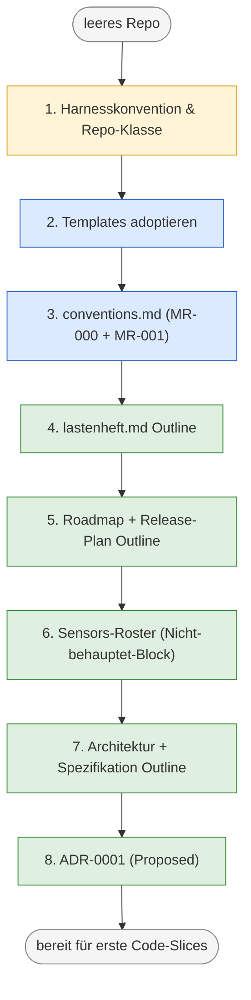
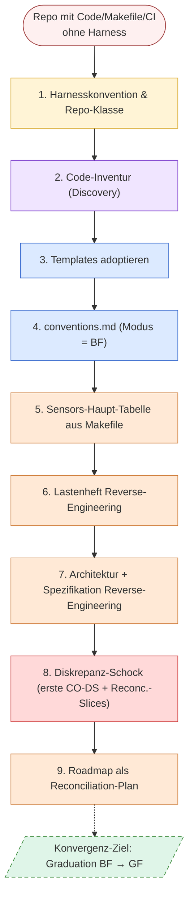

# Draft — Bootstrap-Zielbild (Konvention und Walkthroughs)

> **Status:** Working Notes, kein veröffentlichter Kurs-Lehrtext.
> Erfasst den Stand einer Konzept-Session auf Branch `harness-conventions`
> (Commit-Basis `0a99882` plus diese Datei). Wird später in den Kurs
> eingearbeitet als P4-Aktion (Bootstrap-Lehrtext in `konventionen.md`
> und ggf. Modul-1-Erweiterung).
>
> **Lesehilfe:** Diese Datei trägt drei Sichten — (1) das erweiterte
> Zielbild als Block-System, (2) zwei Bootstrap-Walkthroughs (Greenfield
> und Brownfield) als Schritt-Tabellen, (3) Schnittstellen zu
> existierenden Modulen. Die Diagramme sind Working-Notes-Mermaid, nicht
> Final-Kurs-Diagramme.

## Was diese Datei ist und was nicht

**Ist:** strukturierte Konsolidierung des Zielbilds, das in einer
Bootstrap-Session entstanden ist. Referenz für Folge-Arbeit (P2-Template
+ Worked Example, P4-Lehrtext).

**Ist nicht:** Kurs-Text, Pflicht-Konvention, Modul-Ersatz. Sprache und
Detailgrad sind Arbeitsnotizen.

---

## Teil 1 — Erweitertes Zielbild

### A. Identität und Rolle von `harness/README.md`

1. **Einstiegspunkt, keine neue Quelle.** Bündelt Pointer auf kanonische
   Quellen (Spec, ADR, Planning, AGENTS.md). Dupliziert keine Inhalte.
2. **Rang 9** in Source Precedence — verliert bei jedem Widerspruch.
3. **Pro Repo eine** Datei.
4. **Pflichtgliederung** (Purpose · Source precedence · Guides · Sensors
   · Traceability · Safety · Workflow).

### B. Sensors-Tabelle (Konvention)

5. **Drei Spalten** `Target | Vertrag | Bindung`. Kein Lauf-Status.
6. **Vier kanonische Bindung-Klassen** plus offene Erweiterung:
   - **ADR-Bindung** (`ADR-<NNN>`) — Gate setzt Architektur-Entscheidung
     durch.
   - **Carveout-Bindung** (`CO-<NNN>`) — Gate bewusst geschwächt, mit
     Auflösungs-Trigger und Folge-Slice.
   - **Kalibrierungs-Bindung** (Schwelle X %, M<n> → Y %) — bewegliche
     Eichung mit Meilenstein-Schaltplan.
   - **Reproduzierbarkeits-Bindung** (Image-Hash, Toolchain-Pin) — Gate
     hängt an bit-identischem Artefakt.
   - **Plus repo-spezifische Klassen** — z. B. Anforderungs-Bindung
     (`LH-…`), Compliance-Bindung, Modell-Version-Bindung. Werden im
     repo-lokalen Konventionsdokument (`harness/conventions.md`)
     deklariert.
7. **"Nicht behauptet"-Block** als Prosa-Pointer-Liste unter der
   Haupt-Tabelle. Trägt projektierte Make-Targets mit
   Realisierungs-Slice. **Keine Vertrag-/Bindung-Vorgriffe** — die
   entstehen erst bei Promotion in die Haupt-Tabelle.
8. **Lauf-Status** lebt in CI (Badges/Dashboard), nicht in der README.
   Strukturell rote Gates sind als Carveouts dokumentiert.

### C. Schreibreife — sektionsabhängig

9. **Purpose · Source precedence · Guides** — früh.
10. **Sensors** — inkrementell, mit dem Makefile.
11. **Bindung-Einträge** — wachsen mit den jeweiligen Quellen.
12. **Vollständig** — spät im Zyklus, *eines der letzten Artefakte*.

### D. Bootstrap als Entscheidungsserie (kein Ereignis)

13. **Schritt 1 — Harnesskonvention rezipieren** (Lerner-Schritt,
    extern). Entscheidung: welche Baseline?
14. **Schritt 2 — Templates adoptieren.** Entscheidung: welche
    Templates, wie tief?
15. **Schritt 3 — Konventionsdokument anlegen.** Existenz Pflicht,
    Form Wahl (siehe Block H).

### E. Greenfield-Modus und Brownfield-Modus

16. **Greenfield = Steady-State**, Doc → Code, Wunschbild führt.
17. **Brownfield = Übergangsmodus**, Code → Doc, **Konvergenz-Auftrag**
    zu GF. Pro Sub-Area deklariert.
18. **Graduation** = gated Ereignis. Sub-Area wechselt von BF zu GF,
    wenn: alle Diskrepanzen aufgelöst, Spec/ADR/Sensors decken
    Code-Stand, undeklarierte Hard Rules abgeglichen, intentionale
    Lücken als Carveouts. Dokumentiert im Adaptions-Block von
    `harness/conventions.md` als `MR-…`-Eintrag.
19. **Trigger-Richtung kippt mit Modus.** In BF: Code → Doc
    (Inventur). In GF: Doc → Code (Vertrag).
20. **Permanente BF-Deklaration** möglich für Code, der nicht
    konvergieren soll (z. B. Legacy in Deprecation) — mit
    Begründung und Folge-Slice analog zu Carveout-Disziplin.

### F. Was wo lebt

21a. **Kurs-Konventionen** → `kurs/de/grundlagen/` (pädagogisch).
21b. **Templates** → `lab/templates/` bzw. analog im eigenen Repo.
21c. **Strukturregeln** (projektgebunden) → `harness/conventions.md`.
21d. **Hard Rules** (Verhalten) → `AGENTS.md` (Rang 8).
22. **Strukturelle Inhalte** → ihre Verzeichnisse mit IDs.
23. **Source Precedence — Hard Rule plus Projektentscheidung.**
    Existenz universal; konkrete Rangordnung projektspezifisch.
    Liste in `harness/README.md`, Begründung im Adaptions-Block von
    `harness/conventions.md`.
24. **Lauf-Wahrheit** → CI/Badges/Dashboard.
25. **Bündelung als Pointer** → `harness/README.md`.

### G. (offene Punkte aus der Session — alle beantwortet)

Alle G-Punkte sind in den anderen Blöcken aufgegangen (Bindung-Klassen
in B6, Source Precedence als Entscheidung in F23, AGENTS.md ↔
harness/README.md ↔ conventions.md in F21d/c und Bemerkung in Teil 3).

### H. In-Repo-Konventionen — Hard Rule plus Wahl

26. **Hard Rule (nicht verhandelbar):** Ein Repo hat eine
    in-Repo verankerte Strukturkonvention. Existenz ist Pflicht.
27. **Form ist Wahl** — Entscheidungsmatrix:

    | Entscheidung | Optionen | Faktoren |
    |---|---|---|
    | Form | Einzeldatei · Verzeichnis · verstreut in AGENTS+README · top-level CONVENTIONS.md | Projektgröße · Adaptions-Frequenz · Team-Größe · Audit-Tiefe |
    | Pfad/Sichtbarkeit | `harness/conventions*` · `docs/conventions*` · top-level | Branchen-Konvention · Visibility-Hierarchie |
    | Adaptions-Disziplin | Prosa-Block · ADR-artige `MR-<NNN>`-Liste · eigener Lifecycle | Reversibilität · Audit-Anforderungen · Adaptions-Frequenz |
    | Verhältnis zur Source Precedence | Rang 0 · Rang meta · parallele Achse | Strenge des Teams |

28. **Bootstrap-Modi** — siehe Block E.
29. **Symmetrie zur Carveout-Disziplin:** "nicht ob, sondern wann ja,
    wie dokumentiert".

---

## Teil 2 — Bootstrap-Walkthroughs

### Greenfield-Walkthrough (Schritte 1–8)

| Schritt | Aktion | Berührte Dateien (Phasen-Übergang) | Trigger |
|---|---|---|---|
| 1 | Baseline + Repo-Klasse + ID-Schemata festlegen | keine | reift 2/3 |
| 2 | Templates kopieren | alle Skelette **0 → 1** | keine |
| 3 | `conventions.md` mit MR-000 (Baseline) + MR-001 (ARC-/SPEC-IDs als Adaption) | `conventions.md` 0 → 1 | T1 (Pointer in README), T2 (Pointer in AGENTS) |
| 4 | `lastenheft.md` Outline mit LH-FA-*/LH-QA-* | `lastenheft.md` 1 → 2 | keine direkt |
| 5 | `roadmap.md` mit Welle + Release-Mapping; `releasing.md` mit Strategie | `roadmap.md` 1 → 2; `releasing.md` 1 → 2 | keine |
| 6 | Sensors-Roster im "Nicht behauptet"-Block (Prosa-Pointer-Liste) | `README.md` §Sensors Sub-1→2; `AGENTS.md` §4 Sub-1→2 | T4 (Promotion bei Code-Slice) |
| 7 | Architektur + Spezifikation Outline mit ARC-*/SPEC-* | `architecture.md` 1 → 2; `spezifikation.md` 1 → 2 | T5 (erste ADR-Vorschläge) |
| 8 | ADR-0001 angelegt mit Status Proposed | `adr/0001-…md` 0 → 2; ADR-Index 1 → 2 | T6 (Cross-Ref in Spec), T7 (ADR-Review) |
| **Bootstrap-Ende** | Bereit für ersten Code-Slice (Workflow-Übergang) | — | — |

### Brownfield-Walkthrough (Schritte 1–9)

| Schritt | Aktion | BF-Besonderheit ggü. GF |
|---|---|---|
| 1 | wie GF, plus Modus-Antizipation "BF" | + Modus-Setzung |
| 2 | Code/Makefile/CI/Tests inventarisieren (Lerner-Schritt) | **neu in BF** — kein Repo-Artefakt |
| 3 | Templates adoptieren | wie GF |
| 4 | `conventions.md` mit Modus = BF | Modus-Block anders |
| 5 | Sensors-Haupt-Tabelle aus Makefile-Kommentaren | **gegenteilig zu GF** — Targets existieren, keine Promotion nötig |
| 6 | Lastenheft aus Code/Tests/CI rückbauen | Inventur-Umkehr; Diskrepanz-Material entsteht |
| 7 | Architektur + Spezifikation aus `src/` rückbauen; retroaktive ADRs für implizite Entscheidungen | ADRs teils retroaktiv |
| 8 | Diskrepanzen klassifizieren: CO-DS-* (orphan code), Reconc.-Slice (orphan requirement), retro-ADR (implicit decision) | **BF-spezifischer Schritt** |
| 9 | Roadmap als Reconciliation-Plan; letzte Welle = Graduation | Inhalt anders als GF |
| **Bootstrap-Ende** | Reconciliation-Backlog steht, Konvergenzpfad zu GF sichtbar | — |

### Phase × Modus — die zweidimensionale Reife-Matrix

| | Greenfield (Doc → Code) | Brownfield (Code → Doc) |
|---|---|---|
| Phase 1 Skelett | Template kopiert, *Versprechen* zu füllen | Template kopiert, *Inventur-Auftrag* an Code |
| Phase 2 Outline | Top-Level-Wunschbild | Top-Level-Bestandsaufnahme |
| Phase 3 partiell | Sektionen versprochen, Code folgt | Sektionen dokumentiert, andere unentdeckt |
| Phase 4 kohärent | Vertrag steht, Code wird daran gemessen | Inventur abgeglichen, **Diskrepanz-Schock sichtbar** |
| Phase 5 stabil | Change-Process aktiv | Reconciliation-Slice oder Carveout aktiv |

### Vier Trigger-Klassen

| Klasse | Beschreibung | Beispiel |
|---|---|---|
| **Sync-Trigger** | Pointer-Update zwischen Dokumenten | T1, T2 (Pointer auf conventions.md) |
| **Promotion-Trigger** | Eintrag wandert aus "Nicht behauptet"-Block in Haupt-Tabelle, ggf. mit Zusatzklassen-Deklaration | T4 |
| **Cross-Reference-Trigger** | Wechselseitige Verlinkung (z. B. ADR ↔ Spec) | T6 |
| **Review-Trigger / Acceptance-Trigger** | Phase-Übergang via Sign-off (z. B. ADR Proposed → Accepted) | T7 |

Plus: **Review-Findings als eigene Trigger-Klasse** (HIGH/MEDIUM/LOW) — in
diesem Draft nicht weiter operationalisiert, gehört in P4-Lehrtext.

---

## Teil 3 — Schnittstellen zu existierenden Modulen

| Modul | Verbindung zum Bootstrap-Zielbild |
|---|---|
| **Modul 1** (Source Precedence, Entwicklungszyklus) | Schritt 1–3 sind Vor-Phase davon. Die "sechs Schritte" in Modul 1 sind Source-Precedence-Schritte *innerhalb* von Bootstrap-Schritt 3. |
| **Modul 3** (ADRs) | ADRs als Bindung-Klasse (B6). In GF Schritt 8, in BF Schritt 7 retroaktiv. |
| **Modul 4–6** (Planning, Roadmap, Carveouts) | Roadmap in Schritt 5. **Brownfield-Carveouts** (`CO-DS-…`) sind neue Variante der Carveout-Disziplin aus Modul 6. |
| **Modul 8** (Implementation, AGENTS.md) | AGENTS.md trägt Source Precedence + Quality Gates *bewusst redundant* zu harness/README.md (Agent-Kontext-Garantie). |
| **Modul 10** (Verification, Steering-Loop) | **Bootstrap = Steering-Loop bis Graduation.** Modul 10 ist der Steady-State-Steering-Loop, Bootstrap ist seine Erstanwendung. |
| **Modul 12** (Quality Gates, Halluzinierte Gates) | Status-Spalten-Verbot, "Nicht behauptet"-Block-Disziplin, Modul-12-Anti-Pattern. |
| **Modul 13** (Docker-Harness) | Reproduzierbarkeits-Bindung (B6) hängt am Image-Hash. Erst nach Schritt 8 möglich. |

---

## Teil 4 — Offene Folgeschritte (Aktionsliste)

### Aus dem ursprünglichen P-System

| Priorität | Aktion | Status |
|---|---|---|
| P0 | Commit der initialen Status→Bindung-Edits | ✅ done (Commit `87e6030`) |
| P1 | Konsolidierende Edits in konventionen.md und Modul 1 | ✅ done (Commit `0a99882`) |
| P2 | `lab/templates/harness/conventions.template.md` + Index + Worked Example | ✅ done (Commit `625fa98`) |
| P3.1 | Querverweise im Lab-Beispiel (`harness/README.md`, `AGENTS.md`) — Trigger T1/T2 | ✅ done (Commit `be82d7f`) |
| P3.2 | Kurs-Querverweise (`modul-08`, `modul-12`, `abschlussprojekt`, `fallstudien`) | ✅ done (Commit `ef122b8`) |
| P4 | Bootstrap-Lehrtext aus diesem Draft destillieren | offen, eigene Session |

### Aus der Bootstrap-Session (neu)

- **Kurs-Default für ARC-*/SPEC-***: laut Praxis-Erfahrung sollten
  Architektur und Spezifikation eigene ID-Präfixe als *Default* tragen,
  nicht als Adaption. `konventionen.md §ID-Schema` müsste erweitert
  werden. — gehört in P3 oder eigene Aktion.
- **"Nicht behauptet"-Block-Template-Korrektur**: HTML-Kommentar im
  `harness/README.template.md` ergänzen mit "*keine Vertrag-/Bindung-
  Vorgriffe*". — kleine P3.
- **Brownfield-Carveout-Variante** (`CO-DS-…`) in Modul 6 ergänzen
  oder als eigene Modul-6.5-Sektion. — P4-Lehrtext.
- **Phase × Modus + Trigger-Klassen** als neues Lehrkonzept — gehört
  ins P4-Lehrtext oder eigenes Bootstrap-Modul.

### Sequenzierung

Stand nach Branch `harness-conventions`: **P0–P3.2 sind umgesetzt**
(siehe Aktionsliste oben mit Commit-Hashes). Offen bleibt nur
**P4 — Bootstrap-Lehrtext** aus diesem Draft destillieren — eigene
Session, weil substanziell: mindestens ein neuer Abschnitt in
`konventionen.md` zum Bootstrap-Entscheidungsrahmen, Erweiterung
von Modul 1 um einen expliziten Schritt 0 (Bootstrap-Modus-Wahl,
Baseline-Adoption), Modus-Diskussion (GF/BF) in `fallstudien.md`,
und ggf. eine eigene Übung in Modul 4 ("Wähle und begründe einen
Konventionen-Modus für dein Projekt").
