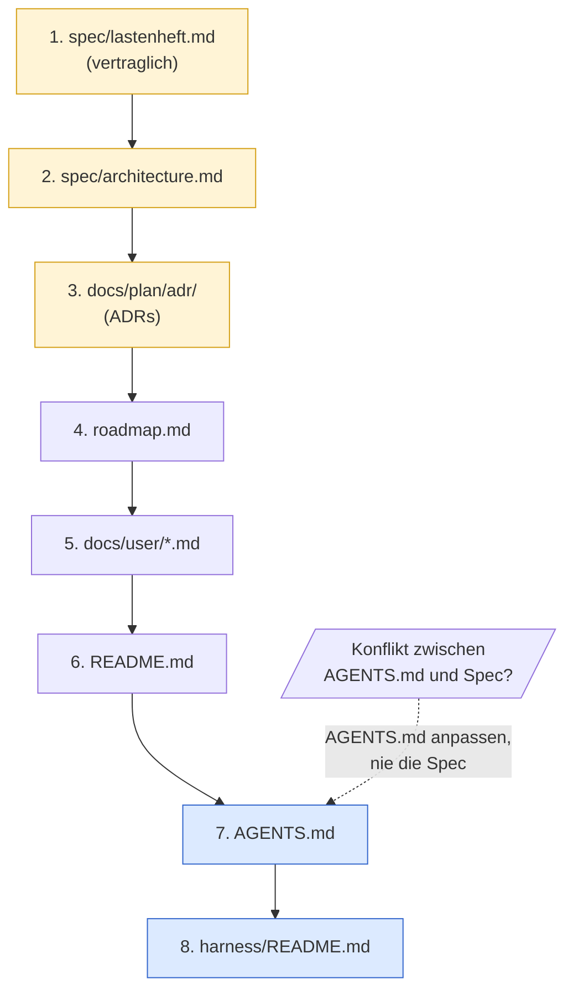
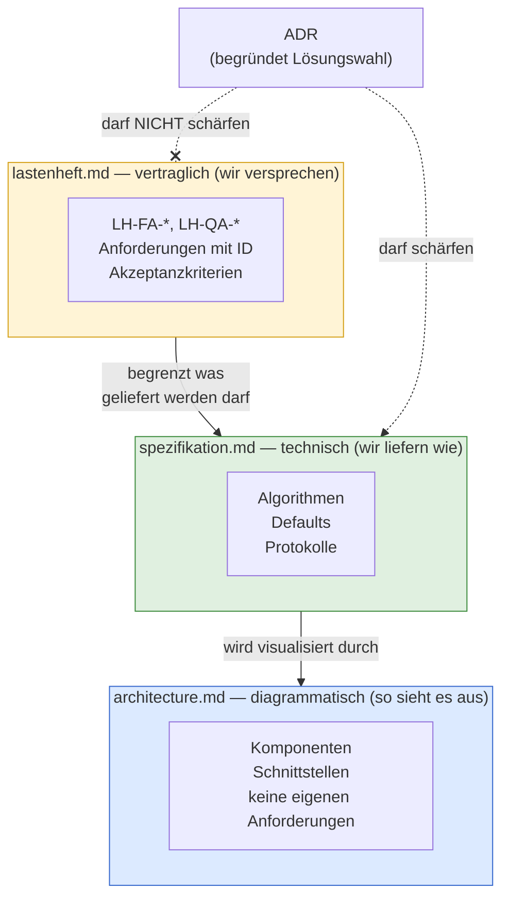

# Konventionen und Begriffe

Damit der Kurs handlich bleibt, treffen wir an ein paar Stellen feste
Entscheidungen. Diese Begriffe gelten durchgängig.

## Kernbegriffe

| Begriff | Bedeutung im Kurs |
|---|---|
| LLM | Modell, das Text → Text abbildet. Stateless. |
| Agent | LLM + Tool-Schnittstelle + Schleife. Hält Zustand über mehrere Turns. |
| Tool-Call | Strukturierter Aufruf einer Funktion durch das LLM (`name`, `arguments`, `result`). |
| Spec | Lastenheft-Artefakt unter `spec/`. Quelle der Wahrheit für *was*. |
| ADR | Architecture Decision Record unter `docs/plan/adr/`. Quelle der Wahrheit für *warum so*. |
| Slice | Kleinste lieferbare Einheit eines Features. Hat eigenen Plan, eigene DoD. |
| Welle | Bündel von Slices, das gemeinsam geplant und abgeschlossen wird. |
| Trigger | Beobachtbare Bedingung, bei der ein Slice/Welle/Carveout in den nächsten Status wandert. |
| Closure | Abschluss eines Slice oder einer Welle, dokumentiert mit Lerneintrag in `done/`. |
| Gate | Automatisch prüfbares Qualitätskriterium (Linter, Typecheck, Architekturtest, Coverage). |
| Carveout | Dokumentierte Ausnahme von einem Gate oder einer Architekturregel. |
| Skill | Repo-spezifisches Markdown/JSON-Artefakt, das einer Agenten-Rolle Checkliste oder Verhalten beibringt. Lebt typischerweise in `.harness/`. |
| Replay | Deterministisch wiederholbarer Agentenlauf gegen fixierte Inputs. |
| Golden Set | Kuratiertes Eingabe/Erwartungs-Paar für Regressionstests. |
| Finding | Einzelne Beobachtung eines Reviewers, kategorisiert HIGH/MEDIUM/LOW/INFO. |
| DoD | Definition of Done. Liste der Bedingungen, die ein Slice erfüllen muss. |
| Guide | Feedforward-Kontrolle: lenkt den Agenten *vor* der Handlung (Spec, ADR, AGENTS.md, Skill, Tool-Constraint). |
| Sensor | Feedback-Kontrolle: prüft *nach* der Handlung (Linter, Test, ArchUnit, Reviewer-Agent). |
| Fitness Function | Maschinell prüfbare Architektur-Aussage (z. B. Modulgrenze, Latenzbudget). |
| Steering Loop | Wiederkehrendes Muster: beobachtetes Agenten-Versagen → Guide/Sensor verbessern → Wiederholung reduzieren. |
| AGENTS.md | Maschinell lesbare Projekt-Konventionen für Agenten (Codestil, Tool-Regeln, Layering, Verbote). Quasi-Standard nach OpenAI/Codex. |
| Constrain / Inform | OpenAI-Doppelaufgabe des Harness: *constrain* = Grenzen ziehen (Architektur, Tools, Layer), *inform* = Kontext liefern (Spec, ADR, AGENTS.md, Skills). |
| Entropy Management | Aktive Pflege des Harness gegen Doku-Drift, tote Constraints und veraltete Konventionen. |
| Source Precedence | Geordnete Liste der kanonischen Quellen. Bei Konflikt gewinnt die höher rangierende. |
| `harness/README.md` | Pro-Repo-Einstiegspunkt: bündelt Source Precedence, Guides, Sensors, Traceability- und Safety-Regeln. Dupliziert keine Spec-Inhalte. |
| Hard Rule | Negativregel, die der Agent nie brechen darf (z. B. "Optimierer darf nie direkt aufs Gerät schreiben"). Repo-spezifisch. |
| Repo-Klasse | Charakter eines Repos im Harness: *Referenz* · *Safety/Control* · *Policy/Compliance*. Bestimmt, wie scharf Hard Rules und Sensors gesetzt werden. |
| ID-Schema | Stabile Präfix-Klammer (`LH-*`, `HSM-*`, `GG-*`), die Spec-Anforderungen, Make-Target-Kommentare, ADRs und Commits verbindet. |
| Spec-Stratifizierung | Aufteilung der Spec in *vertraglich* (Lastenheft) und *technisch* (Spezifikation) mit eigener Precedence-Regel. |
| Bootstrap-aware Gate | Gate mit weicher Frühphase: kennt eine Reifestufe und greift erst ab Trigger hart. Dokumentiert, was die Stufe ist. |

## Verzeichniskonvention

```
spec/                       # Lastenhefte
docs/plan/adr/              # Architecture Decision Records
docs/plan/planning/open/    # geplante, noch nicht gestartete Slices
docs/plan/planning/next/    # priorisiert für die nächste Welle
docs/plan/planning/in-progress/  # aktive Slices
docs/plan/planning/done/    # abgeschlossene Slices
docs/plan/planning/in-progress/roadmap.md   # Meilensteine, Wellen, aktive Welle
docs/plan/carveouts/        # Ausnahmen mit Plan zur Auflösung
AGENTS.md                   # maschinell lesbare Projekt-Konventionen für Agenten
harness/README.md           # Repo-Einstiegspunkt: Source Precedence, Guides, Sensors, Safety
.harness/                   # Skills, Tool-Allowlists, Checklisten-Middlewares
```

## Trennschärfen

- *Spec* beschreibt **was**, *ADR* begründet **warum so**, *Plan* legt **wann und wie** fest.
- *Review* prüft, ob Code gegen Plan und ADR konform ist; *Verifikation* prüft, ob das Ergebnis die DoD und die Spec erfüllt; *Validation* prüft, ob das Ergebnis den realen Bedarf trifft.
- *Linter*-Findings sind keine *Review*-Findings. Gates sind maschinell; Reviews sind agentisch.

## Source Precedence

Sobald mehr als ein Dokument existiert, gibt es Konflikte. Der Harness
muss vorher festlegen, wer gewinnt. Eine pragmatische Default-Reihenfolge
für ein typisches Repo:

1. `spec/lastenheft.md`
2. `spec/architecture.md`
3. `docs/plan/adr/README.md` und die darin referenzierten ADRs
4. `docs/plan/planning/in-progress/roadmap.md`
5. `docs/user/*.md` (Betriebs-/Operations-Docs — Quality-Definitionen, Releasing, Runbooks)
6. `README.md`
7. `AGENTS.md`
8. `harness/README.md`



Gelb: kanonische Quellen — Spec, Architektur, ADRs. Blau: Harness-Index
und Agenten-Konventionen — sie *beschreiben* die kanonischen Quellen,
sie *ersetzen* sie nicht.

Regel: Widerspricht `AGENTS.md` oder `harness/README.md` einer kanonischen
Quelle, wird `AGENTS.md`/`harness/README.md` angepasst — nie die kanonische
Quelle. Der Harness folgt der Spec, nicht umgekehrt.

**Universal vs projektabhängig.** *Dass* eine Source Precedence existiert
und dass bei Konflikt die niedriger rangierte Quelle angepasst wird, ist
universal (Hard Rule). *Welche* Rangordnung konkret gilt, ist
projektspezifische Entscheidung — die obige Liste ist eine pragmatische
Default-Reihenfolge für ein typisches Referenz/Tooling-Repo, kein
Gesetz. Andere Repo-Klassen können abweichende Rangordnungen begründen:
ein Safety/Control-Repo kann Hardware-Specs vor Software-Specs ranken;
ein Policy/Compliance-Repo kann Regulatorik-Anforderungen vor das
Lastenheft ranken (weil "wir versprechen" durch "wir müssen" begrenzt
wird). Die konkret getroffene Rangwahl und ihre Begründung gehören in
den Adaptions-Block des repo-lokalen Konventionsdokuments (Default-Pfad
`harness/conventions.md`).

### Spec-Stratifizierung

In reiferen Repos zerfällt `spec/` selbst in mehrere Tiefen mit eigener
Precedence:

| Datei | Charakter | Änderungs-Prozess |
|---|---|---|
| `spec/lastenheft.md` | **vertraglich abnahmebindend** (`LH-*` / `HSM-*`-IDs) | Change Request |
| `spec/spezifikation.md` | **technisch verbindlich, fortschreibbar** (Algorithmen, Defaults, Protokolle) | ADR-Schärfung erlaubt |
| `spec/architecture.md` | Diagramme, Komponentensicht, **keine eigenen Anforderungen** | Diagramm-Update |



Drei Schichten, drei Änderungs-Prozesse. Die kritische Hard Rule
(Beispiel `c-hsm-doc`, siehe [`fallstudien.md`](fallstudien.md)):
**ADRs DÜRFEN die Spezifikation schärfen, DÜRFEN NICHT das Lastenheft
schärfen.** Diese eine Regel kapselt die gesamte Trennung von
"wir liefern" und "wir versprechen".

### ID-Schema als Klammer

Ein konsistentes Präfix (`LH-*`, `HSM-*`, `GG-*`) verbindet:

* Anforderung in `spec/lastenheft.md`
* Make-Target-Kommentar (`coverage-gate: ## LH-FA-BUILD-008`)
* ADR-Body (`Bezug: HSM-LESE-004`)
* Commit-Message
* PR-Beschreibung

Damit wird der Traceability-Constraint maschinell prüfbar.

## harness/README.md als Einstiegspunkt

Pro Repo bündelt eine einzige Datei alles, was ein Agent oder ein neuer
Mensch zuerst lesen muss. Pflichtgliederung:

```
# Harness

## Purpose                  # ein Absatz, was diese Datei ist (und was nicht)
## Source precedence        # die obige Tabelle, repo-spezifisch
## Guides                   # Tabelle der Feedforward-Quellen
## Sensors                  # Tabelle der Feedback-Gates (nur real existierende!)
## Traceability rules       # Welche IDs müssen in Commits/PRs auftauchen?
## Safety and scope boundaries  # repo-spezifische Hard Rules
## Minimal agent workflow   # der 8-Schritt-Pfad (siehe Modul 8)
```

Wichtig: Die Sensors-Tabelle darf keine Befehle behaupten, die es im Repo
nicht gibt. Halluzinierte Gates sind die häufigste Form von Harness-Lüge.

Die Sensors-Tabelle trägt **keinen Lauf-Status** ("grün"/"rot"):
Lauf-Wahrheit pro Commit lebt in CI (Badges/Dashboard), also in höher
rangierten Quellen, nicht in `harness/README.md` (Rang 9). Strukturell
rote Gates werden als Carveout in `docs/plan/carveouts/` dokumentiert
(Modul 6); die Bindung-Spalte der Tabelle (`Target | Vertrag | Bindung`)
verweist auf die `CO-<NNN>`-ID, die Begründung lebt im Carveout, nicht
hier. Damit ist "rot dokumentieren, nicht verstecken" ortsdiszipliniert:
es geschieht im Carveout-Index, nicht in einer Status-Spalte, die sich
selbst grünfärben kann.

Die Bindung-Spalte trägt vier **kanonische Klassen**:

- **ADR-Bindung** (`ADR-<NNN>`) — Gate setzt eine Architektur-Entscheidung
  durch.
- **Carveout-Bindung** (`CO-<NNN>`) — Gate bewusst geschwächt, mit
  Auflösungs-Trigger und Folge-Slice (Modul 6).
- **Kalibrierungs-Bindung** (`Schwelle X %, M<n> → Y %`) — bewegliche
  Eichung mit Meilenstein-Schaltplan.
- **Reproduzierbarkeits-Bindung** (Image-Hash, Toolchain-Pin) — Gate
  hängt an bit-identischem Artefakt (Modul 13).

Repos können **weitere Klassen** einführen — etwa Anforderungs-Bindung
(`LH-…`), Compliance-Bindung (Regulatorik-Artikel) oder
Modell-Version-Bindung (für KI-Evals). Diese werden im **repo-lokalen
Konventionsdokument** deklariert (Default-Pfad `harness/conventions.md`,
Form projektabhängig), damit ein Reviewer sie als legitim erkennt und
nicht als Tippfehler abtut. Eine Bindung ohne Deklaration ist eine
stille Setzung — und damit eine Harness-Lüge in derselben Klasse wie
ein halluziniertes Gate.

## harness/conventions.md als Konventionsspeicher

`harness/conventions.md` trägt die **repo-lokalen Strukturregeln** und
Adaptionen ggü. der adoptierten Baseline (Kurs, interner Standard,
Industrie-Norm). Sie ist **Pflicht** (Existenz), ihre Form (Einzeldatei
vs. Verzeichnis, ADR-artig vs. Prosa) ist **Wahl** — projektabhängig
nach Projektgröße, Adaptions-Frequenz, Audit-Tiefe.

Pflichtgliederung (Default-Form als Einzeldatei):

| Abschnitt | Inhalt |
|---|---|
| Purpose | was die Datei trägt, was nicht |
| Baseline | welche Konvention adoptiert, mit Stand/Version |
| Adoptierte Konventions-Quellen | Pointer extern (Kurs/Standard) und in-Repo (Templates) |
| Adaptions-Block | ADR-artige Liste der Abweichungen ggü. Baseline (`MR-<NNN>` mit Datum, Geltungsbereich, Begründung, Auflösungs-Trigger oder "permanent") |
| Zusatzklassen-Deklaration für Sensors-Bindung | repo-spezifische Bindung-Klassen jenseits der vier kanonischen (`LH-…`, Compliance, Modell-Version) |
| Modus-Deklaration pro Sub-Area | Greenfield · Brownfield (mit Konvergenz-Auftrag) · Hybrid |
| Glossar (optional) | repo-spezifische Begriffe, die nicht im Kurs-Glossar stehen |

Wichtig: `harness/conventions.md` dupliziert keinen Baseline-Text — sie
verweist und ergänzt. Eine Kopie ginge gegen die Baseline in Drift,
sobald letztere sich weiterentwickelt. Zwei Quellen derselben
Konvention sind dasselbe Drift-Risiko, das die Source-Precedence-Regel
für Spec/ADR adressiert — hier in der Form-Ebene.

Vorlage:
[`/lab/templates/harness/conventions.template.md`](../../../lab/templates/harness/conventions.template.md).
Worked Example:
[`/lab/example/harness/conventions.md`](../../../lab/example/harness/conventions.md).

## Traceability-Constraint

Keine relevante Änderung ohne Bezug zu mindestens einem der folgenden Punkte:

* Requirement-ID
* Architektur-ID oder Architekturprinzip
* ADR-ID
* Test, Gate oder Demo-Artefakt
* Dokumentations-Update, falls ein öffentlicher Vertrag betroffen ist

Das ist eine *computational feedforward*-Kontrolle (siehe
[`klassifikation.md`](klassifikation.md)): ein Commit-Hook prüft, dass
die Nachricht mindestens eine ID enthält. Billig, deterministisch, und
sie zwingt den Implementation-Agent in die Source-Precedence-Kette zurück.
