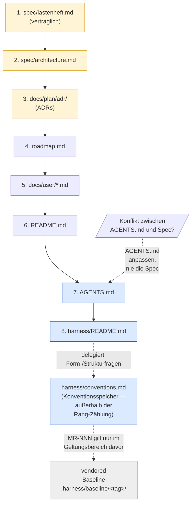
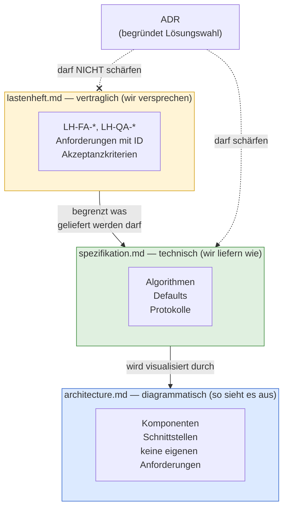
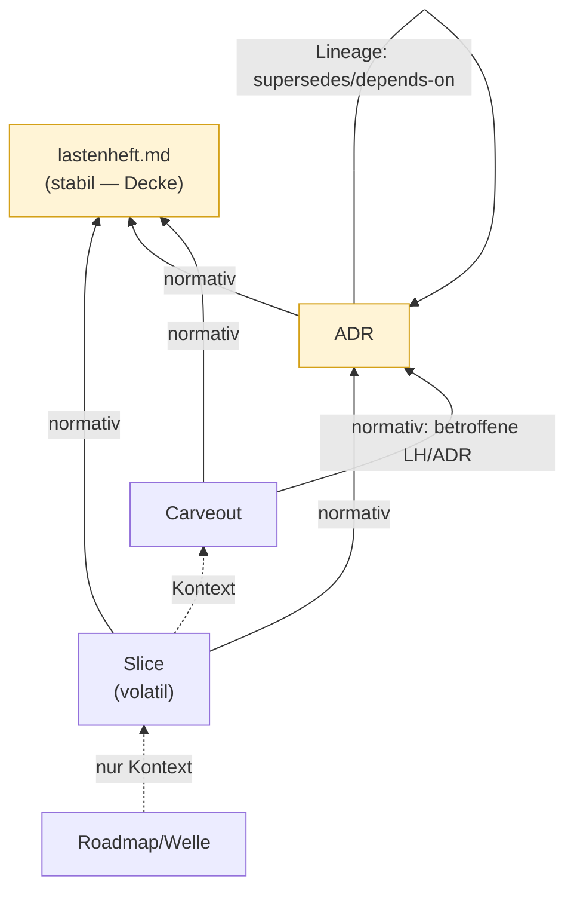
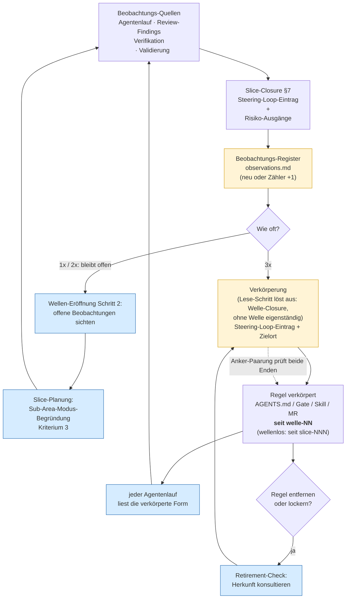

# Konventionen und Begriffe

Damit der Kurs handlich bleibt, treffen wir an ein paar Stellen feste
Entscheidungen. Diese Begriffe gelten durchgängig.

## Kernbegriffe

| Begriff | Bedeutung im Kurs |
|---|---|
| LLM | Modell, das Text → Text abbildet. Stateless. |
| Agent | LLM + Tool-Schnittstelle + Schleife. Hält Zustand über mehrere Turns. |
| Tool-Call | Strukturierter Aufruf einer Funktion durch das LLM (`name`, `arguments`, `result`). |
| SDLC / Lebenszyklus | Software Development Lifecycle; im Kurs *Entwicklungszyklus* genannt (Modul 1). Artefaktkette Spec → ADR → Plan → Code → Review → Verifikation → Closure mit verpflichtenden Rückwärtskanten (Lerneintrag, Folge-ADR). *Validierung* fehlt hier bewusst: sie prüft gegen den realen Bedarf außerhalb des Repos und hinterlässt kein Repo-Artefakt — ihr Ort ist die Rollen-Sequenz (Modul 8). |
| Spec | Lastenheft-Artefakt unter `spec/`. Quelle der Wahrheit für *was*. |
| ADR | Architecture Decision Record unter `docs/plan/adr/`. Quelle der Wahrheit für *warum so*. |
| Slice | Kleinste lieferbare Einheit eines Features. Hat eigenen Plan, eigene DoD. |
| Welle | Bündel von Slices, das gemeinsam geplant und abgeschlossen wird. |
| Trigger | Beobachtbare Bedingung, bei der ein Slice/Welle/Carveout in den nächsten Status wandert. |
| Closure | Abschluss eines Slice oder einer Welle, dokumentiert mit Lerneintrag in `done/`. |
| Gate | Automatisch prüfbares Qualitätskriterium (Linter, Typecheck, Architekturtest, Coverage). |
| Carveout | Dokumentierte Ausnahme von einem Gate oder einer Architekturregel. |
| Skill | Repo-spezifisches Markdown/JSON-Artefakt, das einer Agenten-Rolle Checkliste oder Verhalten beibringt. Lebt typischerweise in `.harness/`. |
| Replay | Deterministisch wiederholbarer Agentenlauf gegen fixierte Inputs. |
| Golden Set | Kuratiertes Eingabe/Erwartungs-Paar für Regressionstests. |
| Finding | Einzelne Beobachtung eines Reviewers, kategorisiert HIGH/MEDIUM/LOW/INFO. |
| DoD | Definition of Done. Liste der Bedingungen, die ein Slice erfüllen muss. |
| Guide | Feedforward-Kontrolle: lenkt den Agenten *vor* der Handlung (Spec, ADR, AGENTS.md, Skill, Tool-Constraint). |
| Sensor | Feedback-Kontrolle: prüft *nach* der Handlung (Linter, Test, ArchUnit, Reviewer-Agent). |
| Fitness Function | Maschinell prüfbare Architektur-Aussage (z. B. Modulgrenze, Latenzbudget). |
| Steering Loop | Wiederkehrendes Muster: beobachtetes Agenten-Versagen → Guide/Sensor verbessern → Wiederholung reduzieren. |
| AGENTS.md | Maschinell lesbare Projekt-Konventionen für Agenten (Codestil, Tool-Regeln, Layering, Verbote). Quasi-Standard nach OpenAI/Codex. |
| Constrain / Inform | OpenAI-Doppelaufgabe des Harness: *constrain* = Grenzen ziehen (Architektur, Tools, Layer), *inform* = Kontext liefern (Spec, ADR, AGENTS.md, Skills). |
| Entropy Management | Aktive Pflege des Harness gegen Doku-Drift, tote Constraints und veraltete Konventionen. |
| Harness-Lüge | Der Harness behauptet eine Kontrolle, die real nicht (mehr) greift — halluziniertes oder undeklariertes Gate, stille Setzung, Pointer auf nicht existierende Mechanik. Häufigste Form: behauptete Gates ohne Make-Target. |
| Source Precedence | Geordnete Liste der kanonischen Quellen. Bei Konflikt gewinnt die höher rangierende. |
| `harness/README.md` | Pro-Repo-Einstiegspunkt: bündelt Source Precedence, Guides, Sensors, Traceability- und Safety-Regeln. Dupliziert keine Spec-Inhalte. |
| `harness/conventions.md` | Repo-lokaler Konventionsspeicher: trägt Strukturregeln und Adaptionen ggü. der adoptierten Baseline (`MR-<NNN>`-Liste, Zusatzklassen für Sensors-Bindung, Modus-Deklaration pro Sub-Area). Pflicht; Form (Einzeldatei/Verzeichnis) ist Wahl. |
| Hard Rule | Negativregel, die der Agent nie brechen darf (z. B. "Optimierer darf nie direkt aufs Gerät schreiben"). Repo-spezifisch. |
| Repo-Klasse | Charakter eines Repos im Harness: *Referenz* · *Safety/Control* · *Policy/Compliance*. Bestimmt, wie scharf Hard Rules und Sensors gesetzt werden. |
| ID-Schema | Stabile Präfix-Klammer (`LH-*`, `HSM-*`, `GG-*`), die Spec-Anforderungen, Make-Target-Kommentare, ADRs und Commits verbindet. |
| `BEO-<NNN>` | Kennung einer Beobachtung im Beobachtungs-Register ([Modul 6](../02-planung/modul-06-roadmap.md#das-beobachtungs-register)). Vergabestelle ist das Register selbst; sie macht den Zähler unabhängig vom Wortlaut der Bezeichnung. |
| Referenz-Richtung (SDP) | Normative Referenzen zeigen nur volatil→stabil (`lastenheft.md` › ADR › Slice); Abwärts-/Seitwärts-Verweise sind Kontext, keine Spezifikation. Siehe [§Referenz-Richtung](#referenz-richtung-sdp-wer-darf-wen-referenzieren). |
| Spec-Stratifizierung | Aufteilung der Spec in *vertraglich* (Lastenheft) und *technisch* (Spezifikation) mit eigener Precedence-Regel. |
| Stratum | Rollen-Klasse eines Spec-Dokuments — *Vertrag* (Decke) · *Technik* · *Sicht* —, bestimmt über normativen Gehalt und Änderungs-Prozess, nicht über den Dateinamen. Rang: Vertrag › Technik › Sicht; nur Vertrag und Sicht sind obligatorisch. Siehe [§Spec-Straten](#spec-straten-mehr-als-ein-spec-dokument). |
| Bootstrap-aware Gate | Gate mit weicher Frühphase: kennt eine Reifestufe und greift erst ab Trigger hart. Dokumentiert, was die Stufe ist. |

## Verzeichniskonvention

```
spec/                       # Lastenhefte
docs/plan/adr/              # Architecture Decision Records
docs/plan/planning/open/    # geplante, noch nicht gestartete Slices
docs/plan/planning/next/    # priorisiert/eingeplant
docs/plan/planning/in-progress/  # aktive Slices
docs/plan/planning/done/    # abgeschlossene Slices
docs/plan/planning/<welle-id>.md            # offene Wellen, flach (Modul 6)
docs/plan/planning/observations.md          # Beobachtungs-Register: der Steering-Loop-Zähler
docs/plan/planning/in-progress/roadmap.md   # Meilensteine, Wellen, aktive Welle
docs/plan/carveouts/        # Ausnahmen mit Plan zur Auflösung
docs/reviews/               # Review-Reports, ein Report pro Lauf (Modul 10)
AGENTS.md                   # maschinell lesbare Projekt-Konventionen für Agenten
harness/README.md           # Repo-Einstiegspunkt: Source Precedence, Guides,
Sensors, Safety
harness/conventions.md      # repo-lokale Strukturregeln und Adaptionen ggü.
Baseline (MR-NNN, Modus pro Sub-Area)
.harness/                   # Skills, Tool-Allowlists, Checklisten-Middlewares
```

## Trennschärfen

- *Spec* beschreibt **was**, *ADR* begründet **warum so**, *Plan* legt **wann
und wie** fest.
- *Review* prüft, ob Code gegen Plan und ADR konform ist; *Verifikation*
prüft, ob das Ergebnis die DoD und die Spec erfüllt; *Validation* prüft, ob
das Ergebnis den realen Bedarf trifft.
- *Linter*-Findings sind keine *Review*-Findings. Gates sind maschinell;
Reviews sind agentisch.

## Source Precedence

Sobald mehr als ein Dokument existiert, gibt es Konflikte. Der Harness
muss vorher festlegen, wer gewinnt. Eine pragmatische Default-Reihenfolge
für ein typisches Repo:

1. `spec/lastenheft.md`
2. `spec/architecture.md`
3. `docs/plan/adr/README.md` und die darin referenzierten ADRs
4. `docs/plan/planning/in-progress/roadmap.md`
5. `docs/user/*.md` (Betriebs-/Operations-Docs — Quality-Definitionen,
Releasing, Runbooks)
6. `README.md`
7. `AGENTS.md`
8. `harness/README.md`


```mermaid
flowchart TD
    L["1. spec/lastenheft.md<br/>(vertraglich)"] --> S["2. spec/architecture.md"]
    S --> A["3. docs/plan/adr/<br/>(ADRs)"]
    A --> R["4. roadmap.md"]
    R --> U["5. docs/user/*.md"]
    U --> RM["6. README.md"]
    RM --> AG["7. AGENTS.md"]
    AG --> H["8. harness/README.md"]
    H -. "delegiert Form-/Strukturfragen" .->
    C["harness/conventions.md<br/>(Konventionsspeicher —<br/>außerhalb der
    Rang-Zählung)"]
    C -. "MR-NNN gilt nur im<br/>Geltungsbereich davor" .-> B["vendored
    Baseline<br/>.harness/baseline/&lt;tag&gt;/"]
    style L fill:#fff4d6,stroke:#d4a017
    style S fill:#fff4d6,stroke:#d4a017
    style A fill:#fff4d6,stroke:#d4a017
    style AG fill:#dceaff,stroke:#3366cc
    style H fill:#dceaff,stroke:#3366cc
    style C fill:#dceaff,stroke:#3366cc
    style B fill:#eeeeee,stroke:#999999

    Conflict[/"Konflikt zwischen<br/>AGENTS.md und Spec?"/] -. "AGENTS.md
    anpassen,<br/>nie die Spec" .-> AG
```

Gelb: kanonische Quellen — Spec, Architektur, ADRs. Blau: Harness-Index
und Agenten-Konventionen — sie *beschreiben* die kanonischen Quellen,
sie *ersetzen* sie nicht — `harness/conventions.md` beschreibt sie nicht,
sondern setzt repo-lokale Struktur. Grau: adoptierte Baseline, kein
Repo-Dokument. Durchgezogene Kanten sind die Rangfolge, gestrichelte sind
Zuständigkeits- und Auflösungsbeziehungen.

Regel: Widerspricht `AGENTS.md`, `harness/README.md` oder
`harness/conventions.md` einer kanonischen Quelle, wird die niedriger
rangierte Datei angepasst — nie die kanonische Quelle. Der Harness folgt
der Spec, nicht umgekehrt.

**Die Harness-Schicht darunter: `conventions.md` und die Baseline.**
Zwei Dinge stehen bewusst **nicht** in der Rangliste. `harness/conventions.md`
ist kein weiterer Rang, sondern der **Konventionsspeicher**, an den die
rangierten Dokumente Form- und Strukturfragen *abtreten*: ID-Schemata,
Verzeichniskonvention, Zusatzklassen, Modus-Deklarationen, Adaptionen
([§harness/conventions.md als Konventionsspeicher](#harnessconventionsmd-als-konventionsspeicher)).
Wo `AGENTS.md` oder `harness/README.md` zu einer solchen Frage nichts sagen,
entsteht deshalb **kein Konflikt, sondern eine Zuständigkeit** — die Rangliste
entscheidet über *Inhalt*, der Konventionsspeicher über *Form*. In der
3-Strata-Form, die die
Templates ausliefern, wäre der Platz ohnehin aufgebraucht — neun Ränge, das
Maximum aus [Modul 1](../01-spec-und-architektur/modul-01-entwicklungszyklus.md).

Das vendored Regelwerk unter `.harness/baseline/<tag>/` steht noch darunter —
übernommenes Fremdmaterial, keine Aussage dieses Repos. Der Anschluss läuft
über den Konventionsspeicher: **Eine `MR-<NNN>` gilt innerhalb ihres
deklarierten Geltungsbereichs vor der Baseline; außerhalb davon gilt die
Baseline unverändert.** Das ist keine zusätzliche Regel, sondern die
Definition einer Adaption — sie steht hier, weil ein Agent, der nur die
Rangliste liest, die Antwort sonst nicht findet.

Daraus folgt die Grenze — sie liegt in der *Wirkung*, nicht im Feld
`Geltungsbereich` (das nennt den Repo-Ausschnitt, nicht den Baseline-Ausschnitt;
welche Baseline-Regel betroffen ist, steht in `Adaption`): Eine `MR-<NNN>`, die
die Baseline **pauschal für nicht anwendbar erklärt**, statt eine benannte Regel
zu ersetzen, ist kein Adaptions-Eintrag mehr, sondern ein **Fork** — sie nimmt
der Baseline die Eigenschaft, gegen die man auditieren kann. *Gelesen wird die Grenze beim **Schreiben** eines Eintrags* — der Adaptions-Block der
`conventions`-Vorlage schickt den Autor hierher; sie ist Entwurfszeit-Regel,
kein Prüfpunkt der Closure. Eine repo-weite
`MR-<NNN>`, die *eine benannte Regel* ersetzt, ist dagegen eine normale
Adaption, und ein Eintrag, der *keine* Abweichung deklariert — die
Baseline-Aussage `MR-000` —, ist weder Fork noch Adaption, sondern die
Adoptions-Erklärung selbst. (Eine *fehlende* Geltungsbereichs-Angabe ist kein
eigener Fall,
sondern ein Formfehler: Das Feld ist Pflicht.) Wird eine `MR-<NNN>`
durch ein Baseline-Update **gegenstandslos**, wird sie nicht überschrieben:
Sie bekommt einen Nachfolger, der sie auflöst und den Baseline-Stand nennt,
der die Ablösung ausgelöst hat — dieselbe Append-only-Disziplin
wie bei ADRs. Widerspricht sie der neuen Fassung, gilt sie in ihrem
Geltungsbereich weiter; der Widerspruch gehört aber benannt
([Modul 2 §Freshness-Audit](../01-spec-und-architektur/modul-02-harness-bootstrap.md)).

**Universal vs projektabhängig.** *Dass* eine Source Precedence existiert
und dass bei Konflikt die niedriger rangierte Quelle angepasst wird, ist
universal (Hard Rule). *Welche* Rangordnung konkret gilt, ist
projektspezifische Entscheidung — die obige Liste ist eine pragmatische
Default-Reihenfolge für ein typisches Referenz/Tooling-Repo, kein
Gesetz. Andere Repo-Klassen können abweichende Rangordnungen begründen:
ein Safety/Control-Repo kann Hardware-Specs vor Software-Specs ranken;
ein Policy/Compliance-Repo kann Regulatorik-Anforderungen vor das
Lastenheft ranken (weil "wir versprechen" durch "wir müssen" begrenzt
wird). Die konkret getroffene Rangwahl und ihre Begründung gehören in
den Adaptions-Block des repo-lokalen Konventionsdokuments (Default-Pfad
`harness/conventions.md`).

### Spec-Stratifizierung

In reiferen Repos zerfällt `spec/` selbst in mehrere Tiefen mit eigener
Precedence:

| Datei | Charakter | Änderungs-Prozess |
|---|---|---|
| `spec/lastenheft.md` | **vertraglich abnahmebindend** (`LH-*` / `HSM-*`-IDs) | Change Request |
| `spec/spezifikation.md` | **technisch verbindlich, fortschreibbar** (Algorithmen, Defaults, Protokolle) | ADR-Schärfung erlaubt |
| `spec/architecture.md` | Diagramme, Komponentensicht, **keine eigenen Anforderungen** | Diagramm-Update |


```mermaid
flowchart TD
    subgraph LH["lastenheft.md — vertraglich (wir versprechen)"]
        LH1["LH-FA-*, LH-QA-*<br/>Anforderungen mit ID<br/>Akzeptanzkriterien"]
    end
    subgraph SP["spezifikation.md — technisch (wir liefern wie)"]
        SP1["Algorithmen<br/>Defaults<br/>Protokolle"]
    end
    subgraph AR["architecture.md — diagrammatisch (so sieht es aus)"]
        AR1["Komponenten<br/>Schnittstellen<br/>keine eigenen Anforderungen"]
    end
    LH -- "begrenzt was<br/>geliefert werden darf" --> SP
    SP -- "wird visualisiert durch" --> AR
    ADR["ADR<br/>(begründet Lösungswahl)"] -. "darf schärfen" .-> SP
    ADR -. "darf NICHT schärfen" .-x LH
    style LH fill:#fff4d6,stroke:#d4a017
    style SP fill:#e0f0e0,stroke:#3a8a3a
    style AR fill:#dceaff,stroke:#3366cc
```

Drei Schichten, drei Änderungs-Prozesse. Die kritische Hard Rule
(Beispiel `c-hsm-doc`, siehe [`fallstudien.md`](fallstudien.md)):
**ADRs DÜRFEN die Spezifikation schärfen, DÜRFEN NICHT das Lastenheft
schärfen.** Diese eine Regel kapselt die gesamte Trennung von
"wir liefern" und "wir versprechen".

„Change Request" ist **bewusst kein Harness-Konstrukt** — kein
`CR-*`-ID-Schema, keine eigene Datei, kein Gate — sondern der *externe*
Vorgang, in dem eine Vertragsänderung mit dem Auftraggeber vereinbart
wird. Im Repo hinterlässt ein *angenommener* Change Request nur einen
**Fußabdruck**: ein Version-Bump des Lastenhefts, eine Zeile in dessen
`## Historie` mit Verweis auf den externen CR (Ticket, Vertragsanhang),
und die geänderten `LH-*`/`HSM-*` selbst. Abgelehnte oder schwebende
CRs leben außerhalb des Repos. Weil nur dieser externe Prozess das
Lastenheft ändern darf, gilt die Hard Rule für *jede* interne Quelle:
**weder ADR noch Slice dürfen `LH-*` je ändern** — sie referenzieren
nur.

### ID-Schema als Klammer

Ein konsistentes Präfix (`LH-*`, `HSM-*`, `GG-*`) verbindet:

* Anforderung in `spec/lastenheft.md`
* Make-Target-Kommentar (`coverage-gate: ## LH-FA-BUILD-008`)
* ADR-Body (`Bezug: HSM-LESE-004`)
* Commit-Message
* PR-Beschreibung

Damit wird der Traceability-Constraint maschinell prüfbar.

### Referenz-Richtung (SDP): wer darf wen referenzieren

Das ID-Schema *verbindet* Artefakte — aber nicht jede Verbindung ist
erlaubt. Welche Referenz *normativ* wirken darf, regelt eine einzige
Asymmetrie, das **Stable Dependencies Principle**: Abhängigkeiten zeigen
zum Stabileren. Die [§Spec-Stratifizierung](#spec-stratifizierung) oben
ist der Spezialfall *innerhalb* von `spec/` ("ADR darf Spezifikation
schärfen, nie das Lastenheft"); die folgende Matrix dehnt dieselbe Logik
auf die ganze Artefakt-Kette aus.

**Stabilitäts-Rang** (stabil → volatil): **Vertrag › ADR › Slice** — die
Hauptmatrix zeigt die Primär-Typen; zwischen Vertrag und ADR liegen die
weiteren Spec-Straten **Technik › Sicht** (`spezifikation.md`,
`architecture.md`), entfaltet in [§Spec-Straten](#spec-straten-mehr-als-ein-spec-dokument).
`lastenheft.md` instanziiert das Vertrags-Stratum. Carveout liegt auf
Slice-Ebene, Roadmap/Welle außerhalb. Wir kollabieren
Martins kontinuierliche Instabilitäts-Metrik (`I = Ce/(Ca+Ce)`) bewusst
auf einen **Typ-Rang** — die Artefakt-Taxonomie ist endlich und benannt,
damit wird die Regel lehr- und prüfbar.

> **Die Matrix-Zeilen sind Stratum-*Klassen*, nicht Dateinamen.** Die Zeile
> „Lastenheft" steht für das **Vertrags-Stratum** (die Decke); ein Projekt
> kann mehrere Vertrags-, Technik- und Sicht-Dokumente haben. Wie ein neues
> Spec-Dokument einem Stratum zugeordnet wird — und warum die Decke nicht
> fix `lastenheft.md` ist — regelt [§Spec-Straten](#spec-straten-mehr-als-ein-spec-dokument)
> unten.

| Dokument ↓ referenziert → | Lastenheft | ADR | Slice | Carveout | Roadmap/Welle |
|---|---|---|---|---|---|
| **Lastenheft** | Normativ: nur intra-`LH-*` | ❌ | ❌ | ❌ | ❌ |
| **ADR** | Normativ: `LH-*`-Grundlage | Normativ/Lineage: aktive ADRs als Grundlage; superseded nur ADR-interne Historie | Kontext: Status-Provenance, Verifikations-Zeiger — *keine* Entscheidungsgrundlage | ❌ | ❌ |
| **Slice** | Normativ: `LH-*`-Scope | Normativ: nur aktive ADRs | Kontext: triggered-by, blocked-by, follow-up-of | Kontext: eigener/offener Carveout, Debt-/Closure-Rückverweis | Kontext: Einordnung in Welle/Roadmap |
| **Carveout** | Normativ: betroffene `LH-*` | Normativ: betroffene aktive ADRs | Kontext/Traceability: owner/verursachender/schließender Slice | Kontext: ersetzt/zusammengeführt/abhängig | Kontext: Welle/Planungseinordnung |
| **Roadmap/Welle** | Kontext: Zielbild/Scope | Kontext: Architekturhintergrund | Kontext: Orchestrierung/Sequenz | Kontext: Risiko-/Debt-Übersicht | Kontext: Hierarchie/Sequenz |


```mermaid
flowchart BT
    S["Slice<br/>(volatil)"] -->|normativ| A["ADR"]
    S -->|normativ| L["lastenheft.md<br/>(stabil — Decke)"]
    A -->|normativ| L
    A -->|Lineage: supersedes/depends-on| A
    C["Carveout"] -->|normativ: betroffene LH/ADR| A
    C -->|normativ| L
    S -. Kontext .-> C
    R["Roadmap/Welle"] -. nur Kontext .-> S
    style L fill:#fff4d6,stroke:#d4a017
    style A fill:#fff4d6,stroke:#d4a017
```

Solide Kanten = normativ (immer aufwärts + die eine ADR-interne Lineage-
Schleife). Gestrichelt = Kontext. **Die normativen Kanten bilden einen
strikt aufwärts gerichteten azyklischen Graphen (DAG) plus genau eine
Selbstkante** — kein Baum, denn Slice, Carveout und ADR haben je *zwei*
normative Eltern (Slice/Carveout → ADR *und* `LH-*`; ADR → `LH-*` *und*
Spec-§). Das ist die ganze Theorie in einem Bild.

**Tragende Regeln:**

1. **Normativ nur volatil → stabil.** Alles Richtung Slice oder zwischen
   Slices ist Planungskontext, keine Spezifikation.
2. **Autorität schlägt Stabilität.** Eine superseded ADR ist historisch
   stabil, aber nicht autoritativ — Slices referenzieren nur *aktive*
   ADRs. Die Supersedes-Kette bleibt ADR-intern.
3. **Carveout → Slice ist keine normative Abhängigkeit** — Schuld-,
   Ablauf- und Traceability-Buchführung (owner, Ursache, Closure). Die
   fachliche Begründung läuft nie über den Slice, sondern über `LH-*`
   oder aktive ADR.
4. **Roadmap/Welle steht außerhalb der normativen Klammer** — darf Slices
   orchestrieren und gruppieren, erzeugt aber keine Spezifikation.
5. **Provenance: Body vs. Changelog.** Ein Abwärts-Zeiger im
   *Anforderungs-/Entscheidungs-Text* ist verboten. Provenance in einer
   abgegrenzten *Versions-/Historie-Tabelle am Dokument-Rand* ist Kontext
   und für alle Artefakte erlaubt (die Slice-ID bleibt ein stabiler
   Token, auch nachdem die Datei nach `done/` wandert). Der Unterschied
   ist nicht der Stabilitätsrang, sondern *ob die Referenz Teil der
   Spezifikations-Logik ist*.

**ADR-Lineage vs. Carveout-Lineage — gleiche Form, andere Normativität.**
Die Diagonalzellen ADR→ADR und Carveout→Carveout sehen identisch aus
(supersede / depends-on / merged), tragen aber entgegengesetzte Kraft:

| | Form | Normativ? | Warum |
|---|---|:---:|---|
| ADR→ADR | Supersedes, Depends-on | **ja** (Lineage) | ADRs sind *Entscheidungen* → tragen Autorität |
| Carveout→Carveout | ersetzt, zusammengeführt | **nein** (Kontext) | Carveouts sind *Schuld* → tragen nur Buchführung |

Die Matrix entscheidet damit nicht über *Linktypen*, sondern über
*Artefaktnatur* — derselbe Pfeil bedeutet je nach Quell-Artefakt etwas
anderes.

**Prüfung — zwei Ebenen.** Die Referenz-Regeln zerfallen in *mechanisch
entscheidbare* und *semantische* Kanten; ein einzelner grep deckt nur die
erste Hälfte ab.

*Maschineller Gate (`check-references`, fail-closed in `make verify`)* —
eine *computational feedforward*-Kontrolle wie der
[Traceability-Constraint](#traceability-constraint):

- ein Spec-Stratum (`lastenheft.md`, `spezifikation.md`, `architecture.md`)
enthält `ADR-` oder `slice-` *außerhalb* der Historie-/Versions-Tabelle → fail
- Slice referenziert eine ADR mit `Status: Superseded` → fail

Damit Regel 5 mechanisch greift, lebt Provenance nur unterhalb einer
designierten Überschrift (z. B. `## Geschichte` oder die Versions-Tabelle),
die der Check von der Prüfung ausnimmt.

*Aufwärts-Kanten als klickbare Links — und ihre Reifestufe.* Die erlaubten
Aufwärts-Referenzen — die ADR-Felder `**Bezug:**` und `**Schärft:**`
([§Spec-Straten](#spec-straten-mehr-als-ein-spec-dokument)) — werden als
**Markdown-Link** geschrieben, nicht als nackte ID, so kommt der Leser
direkt zur Quelle. Der
`check-references`-Gate hier prüft aber nur die *Token-Richtung* (kein
`ADR-`/`slice-` abwärts im Spec-Körper), **nicht** die Link-/Anker-Auflösung:
Wird eine Ziel-Überschrift umbenannt, rottet der Aufwärts-Link *still* — die
gleiche Rot-Klasse, die wir abwärts verboten haben, nur unbewacht. Die
mechanisch erzwungene Reifestufe löst Links auf, prüft Anker-Existenz und
erzwingt die volle Matrix am Zielknoten; Referenz-Implementierung ist
`tools/check_refs.py` aus dem u-boot-Harness (gleiche Build-Familie). <!-- d-check:ignore (Datei liegt im u-boot-Repo) --> Das Lab
bleibt bewusst bei der grep-Variante, um die mechanische Hälfte minimal und
lesbar zu halten.

*Agentischer Review-Sensor (nicht grep-bar).* Ob eine ADR→Slice-Referenz
ein erlaubter *Verifikations-Zeiger/Provenance* oder eine verbotene
*Entscheidungsgrundlage* ist, ist eine semantische Unterscheidung — sie
gehört zum Reviewer-Agenten, nicht zum Linter. Ein grep, der jedes
`slice-NNN` im ADR-Body fängt, würde legitime Verifikations-Zeiger (etwa
„`make test-determinism` (slice-009) verifiziert auch LH-FA-IDX-003")
falsch-positiv flaggen. Faustregel für den Reviewer: *referenziert die
ADR den Slice, um eine Entscheidung zu **begründen** (verboten) oder um
zu zeigen, wo sie **verifiziert/entstanden** ist (erlaubt)?*

Bereits `Accepted`-ADRs sind immutable: vor Einführung dieser Konvention
entstandene Grenzfälle werden **grandfathered**, nicht durch eine
superseding ADR nachgezogen. Der Gate prüft nur ab Einführung neu.

#### Spec-Straten: mehr als ein Spec-Dokument

Reale Projekte haben mehr als drei Spec-Dateien — `api-spec.md`,
`data-model.md`, `sla.md`, `compliance.md`. Die Matrix operiert deshalb
auf **Stratum-Klassen** (Rolle), nicht auf Dateinamen. Jedes Spec-Dokument
fällt über zwei Achsen — *normativer Gehalt* und *Änderungs-Prozess* — in
genau ein Stratum:

| Stratum | Normativer Gehalt | Änderungs-Prozess | Lab | typisch auch |
|---|---|---|---|---|
| **Vertrag** (Decke) | eigene Anforderungen, abnahmebindend | Change Request | `lastenheft.md` | `compliance.md`, `sla.md` |
| **Technik** | eigene technische Festlegungen | fortschreibbar, ADR-Schärfung erlaubt | `spezifikation.md` | `api-spec.md`, `data-model.md` |
| **Sicht** | *keine* eigenen Anforderungen, derivativ | Diagramm-/View-Update | `architecture.md` | `deployment.md`, Sequenz-Views |

**Nur Vertrag und Sicht sind obligatorisch; das Technik-Stratum ist
optional.** Repos, die ihre technischen Festlegungen direkt in Vertrag
oder Sicht falten, enforcen real nur zwei Klassen — das u-boot-Harness
etwa klassifiziert ausschließlich `contract_spec` (`lastenheft.md`) und
`view_spec` (`architecture.md`), ohne separates Technik-Stratum. Die Rang-
*Ordnung* bleibt dieselbe; ein nicht vorhandenes Stratum fällt einfach aus
der Kette.

Generalisierter Rang: **Vertrag › Technik › Sicht › ADR › Slice** —
deckungsgleich mit „Lastenheft sticht Spezifikation sticht Architektur"
([§Spec-Stratifizierung](#spec-stratifizierung), [§Source Precedence](#source-precedence))
und der [Konzeptkarten-Artefaktkette](konzeptkarte.md#artefaktkette). (Die
drei Ordnungen — Herleitung, Konflikt-Autorität, Referenz-Stabilität —
fallen für diese Kette *zusammen*; sie divergieren nur an der
superseded-ADR-Grenze, Regel 2.)

Die ADR ist die *Begründungs*-Schicht **unter** den Spec-Straten — und
**ihre Kanten zeigen aufwärts**:

- **ADR → `LH-*`**: die ADR referenziert die Anforderung, die sie begründet
  (wie in der Hauptmatrix).
- **ADR → Spec-§**: die ADR *deklariert, was sie schärft* (Acceptance-
  Trigger, [§Vier Trigger-Klassen](#vier-trigger-klassen)). **Hier wohnt
  die Änderungskopplung**: wer die ADR ändert, liest aus ihr selbst, welche
  Spec-Stellen nachzuziehen sind.

Die Gegenrichtung **Spec → ADR existiert im bindenden Text nicht** — und
auch nicht als geduldete Quellen-Spalte: der Wert steht für sich, das Warum
findet man über die *aufwärts* zeigende ADR. Die einzige tolerierte
Provenance ist die Historie-/Changelog-Tabelle am Dokument-Rand (Regel 5),
sonst nichts — ein Abwärts-Zeiger im Spec-Körper rottet, sobald ADRs
superseded werden, und die Discovery läuft ohnehin von der ADR-Seite. Damit
zeigt **jede** Kante strikt aufwärts; null Abwärts-Kanten im bindenden Text,
Provenance nur unter `## Historie`. Der `check-references`-Gate setzt diese
Decken-Regel über *alle* Spec-Straten durch, nicht nur über das Lastenheft.
**Innerhalb** eines Stratums sind Dokumente *Peers*: Intra-Referenzen
erlaubt (wie intra-`LH-*`), keine normative Querabhängigkeit, die Zyklen
baut.

Reference-Regeln je Stratum — verfeinert die „Lastenheft"-Zeile der
Hauptmatrix in drei Zeilen:

| Doc ↓ ref → | Vertrag | Technik | Sicht | ADR |
|---|---|---|---|---|
| **Vertrag** | intra (Peers) | ❌ | ❌ | ❌ ¹ |
| **Technik** | Normativ: präzisiert Vertrag, Vertrag gewinnt | intra (Peers) | ❌ | ❌ ¹ |
| **Sicht** | Normativ: Use-Case ↔ Vertrags-ID | Normativ: visualisiert | intra (Peers) | ❌ ¹ |

¹ Spec → ADR existiert im bindenden Text nicht — auch nicht als Quellen-
Spalte. Die aufwärts zeigende ADR trägt alles (ADR → `LH-*` bzw. ADR →
Spec-§, *siehe oben*); das Lastenheft wird dabei *nie* geschärft. Provenance
lebt allein in der Historie-Tabelle (Regel 5); `check-references` erzwingt
das über alle Straten.

Die Spalten **Slice/Carveout/Roadmap** sind für *alle* Spec-Straten ❌ —
das Spec-Layer referenziert nie abwärts (wie die „Lastenheft"-Zeile der
Hauptmatrix); darum hier weggelassen.

**Platzierung wird deklariert, nicht geraten** — über zwei bestehende
Mechanismen:

1. **ID-Präfix kodiert das Stratum.** Die Matrix operiert auf Präfixen:
   `LH-*` → Vertrag, `SPEC-*` → Technik, `ARC-*` → Sicht (Bootstrap-Beleg
   in `modul-02`). Eine Sicht-Datei trägt sehr wohl `ARC-*`-*Struktur*-IDs
   (Komponenten, Schnittstellen), nur keine eigenen *Anforderungs*-IDs —
   das macht sie derivativ. Siehe [§ID-Schema](#id-schema-als-klammer).
2. **Deklaration in `harness/conventions.md`** (Adaptions-Block, wie die
   Zusatzklassen für Sensors-Bindung). Ein Spec-Dokument ohne deklariertes
   Stratum ist eine *stille Setzung* — dieselbe Harness-Lüge-Klasse wie ein
   undeklariertes Gate — und **nicht normativ zitierbar**, bis es deklariert
   ist (analog Phase 4 „freigegeben für Verweise von außen").

**Die Decke ist nicht fix.** Ein Policy/Compliance-Repo rankt Regulatorik
*über* das Lastenheft („wir müssen" begrenzt „wir versprechen", siehe
[§Source Precedence](#source-precedence)). Die Stratum-*Klassen* sind
universal; die konkrete Rangwahl innerhalb des Vertrags-Stratums ist
projektspezifisch und gehört in `harness/conventions.md`.

## harness/README.md als Einstiegspunkt

Pro Repo bündelt eine einzige Datei alles, was ein Agent oder ein neuer
Mensch zuerst lesen muss. Pflichtgliederung:

```
# Harness

## Purpose                  # ein Absatz, was diese Datei ist (und was nicht)
## Source precedence        # die obige Tabelle, repo-spezifisch
## Guides                   # Tabelle der Feedforward-Quellen
## Sensors                  # Tabelle der Feedback-Gates (nur real existierende!)
## Traceability rules       # Welche IDs müssen in Commits/PRs auftauchen?
## Safety and scope boundaries  # repo-spezifische Hard Rules
## Minimal agent workflow   # der 8-Schritt-Pfad (siehe Modul 9)
```

Wichtig: Die Sensors-Tabelle darf keine Befehle behaupten, die es im Repo
nicht gibt. Halluzinierte Gates sind die häufigste Form von Harness-Lüge.

Die Sensors-Tabelle trägt **keinen Lauf-Status** ("grün"/"rot"):
Lauf-Wahrheit pro Commit lebt in CI (Badges/Dashboard), also in höher
rangierten Quellen, nicht in `harness/README.md` (unterster Rang). Strukturell
rote Gates werden als Carveout in `docs/plan/carveouts/` dokumentiert
(Modul 7); die Bindung-Spalte der Tabelle (`Target | Vertrag | Bindung`)
verweist auf die `CO-<NNN>`-ID, die Begründung lebt im Carveout, nicht
hier. Damit ist "rot dokumentieren, nicht verstecken" ortsdiszipliniert:
es geschieht im Carveout-Index, nicht in einer Status-Spalte, die sich
selbst grünfärben kann.

Die Bindung-Spalte trägt vier **kanonische Klassen**:

- **ADR-Bindung** (`ADR-<NNNN>`) — Gate setzt eine Architektur-Entscheidung
  durch.
- **Carveout-Bindung** (`CO-<NNN>`) — Gate bewusst geschwächt, mit
  Auflösungs-Trigger und Folge-Slice (Modul 7).
- **Kalibrierungs-Bindung** (`Schwelle X %, M<n> → Y %`) — bewegliche
  Eichung mit Meilenstein-Schaltplan.
- **Reproduzierbarkeits-Bindung** (Image-Hash, Toolchain-Pin) — Gate
  hängt an bit-identischem Artefakt (Modul 14).

Repos können **weitere Klassen** einführen — etwa Anforderungs-Bindung
(`LH-…`), Compliance-Bindung (Regulatorik-Artikel) oder
Modell-Version-Bindung (für KI-Evals). Diese werden im **repo-lokalen
Konventionsdokument** deklariert (Default-Pfad `harness/conventions.md`,
Form projektabhängig), damit ein Reviewer sie als legitim erkennt und
nicht als Tippfehler abtut. Eine Bindung ohne Deklaration ist eine
stille Setzung — und damit eine Harness-Lüge in derselben Klasse wie
ein halluziniertes Gate.

## harness/conventions.md als Konventionsspeicher

`harness/conventions.md` trägt die **repo-lokalen Strukturregeln** und
Adaptionen ggü. der adoptierten Baseline (Kurs, interner Standard,
Industrie-Norm). Sie ist **Pflicht** (Existenz), ihre Form (Einzeldatei
vs. Verzeichnis, ADR-artig vs. Prosa) ist **Wahl** — projektabhängig
nach Projektgröße, Adaptions-Frequenz, Audit-Tiefe.

Pflichtgliederung (Default-Form als Einzeldatei):

| Abschnitt | Inhalt |
|---|---|
| Purpose | was die Datei trägt, was nicht |
| Baseline | welche Konvention adoptiert, mit Stand/Version |
| Adoptierte Konventions-Quellen | Pointer extern (Kurs/Standard) und in-Repo (Templates) |
| Adaptions-Block | ADR-artige Liste der Abweichungen ggü. Baseline (`MR-<NNN>` mit Datum, Geltungsbereich, Adaption, Begründung, Auflösungs-Trigger oder "permanent"). Löst ein Eintrag einen früheren **ab**, nennt er zusätzlich *Löst auf* und *Ausgelöst durch Baseline-Stand*; *schärft* er ihn nur (der alte gilt weiter, die Regel wird **strenger**), steht das im Titel — `(schärft MR-<NNN>)`. Verliert ein Eintrag durch die Baseline dagegen einen *Teil seines Geltungsbereichs*, ist das eine **Ablösung** mit engerem Nachfolger, keine Schärfung. Einträge werden nie überschrieben. |
| Zusatzklassen-Deklaration für Sensors-Bindung | repo-spezifische Bindung-Klassen jenseits der vier kanonischen (`LH-…`, Compliance, Modell-Version) |
| Modus-Deklaration pro Sub-Area | Greenfield · Brownfield (mit Konvergenz-Auftrag) · Hybrid |
| Glossar (optional) | repo-spezifische Begriffe, die nicht im Kurs-Glossar stehen |

Wichtig: `harness/conventions.md` dupliziert keinen Baseline-Text — sie
verweist und ergänzt. Eine Kopie ginge gegen die Baseline in Drift,
sobald letztere sich weiterentwickelt. Zwei Quellen derselben
Konvention sind dasselbe Drift-Risiko, das die Source-Precedence-Regel
für Spec/ADR adressiert — hier in der Form-Ebene.

Vorlage:
[`/lab/templates/harness/conventions.template.md`](../../../lab/templates/harness/conventions.template.md).
Worked Example:
[`/lab/example/harness/conventions.md`](../../../lab/example/harness/conventions.md).

## Harness-Bootstrap

*Harness-Bootstrap* bezeichnet den **Einstiegsprozess** in den
Harness-Lebenszyklus eines Repos — der Weg von "leeres Repo" oder
"Repo ohne Harness" bis zur Stelle, an der inhaltliche Arbeit (Slices,
Code) auf einem etablierten Harness aufsetzt. Es ist eine *Trajektorie
durch Dokument-Zustände*, kein *Ereignis*. Konkreter Walkthrough mit
Schritten in [Modul 1](../01-spec-und-architektur/modul-01-entwicklungszyklus.md#worked-example-einen-source-precedence-block-aus-einem-konfliktbehafteten-repo-destillieren).

> **Begriffsklärung:** "Harness-Bootstrap" meint hier den
> Einstiegsprozess in den Harness. Nicht zu verwechseln mit
> *Bootstrap-aware Gate* ([Modul 13](../04-qualitaet/modul-13-quality-gates.md)) — das ist ein
> einzelnes Gate mit Reifestufe und Hochschalt-Trigger (Coverage 0 →
> 70 %). Beide Begriffe teilen das Wort, sind strukturell verschieden:
> *Harness-Bootstrap* betrifft den **Repo-Lebenszyklus**,
> *Bootstrap-aware Gate* die **Reifestufe eines Sensors**.

### Was ist eine Sub-Area?

Eine *Sub-Area* ist eine **Doku-/Code-Sektion, die als Träger einer
Modus-Entscheidung dient** — mit eigener Konventions-Härte (eigene
`MR-NNN` möglich), eigener Inventur-Linie und eigener Pfad-/Datei-Familie
im Repo. Sie ist nicht das Repo (zu grob) und nicht der Slice (ein Slice
*berührt* Sub-Areas, *trägt* aber keinen Modus).

*Modul, Verzeichnis, Komponente* (siehe §Modus pro Sub-Area unten) sind
die **typischen Träger** — sie nennen, *welche Strukturen* eine Sub-Area
sein können. Ob eine konkrete Struktur als Sub-Area **qualifiziert**,
entscheiden drei Inklusions-Achsen (bottom-up):

| Achse | Test | erfüllt, wenn … |
|---|---|---|
| **1 — Konventions-Härte** | Ist eine eigene `MR-NNN`-Adaption plausibel formulierbar? | … die Sektion eine eigene Strukturregel tragen *könnte* (nicht: schon trägt). |
| **2 — Inventur-Linie** | Ist eine eigene Diskrepanz-Bericht-Zeile sinnvoll? | … Code-Bestand und Doku-Aussage dieser Sektion als Paar abgleichbar sind, ohne dass eine Nachbar-Sub-Area mitgezogen werden muss. |
| **3 — Struktureller Cluster** | Gibt es eine eigene Pfad-/Datei-Familie? | … ein eigenes Verzeichnis, Dateimuster oder Konventions-Präfix die Sektion trägt. |

**Schwelle: mindestens zwei der drei Achsen.** Eine Achse allein ist zu
schwach — der typische Fall ist *Struktur ohne Substanz*: ein Verzeichnis
existiert (Achse 3), hat aber keine eigene Konvention (Achse 1) und keine
eigenständig abgleichbare Inventur-Linie (Achse 2). Das ist noch keine
Sub-Area, sondern eine **Sub-Area-Aspirantin** — in winzigen Repos
normal, mit wachsender Struktur wird daraus eine Sub-Area.

**Positiv-Beispiele:**

- *Audit-Logging* — eigene MR-Adaption denkbar (Format-Standard für
  Log-Einträge, Achse 1), eigene Inventur-Linie (entstehen alle
  Audit-Events wie spezifiziert?, Achse 2), eigener `services/audit/`-
  Pfad-Cluster (Achse 3). Alle drei → klar Sub-Area.
- *Test-Infrastruktur* — eigenes Pfadnaming-Schema (Achse 3) und eine
  eigene Inventur-Linie (Tests ohne `LH-*`-ID als Diskrepanz, Achse 2).
  Zwei von drei → Sub-Area.

**Negativ-Beispiele:**

- *"Backend"* ist zu grob — verletzt Achse 1 (keine *einzelne*
  `MR-NNN`-Adaption denkbar; API-Pattern, Persistence-Layout und
  Hintergrund-Jobs bräuchten je eigene) und Achse 3 (mehrere
  Pfad-Familien). *"Backend"* bündelt typischerweise *drei* Sub-Areas.
- *"Frontend"* — analog: eigene Konventionen pro Schicht (Komponenten,
  State, Styling), keine gemeinsame Inventur-Linie. Auch hier:
  ausdifferenzieren, nicht als *eine* Sub-Area führen.

> **Abgrenzung zu den vier Modus-Pflichtkriterien.** Die drei Achsen
> hier beantworten *ob eine Struktur eine Sub-Area ist* (Granularitäts-
> Gate). Sie sind **nicht** zu verwechseln mit den vier Pflichtkriterien,
> mit denen [Modul 5](../02-planung/modul-05-planning-harness.md#worked-mini-example-bootstrap-modus-pro-sub-area-für-einen-slice-begründen)
> begründet, *welcher Modus* (GF/BF/Hybrid) für eine bereits erkannte
> Sub-Area gilt (Konventionen-Dichte · Phase-Reife · Evidenz-/Diskrepanz-
> Risiko · Reconciliation-Aufwand). Erst Inklusion (hier), dann
> Modus-Wahl (Modul 5).

**Aggregation — die Kehrseite der Inklusion.** Wie die Schwelle ein
*Zuviel an Struktur* abweist (die Aspirantin oben), weist dieselbe Logik
rückwärts gelesen ein *Zuwenig an Trennung* ab: Zwei Sub-Areas, die
**permanent dieselben Trigger** erzeugen *und* **dieselbe Modus-Aussage**
tragen, sind in Wahrheit *eine* — sie getrennt zu führen erzeugt zwei
Inventur-Linien ohne eigene Diskrepanz (Anti-Refactoring). Die
Diagnose-Frage ist die Achsen-Frage rückwärts: *„Feuern die beiden je
**unabhängig** — eigener Trigger, eigene `MR-NNN`?"* Über mehrere Wellen
nein → zusammenführen; sobald eine Hälfte eine eigene Adaption oder
Inventur-Linie bekommt (Achse 1/2 divergiert) → trennen. Aggregation ist
damit keine Einmal-Entscheidung, sondern eine wiederkehrende
Wartungs-Praxis. Faustregel: *was nie getrennt feuert, ist
eine Sub-Area; eine Sub-Area, deren Hälften auseinanderdriften, sind
zwei.* Beispiel aus dem Lab: die sechs Sprach-Skelette (`go/`, `python/`,
…) werden *nicht* als sechs `Implementierung`-Sub-Areas geführt, sondern
als *eine* — sie teilen Spec und Modus (alle GF) und tragen nie eine
*unabhängige* Modus- oder Trigger-Entscheidung; die per-Sprache-Stilunterschiede
(`gofmt` vs. `black`) sind Sub-Sub-Area-Nuancen, keine eigenen
Inventur-Linien. Split-Trigger: kippte ein Skelett nach BF (etwa ein
Alt-Port mit Bestandscode), bekäme es eine eigene Modus-Aussage — und
*dann* wäre es eine eigene Sub-Area. Die Gegenrichtung zeigt
`harness/conventions.md`: `Test-Infrastruktur`, `Verifikation` und
`Replay-/Eval-Infrastruktur` sehen ähnlich aus („Korrektheits-Sensoren"),
sind aber *drei* Sub-Areas, weil Achse 1 divergiert — sie zu mergen wäre
der „zu grob"-Fehler.

### Modus pro Sub-Area: Greenfield vs Brownfield

Pro Sub-Area eines Repos (Modul, Verzeichnis, Komponente) wird ein
**Modus** deklariert (im Adaptions-Block von
`harness/conventions.md`). Die Modus-Wahl bestimmt die
*Trigger-Richtung* — wer wem folgt:

| Modus | Trigger-Richtung | Bild im Kopf |
|---|---|---|
| **Greenfield** (GF) | Doc → Code | Spec führt, Code folgt. "Wir versprechen X, dann liefern wir X." Steady-State. |
| **Brownfield** (BF) | Code → Doc | Code existiert, Doku folgt. Inventur des Bestands. **Übergangs-Modus mit Konvergenz-Auftrag** zu GF. |
| **Hybrid** | gemischt pro Sub-Sub-Area | Realistisch: alte Komponenten BF, neue GF. |

**Konvergenz-Auftrag.** BF ist *keine Daueroption*. Jede BF-Sub-Area
trägt eine **Graduation-Bedingung** (im Adaptions-Block dokumentiert):
*was muss erfüllt sein, damit die Sub-Area in GF-Modus wechselt?*
Typisch: alle entdeckten Diskrepanzen aufgelöst (als Carveouts oder
Reconciliation-Slices); Spec/ADR/Sensors decken Code-Stand ab;
ID-Schema retrofitted. Eine BF-Sub-Area ohne Graduation-Plan ist eine
*permanente Ausnahme als temporär getarnt* — analog zur
Carveout-Disziplin in [Modul 7](../02-planung/modul-07-carveouts.md).

Permanente BF-Erklärung (für Code, der absehbar entfernt wird —
Legacy, Drittsystem-Adapter) ist möglich, mit Begründung und
Folge-Slice.

### Sektionsweise Reife: Phasen pro Dokument

Ein Harness-Dokument ist während Bootstrap nicht "entweder leer oder
fertig". Sektionen reifen mit unterschiedlichem Tempo durch fünf
Phasen:

| Phase | Beschreibung |
|---|---|
| 0 — leer | Datei existiert nicht |
| 1 — Skelett | Template kopiert, Pflichtgliederung mit Platzhaltern |
| 2 — Outline | Top-Level ausformuliert, Details `<…>` |
| 3 — partiell | einige Sektionen voll, andere noch `<…>` |
| 4 — kohärent | alle Sektionen gefüllt, intern konsistent — *freigegeben* für Verweise von außen |
| 5 — stabil | Änderungen nur über Change-Process |

*Sektionen* eines Dokuments können in unterschiedlichen Phasen sein.
Beispiel: §Source precedence von `harness/README.md` kann durch
Template-Adoption früh auf Phase 2 sein, während §Sensors auf Phase 1
verharrt, bis das Makefile existiert. **Sektionsweise Reife ist Regel,
nicht Ausnahme** — Schreibreife wird sektionsweise beurteilt, nicht
dateiweise.

### Vier Trigger-Klassen

Während Bootstrap (und auch danach im Steering-Loop) lösen Änderungen
in einem Dokument *Folgeaktionen* in anderen aus. Vier Klassen:

| Klasse | Wirkung | Beispiel |
|---|---|---|
| **Sync-Trigger** | Pointer in einem Dokument muss in einem anderen ergänzt werden | Neuer Eintrag in `conventions.md` → Pointer in `harness/README.md` |
| **Promotion-Trigger** | Eintrag wandert aus "Nicht behauptet"-Block in Haupt-Tabelle | Make-Target real im Makefile entstanden → Sensor-Zeile gepromoted |
| **Cross-Reference-Trigger** | Verlinkung zwischen Dokumenten, normativ **nur volatil→stabil** ([§Referenz-Richtung](#referenz-richtung-sdp-wer-darf-wen-referenzieren)) | Neue ADR *deklariert aufwärts, was sie schärft* (ADR → Spec-§) und referenziert die Anforderung; der Acceptance-Trigger zieht die Spec nach. Ein Spec→ADR-Rückzeiger im bindenden Text existiert nicht (auch nicht als Quellen-Spalte) — Provenance nur in der Historie-Tabelle (Regel 5); `check-references` erzwingt das über alle Straten |
| **Acceptance-Trigger** | Phase-Übergang via Sign-off (z. B. ADR Proposed → Accepted) | ADR-Review-Runde abgeschlossen → bindend |

Trigger werden zwischen Bootstrap-Schritten ausgewertet — sie sind die
"Inbox" der nicht-Vorderscene-Arbeit. Eine zwischen Schritten
übersehene Trigger-Pflicht ist ein häufiges Drift-Symptom.

### Harness-Bootstrap-Ende vs Workflow-Beginn

Harness-Bootstrap ist *abgeschlossen*, wenn der Repo bereit ist für
inhaltliche Slices. In **Greenfield**: erster ADR akzeptiert,
Roadmap-Outline mit Welle-Sequenz, Sensors-Roster als "Nicht
behauptet"-Block. In **Brownfield**: Reconciliation-Backlog steht,
Konvergenzpfad zu GF ist sichtbar (mit ersten Reconciliation-Slices in
`open/`). Ab dann übernimmt der **Workflow** (Slice-Lebenszyklus,
Modul 5–9). Bootstrap und Workflow sind getrennte Lebenszyklen — kein
Übergang ohne Sichtbarkeit.

### Einführungs-Reihenfolge über mehrere Repos

Bootstrap gilt pro Repo — in einer Mehrfach-Repo-Landschaft stellt sich
zusätzlich die Frage, *welches Repo zuerst*. Die Antwort folgt der
Repo-Klasse (§Kernbegriffe):

**Beginne immer beim Referenz-Repo**, portiere erst nach erfolgreicher
Steering-Loop-Iteration auf die Flagships (Safety/Control,
Policy/Compliance). Alle Repos parallel mit demselben Master-Prompt zu
treiben skaliert nicht — der Agent verteilt dann halbgare
Standardtexte über alle.

Begründung: das Referenz-Repo ist der *Demonstrator*, in dem
experimentiert werden darf; ein Flagship trägt nicht verhandelbare Hard
Rules und ist der falsche Ort, um eine Konvention zum ersten Mal
auszuprobieren. Was sich im Referenz-Repo über eine Steering-Loop-Runde
bewährt hat, wandert in die Flagships — nicht umgekehrt.

### Verbindung zum Steering-Loop

Harness-Bootstrap ist im Grunde der **Steering-Loop ([Modul 11](../04-qualitaet/modul-11-verification.md)),
einmal in Folge angewendet, bis Graduation erreicht ist**. Das
Werkzeug ist identisch (Beobachtung → Guide/Sensor); was sich
unterscheidet, ist die Anwendungsphase: Bootstrap = initial bis
Steady-State; Steering-Loop = laufend im Steady-State. Wer den
Steering-Loop versteht, versteht Bootstrap — und umgekehrt.

### Querverweise

- **[Modul 2 — Harness-Bootstrap](../01-spec-und-architektur/modul-02-harness-bootstrap.md)**: ausgearbeiteter Lehrtext mit GF/BF-Walkthroughs, Trigger-Klassen-Inline-Ankern und Phasen-Karten-Übung — Vollform des Bootstrap-Konzepts.
- **Modul 1 §Schritt 0** ([§Source precedence](../01-spec-und-architektur/modul-01-entwicklungszyklus.md#worked-example-einen-source-precedence-block-aus-einem-konfliktbehafteten-repo-destillieren)): kompakter Vorgriff auf das Modus-Konzept als Eingang in den Lebenszyklus (Baseline und Modus festlegen plus den sechs Folge-Schritten); Vollform in Modul 2.
- **[`fallstudien.md` §Beobachtung aus dem Ist-Zustand](fallstudien.md#beobachtung-aus-dem-ist-zustand)**: die vier Beispiel-Repos in GF-/BF-Modus klassifiziert.
- **§harness/conventions.md als Konventionsspeicher** (oben): Adaptions-Block
trägt Modus-Deklaration pro Sub-Area; Graduation-Bedingung wird dort
dokumentiert.

## Traceability-Constraint

Keine relevante Änderung ohne Bezug zu mindestens einem der folgenden Punkte:

* Requirement-ID
* Architektur-ID oder Architekturprinzip
* ADR-ID
* Test, Gate oder Demo-Artefakt
* Dokumentations-Update, falls ein öffentlicher Vertrag betroffen ist

Das ist eine *computational feedforward*-Kontrolle (siehe
[`klassifikation.md`](klassifikation.md)): ein Commit-Hook prüft, dass
die Nachricht mindestens eine ID enthält. Billig, deterministisch, und
sie zwingt den Implementation-Agent in die Source-Precedence-Kette zurück.

### Herkunfts-Anker für Steering-Loop-Regeln

Der Traceability-Constraint bindet **Änderungen** an eine ID. Der
Herkunfts-Anker ist dieselbe Regel, angewandt auf das **Artefakt**: Eine
Regel, die aus dem Steering Loop entstand, nennt die Welle, in der sie
entstand — oder, wenn sie ohne Welle verkörpert wurde, den Slice:
`seit welle-<NN>` bzw. `seit slice-<NNN>`.

**Warum.** Eine Regel aus Spec oder ADR trägt ihre Begründung im
`LH-*`/`ADR-*`-Bezug. Eine Regel aus *Beobachtung* hat keine solche ID —
ihre Begründung liegt in einer Closure-Notiz, die niemand von der Regel
aus findet. Ohne Anker wirkt sie beim nächsten Aufräumen wie
Overengineering und fliegt raus; die Failure-Klasse kommt zurück, und die
Zählung beginnt von vorn.

**Geltungsbereich — bewusst eng.** Nur Regeln, die aus dem Steering Loop
entstanden (Schwelle 3× erreicht). Was aus Lastenheft, Spezifikation oder
ADR folgt, trägt bereits eine ID und braucht keinen zweiten Anker.

**Form** — ein Feld, kein Konstrukt:

```makefile
noqa-gate:  ## LH-QA-SUP-002 · seit welle-3        # Make-Target, Welle
coverage-floor: ## LH-QA-SUP-004 · seit slice-047 # Make-Target, wellenlos
```
```markdown
### 3.3 git mv + Inhaltsänderung = zwei Commits   (seit welle-3)   <!-- AGENTS.md -->
- Tie-Break in sortierenden Operationen dokumentiert  (seit welle-3)  <!--
Reviewer-Skill -->
```

Der Adaptions-Block trägt das Muster bereits über sein Feld *Begründung*
(„Drei Vorfälle in Folge: `slice-041/044/047`") — der Anker
verallgemeinert es auf Gates, Skills und Hard Rules.

**Warum die Welle der Regelfall ist — und wann der Slice an ihre Stelle tritt.**
`done/welle-<NN>-results.md` §Steering-Loop-Einträge nennt beim
Schwellen-Übertritt das Trio *Regel · stabile Bezeichnung · Slice-Belege*.
Ein Anker `seit welle-3` löst damit in **einem Hop** auf und bleibt grob
genug, um nicht zu verrotten. Wurde die Regel **ohne Welle** verkörpert
([Modul 6 §Das Beobachtungs-Register](../02-planung/modul-06-roadmap.md#das-beobachtungs-register)),
gibt es diese Datei nicht — dann ist der Slice die einzige auflösbare
Herkunft, und der Anker lautet `seit slice-<NNN>`. Er löst über
`done/slice-<NNN>.md` §7 auf, ebenfalls in einem Hop.

**Ab Einführung, kein Nachrüsten.** Bestehende Regeln haben keinen
rekonstruierbaren Ursprung mehr; `seit unbekannt` wäre eine
[Harness-Lüge](#kernbegriffe). Der leere Zustand *ist* die ehrliche
Information.

#### Zwei Sensoren

**Anker-Paarung** (*computational feedback*). Die Prüfung läuft **von der
Closure-Notiz nach außen**, nicht von der Regel nach innen — denn von der
Regel aus ist nicht entscheidbar, ob sie einen Anker braucht.

**Ausgelöst wird durch ein Feld, nicht durch eine Sektion und nicht durch
Prosa:** durch das Pflichtfeld **`liegt in <Pfad>`**. Es steht in
`## Steering-Loop-Einträge` jeder `welle-<NN>-results.md` und — für wellenlos
verkörperte Regeln — in §7 jeder `done/slice-<NNN>.md`; die kanonischen Formen
liefern `welle-results.template.md` bzw. `slice.template.md` §7. Eine bloße
**Erwähnung** eines Pfades im Fließtext ist *kein* Zielort und löst nichts aus.
Fehlt das Feld, ist der Eintrag *gezählt, nicht verkörpert* und kein Gegenstand
der Paarung — sonst liefe der Sensor auf jeder gewöhnlichen Slice-Closure rot
und wäre selbst das, wogegen er gebaut ist. Geprüft wird dann: (1) der Pfad
existiert, (2) das Ziel trägt `seit welle-<NN>` bzw. `seit slice-<NNN>`. Rot bei: Regel nie geschrieben · still gelöscht ·
Anker vergessen. Das ist die Klasse *halluziniertes Gate*
([Modul 13](../04-qualitaet/modul-13-quality-gates.md#hard-rule-doku-disziplin)),
auf Regeln statt auf Make-Targets angewandt.

> **Grenze — ehrlich benannt:** Der Sensor erzwingt den Anker nur für
> **deklarierte** Steering-Loop-Regeln. Wer die Closure-Notiz nicht
> schreibt, wird nicht erwischt. Das ist die Grenze der Deklaration, nicht
> ein Fehler des Sensors — und sie gehört benannt, sonst ist der Sensor
> selbst eine Harness-Lüge.

**Retirement-Check** (*inferential feedback*, ereignis-getriggert). Kein
periodischer Sweep — der Auslöser ist der Moment, in dem die Frage real
auftritt:

> Eine Regel mit Herkunfts-Anker wird **nicht entfernt oder gelockert**,
> ohne dass die Herkunft konsultiert und das Ergebnis dokumentiert wurde:
> *Regel seit `welle-3` — ist die Beobachtung seither wieder aufgetreten?*

Dieselbe Bauart wie „Gates dürfen nicht ohne ADR gelockert werden" —
aber **kumulativ, nicht ersetzend**: Ist das verankerte Artefakt selbst ein
Gate (`noqa-gate` im Beispiel oben ist beides zugleich), gilt die ADR-Pflicht
aus [Modul 9](../03-agenten/modul-09-implementierung.md#hard-rules-repo-spezifisch)
unverändert weiter; der Retirement-Check kommt hinzu und beantwortet eine
*andere* Frage — nicht „darf ich?", sondern „ist der Grund entfallen?". Er ist
der **Konsument** des Ankers: ohne ihn wäre der Anker eine zweite
write-only-Ablage — genau der
Fehler, den das *Beobachtungs-Register*
([Modul 6](../02-planung/modul-06-roadmap.md#das-beobachtungs-register))
behebt.

#### Der Fluss — jedes Artefakt hat einen Konsumenten


```mermaid
flowchart TB
    A["Beobachtungs-Quellen<br/>Agentenlauf · Review-Findings<br/>Verifikation
    · Validierung"] --> B["Slice-Closure §7<br/>Steering-Loop-Eintrag<br/>+
    Risiko-Ausgänge"]
    B --> V["Beobachtungs-Register<br/>observations.md<br/>(neu oder Zähler +1)"]
    V --> C{"Wie oft?"}
    C -- "3x" --> E["Verkörperung<br/>(Lese-Schritt löst aus: Welle-Closure,<br/>ohne Welle eigenständig)<br/>Steering-Loop-Eintrag + Zielort"]

    C -- "1x / 2x: bleibt offen" --> F["Wellen-Eröffnung Schritt 2:<br/>offene Beobachtungen sichten"]
    F --> G["Slice-Planung:<br/>Sub-Area-Modus-Begründung<br/>Kriterium 3"]
    G --> A

    E --> H["Regel verkörpert<br/>AGENTS.md / Gate / Skill / MR<br/><b>seit welle-NN</b><br/>(wellenlos: seit slice-NNN)"]
    H --> I["jeder Agentenlauf<br/>liest die verkörperte Form"]
    I --> A
    E -. "Anker-Paarung prüft beide Enden" .-> H
    H --> J{"Regel entfernen<br/>oder lockern?"}
    J -- "ja" --> K["Retirement-Check:<br/>Herkunft konsultieren"]
    K --> E

    style V fill:#fff4d6,stroke:#d4a017
    style E fill:#fff4d6,stroke:#d4a017
    style F fill:#d6ecff,stroke:#2a6fb5
    style G fill:#d6ecff,stroke:#2a6fb5
    style I fill:#d6ecff,stroke:#2a6fb5
    style K fill:#d6ecff,stroke:#2a6fb5
```

Gelb ist, was **geschrieben** wird, blau, was es **liest**. Das Bild ist
zugleich die ausgearbeitete Illustration der Regel
[§Jedes Artefakt hat einen Konsumenten](#jedes-artefakt-hat-einen-konsumenten)
(unten).

Die beiden Schleifen tragen unterschiedliche Mengen: Die linke hält die
Beobachtungen **unter** der Schwelle am Leben (sonst zählt niemand hoch),
die rechte hält die Begründung der **verkörperten** Regeln greifbar (sonst
werden sie beim Aufräumen still entfernt). Keine ersetzt die andere.

## Jedes Artefakt hat einen Konsumenten

**Regel.** Wer dem Harness ein Artefakt hinzufügt — eine Sektion, eine Liste,
eine Notiz —, benennt, **wer es liest und wann**. Findet sich kein Leser, ist
es Ablage, keine Steuerung, und gehört nicht angelegt.

Im Fluss-Diagramm oben ist das die Probe *hat das neue gelbe Kästchen ein
blaues?* Der Steering-Loop-Eintrag war vor dem *Beobachtungs-Register* genau das: sauber erhoben, nie gelesen.

**Zwei Ausnahmen, die keine sind:**

- **Derivative Artefakte** — Indizes und Listen, deren Inhalt anderswo als
  Original liegt (ADR-Index, Carveout-Index, *Folge-Slices* in der
  Closure-Notiz). Sie brauchen keinen eigenen Leser, wohl aber eine
  **Deckung**: das Original muss existieren. Kennzeichne sie als *derivativ*,
  sonst schlägt die Probe falschen Alarm.
- **Lauf-Belege** — Artefakte, die belegen, *dass* etwas lief (Review-Report,
  Verifikations-Belege). Ihr Konsument ist der Vorgang selbst und danach der
  Audit; über Läufe hinweg werden sie nicht wieder gelesen, und sie müssen es
  nicht ([Modul 10](../04-qualitaet/modul-10-review-harness.md)).

**Einordnung — und ihre Grenze.** Die Regel ist *inferential feedforward* und
greift zur **Entwurfszeit**: wenn jemand den Harness *erweitert*, nicht wenn er
ihn *betreibt*. Sie ist ausdrücklich **kein Prüfpunkt der Closure-Prozedur** —
dort spräche sie in den meisten Wellen auf nichts an, würde nach der dritten
Welle übersprungen und wäre danach eine
[Harness-Lüge](#kernbegriffe). Der häufige Fall ist ohnehin gedeckt: Erreicht
eine Beobachtung die Schwelle und wird zur Regel, hat sie ihren Leser
automatisch — die verkörperte Form wird in jedem Lauf gelesen, und die
**Anker-Paarung** prüft deterministisch, dass sie wirklich landete.

Was die Regel *nicht* leistet: Sie sagt nicht, ob ein genannter Konsument den
Inhalt auch **nutzt**. „Wird beim Audit gelesen" ist eine gültige Antwort und
zugleich die schwächste — wer sie gibt, sollte wissen, dass er ein Archiv
anlegt.
