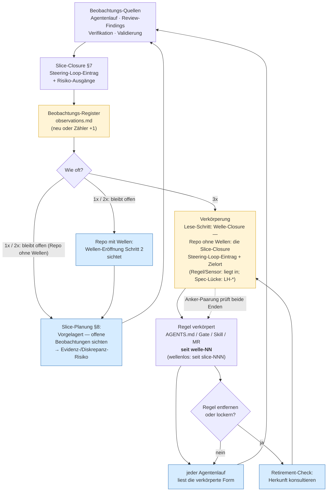

# Traceability-Constraint

## Traceability-Constraint

Keine relevante Änderung ohne Bezug zu mindestens einem der folgenden Punkte:

* Requirement-ID
* Architekturprinzip (die `ARC-*` der Sicht zählt nicht — Struktur-IDs
  adressieren innerhalb der Spec, siehe [§ID-Schema](source-precedence.md#id-schema-als-klammer))
* ADR-ID
* Test, Gate oder Demo-Artefakt
* Dokumentations-Update, falls ein öffentlicher Vertrag betroffen ist

Das ist eine *computational feedforward*-Kontrolle (siehe
[`klassifikation.md`](klassifikation.md)): ein Commit-Hook prüft, dass
die Nachricht mindestens eine ID enthält. Billig, deterministisch, und
sie zwingt den Implementer-Agent in die Source-Precedence-Kette zurück.

### Herkunfts-Anker für Steering-Loop-Regeln

Der Traceability-Constraint bindet **Änderungen** an eine ID. Der
Herkunfts-Anker ist dieselbe Regel, angewandt auf das **Artefakt**: Eine
Regel, die aus dem Steering Loop entstand, nennt die Welle, in der sie
entstand — oder, wenn sie ohne Welle verkörpert wurde, den Slice:
`seit welle-<NN>` bzw. `seit slice-<NNN>`.

**Warum.** Eine Regel aus Spec oder ADR trägt ihre Begründung im
`LH-*`/`ADR-*`-Bezug. Eine Regel aus *Beobachtung* hat keine solche ID —
ihre Begründung liegt in einer Closure-Notiz, die niemand von der Regel
aus findet. Ohne Anker wirkt sie beim nächsten Aufräumen wie
Overengineering und fliegt raus; die Failure-Klasse kommt zurück, und die
Zählung beginnt von vorn.

**Geltungsbereich — bewusst eng.** Nur Regeln, die aus dem Steering Loop
entstanden (Schwelle 3× erreicht). Was aus Lastenheft, Spezifikation oder
ADR folgt, trägt bereits eine ID und braucht keinen zweiten Anker.

**Form** — ein Feld, kein Konstrukt:

```makefile
noqa-gate:  ## LH-QA-SUP-002 · seit welle-3        # Make-Target, Welle
coverage-floor: ## LH-QA-SUP-004 · seit slice-047 # Make-Target, wellenlos
```
```markdown
### 3.3 git mv + Inhaltsänderung = zwei Commits   (seit welle-3)   <!-- AGENTS.md -->
- Tie-Break in sortierenden Operationen dokumentiert  (seit welle-3)  <!--
Reviewer-Skill -->
```

Der Adaptions-Block trägt das Muster bereits über sein Feld *Begründung*
(„Drei Vorfälle in Folge: `slice-041/044/047`") — der Anker
verallgemeinert es auf Gates, Skills und Hard Rules.

**Warum die Welle der Regelfall ist — und wann der Slice an ihre Stelle tritt.**
`done/welle-<NN>-results.md` §Steering-Loop-Einträge nennt beim
Schwellen-Übertritt das Trio *Regel · stabile Bezeichnung · Slice-Belege*.
Ein Anker `seit welle-3` löst damit in **einem Hop** auf und bleibt grob
genug, um nicht zu verrotten. Wurde die Regel **ohne Welle** verkörpert
([Modul 6 §Das Beobachtungs-Register](../02-planung/modul-06-roadmap.md#das-beobachtungs-register)),
gibt es diese Datei nicht — dann ist der Slice die einzige auflösbare
Herkunft, und der Anker lautet `seit slice-<NNN>`. Er löst über
`done/slice-<NNN>-<kurzer-titel>.md` §7 auf, ebenfalls in einem Hop: Die
Nummer ist eindeutig, der Titelrest gehört zum Dateinamen
([`slice.template.md`](../../../lab/templates/docs/plan/planning/slice.template.md)),
und wer den Anker maschinell auflöst, sucht auf `done/slice-<NNN>-*.md`.

**Ab Einführung, kein Nachrüsten.** Bestehende Regeln haben keinen
rekonstruierbaren Ursprung mehr; `seit unbekannt` wäre eine
[Harness-Lüge](begriffe.md#kernbegriffe). Der leere Zustand *ist* die ehrliche
Information.

#### Zwei Sensoren

**Anker-Paarung** (*computational feedback*). Die Prüfung läuft **von der
Closure-Notiz nach außen**, nicht von der Regel nach innen — denn von der
Regel aus ist nicht entscheidbar, ob sie einen Anker braucht.

**Ausgelöst wird durch ein Feld, nicht durch die Semantik des Eintrags und
nicht durch Prosa:** durch das Pflichtfeld **`liegt in <Zielort>`**. Es steht in
`## Steering-Loop-Einträge` jeder `welle-<NN>-results.md` und — für wellenlos
verkörperte Regeln — in §7 jeder `done/slice-<NNN>-<kurzer-titel>.md`; die
kanonischen Formen liefern `welle-results.template.md` bzw.
`slice.template.md` §7.

**Das Feld gilt nur in diesen beiden Sektionen.** Überall sonst sind dieselben
zwei Wörter gewöhnliche Sprache und lösen nichts aus — die Trigger-Formulierung
„`SL-024` liegt in `done/`" ([Modul 6](../02-planung/modul-06-roadmap.md))
ebenso wenig wie eine bloße **Erwähnung** eines Pfades im Fließtext. Der
Sektions-Scope grenzt den Auslöser ein, ersetzt ihn aber nicht: *innerhalb* der
Sektion entscheidet das Feld.

**Die Ruheort-Regel — für jede Datei, die per `git mv` wandert.** Ein
Slice-Plan und ein Welle-Plan werden an einem Ort geschrieben und an einem
anderen gelesen: Bei der Closure wandern sie nach `done/`. Jeder relative Pfad
darin ist deshalb so zu schreiben, wie er **vom Ruheort** auflöst, nicht vom
Schreibort — die Ergebnis-Notiz liegt in `done/` als Geschwister (ohne Präfix),
das Beobachtungs-Register eine Ebene höher (Eltern-Verzeichnis, also mit `..`-Präfix). Ein im
Schreibmoment richtiges `done/…` bricht für jeden Leser danach, und zwar
still: Der Pfad bleibt syntaktisch intakt und zeigt ins Leere.

**Was in den Backticks steht, ist ein Zielort, nicht immer eine Datei** — drei
kanonische Füllungen: `AGENTS.md §<N>` (Datei + Abschnitt) ·
`Makefile:<target>` (Datei + Make-Target) · `.harness/skills/<name>.md`
(Datei allein). Geprüft wird dann:

1. **Der Pfad existiert** — **ab Repo-Wurzel**, nicht relativ zur
   Closure-Notiz. Der Zielort ist ein Ort im Repo, kein Nachbar der Notiz; eine
   Regel wandert nicht mit, wenn die Notiz nach `done/` wandert. Dafür trennt
   der Sensor ein Suffix ab ` §` oder ab `:` ab und prüft den Rest als Pfad.
   *(Nicht zu verwechseln mit den Pfaden, die eine Closure-Notiz auf ihre
   Nachbar-Artefakte setzt — der Zeiger aufs Beobachtungs-Register etwa ist
   datei-relativ und folgt der Ruheort-Regel. Der Zielort ist die Ausnahme, und er ist es, weil
   er aus dem Planungs-Baum hinauszeigt.)*
2. **Das Ziel trägt** `seit welle-<NN>` bzw. `seit slice-<NNN>` — bei einem
   Make-Target auf dessen Target-Zeile, bei einem Abschnitt in dessen
   Überschrift, bei einer Datei ohne Suffix irgendwo in ihr.

Ohne die Abtrenn-Regel liefe die Make-Target-Variante rot, obwohl sie die Form
erfüllt — der Sensor widerlegte sich selbst.

Fehlt das Feld, ist der Eintrag *gezählt, nicht verkörpert* und kein Gegenstand
der Paarung — sonst liefe der Sensor auf jeder gewöhnlichen Slice-Closure rot
und wäre selbst das, wogegen er gebaut ist. **Eine Ausnahme, die keine
Gegenausnahme ist:** Eine *benannte Spec-Lücke* trägt kein `liegt in`, ist aber
sehr wohl verkörpert — nur in einer versionierten Spec statt an einem Pfad. Ihr
Gegenstück ist die `LH-*`-ID, nicht der Herkunfts-Anker; sie ist damit kein
Gegenstand dieser Paarung, wohl aber der Register-Paarung
([Modul 6](../02-planung/modul-06-roadmap.md#das-beobachtungs-register)) wie
jeder andere Eintrag. Rot bei: Regel nie geschrieben · still gelöscht ·
Anker vergessen. Das ist die Klasse *halluziniertes Gate*
([Modul 13](../04-qualitaet/modul-13-quality-gates.md#hard-rule-doku-disziplin)),
auf Regeln statt auf Make-Targets angewandt.

> **Grenze — ehrlich benannt:** Der Sensor erzwingt den Anker nur für
> **deklarierte** Steering-Loop-Regeln. Wer die Closure-Notiz nicht
> schreibt, wird nicht erwischt. Das ist die Grenze der Deklaration, nicht
> ein Fehler des Sensors — und sie gehört benannt, sonst ist der Sensor
> selbst eine Harness-Lüge.

**Retirement-Check** (*inferential feedback*, ereignis-getriggert). Kein
periodischer Sweep — der Auslöser ist der Moment, in dem die Frage real
auftritt:

> Eine Regel mit Herkunfts-Anker wird **nicht entfernt oder gelockert**,
> ohne dass die Herkunft konsultiert und das Ergebnis dokumentiert wurde:
> *Regel seit `welle-3` — ist die Beobachtung seither wieder aufgetreten?*

Dieselbe Bauart wie „Gates dürfen nicht ohne ADR gelockert werden" —
aber **kumulativ, nicht ersetzend**: Ist das verankerte Artefakt selbst ein
Gate (`noqa-gate` im Beispiel oben ist beides zugleich), gilt die ADR-Pflicht
aus [Modul 9](../03-agenten/modul-09-implementierung.md#hard-rules-repo-spezifisch)
unverändert weiter; der Retirement-Check kommt hinzu und beantwortet eine
*andere* Frage — nicht „darf ich?", sondern „ist der Grund entfallen?". Er ist
der **Konsument** des Ankers: ohne ihn wäre der Anker eine zweite
write-only-Ablage — genau der
Fehler, den das *Beobachtungs-Register*
([Modul 6](../02-planung/modul-06-roadmap.md#das-beobachtungs-register))
behebt.

#### Der Fluss — jedes Artefakt hat einen Konsumenten



Gelb ist, was **geschrieben** wird, blau, was es **liest**. Das Bild ist
zugleich die ausgearbeitete Illustration der Regel
[§Jedes Artefakt hat einen Konsumenten](harness-dateien.md#jedes-artefakt-hat-einen-konsumenten).

Die beiden Schleifen tragen unterschiedliche Mengen: Die linke hält die
Beobachtungen **unter** der Schwelle am Leben (sonst zählt niemand hoch),
die rechte hält die Begründung der **verkörperten** Regeln greifbar (sonst
werden sie beim Aufräumen still entfernt). Keine ersetzt die andere.
