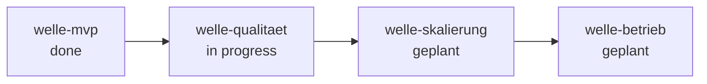

# Roadmap — DocSearch

**Format-Regel:** Reihenfolge von **Wellen**, keine Reihenfolge von
Terminen. Daten sind Schätzungen, korrigierbar.

---

## Offene Wellen

*Derivativ* — der Zustand sind die flachen Welle-Dateien unter
`docs/plan/planning/`; woran gerade gearbeitet wird, sagt das `Welle:`-Feld
der Slices in `in-progress/`. Ziel, Trigger und Closure-Kriterien stehen in
der Welle-Datei, nicht hier:

- [welle-qualitaet](../welle-qualitaet.md)

## Nächste Wellen

| Welle | Trigger | Wichtigste Slices | Geschätzter Aufwand |
|---|---|---|---|
| welle-skalierung | welle-qualitaet done | slice-ann-suche (ANN-Suche, bringt ADR-0004), slice-replay-runner (Multi-Sprach-Adapter-Cleanup) | L | <!-- d-check:ignore (ADR entsteht erst in slice-ann-suche) -->
| welle-betrieb | welle-skalierung done | slice-k8s-helm-chart (k8s-Helm-Chart), slice-otel-collector (OTel-Collector) | M |

## Meilensteine

| Meilenstein | Welle(n) | Trigger | Status |
|---|---|---|---|
| M1 — Lauffähiger Stack | welle-mvp | DoD `make gates` grün, ein Lab-Beispiel pro Sprache | erreicht 2026-06-02 — [`../done/welle-mvp-results.md`](../done/welle-mvp-results.md) |
| M2 — Qualitätsschwelle | welle-qualitaet | welle-qualitaet geschlossen (slice-property-tests in `done/`, Property-Suite läuft 100 Generationen) | offen |
| M3 — Skalierbar | welle-skalierung | p95 < 1 s auch bei 100k Einträgen | offen |
| M4 — Produktionsreif | welle-betrieb | Releases, Runbook, OTel-Pipeline | offen |

## Abhängigkeitsgraph

## Abgeschlossene Wellen

| Welle | Abschluss | Closure-Notiz |
|---|---|---|
| welle-mvp | 2026-06-02 | [`../done/welle-mvp-results.md`](../done/welle-mvp-results.md) |

## Historische Trigger-Verschiebungen

| Datum | Was wurde geändert? | Warum? |
|---|---|---|
| 2026-05-22 | Welle-1-Schließung verschoben | slice-007 (Top-K-Boundary) erforderte LH-Update (v0.2.0) — Spec-Lücke aus Steering Loop |
