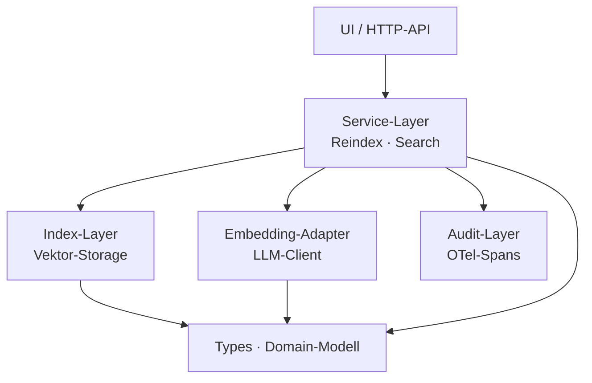
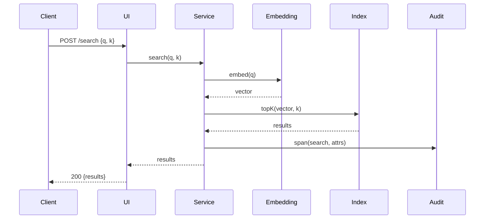
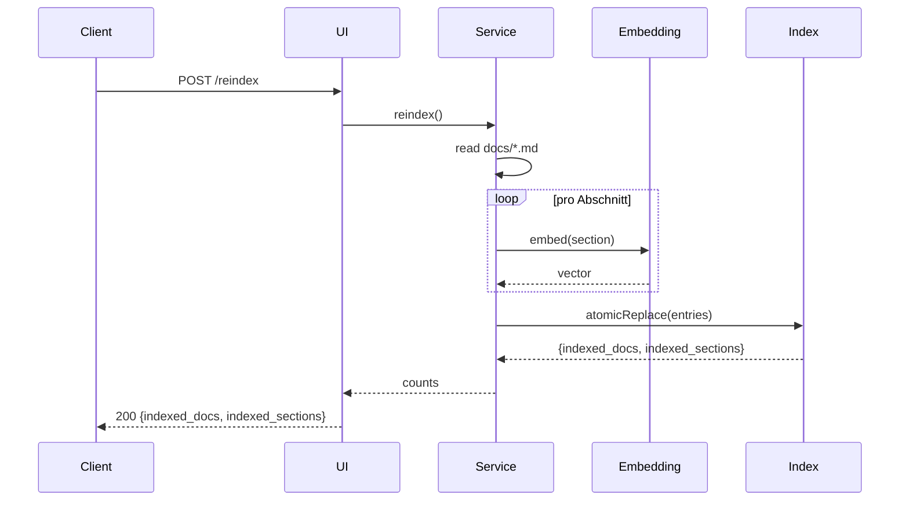

# Architektur — DocSearch

**Status:** Aktiv. **Letzte Änderung:** 2026-06-02.

**Hard Rule:** Diese Datei enthält *keine* Wellen, Slices, Commit-Hashes
oder Closure-Daten. Die zeitliche Schicht lebt in
[`../docs/plan/planning/in-progress/roadmap.md`](../docs/plan/planning/in-progress/roadmap.md).

---

## 1. Komponenten-Übersicht

## 2. Schichten und Constraints

| Schicht | Verantwortlichkeit | Darf importieren | Darf NICHT importieren |
|---|---|---|---|
| Types | Domain-Modell (Pure), keine I/O | — | alle anderen |
| Index | Vektor-Storage, Cosinus-Berechnung | Types | Service, UI, Embedding |
| Embedding | LLM-Adapter, Caching | Types | Service, UI, Index |
| Audit | OTel-Spans, Log-Formatter | Types | Service, UI |
| Service | Geschäftslogik (Reindex, Search) | Types, Index, Embedding, Audit | UI |
| UI | HTTP-Handler, Input-Validierung | Service, Types | Index, Embedding, Audit direkt |

**Konsequenz:** Service ist der einzige "Sammler". UI darf weder Index
noch Embedding direkt aufrufen — alle Quereinstiege gehen über
Service.

## 3. Externe Abhängigkeiten

| System | Rolle | Substituierbarkeit |
|---|---|---|
| Embedding-Modell | Embedding-Erzeugung | Adapter-Pattern: Modell-Wechsel ohne Service-Änderung |
| Object Storage (optional) | Index-Persistenz | Lokales Filesystem vs. S3-API |

## 4. Sequenz-Diagramme

### Use-Case: LH-FA-02 — Suche

### Use-Case: LH-FA-01 — Indexierung

## 5. Fehlermodelle und Resilienz

| Fehlerquelle | Behandlung-Schicht | Logging |
|---|---|---|
| Verzeichnis fehlt (Reindex) | UI → 400 E001 | `event=reindex_error` |
| Embedding-Adapter Timeout | Service → 503 E003 (Index unverändert) | `event=embedding_unavailable` |
| Index-Read-Fehler | Service → 500 E099 | `event=internal_error` |

**Atomic-Replace:** Reindex schreibt in `data/index/index.bin.new` und
ersetzt erst nach erfolgreichem Schreiben. Damit bleibt der alte Index
bei jedem Fehler intakt.

> Welche ADR welche Stelle dieses Dokuments verbindlich macht, deklarieren
> die ADRs selbst aufwärts im `**Schärft:**`-Feld; der kanonische ADR-Index
> ist `docs/plan/adr/README.md` (keine Sicht→ADR-Abwärtszeiger, Kurs
> §Referenz-Richtung).
