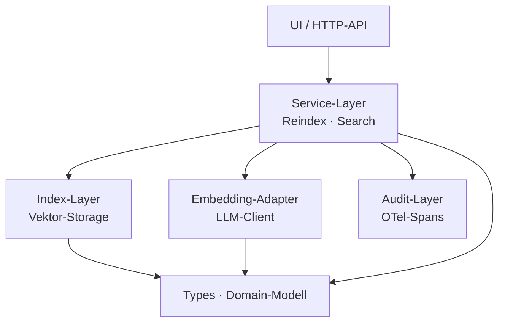
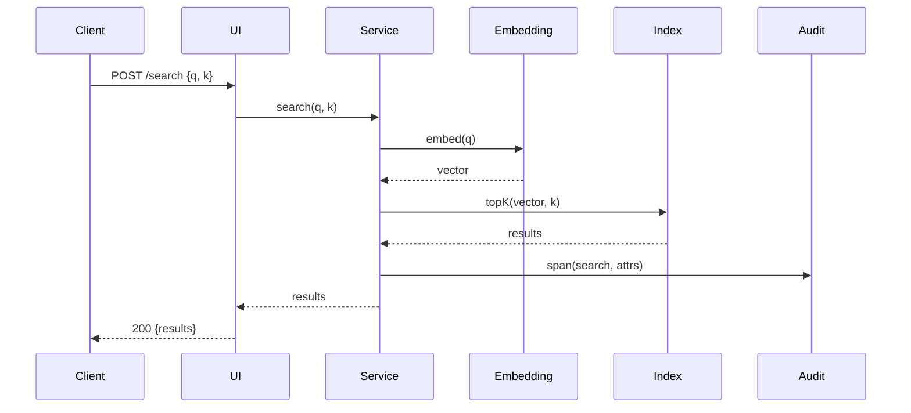
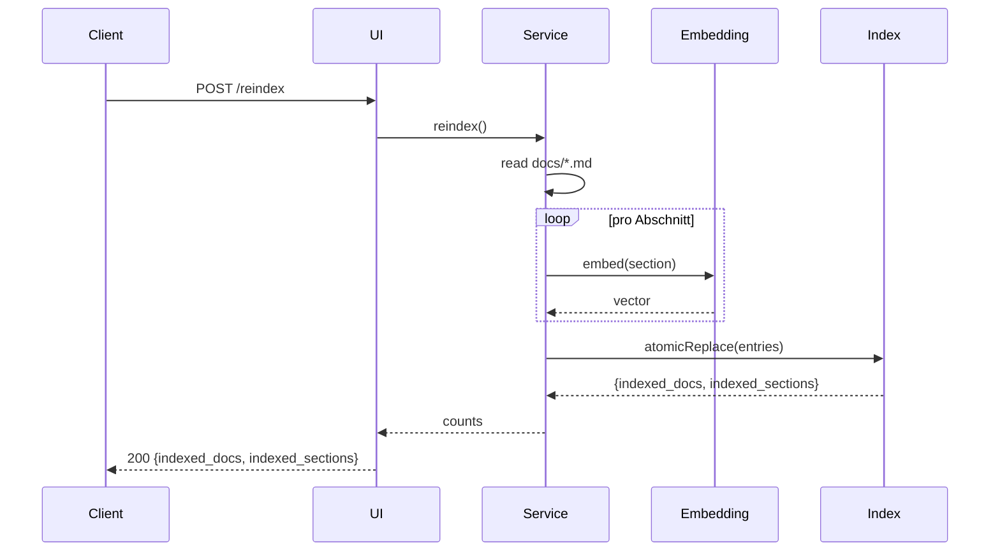

# Architektur — DocSearch

**Status:** Aktiv. **Letzte Änderung:** 2026-08-08.

**Hard Rule:** Diese Datei enthält *keine* Wellen, Slices, Commit-Hashes
oder Closure-Daten. Die zeitliche Schicht lebt in
[`../docs/plan/planning/in-progress/roadmap.md`](../docs/plan/planning/in-progress/roadmap.md).

---

## 1. Komponenten-Übersicht

Hier werden die `ARC-*` für Komponenten vergeben — eine Adresse je Komponente,
damit Slice und Carveout auf sie zeigen können, keine Anforderung.

```mermaid
flowchart TB
    UI[UI / HTTP-API]
    Service[Service-Layer<br/>Reindex · Search]
    Index[Index-Layer<br/>Vektor-Storage]
    Embedding[Embedding-Adapter<br/>LLM-Client]
    Audit[Audit-Layer<br/>OTel-Spans]
    Types[Types · Domain-Modell]

    UI --> Service
    Service --> Index
    Service --> Embedding
    Service --> Audit
    Index --> Types
    Embedding --> Types
    Service --> Types
```

| ID | Komponente | Rolle |
|---|---|---|
| `ARC-001` | Types | Domain-Modell, keine I/O |
| `ARC-002` | Index-Layer | Vektor-Storage, Cosinus-Berechnung |
| `ARC-003` | Embedding-Adapter | LLM-Client, Caching |
| `ARC-004` | Audit-Layer | OTel-Spans, Log-Formatter |
| `ARC-005` | Service-Layer | Reindex und Search |
| `ARC-006` | UI / HTTP-API | HTTP-Handler, Input-Validierung |

## 2. Schichten und Constraints

Die Constraints verweisen auf die Komponenten aus §1; eigene Kennungen vergibt
diese Sektion nicht.

| Komponente | Schicht | Verantwortlichkeit | Darf importieren | Darf NICHT importieren |
|---|---|---|---|---|
| `ARC-001` | Types | Domain-Modell (Pure), keine I/O | — | alle anderen |
| `ARC-002` | Index | Vektor-Storage, Cosinus-Berechnung | Types | Service, UI, Embedding |
| `ARC-003` | Embedding | LLM-Adapter, Caching | Types | Service, UI, Index |
| `ARC-004` | Audit | OTel-Spans, Log-Formatter | Types | Service, UI |
| `ARC-005` | Service | Geschäftslogik (Reindex, Search) | Types, Index, Embedding, Audit | UI |
| `ARC-006` | UI | HTTP-Handler, Input-Validierung | Service, Types | Index, Embedding, Audit direkt |

**Konsequenz:** Service ist der einzige "Sammler". UI darf weder Index
noch Embedding direkt aufrufen — alle Quereinstiege gehen über
Service.

## 3. Externe Abhängigkeiten

| ID | System | Rolle | Substituierbarkeit |
|---|---|---|---|
| `ARC-007` | Embedding-Modell | Embedding-Erzeugung | Adapter-Pattern: Modell-Wechsel ohne Service-Änderung |
| `ARC-008` | Object Storage (optional) | Index-Persistenz | Lokales Filesystem vs. S3-API |

## 4. Sequenz-Diagramme

### Use-Case: LH-FA-02 — Suche

```mermaid
sequenceDiagram
    participant Client
    participant UI
    participant Service
    participant Embedding
    participant Index
    participant Audit

    Client->>UI: POST /search {q, k}
    UI->>Service: search(q, k)
    Service->>Embedding: embed(q)
    Embedding-->>Service: vector
    Service->>Index: topK(vector, k)
    Index-->>Service: results
    Service->>Audit: span(search, attrs)
    Service-->>UI: results
    UI-->>Client: 200 {results}
```

### Use-Case: LH-FA-01 — Indexierung

```mermaid
sequenceDiagram
    participant Client
    participant UI
    participant Service
    participant Embedding
    participant Index

    Client->>UI: POST /reindex
    UI->>Service: reindex()
    Service->>Service: read docs/*.md
    loop pro Abschnitt
        Service->>Embedding: embed(section)
        Embedding-->>Service: vector
    end
    Service->>Index: atomicReplace(entries)
    Index-->>Service: {indexed_docs, indexed_sections}
    Service-->>UI: counts
    UI-->>Client: 200 {indexed_docs, indexed_sections}
```

## 5. Fehlermodelle und Resilienz

| Fehlerquelle | Behandlung-Schicht | Logging |
|---|---|---|
| Verzeichnis fehlt (Reindex) | UI → 400 E001 | `event=reindex_error` |
| Embedding-Adapter Timeout | Service → 503 E003 (Index unverändert) | `event=embedding_unavailable` |
| Index-Read-Fehler | Service → 500 E099 | `event=internal_error` |

**Atomic-Replace:** Reindex schreibt in eine Temp-Datei im selben
Verzeichnis und ersetzt `data/index/index.bin` erst nach erfolgreichem
Schreiben. Damit bleibt der alte Index
bei jedem Fehler intakt.
