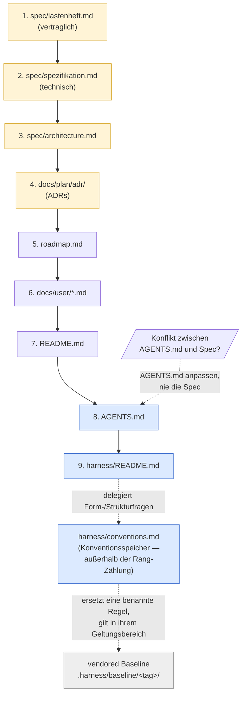
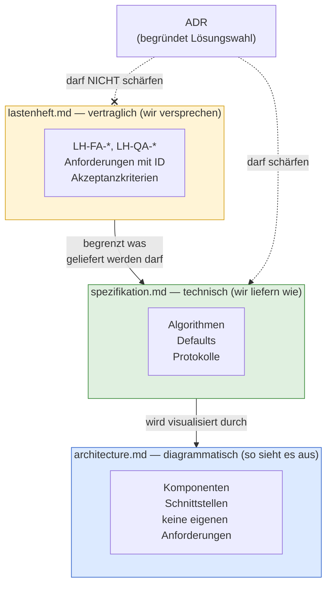
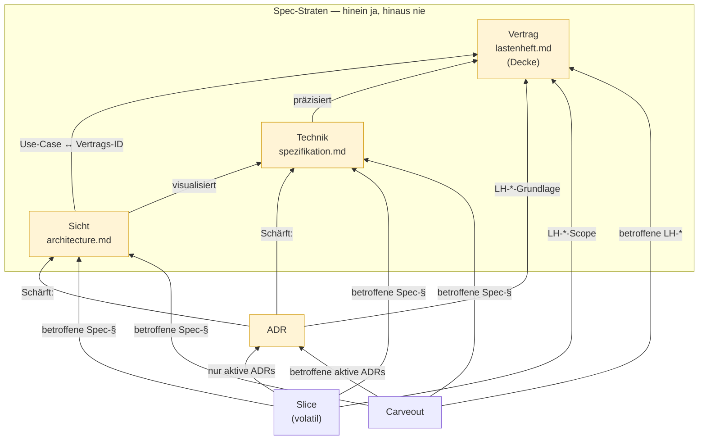
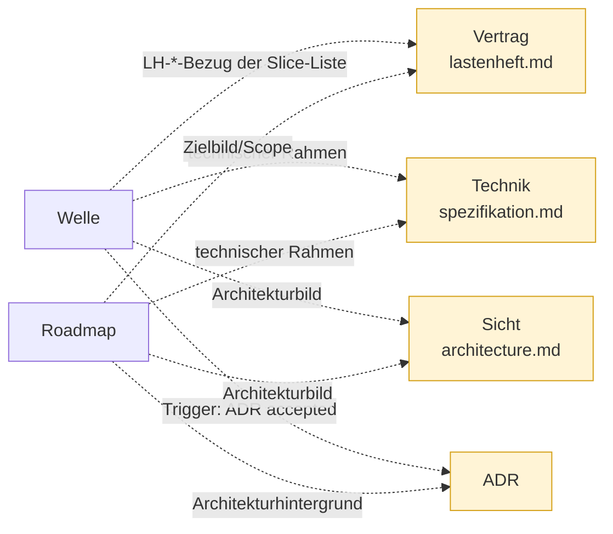
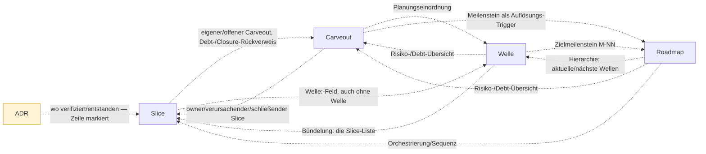

## Konventionen
<!-- Quelle: [grundlagen/konventionen.md](../../kurs/de/grundlagen/konventionen.md) -->

### Kernbegriffe

| Begriff                  | Bedeutung im Regelwerk                                                                                                                                                                                                                                                                                                                                                                                    |
| ------------------------ | --------------------------------------------------------------------------------------------------------------------------------------------------------------------------------------------------------------------------------------------------------------------------------------------------------------------------------------------------------------------------------------------------------- |
| LLM                      | Modell, das Text → Text abbildet. Stateless.                                                                                                                                                                                                                                                                                                                                                              |
| Agent                    | LLM + Tool-Schnittstelle + Schleife. Hält Zustand über mehrere Turns.                                                                                                                                                                                                                                                                                                                                     |
| Tool-Call                | Strukturierter Aufruf einer Funktion durch das LLM (`name`, `arguments`, `result`).                                                                                                                                                                                                                                                                                                                       |
| SDLC / Lebenszyklus      | Software Development Lifecycle; in diesem Regelwerk *Entwicklungszyklus* genannt (Modul 1). Artefaktkette Spec → ADR → Plan → Code → Review → Verifikation → Closure mit verpflichtenden Rückwärtskanten (Lerneintrag, Folge-ADR). *Validierung* fehlt hier bewusst: sie prüft gegen den realen Bedarf außerhalb des Repos und hinterlässt kein Repo-Artefakt — ihr Ort ist die Rollen-Sequenz (Modul 8). |
| Spec                     | Die Artefakte unter `spec/` — die drei Straten *Vertrag* · *Technik* · *Sicht*. Quelle der Wahrheit für *was gilt*; das *warum* trägt die ADR.                                                                                                                                                                                                                                                                                                                                         |
| ADR                      | Architecture Decision Record unter `docs/plan/adr/`. Quelle der Wahrheit für *warum so*.                                                                                                                                                                                                                                                                                                                  |
| Slice                    | Kleinste lieferbare Einheit eines Features. Hat eigenen Plan, eigene DoD.                                                                                                                                                                                                                                                                                                                                 |
| Welle                    | Bündel von Slices, das gemeinsam geplant und abgeschlossen wird.                                                                                                                                                                                                                                                                                                                                          |
| Trigger                  | Beobachtbare Bedingung, bei der ein Slice/Welle/Carveout in den nächsten Status wandert.                                                                                                                                                                                                                                                                                                                  |
| Closure                  | Abschluss eines Slice oder einer Welle, dokumentiert mit Lerneintrag in `done/`.                                                                                                                                                                                                                                                                                                                          |
| Gate                     | Automatisch prüfbares Qualitätskriterium (Linter, Typecheck, Architekturtest, Coverage).                                                                                                                                                                                                                                                                                                                  |
| Carveout                 | Dokumentierte Ausnahme von einem Gate oder einer Architekturregel.                                                                                                                                                                                                                                                                                                                                        |
| Skill                    | Repo-spezifisches Markdown/JSON-Artefakt, das einer Agenten-Rolle Checkliste oder Verhalten beibringt. Lebt typischerweise in `.harness/`.                                                                                                                                                                                                                                                                |
| Replay                   | Deterministisch wiederholbarer Agentenlauf gegen fixierte Inputs.                                                                                                                                                                                                                                                                                                                                         |
| Golden Set               | Kuratiertes Eingabe/Erwartungs-Paar für Regressionstests.                                                                                                                                                                                                                                                                                                                                                 |
| Finding                  | Einzelne Beobachtung eines Reviewers, kategorisiert HIGH/MEDIUM/LOW/INFO.                                                                                                                                                                                                                                                                                                                                 |
| DoD                      | Definition of Done. Liste der Bedingungen, die ein Slice erfüllen muss.                                                                                                                                                                                                                                                                                                                                   |
| Guide                    | Feedforward-Kontrolle: lenkt den Agenten *vor* der Handlung (Spec, ADR, AGENTS.md, Skill, Tool-Constraint).                                                                                                                                                                                                                                                                                               |
| Sensor                   | Feedback-Kontrolle: prüft *nach* der Handlung (Linter, Test, ArchUnit, Reviewer-Agent).                                                                                                                                                                                                                                                                                                                   |
| Fitness Function         | Maschinell prüfbare Architektur-Aussage (z. B. Modulgrenze, Latenzbudget).                                                                                                                                                                                                                                                                                                                                |
| Steering Loop            | Wiederkehrendes Muster: beobachtetes Agenten-Versagen → Guide/Sensor verbessern → Wiederholung reduzieren.                                                                                                                                                                                                                                                                                                |
| AGENTS.md                | Maschinell lesbare Projekt-Konventionen für Agenten (Codestil, Tool-Regeln, Layering, Verbote). Quasi-Standard nach OpenAI/Codex.                                                                                                                                                                                                                                                                         |
| Constrain / Inform       | OpenAI-Doppelaufgabe des Harness: *constrain* = Grenzen ziehen (Architektur, Tools, Layer), *inform* = Kontext liefern (Spec, ADR, AGENTS.md, Skills).                                                                                                                                                                                                                                                    |
| Entropy Management       | Aktive Pflege des Harness gegen Doku-Drift, tote Constraints und veraltete Konventionen.                                                                                                                                                                                                                                                                                                                  |
| Harness-Lüge             | Der Harness behauptet eine Kontrolle, die real nicht (mehr) greift — halluziniertes oder undeklariertes Gate, stille Setzung, Pointer auf nicht existierende Mechanik. Häufigste Form: behauptete Gates ohne Make-Target.                                                                                                                                                                                 |
| Source Precedence        | Geordnete Liste der kanonischen Quellen. Bei Konflikt gewinnt die höher rangierende.                                                                                                                                                                                                                                                                                                                      |
| `harness/README.md`      | Pro-Repo-Einstiegspunkt: bündelt Source Precedence, Guides, Sensors, Traceability- und Safety-Regeln. Dupliziert keine Spec-Inhalte.                                                                                                                                                                                                                                                                      |
| `harness/conventions.md` | Repo-lokaler Konventionsspeicher: trägt Strukturregeln und Adaptionen ggü. der adoptierten Baseline (`MR-<NNN>`-Liste, Zusatzklassen für Sensors-Bindung, Modus-Deklaration pro Sub-Area). Pflicht; Form (Einzeldatei/Verzeichnis) ist Wahl.                                                                                                                                                              |
| Hard Rule                | Negativregel, die der Agent nie brechen darf (z. B. "Optimierer darf nie direkt aufs Gerät schreiben"). Repo-spezifisch.                                                                                                                                                                                                                                                                                  |
| Repo-Klasse              | Charakter eines Repos im Harness: *Referenz* · *Safety/Control* · *Policy/Compliance*. Bestimmt, wie scharf Hard Rules und Sensors gesetzt werden.                                                                                                                                                                                                                                                        |
| ID-Schema                | Stabile Präfix-Klammer (`LH-*`, `HSM-*`, `GG-*`), die Spec-Anforderungen, Make-Target-Kommentare, ADRs und Commits verbindet.                                                                                                                                                                                                                                                                             |
| `BEO-<NNN>`              | Kennung einer Beobachtung im Beobachtungs-Register ([Modul 6](modul-06-roadmap.md#das-beobachtungs-register-modul-6)). Vergabestelle ist das Register selbst; sie macht den Zähler unabhängig vom Wortlaut der Bezeichnung.                                                                                                                                                                               |
| Referenz-Richtung (SDP)  | Normative Referenzen zeigen nur volatil→stabil — **Vertrag › Technik › Sicht › ADR › Slice** (Stratum-Klassen, nicht Dateinamen). Wo die Matrix eine Zelle als *Kontext* ausweist, ist der Verweis erlaubt, trägt aber keine Normkraft; ein ❌ erlaubt auch keinen Kontext. Siehe [§Referenz-Richtung](#referenz-richtung-sdp-wer-darf-wen-referenzieren).                                                                                                                                                                                         |
| Spec-Stratifizierung     | Aufteilung der Spec in drei obligatorische Straten — *vertraglich* (Lastenheft) · *technisch* (Spezifikation) · *Sicht* (Architektur) — mit eigener Precedence-Regel.                                                                                                                                                                                                                                                                                           |
| Stratum                  | Rollen-Klasse eines Spec-Dokuments — *Vertrag* (Decke) · *Technik* · *Sicht* —, bestimmt über normativen Gehalt und Änderungs-Prozess, nicht über den Dateinamen. Rang: Vertrag › Technik › Sicht; alle drei sind obligatorisch, eine Abweichung wird als `MR-<NNN>` deklariert. Siehe [§Spec-Straten](#spec-straten-mehr-als-ein-spec-dokument).                                                                                                    |
| Bootstrap-aware Gate     | Gate mit weicher Frühphase: kennt eine Reifestufe und greift erst ab Trigger hart. Dokumentiert, was die Stufe ist.                                                                                                                                                                                                                                                                                       |

### Verzeichniskonvention

```
spec/                       # Spec-Straten: Vertrag · Technik · Sicht
docs/plan/adr/              # Architecture Decision Records
docs/plan/planning/open/    # geplante, noch nicht gestartete Slices
docs/plan/planning/next/    # priorisiert/eingeplant
docs/plan/planning/in-progress/  # aktive Slices
docs/plan/planning/done/    # abgeschlossene Slices
docs/plan/planning/<welle-id>.md            # offene Wellen, flach (Modul 6)
docs/plan/planning/observations.md          # Beobachtungs-Register: der Steering-Loop-Zähler
docs/plan/planning/in-progress/roadmap.md   # Meilensteine, Wellen, aktive Welle
docs/plan/carveouts/        # Ausnahmen mit Plan zur Auflösung
docs/reviews/               # Review-Reports, ein Report pro Lauf (Modul 10)
AGENTS.md                   # maschinell lesbare Projekt-Konventionen für Agenten
harness/README.md           # Einstiegspunkt: Precedence, Guides, Sensors, Safety
harness/conventions.md      # Index: repo-lokale Regeln, Adaptionen, Modus pro Sub-Area
harness/conventions/        # ein MR je Datei; done/ = aufgelöst
.harness/                   # Skills, Tool-Allowlists, Checklisten-Middlewares
```

### Template-Schichtung — was der Rumpf trägt und was der Kommentar

Ein Template wird beim Adoptieren **abgebaut**: Platzhalter ersetzt,
Hinweis-Block entfernt, **alle HTML-Kommentare gelöscht** — bis auf die
`d-check:ignore`-Marker, die Falsch-Positive unterdrücken und bleiben müssen
([`../templates/README.md`](../templates/README.md) §Verwendung, Schritt 5). Was danach
dasteht, ist alles, was der Adopter Wochen später hat. Vier Schichten:

| Schicht              | Inhalt                                                                                                                                       | Überlebt das Adoptieren?                                                            |
| -------------------- | -------------------------------------------------------------------------------------------------------------------------------------------- | ----------------------------------------------------------------------------------- |
| **Regelwerk**        | Der Normtext. **Einzige** Quelle.                                                                                                            | — vendored unter `.harness/baseline/<tag>/regelwerk/`, lebt außerhalb des Artefakts |
| **Rumpf**            | Nur, was das *fertige Artefakt* trägt: Feldnamen, Feldreihenfolge, `<Platzhalter>` — plus **genau ein** Regelwerk-Zeiger pro Pflicht-Sektion | ja                                                                                  |
| **DoD / Checkliste** | Jede Pflicht, die der Ausfüllende **abhaken** muss. Das ist die Prozedur                                                                     | ja                                                                                  |
| **Kommentar**        | Begründung und Bedienhinweis                                                                                                                 | nein                                                                                |

- **Test für den Rumpf:** Liest sich das im veröffentlichten Artefakt als
  *Inhalt* — oder als *Anleitung an jemanden*? Anleitung gehört nie in den
  Rumpf. Dazu kommt: Normtext im Rumpf wird vom Platzhalter-Ersetzen
  zerschossen — aus der allgemeinen Regel wird eine falsche Einzelaussage.
- **Hard Rule:** *Kein Kommentar ist die einzige Fundstelle einer Norm.* Wer
  eine Regel in einen Template-Kommentar schreibt, schreibt sie in den
  Papierkorb des Adopters. Sie gehört ins Regelwerk; im Template steht der
  **Zeiger** darauf, im Rumpf, bei der Sektion, für die sie gilt.
- **Der Zeiger ist kein Zitat.** Ein Template, das den Normtext ausschreibt,
  führt ihn ein zweites Mal — und zwei Fassungen driften.
- **Feedback-Hälfte ist *inferential*, nicht computational:** „Ist dieser Satz
  eine Norm?" ist ein Urteil, kein Match — und Template-Verzeichnisse sind für
  Referenz-Gates bewusst ausgenommen (symbolische Pfade). Die Regel steht
  deshalb als HIGH-Eintrag *Norm nur im Template-Kommentar* im Reviewer-Skill
  (Ziel-Form `../templates/.harness/skills/reviewer.template.md`).
- **Grenze:** Sie hängt damit an einem Review, nicht an einem Lauf. Wer ohne
  Review committet, wird nicht erwischt. Und der Skill oben ist eine
  **Ziel-Form für das adoptierende Repo** — ob dort ein Review mit dieser
  HIGH-Regel tatsächlich läuft, entscheidet der Adopter, nicht diese
  Konvention. Wo er es nicht einrichtet, hat die Hard Rule keinen Träger, und
  das ist kein Sonderfall: Es ist der Auslieferungszustand. Einen *Sensor* zu
  behaupten, wo keiner steht, wäre die Klasse *halluziniertes Gate* (Modul 13)
  — auf die eigene Konvention angewandt.

### Trennschärfen

- *Spec* beschreibt **was**, *ADR* begründet **warum so**, *Plan* legt **wann
und wie** fest.
- *Review* prüft, ob Code gegen Plan und ADR konform ist; *Verifikation*
prüft, ob das Ergebnis die DoD und die Spec erfüllt; *Validation* prüft, ob
das Ergebnis den realen Bedarf trifft.
- *Linter*-Findings sind keine *Review*-Findings. Gates sind maschinell;
Reviews sind agentisch.

### Source Precedence

Sobald mehr als ein Dokument existiert, gibt es Konflikte. Der Harness
muss vorher festlegen, wer gewinnt. Eine pragmatische Default-Reihenfolge
für ein typisches Repo:

1. `spec/lastenheft.md`
2. `spec/spezifikation.md`
3. `spec/architecture.md`
4. `docs/plan/adr/README.md` und die darin referenzierten ADRs
5. `docs/plan/planning/in-progress/roadmap.md`
6. `docs/user/*.md` (Betriebs-/Operations-Docs — Quality-, Releasing- und
Runbook-*Sichten*)
7. `README.md`
8. `AGENTS.md`
9. `harness/README.md`



Gelb: kanonische Quellen — Spec, Architektur, ADRs. Blau: Harness-Index
und Agenten-Konventionen — sie *beschreiben* die kanonischen Quellen,
sie *ersetzen* sie nicht — `harness/conventions.md` beschreibt sie nicht,
sondern setzt repo-lokale Struktur. Grau: adoptierte Baseline, kein
Repo-Dokument. Durchgezogene Kanten sind die Rangfolge, gestrichelte sind
Zuständigkeits- und Auflösungsbeziehungen.

Regel: Widerspricht `AGENTS.md`, `harness/README.md` oder
`harness/conventions.md` einer kanonischen Quelle, wird die niedriger
rangierte Datei angepasst — nie die kanonische Quelle. Der Harness folgt
der Spec, nicht umgekehrt.

**Die Harness-Schicht darunter: `conventions.md` und die Baseline.**
Zwei Dinge stehen bewusst **nicht** in der Rangliste. `harness/conventions.md`
ist kein weiterer Rang, sondern der **Konventionsspeicher**, an den die
rangierten Dokumente Form- und Strukturfragen *abtreten*: ID-Schemata,
Verzeichniskonvention, Zusatzklassen, Modus-Deklarationen, Adaptionen
([§harness/conventions.md als Konventionsspeicher](#harnessconventionsmd-als-konventionsspeicher)).
Wo `AGENTS.md` oder `harness/README.md` zu einer solchen Frage nichts sagen,
entsteht deshalb **kein Konflikt, sondern eine Zuständigkeit** — die Rangliste
entscheidet über *Inhalt*, der Konventionsspeicher über *Form*. Der Platz
wäre ohnehin aufgebraucht — neun Ränge, das
Maximum aus [Modul 1](modul-01-entwicklungszyklus.md).

Das vendored Regelwerk unter `.harness/baseline/<tag>/` steht noch darunter —
übernommenes Fremdmaterial, keine Aussage dieses Repos. Der Anschluss läuft
über den Konventionsspeicher: **Eine `MR-<NNN>` gilt innerhalb ihres
deklarierten Geltungsbereichs vor der Baseline; außerhalb davon gilt die
Baseline unverändert.** Das ist keine zusätzliche Regel, sondern die
Definition einer Adaption — sie steht hier, weil ein Agent, der nur die
Rangliste liest, die Antwort sonst nicht findet.

Daraus folgt die Grenze — sie liegt in der *Wirkung*, nicht im Feld
`Geltungsbereich` (das nennt den Repo-Ausschnitt; den Baseline-Ausschnitt nennt
das eigene Feld `Ersetzt-Baseline-Regel`): Eine `MR-<NNN>`, die
die Baseline **pauschal für nicht anwendbar erklärt**, statt eine benannte Regel
zu ersetzen, ist kein Adaptions-Eintrag mehr, sondern ein **Fork** — sie nimmt
der Baseline die Eigenschaft, gegen die man auditieren kann. *Gelesen wird die Grenze beim **Schreiben** eines Eintrags* — der Adaptions-Block der
`conventions`-Vorlage schickt den Autor hierher; sie ist Entwurfszeit-Regel,
kein Prüfpunkt der Closure. Eine repo-weite
`MR-<NNN>`, die *eine benannte Regel* ersetzt, ist dagegen eine normale
Adaption, und ein Eintrag, der *keine* Abweichung deklariert — die
Baseline-Aussage `MR-000` —, ist weder Fork noch Adaption, sondern die
Adoptions-Erklärung selbst. (Eine *fehlende* Geltungsbereichs-Angabe ist kein
eigener Fall,
sondern ein Formfehler: Das Feld ist Pflicht.) Wird eine `MR-<NNN>`
durch ein Baseline-Update **gegenstandslos**, wird sie nicht überschrieben:
Sie bekommt einen Nachfolger, der sie auflöst und den Baseline-Stand nennt,
der die Ablösung ausgelöst hat — dieselbe Append-only-Disziplin
wie bei ADRs. Widerspricht sie der neuen Fassung, gilt sie in ihrem
Geltungsbereich weiter; der Widerspruch gehört aber benannt
([Modul 2 §Freshness-Audit](modul-02-harness-bootstrap.md)).

**Universal vs projektabhängig.** *Dass* eine Source Precedence existiert
und dass bei Konflikt die niedriger rangierte Quelle angepasst wird, ist
universal (Hard Rule). *Welche* Rangordnung konkret gilt, ist
projektspezifische Entscheidung — die obige Liste ist eine pragmatische
Default-Reihenfolge für ein typisches Referenz/Tooling-Repo, kein
Gesetz. Andere Repo-Klassen können abweichende Rangordnungen begründen:
ein Safety/Control-Repo kann Hardware-Specs vor Software-Specs ranken;
ein Policy/Compliance-Repo kann Regulatorik-Anforderungen vor das
Lastenheft ranken (weil "wir versprechen" durch "wir müssen" begrenzt
wird). Die konkret getroffene Rangwahl und ihre Begründung gehören in
den Adaptions-Block des repo-lokalen Konventionsdokuments (Default-Pfad
`harness/conventions.md`).

#### Spec-Stratifizierung

`spec/` zerfällt selbst in drei Straten mit eigener Precedence — alle drei
obligatorisch ([§Spec-Straten](#spec-straten-mehr-als-ein-spec-dokument)):

| Datei                   | Charakter                                                                     | Änderungs-Prozess     |
| ----------------------- | ----------------------------------------------------------------------------- | --------------------- |
| `spec/lastenheft.md`    | **vertraglich abnahmebindend** (`LH-*` / `HSM-*`-IDs)                         | Change Request        |
| `spec/spezifikation.md` | **technisch verbindlich, fortschreibbar** (Algorithmen, Defaults, Protokolle) | ADR-Schärfung erlaubt |
| `spec/architecture.md`  | Diagramme, Komponentensicht, **keine eigenen Anforderungen**                  | Diagramm-Update       |



Drei Schichten, drei Änderungs-Prozesse. Die kritische Hard Rule:
**ADRs DÜRFEN die Spezifikation schärfen, DÜRFEN NICHT das Lastenheft
schärfen.** Diese eine Regel kapselt die gesamte Trennung von
"wir liefern" und "wir versprechen".

„Change Request" ist **bewusst kein Harness-Konstrukt** — kein
`CR-*`-ID-Schema, keine eigene Datei, kein Gate — sondern der *externe*
Vorgang, in dem eine Vertragsänderung mit dem Auftraggeber vereinbart
wird. Im Repo hinterlässt ein *angenommener* Change Request nur einen
**Fußabdruck**: ein Version-Bump des Lastenhefts, eine Zeile in dessen
`## Historie` mit Verweis auf den externen CR (Ticket, Vertragsanhang),
und die geänderten `LH-*`/`HSM-*` selbst. Abgelehnte oder schwebende
CRs leben außerhalb des Repos. Weil nur dieser externe Prozess das
Lastenheft ändern darf, gilt die Hard Rule für *jede* interne Quelle:
**weder ADR noch Slice dürfen `LH-*` je ändern** — sie referenzieren
nur.

#### ID-Schema als Klammer

Ein konsistentes Präfix (`LH-*`, `HSM-*`, `GG-*`) verbindet:

* Anforderung in `spec/lastenheft.md`
* Make-Target-Kommentar (`coverage-gate: ## LH-FA-BUILD-008`)
* ADR-Body (`Bezug: HSM-LESE-004`)
* Commit-Message
* PR-Beschreibung

Damit wird der Traceability-Constraint maschinell prüfbar.

#### Referenz-Richtung (SDP): wer darf wen referenzieren

Das ID-Schema *verbindet* Artefakte — aber nicht jede Verbindung ist
erlaubt. Welche Referenz *normativ* wirken darf, regelt eine einzige
Asymmetrie, das **Stable Dependencies Principle**: Abhängigkeiten zeigen
zum Stabileren. Die [§Spec-Stratifizierung](#spec-stratifizierung) oben
ist der Spezialfall *innerhalb* von `spec/` ("ADR darf Spezifikation
schärfen, nie das Lastenheft"); die folgende Matrix dehnt dieselbe Logik
auf die ganze Artefakt-Kette aus.

**Stabilitäts-Rang** (stabil → volatil):
**Vertrag › Technik › Sicht › ADR › Slice**. `lastenheft.md` instanziiert das
Vertrags-Stratum, `spezifikation.md` das Technik-, `architecture.md` das
Sicht-Stratum; welches Dokument in welches Stratum fällt, regelt
[§Spec-Straten](#spec-straten-mehr-als-ein-spec-dokument). Carveout liegt auf
Slice-Ebene, Welle und Roadmap außerhalb. Wir kollabieren
Martins kontinuierliche Instabilitäts-Metrik (`I = Ce/(Ca+Ce)`) bewusst
auf einen **Typ-Rang** — die Artefakt-Taxonomie ist endlich und benannt,
damit wird die Regel lehr- und prüfbar.

> **Die Matrix-Zeilen sind Stratum-*Klassen*, nicht Dateinamen.** Die
> Dateinamen in der Kopfzeile sind die üblichen Instanzen; ein Projekt kann
> mehrere Vertrags-, Technik- und Sicht-Dokumente haben. Wie ein neues
> Spec-Dokument einem Stratum
> zugeordnet wird — und warum die Decke nicht fix `lastenheft.md` ist —
> regelt [§Spec-Straten](#spec-straten-mehr-als-ein-spec-dokument) unten.

| Dokument ↓ referenziert → | Vertrag `lastenheft.md` | Technik `spezifikation.md` | Sicht `architecture.md` | ADR | Slice | Carveout | Welle | Roadmap |
|---|---|---|---|---|---|---|---|---|
| **Vertrag** (Decke) | intra (Peers) — nur `LH-*` untereinander | ❌ | ❌ | ❌ | ❌ | ❌ | ❌ | ❌ |
| **Technik** | Normativ: präzisiert Vertrag, Vertrag gewinnt | intra (Peers) | ❌ | ❌ | ❌ | ❌ | ❌ | ❌ |
| **Sicht** | Normativ: Use-Case ↔ Vertrags-ID | Normativ: visualisiert | intra (Peers) | ❌ | ❌ | ❌ | ❌ | ❌ |
| **ADR** | Normativ: `LH-*`-Grundlage | Normativ: **`Schärft:`** | Normativ: **`Schärft:`** | Normativ/Lineage: aktive ADRs als Grundlage; superseded nur ADR-interne Historie | Kontext: **wo** verifiziert/entstanden, nie **warum** entschieden — der zulässige Zeiger wird in seiner Zeile markiert | ❌ | ❌ | ❌ |
| **Slice** | Normativ: `LH-*`-Scope | Normativ: betroffene Spec-§ | Normativ: betroffene Spec-§ | Normativ: nur aktive ADRs | Kontext: triggered-by, blocked-by, follow-up-of | Kontext: eigener/offener Carveout, Debt-/Closure-Rückverweis | Kontext: `Welle:`-Feld, auch „ohne Welle“ | ❌ |
| **Carveout** | Normativ: betroffene `LH-*` | Normativ: betroffene Spec-§ | Normativ: betroffene Spec-§ | Normativ: betroffene aktive ADRs | Kontext/Traceability: owner/verursachender/schließender Slice | Kontext: ersetzt/zusammengeführt/abhängig | Kontext: Planungseinordnung | Kontext: Meilenstein als Auflösungs-Trigger |
| **Welle** | Kontext: `LH-*`-Bezug der Slice-Liste | Kontext: technischer Rahmen | Kontext: Architekturbild | Kontext: Trigger (`ADR-<NNNN>` accepted) | Kontext: Bündelung — die Slice-Liste | Kontext: Risiko-/Debt-Übersicht | Kontext: Vorgänger-Welle als Trigger | Kontext: Zielmeilenstein `M<NN>` |
| **Roadmap** | Kontext: Zielbild/Scope | Kontext: technischer Rahmen | Kontext: Architekturbild | Kontext: Architekturhintergrund | Kontext: Orchestrierung/Sequenz | Kontext: Risiko-/Debt-Übersicht | Kontext: Hierarchie — aktuelle und nächste Wellen | intra: Meilenstein ↔ Welle |

Die drei Spec-Zeilen sind **identisch bis auf die Diagonale**: links davon nur
*Normativ aufwärts*, rechts davon nur ❌. Das ist die **Decken-Regel** — sie
gilt für alle drei Straten, nicht nur für den Vertrag.

**Welle und Roadmap sind zwei Zeilen, nicht eine.** Die Welle trägt das
*Bündel* (Ziel, Trigger, Slice-Liste), die Roadmap die *Reihenfolge* (aktuelle
Welle, nächste Wellen, Meilensteine). Ihre Reihenfolge in der Matrix folgt der
Zeigerichtung — **Slice → Welle → Roadmap**: Der Slice nennt seine Welle, die
Welle ihren Zielmeilenstein. Getrennt wird sichtbar, was zusammengefasst
unsichtbar blieb: Ein Slice nennt **nie** die Roadmap — und was von außen doch
auf sie zeigt (Carveout, Welle), zeigt auf einen **Meilenstein**, nie auf die
Planung selbst.



**Das Bild zeigt die normativen Kanten.** Sie bilden einen strikt aufwärts
gerichteten azyklischen Graphen; kein Baum, denn Slice, Carveout und ADR haben
je *zwei* normative Eltern (Slice/Carveout → ADR *und* `LH-*`; ADR → `LH-*`
*und* Spec-§).

**Die Diagonale steht nur in der Matrix.** Intra-Peers, ADR-Lineage und die
Selbstbezüge von Slice, Carveout, Welle und Roadmap sind Kanten eines Knotens
auf sich selbst; die Bilder lassen sie weg, weil sie die Richtung überlagern,
um die es geht. Zusammen zeigen die drei Bilder deshalb jede Zelle
**außerhalb der Diagonale**, die kein ❌ trägt; die Kantentexte sind die
Zelltexte.

**Die Planungs-Ebene zeigt in den kanonischen Block, nie umgekehrt.** Welle
und Roadmap berufen sich auf Vertrag, Technik, Sicht und ADR — umgekehrt
beruft sich dort niemand auf sie. Genau das macht sie zur Planungs-, nicht zur
Spezifikations-Ebene.



**Die Planungs-Ebene führt Buch.** Slice, Carveout, Welle und Roadmap zeigen
wechselseitig aufeinander — wer verursacht, wer schließt, was blockiert, was
zusammen läuft. Dazu die einzige Kontext-Kante, die den kanonischen Block
**verlässt**: `ADR → Slice`. Sie ist deshalb die einzige, die eine Markierung
in ihrer Zeile verlangt; alle anderen bleiben in der Planungs-Ebene, wo
Abwärts-Verweise ohnehin erwartbar sind.



**Was von außen auf die Roadmap zeigt, zeigt auf einen Meilenstein** — der
Carveout als Auflösungs-Trigger, die Welle als Zielmeilenstein. Auf die
*Planung* selbst — welche Welle als nächstes läuft — beruft sich nichts: Sie
ist zu volatil, um Bezugspunkt zu sein. Deshalb trägt der Slice ein
`Welle:`-Feld und keinen Roadmap-Verweis.

**Kontext trägt keine Normkraft** — gestrichelt heißt: darf stehen, begründet
aber nichts.

**Tragende Regeln:**

1. **Normativ nur volatil → stabil.** Alles Richtung Slice oder zwischen
   Slices ist Planungskontext, keine Spezifikation.
2. **Autorität schlägt Stabilität.** Eine superseded ADR ist historisch
   stabil, aber nicht autoritativ — Slices referenzieren nur *aktive*
   ADRs. Die Supersedes-Kette bleibt ADR-intern.
3. **Carveout → Slice ist keine normative Abhängigkeit** — Schuld-,
   Ablauf- und Traceability-Buchführung (owner, Ursache, Closure). Die
   fachliche Begründung läuft nie über den Slice, sondern über `LH-*`
   oder aktive ADR.
4. **Welle und Roadmap stehen außerhalb der normativen Klammer** — die Welle
   bündelt (Ziel, Trigger, Slice-Liste), die Roadmap ordnet (Reihenfolge,
   Meilensteine); beide erzeugen keine Spezifikation.
5. **Provenance nur auf der Planungs-Ebene.** In einer abgegrenzten
   *Versions-/Historie-Tabelle am Dokument-Rand* ist ein Abwärts-Verweis
   Kontext — für ADR, Slice, Carveout und die Planungs-Ebene (die
   Slice-ID bleibt ein stabiler Token, auch nachdem die Datei nach
   `done/` wandert). **Für die Spec-Straten gilt das nicht:** Kein
   Spec-Dokument nennt eine ADR oder einen Slice, in keinem Abschnitt,
   auch nicht in seiner Historie.

   Der Grund ist nicht der Rang, sondern die **Unreparierbarkeit**. Eine
   Historie-Zeile ist ein Protokoll; sie wird nicht rückwirkend geändert.
   Wird die dort genannte ADR superseded, zeigt die Zeile dauerhaft auf
   eine Entscheidung, die nicht mehr gilt — und kein Gate meldet es, wenn
   die Sektion von der Prüfung ausgenommen ist. Im Körper ist derselbe
   Zeiger reparierbar, am Dokument-Rand ist er es nicht: Für rottende
   Verweise ist die Historie die *schlechteste* Stelle, nicht die
   harmloseste. Was eine Änderung auslöste, steht aufwärts — `Schärft:`
   in der ADR, Closure-Notiz im Slice.

   **Eine Verweis-Spalte trägt nur, was sonst nirgends im Repo steht.**
   Beim Vertrag ist das der externe CR — er hat kein anderes Zuhause.
   Technik und Sicht verankern ihre Aufwärts-Bezüge bereits im Körper
   (`LH-*` in Abschnitts-Überschriften und Begründungs-Spalten); dieselbe
   Kopplung ein zweites Mal in der Historie zu führen, erzeugt keine
   Information, sondern eine zweite Fassung, die driftet.

**ADR-Lineage vs. Carveout-Lineage — gleiche Form, andere Normativität.**
Die Diagonalzellen ADR→ADR und Carveout→Carveout sehen identisch aus
(supersede / depends-on / merged), tragen aber entgegengesetzte Kraft:

|                   | Form                     |     Normativ?      | Warum                                            |
| ----------------- | ------------------------ | :----------------: | ------------------------------------------------ |
| ADR→ADR           | Supersedes, Depends-on   |  **ja** (Lineage)  | ADRs sind *Entscheidungen* → tragen Autorität    |
| Carveout→Carveout | ersetzt, zusammengeführt | **nein** (Kontext) | Carveouts sind *Schuld* → tragen nur Buchführung |

Die Matrix entscheidet damit nicht über *Linktypen*, sondern über
*Artefaktnatur* — derselbe Pfeil bedeutet je nach Quell-Artefakt etwas
anderes.

**Prüfung — zwei Ebenen.** Die Referenz-Regeln zerfallen in *mechanisch
entscheidbare* und *semantische* Kanten; ein einzelner grep deckt nur die
erste Hälfte ab.

*Maschineller Gate (`check-references`, fail-closed in `make verify`)* —
eine *computational feedforward*-Kontrolle wie der
[Traceability-Constraint](#traceability-constraint):

- ein Spec-Stratum (`lastenheft.md`, `spezifikation.md`, `architecture.md`)
enthält `ADR-` oder `slice-` → fail, **ohne ausgenommene Sektion**
- Slice referenziert eine ADR mit `Status: Superseded` → fail

Die ausgenommene Überschrift (z. B. `## Geschichte` oder die
Versions-Tabelle), unter der Provenance nach Regel 5 leben darf, gibt es
nur auf der **Planungs-Ebene**. Über den Spec-Straten läuft der Check über
das ganze Dokument — gäbe es dort eine ausgenommene Sektion, wäre sie genau
die Stelle, an der die Verweise erfahrungsgemäß landen.

*Aufwärts-Kanten als klickbare Links — und ihre Reifestufe.* Die erlaubten
Aufwärts-Referenzen — die ADR-Felder `**Bezug:**` und `**Schärft:**`
([§Spec-Straten](#spec-straten-mehr-als-ein-spec-dokument)) — werden als
**Markdown-Link** geschrieben, nicht als nackte ID, so kommt der Leser
direkt zur Quelle. Der
`check-references`-Gate hier prüft aber nur die *Token-Richtung* (kein
`ADR-`/`slice-` abwärts im Spec-Körper), **nicht** die Link-/Anker-Auflösung:
Wird eine Ziel-Überschrift umbenannt, rottet der Aufwärts-Link *still* — die
gleiche Rot-Klasse, die wir abwärts verboten haben, nur unbewacht. Die
mechanisch erzwungene Reifestufe löst Links auf, prüft Anker-Existenz und
erzwingt die volle Matrix am Zielknoten. Das Lab bleibt bewusst bei der
grep-Variante, um die mechanische Hälfte minimal und lesbar zu halten.

*Mechanisierbar — über den umgekehrten Default.* Ob eine ADR→Slice-Referenz
ein erlaubter *Verifikations-Zeiger/Provenance* oder eine verbotene
*Entscheidungsgrundlage* ist, ist eine semantische Unterscheidung. Sie ist
darum aber **nicht unprüfbar**: Ein naiver grep über den ADR-Body flaggte
legitime Zeiger falsch-positiv (etwa „`make test-determinism` (slice-NNN)
verifiziert auch LH-FA-NNN") — die Bauform, die trägt, ist eine andere.
**Die Kante gilt als verboten, und die Ausnahme wird am Ort deklariert.**
Der Autor markiert den zulässigen Zeiger in seiner Zeile, der Sensor
erzwingt alles Übrige; dieselbe Form wie bei jeder deklarierten Ausnahme
(Carveout mit Trigger, `ignore`-Eintrag mit Begründung). Auch die Rangfolge
*innerhalb* der Spec-Klasse — Vertrag ↛ Technik ↛ Sicht — ist so erzwingbar,
nicht nur Spec ↛ ADR/Slice.

Was dem Reviewer bleibt, ist das, was kein Sensor prüfen kann: ob die
Markierung **ehrlich** gesetzt ist. Faustregel: *referenziert die ADR den
Slice, um eine Entscheidung zu **begründen** (verboten) oder um zu zeigen,
wo sie **verifiziert/entstanden** ist (erlaubt)?* Wer den Marker setzt, um
einen Befund loszuwerden, hat die Regel nicht erfüllt, sondern umgangen.

Bereits `Accepted`-ADRs sind immutable: vor Einführung dieser Konvention
entstandene Grenzfälle werden **grandfathered**, nicht durch eine
superseding ADR nachgezogen. Der Gate prüft nur ab Einführung neu.

##### Spec-Straten: mehr als ein Spec-Dokument

Reale Projekte haben mehr als drei Spec-Dateien — `api-spec.md`,
`data-model.md`, `sla.md`, `compliance.md`. Die Matrix operiert deshalb
auf **Stratum-Klassen** (Rolle), nicht auf Dateinamen. Jedes Spec-Dokument
fällt über zwei Achsen — *normativer Gehalt* und *Änderungs-Prozess* — in
genau ein Stratum:

| Stratum             | Normativer Gehalt                        | Änderungs-Prozess                     | Lab                | typisch auch                   |
| ------------------- | ---------------------------------------- | ------------------------------------- | ------------------ | ------------------------------ |
| **Vertrag** (Decke) | eigene Anforderungen, abnahmebindend     | Change Request                        | `lastenheft.md`    | `compliance.md`, `sla.md`      |
| **Technik**         | eigene technische Festlegungen           | fortschreibbar, ADR-Schärfung erlaubt | `spezifikation.md` | `api-spec.md`, `data-model.md` |
| **Sicht**           | *keine* eigenen Anforderungen, derivativ | Diagramm-/View-Update                 | `architecture.md`  | `deployment.md`, Sequenz-Views |

**Alle drei Straten sind obligatorisch.** Ein Repo, das etwas baut, trifft
technische Festlegungen — und für die gibt es keinen anderen zulässigen Ort.
Im Vertrag wären sie abnahmebindend und nur per Change Request änderbar; in
der Sicht widersprächen sie deren Derivativität. „Falten" verschiebt deshalb
nicht Inhalt zwischen Dateien, es ändert seinen **Änderungs-Prozess** — und
genau der definiert das Stratum mit. Das Technik-Stratum existiert darum auch
dann, wenn es dünn ist: Es ist der einzige Ort für eine Festlegung, die wir
selbst gesetzt haben und selbst fortschreiben dürfen, und es ist das Ziel der
`Schärft:`-Kante — ohne es hätte die einzige normative ADR→Spec-Kante nur noch
die Sicht.

Ein Repo *kann* mit zwei Straten fahren. Dann ist das eine **Abweichung von
der Baseline und wird als `MR-<NNN>` deklariert**, nicht durch Weglassen
erledigt — ein Stratum, das niemand deklariert hat, ist eine stille Setzung
(dieselbe Klasse wie ein undeklariertes Gate).

Generalisierter Rang: **Vertrag › Technik › Sicht › ADR › Slice** —
deckungsgleich mit „Lastenheft sticht Spezifikation sticht Architektur"
([§Spec-Stratifizierung](#spec-stratifizierung), [§Source Precedence](#source-precedence))
und der [Artefaktkette](#kernbegriffe). (Die
drei Ordnungen — Herleitung, Konflikt-Autorität, Referenz-Stabilität —
fallen für diese Kette *zusammen*; sie divergieren nur an der
superseded-ADR-Grenze, Regel 2.)

Die ADR ist die *Begründungs*-Schicht **unter** den Spec-Straten — und
**ihre Kanten zeigen aufwärts**:

- **ADR → `LH-*`**: die ADR referenziert die Anforderung, die sie begründet
  (wie in der Hauptmatrix).
- **ADR → Spec-§**: die ADR *deklariert, was sie schärft* (Acceptance-
  Trigger, [§Vier Trigger-Klassen](#vier-trigger-klassen)). **Hier wohnt
  die Änderungskopplung**: wer die ADR ändert, liest aus ihr selbst, welche
  Spec-Stellen nachzuziehen sind.

Die Gegenrichtung **Spec → ADR existiert im bindenden Text nicht** — und
auch nicht als geduldete Quellen-Spalte: der Wert steht für sich, das Warum
findet man über die *aufwärts* zeigende ADR. Die einzige tolerierte
Provenance ist die Historie-/Changelog-Tabelle am Dokument-Rand (Regel 5),
sonst nichts — ein Abwärts-Zeiger im Spec-Körper rottet, sobald ADRs
superseded werden, und die Discovery läuft ohnehin von der ADR-Seite. Damit
zeigt **jede** Kante strikt aufwärts; null Abwärts-Kanten im bindenden Text,
Provenance nur unter `## Historie`. Der `check-references`-Gate setzt diese
Decken-Regel über *alle* Spec-Straten durch, nicht nur über das Lastenheft.
**Innerhalb** eines Stratums sind Dokumente *Peers*: Intra-Referenzen
erlaubt (wie intra-`LH-*`), keine normative Querabhängigkeit, die Zyklen
baut.

Die Reference-Regeln je Stratum stehen in der Matrix oben — die drei
Spec-Zeilen ([§Referenz-Richtung (SDP)](#referenz-richtung-sdp-wer-darf-wen-referenzieren)).
Sie standen hier einmal ein zweites Mal; zwei Fassungen derselben Regel
driften.

Was dort nur als ❌ erscheint, hat einen Grund, der hierher gehört:
**Spec → ADR existiert im bindenden Text nicht — auch nicht als
Quellen-Spalte.** Die aufwärts zeigende ADR trägt alles (ADR → `LH-*` bzw.
ADR → Spec-§); das Lastenheft wird dabei *nie* geschärft.

**Platzierung wird deklariert, nicht geraten** — über zwei bestehende
Mechanismen:

1. **ID-Präfix kodiert das Stratum.** Die Matrix operiert auf Präfixen:
   `LH-*` → Vertrag, `SPEC-*` → Technik, `ARC-*` → Sicht (Bootstrap-Beleg
   in `modul-02`). Eine Sicht-Datei trägt sehr wohl `ARC-*`-*Struktur*-IDs
   (Komponenten, Schnittstellen), nur keine eigenen *Anforderungs*-IDs —
   das macht sie derivativ. Siehe [§ID-Schema](#id-schema-als-klammer).
2. **Deklaration in `harness/conventions.md`** (Adaptions-Block, wie die
   Zusatzklassen für Sensors-Bindung). Ein Spec-Dokument ohne deklariertes
   Stratum ist eine *stille Setzung* — dieselbe Harness-Lüge-Klasse wie ein
   undeklariertes Gate — und **nicht normativ zitierbar**, bis es deklariert
   ist (analog Phase 4 „freigegeben für Verweise von außen").

**Die Decke ist nicht fix.** Ein Policy/Compliance-Repo rankt Regulatorik
*über* das Lastenheft („wir müssen" begrenzt „wir versprechen", siehe
[§Source Precedence](#source-precedence)). Die Stratum-*Klassen* sind
universal; die konkrete Rangwahl innerhalb des Vertrags-Stratums ist
projektspezifisch und gehört in `harness/conventions.md`.

### harness/README.md als Einstiegspunkt

Pro Repo bündelt eine einzige Datei alles, was ein Agent oder ein neuer
Mensch zuerst lesen muss. Pflichtgliederung:

```
# Harness

## Purpose                  # ein Absatz, was diese Datei ist (und was nicht)
## Source precedence        # die obige Tabelle, repo-spezifisch
## Guides                   # Tabelle der Feedforward-Quellen
## Sensors                  # Tabelle der Feedback-Gates (nur real existierende!)
## Traceability rules       # Welche IDs müssen in Commits/PRs auftauchen?
## Safety and scope boundaries  # repo-spezifische Hard Rules
## Minimal agent workflow   # der 8-Schritt-Pfad (siehe Modul 9)
```

Wichtig: Die Sensors-Tabelle darf keine Befehle behaupten, die es im Repo
nicht gibt. Halluzinierte Gates sind die häufigste Form von Harness-Lüge.

Die Sensors-Tabelle trägt **keinen Lauf-Status** ("grün"/"rot"):
Lauf-Wahrheit pro Commit lebt in CI (Badges/Dashboard), also in höher
rangierten Quellen, nicht in `harness/README.md` (unterster Rang). Strukturell
rote Gates werden als Carveout in `docs/plan/carveouts/` dokumentiert
(Modul 7); die Bindung-Spalte der Tabelle (`Target | Vertrag | Bindung`)
verweist auf die `CO-<NNN>`-ID, die Begründung lebt im Carveout, nicht
hier. Damit ist "rot dokumentieren, nicht verstecken" ortsdiszipliniert:
es geschieht im Carveout-Index, nicht in einer Status-Spalte, die sich
selbst grünfärben kann.

Die Bindung-Spalte trägt vier **kanonische Klassen**:

- **ADR-Bindung** (`ADR-<NNNN>`) — Gate setzt eine Architektur-Entscheidung
  durch.
- **Carveout-Bindung** (`CO-<NNN>`) — Gate bewusst geschwächt, mit
  Auflösungs-Trigger und Folge-Slice (Modul 7).
- **Kalibrierungs-Bindung** (`Schwelle X %, M<n> → Y %`) — bewegliche
  Eichung mit Meilenstein-Schaltplan.
- **Reproduzierbarkeits-Bindung** (Image-Hash, Toolchain-Pin) — Gate
  hängt an bit-identischem Artefakt (Modul 14).

Repos können **weitere Klassen** einführen — etwa Anforderungs-Bindung
(`LH-…`), Compliance-Bindung (Regulatorik-Artikel) oder
Modell-Version-Bindung (für KI-Evals). Diese werden im **repo-lokalen
Konventionsdokument** deklariert (Default-Pfad `harness/conventions.md`,
Form projektabhängig), damit ein Reviewer sie als legitim erkennt und
nicht als Tippfehler abtut. Eine Bindung ohne Deklaration ist eine
stille Setzung — und damit eine Harness-Lüge in derselben Klasse wie
ein halluziniertes Gate.

### harness/conventions.md als Konventionsspeicher

`harness/conventions.md` trägt die **repo-lokalen Strukturregeln** und
Adaptionen ggü. der adoptierten Baseline (Kurs, interner Standard,
Industrie-Norm). Sie ist **Pflicht** (Existenz), ihre Form (Einzeldatei
vs. Verzeichnis, ADR-artig vs. Prosa) ist **Wahl** — projektabhängig
nach Projektgröße, Adaptions-Frequenz, Audit-Tiefe.

Pflichtgliederung (Default-Form als Einzeldatei):

| Abschnitt                                     | Inhalt                                                                                                                                                                                                                                                                                                                                                                                                                                                                                                                                                                            |
| --------------------------------------------- | --------------------------------------------------------------------------------------------------------------------------------------------------------------------------------------------------------------------------------------------------------------------------------------------------------------------------------------------------------------------------------------------------------------------------------------------------------------------------------------------------------------------------------------------------------------------------------- |
| Purpose                                       | was die Datei trägt, was nicht                                                                                                                                                                                                                                                                                                                                                                                                                                                                                                                                                    |
| Baseline                                      | welche Konvention adoptiert, mit Stand/Version                                                                                                                                                                                                                                                                                                                                                                                                                                                                                                                                    |
| Adoptierte Konventions-Quellen                | Pointer extern (Kurs/Standard) und in-Repo (Templates)                                                                                                                                                                                                                                                                                                                                                                                                                                                                                                                            |
| Adaptions-Block | **Index** der Abweichungen ggü. Baseline, nicht die Einträge selbst: `MR-000` (Adoptions-Erklärung) plus je eine Tabellenzeile pro Adaption. Pflichtfelder eines Eintrags: Datum, Geltungsbereich, `Ersetzt-Baseline-Regel`, Adaption, Begründung, Auflösungs-Trigger oder "permanent"). Löst ein Eintrag einen früheren **ab**, nennt er zusätzlich *Löst auf* und *Ausgelöst durch Baseline-Stand*; *schärft* er ihn nur (der alte gilt weiter, die Regel wird **strenger**), steht das im Titel — `(schärft MR-<NNN>)`. Verliert ein Eintrag durch die Baseline dagegen einen *Teil seines Geltungsbereichs*, ist das eine **Ablösung** mit engerem Nachfolger, keine Schärfung. Einträge werden nie überschrieben. |
| Zusatzklassen-Deklaration für Sensors-Bindung | repo-spezifische Bindung-Klassen jenseits der vier kanonischen (`LH-…`, Compliance, Modell-Version)                                                                                                                                                                                                                                                                                                                                                                                                                                                                               |
| Modus-Deklaration pro Sub-Area                | Greenfield · Brownfield (mit Konvergenz-Auftrag) · Hybrid                                                                                                                                                                                                                                                                                                                                                                                                                                                                                                                         |
| Glossar (optional)                            | repo-spezifische Begriffe, die nicht im Regelwerk-Glossar stehen                                                                                                                                                                                                                                                                                                                                                                                                                                                                                                                  |

**Ein Eintrag je Datei — und der Grund ist der Kontext des Agenten.**
Die Einträge selbst leben unter `harness/conventions/MR-<NNN>-<titel>.md`;
ist der Auflösungs-Trigger eingetreten, wandert die Datei nach
`conventions/done/`. Der Zustand ist die **Verzeichnis-Position**, kein
Status-Feld — dieselbe Lifecycle-Form wie bei Slices
([`modul-05-planning-harness.md` §Lifecycle als State Machine](modul-05-planning-harness.md#lifecycle-als-state-machine)).

Der Schnitt folgt nicht der Ästhetik, sondern dem Lesepfad: `conventions.md`
liest **jeder** Agentenlauf. Steht der volle Text aller Adaptionen darin,
wächst der Pflichtanteil des Kontexts mit jeder Adaption — und trägt bald
mehrheitlich Einträge, die *aufgelöst* sind und trotzdem gelesen werden. Das
ist nicht nur Kontext-Kosten, sondern ein Korrektheits-Risiko: Ein
aufgelöster Eintrag liest sich wie ein geltender. Mit Index plus Dateien
zahlt jeder Lauf **eine Zeile pro aktiver Adaption**; geöffnet wird nur, was
den eigenen Geltungsbereich trifft.

Die Form bleibt Wahl: Ein Repo mit zwei permanenten Adaptionen darf sie
inline führen. Der **Default** ist die Verzeichnis-Form, weil sie mit der
Adaptions-Zahl nicht mitwächst.

Nebeneffekt, kein Selbstzweck: Ein Eintrag je Datei ist auch die einzige
Form, in der die Append-only-Disziplin *prüfbar* wird — eine wachsende
Sammeldatei lässt sich nicht gegen Core-Drift pinnen, eine akzeptierte
Einzeldatei schon.

Wichtig: `harness/conventions.md` dupliziert keinen Baseline-Text — sie
verweist und ergänzt. Eine Kopie ginge gegen die Baseline in Drift,
sobald letztere sich weiterentwickelt. Zwei Quellen derselben
Konvention sind dasselbe Drift-Risiko, das die Source-Precedence-Regel
für Spec/ADR adressiert — hier in der Form-Ebene.

Vorlagen:
[`templates/harness/conventions.template.md`](../templates/harness/conventions.template.md)
(Index) und
[`templates/harness/conventions/MR-NNN-titel.template.md`](../templates/harness/conventions/MR-NNN-titel.template.md)
(ein Eintrag).

### Harness-Bootstrap

*Harness-Bootstrap* bezeichnet den **Einstiegsprozess** in den
Harness-Lebenszyklus eines Repos — der Weg von "leeres Repo" oder
"Repo ohne Harness" bis zur Stelle, an der inhaltliche Arbeit (Slices,
Code) auf einem etablierten Harness aufsetzt. Es ist eine *Trajektorie
durch Dokument-Zustände*, kein *Ereignis*. Konkreter Walkthrough mit
Schritten in [Modul 1](modul-01-entwicklungszyklus.md#source-precedence-block).

> **Begriffsklärung:** "Harness-Bootstrap" meint hier den
> Einstiegsprozess in den Harness. Nicht zu verwechseln mit
> *Bootstrap-aware Gate* ([Modul 13](modul-13-quality-gates.md)) — das ist ein
> einzelnes Gate mit Reifestufe und Hochschalt-Trigger (Coverage 0 →
> 70 %). Beide Begriffe teilen das Wort, sind strukturell verschieden:
> *Harness-Bootstrap* betrifft den **Repo-Lebenszyklus**,
> *Bootstrap-aware Gate* die **Reifestufe eines Sensors**.

#### Was ist eine Sub-Area?

Eine *Sub-Area* ist eine **Doku-/Code-Sektion, die als Träger einer
Modus-Entscheidung dient** — mit eigener Konventions-Härte (eigene
`MR-NNN` möglich), eigener Inventur-Linie und eigener Pfad-/Datei-Familie
im Repo. Sie ist nicht das Repo (zu grob) und nicht der Slice (ein Slice
*berührt* Sub-Areas, *trägt* aber keinen Modus).

*Modul, Verzeichnis, Komponente* (siehe §Modus pro Sub-Area unten) sind
die **typischen Träger** — sie nennen, *welche Strukturen* eine Sub-Area
sein können. Ob eine konkrete Struktur als Sub-Area **qualifiziert**,
entscheiden drei Inklusions-Achsen (bottom-up):

| Achse                         | Test                                                      | erfüllt, wenn …                                                                                                                   |
| ----------------------------- | --------------------------------------------------------- | --------------------------------------------------------------------------------------------------------------------------------- |
| **1 — Konventions-Härte**     | Ist eine eigene `MR-NNN`-Adaption plausibel formulierbar? | … die Sektion eine eigene Strukturregel tragen *könnte* (nicht: schon trägt).                                                     |
| **2 — Inventur-Linie**        | Ist eine eigene Diskrepanz-Bericht-Zeile sinnvoll?        | … Code-Bestand und Doku-Aussage dieser Sektion als Paar abgleichbar sind, ohne dass eine Nachbar-Sub-Area mitgezogen werden muss. |
| **3 — Struktureller Cluster** | Gibt es eine eigene Pfad-/Datei-Familie?                  | … ein eigenes Verzeichnis, Dateimuster oder Konventions-Präfix die Sektion trägt.                                                 |

**Schwelle: mindestens zwei der drei Achsen.** Eine Achse allein ist zu
schwach — der typische Fall ist *Struktur ohne Substanz*: ein Verzeichnis
existiert (Achse 3), hat aber keine eigene Konvention (Achse 1) und keine
eigenständig abgleichbare Inventur-Linie (Achse 2). Das ist noch keine
Sub-Area, sondern eine **Sub-Area-Aspirantin** — in winzigen Repos
normal, mit wachsender Struktur wird daraus eine Sub-Area.

**Positiv-Beispiele:**

- *Audit-Logging* — eigene MR-Adaption denkbar (Format-Standard für
  Log-Einträge, Achse 1), eigene Inventur-Linie (entstehen alle
  Audit-Events wie spezifiziert?, Achse 2), eigener `services/audit/`-
  Pfad-Cluster (Achse 3). Alle drei → klar Sub-Area.
- *Test-Infrastruktur* — eigenes Pfadnaming-Schema (Achse 3) und eine
  eigene Inventur-Linie (Tests ohne `LH-*`-ID als Diskrepanz, Achse 2).
  Zwei von drei → Sub-Area.

**Negativ-Beispiele:**

- *"Backend"* ist zu grob — verletzt Achse 1 (keine *einzelne*
  `MR-NNN`-Adaption denkbar; API-Pattern, Persistence-Layout und
  Hintergrund-Jobs bräuchten je eigene) und Achse 3 (mehrere
  Pfad-Familien). *"Backend"* bündelt typischerweise *drei* Sub-Areas.
- *"Frontend"* — analog: eigene Konventionen pro Schicht (Komponenten,
  State, Styling), keine gemeinsame Inventur-Linie. Auch hier:
  ausdifferenzieren, nicht als *eine* Sub-Area führen.

> **Abgrenzung zu den vier Modus-Pflichtkriterien.** Die drei Achsen
> hier beantworten *ob eine Struktur eine Sub-Area ist* (Granularitäts-
> Gate). Sie sind **nicht** zu verwechseln mit den vier Pflichtkriterien,
> mit denen [Modul 5](modul-05-planning-harness.md#ziel-form-sub-area-modus-begründung)
> begründet, *welcher Modus* (GF/BF/Hybrid) für eine bereits erkannte
> Sub-Area gilt (Konventionen-Dichte · Phase-Reife · Evidenz-/Diskrepanz-
> Risiko · Reconciliation-Aufwand). Erst Inklusion (hier), dann
> Modus-Wahl (Modul 5).

**Was heißt „berührt"?** Ein Slice *berührt* eine Sub-Area, wenn er ihren
**Doku-/Code-Abgleich bewegt** — wenn er also ihre Konventions-Härte oder ihre
Inventur-Linie verändert. Das ist die Bedingung, die entscheidet, für welche
Sub-Areas ein Slice einen Begründungsblock schreibt ([Modul 5 §8](modul-05-planning-harness.md#ziel-form-sub-area-modus-begründung)) und unter welche
Sub-Area eine Beobachtung ins Register geht ([Modul 6 §Das Beobachtungs-Register](modul-06-roadmap.md#das-beobachtungs-register-modul-6)). Zwei Wege führen dorthin,
und nur einer steht im Diff:

- **Pfad-Berührung** — der Slice ändert eine Datei aus dem Pfad-Cluster der
  Sub-Area. Mechanisch ablesbar, aber **nicht hinreichend**: Additive Arbeit
  *innerhalb* einer bereits deklarierten Konvention bewegt den Abgleich nicht.
  Ein Slice, der eine Testdatei nach dem geltenden Schema ergänzt, berührt
  *Test-Infrastruktur* nicht — sonst trüge jeder Slice diesen Block, und der
  Block verlöre genau die Aussage, für die es ihn gibt.
- **Aussagen-Berührung** — der Slice ändert eine Aussage, gegen die der Cluster
  abgeglichen wird, ohne eine seiner Dateien anzufassen. Eine ADR, die die
  Schreib-Semantik des Index festlegt, berührt die Implementierungs-Sub-Area
  auch dann, wenn in dieser Welle noch kein Index-Code entsteht.

> **Grenze — ehrlich benannt:** Keine der beiden Hälften ist maschinell
> entscheidbar. Was der Diff liefert, ist eine **Kandidatenliste**: Ein Gate
> kann verlangen, dass jeder Pfad-Kandidat in §8 entweder einen Block oder eine
> Abweisung mit Grund bekommt. Ob die Abweisung trägt — und ob ein Kandidat
> fehlt, den nur die Aussagen-Berührung findet —, bleibt Urteil.

**Aggregation — die Kehrseite der Inklusion.** Wie die Schwelle ein
*Zuviel an Struktur* abweist (die Aspirantin oben), weist dieselbe Logik
rückwärts gelesen ein *Zuwenig an Trennung* ab: Zwei Sub-Areas, die
**permanent dieselben Trigger** erzeugen *und* **dieselbe Modus-Aussage**
tragen, sind in Wahrheit *eine* — sie getrennt zu führen erzeugt zwei
Inventur-Linien ohne eigene Diskrepanz (Anti-Refactoring). Die
Diagnose-Frage ist die Achsen-Frage rückwärts: *„Feuern die beiden je
**unabhängig** — eigener Trigger, eigene `MR-NNN`?"* Über mehrere Wellen
nein → zusammenführen; sobald eine Hälfte eine eigene Adaption oder
Inventur-Linie bekommt (Achse 1/2 divergiert) → trennen. Aggregation ist
damit keine Einmal-Entscheidung, sondern eine wiederkehrende
Wartungs-Praxis. Faustregel: *was nie getrennt feuert, ist
eine Sub-Area; eine Sub-Area, deren Hälften auseinanderdriften, sind
zwei.* Beispiel: die sechs Sprach-Skelette (`go/`, `python/`,
…) werden *nicht* als sechs `Implementierung`-Sub-Areas geführt, sondern
als *eine* — sie teilen Spec und Modus (alle GF) und tragen nie eine
*unabhängige* Modus- oder Trigger-Entscheidung; die per-Sprache-Stilunterschiede
(`gofmt` vs. `black`) sind Sub-Sub-Area-Nuancen, keine eigenen
Inventur-Linien. Split-Trigger: kippte ein Skelett nach BF (etwa ein
Alt-Port mit Bestandscode), bekäme es eine eigene Modus-Aussage — und
*dann* wäre es eine eigene Sub-Area. Die Gegenrichtung zeigt
`harness/conventions.md`: `Test-Infrastruktur`, `Verifikation` und
`Replay-/Eval-Infrastruktur` sehen ähnlich aus („Korrektheits-Sensoren"),
sind aber *drei* Sub-Areas, weil Achse 1 divergiert — sie zu mergen wäre
der „zu grob"-Fehler.

#### Modus pro Sub-Area: Greenfield vs Brownfield

Pro Sub-Area eines Repos (Modul, Verzeichnis, Komponente) wird ein
**Modus** deklariert (im Adaptions-Block von
`harness/conventions.md`). Die Modus-Wahl bestimmt die
*Trigger-Richtung* — wer wem folgt:

| Modus               | Trigger-Richtung          | Bild im Kopf                                                                                         |
| ------------------- | ------------------------- | ---------------------------------------------------------------------------------------------------- |
| **Greenfield** (GF) | Doc → Code                | Spec führt, Code folgt. "Wir versprechen X, dann liefern wir X." Steady-State.                       |
| **Brownfield** (BF) | Code → Doc                | Code existiert, Doku folgt. Inventur des Bestands. **Übergangs-Modus mit Konvergenz-Auftrag** zu GF. |
| **Hybrid**          | gemischt pro Sub-Sub-Area | Realistisch: alte Komponenten BF, neue GF.                                                           |

**Konvergenz-Auftrag.** BF ist *keine Daueroption*. Jede BF-Sub-Area
trägt eine **Graduation-Bedingung** (im Adaptions-Block dokumentiert):
*was muss erfüllt sein, damit die Sub-Area in GF-Modus wechselt?*
Typisch: alle entdeckten Diskrepanzen aufgelöst (als Carveouts oder
Reconciliation-Slices); Spec/ADR/Sensors decken Code-Stand ab;
ID-Schema retrofitted. Eine BF-Sub-Area ohne Graduation-Plan ist eine
*permanente Ausnahme als temporär getarnt* — analog zur
Carveout-Disziplin in [Modul 7](modul-07-carveouts.md).

Permanente BF-Erklärung (für Code, der absehbar entfernt wird —
Legacy, Drittsystem-Adapter) ist möglich, mit Begründung und
Folge-Slice.

#### Sektionsweise Reife: Phasen pro Dokument

Ein Harness-Dokument ist während Bootstrap nicht "entweder leer oder
fertig". Sektionen reifen mit unterschiedlichem Tempo durch fünf
Phasen:

| Phase        | Beschreibung                                                                     |
| ------------ | -------------------------------------------------------------------------------- |
| 0 — leer     | Datei existiert nicht                                                            |
| 1 — Skelett  | Template kopiert, Pflichtgliederung mit Platzhaltern                             |
| 2 — Outline  | Top-Level ausformuliert, Details `<…>`                                           |
| 3 — partiell | einige Sektionen voll, andere noch `<…>`                                         |
| 4 — kohärent | alle Sektionen gefüllt, intern konsistent — *freigegeben* für Verweise von außen |
| 5 — stabil   | Änderungen nur über Change-Process                                               |

*Sektionen* eines Dokuments können in unterschiedlichen Phasen sein.
Beispiel: §Source precedence von `harness/README.md` kann durch
Template-Adoption früh auf Phase 2 sein, während §Sensors auf Phase 1
verharrt, bis das Makefile existiert. **Sektionsweise Reife ist Regel,
nicht Ausnahme** — Schreibreife wird sektionsweise beurteilt, nicht
dateiweise.

#### Vier Trigger-Klassen

Während Bootstrap (und auch danach im Steering-Loop) lösen Änderungen
in einem Dokument *Folgeaktionen* in anderen aus. Vier Klassen:

| Klasse                      | Wirkung                                                                                                                        | Beispiel                                                                                                                                                                                                                                                                                                                                     |
| --------------------------- | ------------------------------------------------------------------------------------------------------------------------------ | -------------------------------------------------------------------------------------------------------------------------------------------------------------------------------------------------------------------------------------------------------------------------------------------------------------------------------------------- |
| **Sync-Trigger**            | Pointer in einem Dokument muss in einem anderen ergänzt werden                                                                 | Neuer Eintrag in `conventions.md` → Pointer in `harness/README.md`                                                                                                                                                                                                                                                                           |
| **Promotion-Trigger**       | Eintrag wandert aus "Nicht behauptet"-Block in Haupt-Tabelle                                                                   | Make-Target real im Makefile entstanden → Sensor-Zeile gepromoted                                                                                                                                                                                                                                                                            |
| **Cross-Reference-Trigger** | Verlinkung zwischen Dokumenten, normativ **nur volatil→stabil** ([#ERROR!](#referenz-richtung-sdp-wer-darf-wen-referenzieren)) | Neue ADR *deklariert aufwärts, was sie schärft* (ADR → Spec-§) und referenziert die Anforderung; der Acceptance-Trigger zieht die Spec nach. Ein Spec→ADR-Rückzeiger im bindenden Text existiert nicht (auch nicht als Quellen-Spalte) — Provenance nur in der Historie-Tabelle (Regel 5); `check-references` erzwingt das über alle Straten |
| **Acceptance-Trigger**      | Phase-Übergang via Sign-off (z. B. ADR Proposed → Accepted)                                                                    | ADR-Review-Runde abgeschlossen → bindend                                                                                                                                                                                                                                                                                                     |

Trigger werden zwischen Bootstrap-Schritten ausgewertet — sie sind die
"Inbox" der nicht-Vorderscene-Arbeit. Eine zwischen Schritten
übersehene Trigger-Pflicht ist ein häufiges Drift-Symptom.

#### Harness-Bootstrap-Ende vs Workflow-Beginn

Harness-Bootstrap ist *abgeschlossen*, wenn der Repo bereit ist für
inhaltliche Slices. In **Greenfield**: erster ADR akzeptiert,
Roadmap-Outline mit Welle-Sequenz, Sensors-Roster als "Nicht
behauptet"-Block. In **Brownfield**: Reconciliation-Backlog steht,
Konvergenzpfad zu GF ist sichtbar (mit ersten Reconciliation-Slices in
`open/`). Ab dann übernimmt der **Workflow** (Slice-Lebenszyklus,
Modul 5–9). Bootstrap und Workflow sind getrennte Lebenszyklen — kein
Übergang ohne Sichtbarkeit.

#### Einführungs-Reihenfolge über mehrere Repos

Bootstrap gilt pro Repo — in einer Mehrfach-Repo-Landschaft stellt sich
zusätzlich die Frage, *welches Repo zuerst*. Die Antwort folgt der
Repo-Klasse (§Kernbegriffe):

**Beginne immer beim Referenz-Repo**, portiere erst nach erfolgreicher
Steering-Loop-Iteration auf die Flagships (Safety/Control,
Policy/Compliance). Alle Repos parallel mit demselben Master-Prompt zu
treiben skaliert nicht — der Agent verteilt dann halbgare
Standardtexte über alle.

Begründung: das Referenz-Repo ist der *Demonstrator*, in dem
experimentiert werden darf; ein Flagship trägt nicht verhandelbare Hard
Rules und ist der falsche Ort, um eine Konvention zum ersten Mal
auszuprobieren. Was sich im Referenz-Repo über eine Steering-Loop-Runde
bewährt hat, wandert in die Flagships — nicht umgekehrt.

#### Verbindung zum Steering-Loop

Harness-Bootstrap ist im Grunde der **Steering-Loop ([Modul 11](modul-11-verification.md)),
einmal in Folge angewendet, bis Graduation erreicht ist**. Das
Werkzeug ist identisch (Beobachtung → Guide/Sensor); was sich
unterscheidet, ist die Anwendungsphase: Bootstrap = initial bis
Steady-State; Steering-Loop = laufend im Steady-State. Wer den
Steering-Loop versteht, versteht Bootstrap — und umgekehrt.

#### Querverweise

- **[Modul 2 — Harness-Bootstrap](modul-02-harness-bootstrap.md)**: ausgearbeiteter Lehrtext mit GF/BF-Walkthroughs, Trigger-Klassen-Inline-Ankern und Phasen-Karten-Übung — Vollform des Bootstrap-Konzepts.
- **Modul 1 §Schritt 0** ([§Source-Precedence-Block](modul-01-entwicklungszyklus.md#source-precedence-block)): kompakter Vorgriff auf das Modus-Konzept als Eingang in den Lebenszyklus (Baseline und Modus festlegen plus den sechs Folge-Schritten); Vollform in Modul 2.
- **§harness/conventions.md als Konventionsspeicher** (oben): Adaptions-Block
trägt Modus-Deklaration pro Sub-Area; Graduation-Bedingung wird dort
dokumentiert.

### Traceability-Constraint

Keine relevante Änderung ohne Bezug zu mindestens einem der folgenden Punkte:

* Requirement-ID
* Architektur-ID oder Architekturprinzip
* ADR-ID
* Test, Gate oder Demo-Artefakt
* Dokumentations-Update, falls ein öffentlicher Vertrag betroffen ist

Das ist eine *computational feedforward*-Kontrolle (siehe
[`klassifikation.md`](grundlagen-klassifikation.md#klassifikation-und-steering-loop)): ein Commit-Hook prüft, dass
die Nachricht mindestens eine ID enthält. Billig, deterministisch, und
sie zwingt den Implementer-Agent in die Source-Precedence-Kette zurück.

<a id="herkunfts-anker"></a>

#### Herkunfts-Anker für Steering-Loop-Regeln

Der Traceability-Constraint bindet **Änderungen** an eine ID. Der
Herkunfts-Anker ist dieselbe Regel auf dem **Artefakt**: Eine Regel, die
aus dem Steering Loop entstand, nennt die Welle, in der sie entstand — oder,
wenn sie ohne Welle verkörpert wurde, den Slice: `seit welle-<NN>` bzw.
`seit slice-<NNN>`.

- **Geltungsbereich — eng.** Nur Regeln, die die 3×-Schwelle erreicht
  haben. Was aus Lastenheft, Spezifikation oder ADR folgt, trägt bereits
  eine ID und braucht keinen zweiten Anker.
- **Form** — ein Feld, kein Konstrukt:
  `noqa-gate:  ## LH-QA-SUP-002 · seit welle-3` (Make-Target) ·
  `coverage-floor: ## LH-QA-SUP-004 · seit slice-047` (wellenlos) ·
  `### 3.3 <Hard Rule>   (seit welle-3)` (AGENTS.md) ·
  `- <HIGH-Regel>  (seit welle-3)` (Reviewer-Skill). Der Adaptions-Block
  trägt das Muster bereits über sein Feld *Begründung*.
- **Die Welle ist der Regelfall, der Slice die Ausnahme.**
  `done/welle-<NN>-results.md` §Steering-Loop-Einträge nennt beim
  Schwellen-Übertritt *Regel · stabile Bezeichnung · Slice-Belege* — ein Anker
  löst damit in einem Hop auf und bleibt grob genug, um nicht zu verrotten.
  Wurde die Regel **ohne Welle** verkörpert, gibt es diese Datei nicht; dann
  ist der Slice die einzige auflösbare Herkunft (`seit slice-<NNN>`, löst über
  `done/slice-<NNN>-<kurzer-titel>.md` §7 auf — die Nummer ist eindeutig, der
  Titelrest gehört zum Dateinamen; maschinell also `done/slice-<NNN>-*.md`).
- **Ab Einführung, kein Nachrüsten.** Altbestand bleibt ohne Anker;
  `seit unbekannt` wäre eine Harness-Lüge, der leere Zustand ist die
  ehrliche Information.

**Sensor 1 — Anker-Paarung** (*computational feedback*). Die Prüfung läuft
**von der Closure-Notiz nach außen**, nicht von der Regel nach innen: von
der Regel aus ist nicht entscheidbar, ob sie einen Anker braucht.
**Ausgelöst wird durch ein Feld, nicht durch die Semantik des Eintrags und
nicht durch Prosa:** durch das Pflichtfeld **`liegt in <Zielort>`** — in
`## Steering-Loop-Einträge` jeder `welle-<NN>-results.md` und, für wellenlos
verkörperte Regeln, in §7 jeder `done/slice-<NNN>-<kurzer-titel>.md`; die
kanonischen Formen liefern `welle-results.template.md` bzw.
`slice.template.md` §7 (siehe Ziel-Form unten).

- **Das Feld gilt nur in diesen beiden Sektionen.** Überall sonst sind es
  gewöhnliche Wörter und lösen nichts aus — der Trigger-Sprachgebrauch
  „`SL-024` liegt in `done/`" (Modul 6) ebenso wenig wie eine bloße Erwähnung
  eines Pfades im Fließtext. Der Sektions-Scope grenzt den Auslöser ein,
  ersetzt ihn aber nicht: *innerhalb* der Sektion entscheidet das Feld.
- **Die Ruheort-Regel — für jede Datei, die per `git mv` wandert.** Ein
  Slice-Plan und ein Welle-Plan werden an einem Ort geschrieben und an einem
  anderen gelesen: Bei der Closure wandern sie nach `done/`. Jeder relative
  Pfad darin ist deshalb so zu schreiben, wie er **vom Ruheort** auflöst, nicht
  vom Schreibort — die Ergebnis-Notiz liegt in `done/` als Geschwister (ohne
  Präfix), das Beobachtungs-Register eine Ebene höher (Eltern-Verzeichnis, also mit `..`-Präfix).
  Ein im Schreibmoment richtiges `done/…` bricht für jeden Leser danach, und
  zwar still: Der Pfad bleibt syntaktisch intakt und zeigt ins Leere.
- **In den Backticks steht ein Zielort, nicht immer eine Datei** — drei
  kanonische Füllungen: `AGENTS.md §<N>` · `Makefile:<target>` ·
  `.harness/skills/<name>.md`.
- **Geprüft wird:** (1) der Pfad existiert, **ab Repo-Wurzel** — nicht relativ
  zur Closure-Notiz: Der Zielort zeigt aus dem Planungs-Baum hinaus und wandert
  nicht mit, wenn die Notiz nach `done/` wandert. Dafür wird ein Suffix ab
  ` §` oder ab `:` abgetrennt und der Rest als Pfad geprüft. (Die Pfade auf
  Nachbar-Artefakte — der Zeiger aufs Beobachtungs-Register — bleiben
  datei-relativ und folgen der Ruheort-Regel.) (2) Das Ziel trägt `seit welle-<NN>` bzw.
  `seit slice-<NNN>` — beim Make-Target auf dessen Target-Zeile, beim
  Abschnitt in dessen Überschrift, bei einer Datei ohne Suffix irgendwo in ihr.
- **Fehlt das Feld**, ist der Eintrag *gezählt, nicht verkörpert* und kein
  Gegenstand der Paarung. Ausnahme ohne Gegenausnahme: Eine **benannte
  Spec-Lücke** trägt kein `liegt in` und ist trotzdem verkörpert — in einer
  versionierten Spec statt an einem Zielort. Ihr Gegenstück ist die
  `LH-*`-ID; an der Register-Paarung (Modul 6) nimmt sie teil wie jeder
  andere Eintrag.

Rot bei: Regel nie geschrieben · still gelöscht · Anker vergessen —
dieselbe Klasse wie ein halluziniertes Gate
([Modul 13](modul-13-quality-gates.md)).

> **Grenze:** Der Sensor erzwingt den Anker nur für **deklarierte**
> Steering-Loop-Regeln. Wer die Closure-Notiz nicht schreibt, wird nicht
> erwischt. Das ist die Grenze der Deklaration, nicht ein Fehler des
> Sensors — und sie gehört benannt.

**Sensor 2 — Retirement-Check** (*inferential feedback*,
ereignis-getriggert, kein periodischer Sweep): Eine Regel mit
Herkunfts-Anker wird **nicht entfernt oder gelockert**, ohne dass die
Herkunft konsultiert und das Ergebnis dokumentiert wurde — *„Regel seit
`welle-3` — ist die Beobachtung seither wieder aufgetreten?"*. Dieselbe
Bauart wie „Gates dürfen nicht ohne ADR gelockert werden", aber **kumulativ,
nicht ersetzend**: ist das verankerte Artefakt selbst ein Gate, gilt die
ADR-Pflicht unverändert weiter — der Retirement-Check beantwortet eine andere
Frage („ist der Grund entfallen?", nicht „darf ich?"). Er ist der
**Konsument** des Ankers; ohne ihn wäre der Anker eine zweite
write-only-Ablage.

Ziel-Form des Eintrags mit dem Pflichtfeld `liegt in <Zielort>` — zwei Orte, zwei
Vorlagen: für die Welle-Closure
[`../templates/docs/plan/planning/welle-results.template.md`](../templates/docs/plan/planning/welle-results.template.md),
für wellenlos verkörperte Regeln
[`../templates/docs/plan/planning/slice.template.md`](../templates/docs/plan/planning/slice.template.md)
§7.

<a id="jedes-artefakt-hat-einen-konsumenten"></a>

### Jedes Artefakt hat einen Konsumenten

Wer dem Harness ein Artefakt hinzufügt — eine Sektion, eine Liste, eine Notiz
—, benennt, **wer es liest und wann**. Findet sich kein Leser, ist es Ablage,
keine Steuerung, und gehört nicht angelegt.

- **Derivative Artefakte** (ADR-Index, Carveout-Index, *Folge-Slices* in der
  Closure-Notiz) brauchen keinen eigenen Leser, wohl aber eine **Deckung**:
  das Original muss existieren. Als *derivativ* kennzeichnen, sonst schlägt
  die Probe falschen Alarm.
- **Lauf-Belege** (Review-Report, Verifikations-Belege) haben ihren Konsumenten
  im Vorgang selbst und danach im Audit; über Läufe hinweg werden sie nicht
  wieder gelesen und müssen es nicht.

**Einordnung und Grenze:** *inferential feedforward*, greift zur
**Entwurfszeit** — beim Erweitern des Harness, nicht in seinem Betrieb.
**Kein Prüfpunkt der Closure-Prozedur**: dort spräche die Regel in den meisten
Wellen auf nichts an, würde übersprungen und wäre danach eine Harness-Lüge.
Der häufige Fall ist gedeckt — eine Beobachtung, die die Schwelle erreicht und
zur Regel wird, hat ihren Leser automatisch (die verkörperte Form wird in jedem
Lauf gelesen), und die Anker-Paarung prüft deterministisch, dass sie landete.
Die Regel sagt **nicht**, ob ein genannter Konsument den Inhalt auch nutzt;
„wird beim Audit gelesen" ist gültig und zugleich die schwächste Antwort.
