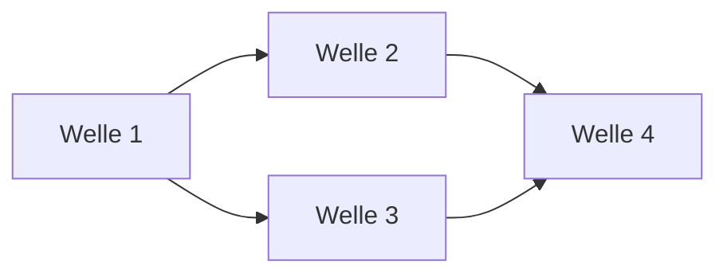

# Roadmap

> **Template-Hinweis.** Vorlage für die Roadmap des Repos. Kopiere nach
> `docs/plan/planning/in-progress/roadmap.md` (oder dem in deinem Repo
> üblichen Pfad) und ersetze Platzhalter. Lösche diesen Block.

**Status:** Aktiv. **Letzte Änderung:** YYYY-MM-DD.

**Format-Regel:** Die Roadmap ist eine Reihenfolge von **Wellen**,
keine Reihenfolge von Terminen (siehe
Baseline-Regelwerk `modul-06-roadmap.md`).
Termine werden — falls überhaupt — als Konsequenz der Wellen-Schätzung
gezeigt, nicht als Treiber.

---

## Aktuelle Welle

Regeln dieser Sektion: Baseline-Regelwerk `modul-06-roadmap.md`
§Roadmap-Struktur: fünf Abschnitte — genau **eine** aktuelle Welle.

**Welle-ID:** <welle-NN-titel>
**Start:** YYYY-MM-DD
**Geplantes Ende:** YYYY-MM-DD (Schätzung, korrigierbar)

**Closure-Trigger:** <siehe Welle-Datei>

## Nächste Wellen

Regeln dieser Sektion: Baseline-Regelwerk `modul-06-roadmap.md`
§Roadmap-Struktur: fünf Abschnitte — geplante Wellen stehen hier und bekommen **keine** eigene Datei.

| Welle | Trigger | Wichtigste Slices | Geschätzter Aufwand |
|---|---|---|---|
| <welle-N+1> | Welle <N> done | <…> | S/M/L |
| <welle-N+2> | Welle <N+1> done + ADR-<NNNN> accepted | <…> | S/M/L |

## Meilensteine

Regeln dieser Sektion: Baseline-Regelwerk `modul-06-roadmap.md`
§Welle ≠ Meilenstein ≠ Release.

<!--
Externe Versprechen oder interne Trigger-Punkte.
"M2: erstes lauffähiges Lab" ist ein Meilenstein.
-->

| Meilenstein | Welle(n) | Trigger | Status |
|---|---|---|---|
| M1 | <welle-NN> | <…> | erreicht / offen |

## Abhängigkeitsgraph

Regeln dieser Sektion: Baseline-Regelwerk `modul-06-roadmap.md`
§Roadmap-Regeln — Reihenfolge von Wellen, keine Reihenfolge von Terminen.

## Abgeschlossene Wellen

Regeln dieser Sektion: Baseline-Regelwerk `modul-06-roadmap.md`
§Roadmap-Struktur: fünf Abschnitte.

| Welle | Abschluss | Closure-Notiz |
|---|---|---|
| <welle-NN> | YYYY-MM-DD | [`welle-NN-results.md`](../done/welle-NN-results.md) |

## Historische Trigger-Verschiebungen

Regeln dieser Sektion: Baseline-Regelwerk `modul-06-roadmap.md`
§Roadmap-Regeln — Schätzungen sind korrigierbar; die Korrektur wird sichtbar geführt, nicht überschrieben.

<!--
Wenn Wellen umgeplant wurden: Datum, Grund, neue Reihenfolge.
Steering-Loop-relevant.
-->

| Datum | Was wurde geändert? | Warum? |
|---|---|---|
| YYYY-MM-DD | <…> | <…> |
