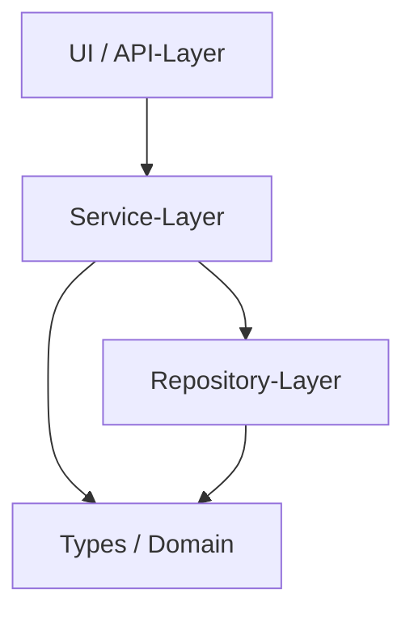
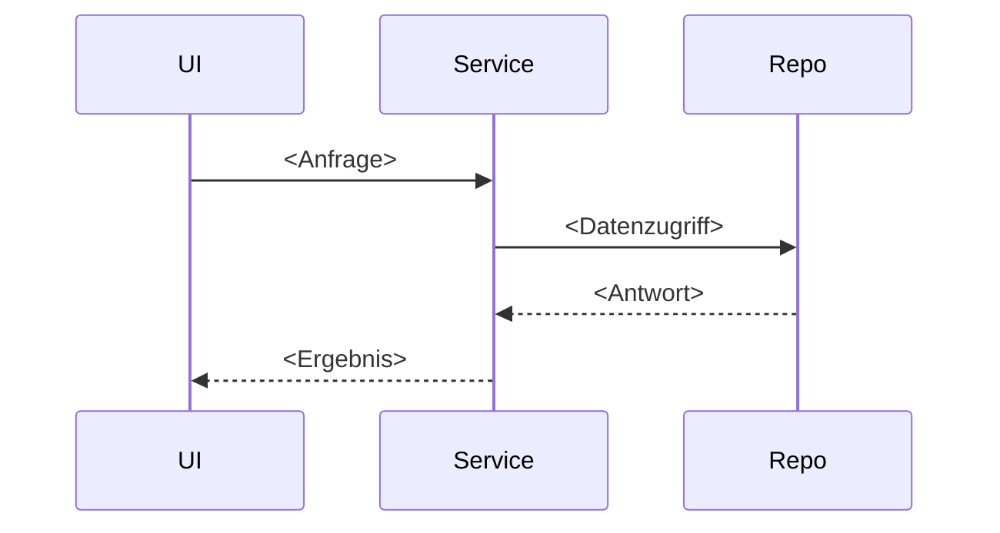

# Architektur — <Projektname>

> **Template-Hinweis.** Diese Datei ist eine Vorlage. Sie ist
> **sprach- und meilensteinfrei** (siehe Hard Rule aus grid-gym in
> [Modul 9](../../../kurs/de/03-agenten/modul-09-implementierung.md)).
> Kopiere sie nach `spec/architecture.md`, ersetze `<Platzhalter>` und
> lösche diesen Block.

**Status:** Aktiv. **Letzte Änderung:** YYYY-MM-DD.

**Hard Rule:** Diese Datei enthält *keine* Wellen, Slices, Commit-Hashes
oder Closure-Daten. Die zeitliche Schicht lebt in
`docs/plan/planning/in-progress/roadmap.md` und den späteren Closure-Notizen.

---

## 1. Komponenten-Übersicht

<!--
Ein Diagramm (Mermaid oder ASCII) der Top-Level-Komponenten.
Jeder Kasten benennt die Schicht/Rolle, nicht die Technologie.

Mermaid-Beispiel siehe unten — durch das Begleit-Lab dokumentiert,
aber zwingend ist nur die Klarheit, nicht das Format.
-->

## 2. Schichten und Constraints

<!--
Pro Schicht: was sie tut, was sie *nicht* tut. Layering-Regeln, die
durch ArchUnit / depguard / import-linter durchgesetzt werden.
ADR-Bezug für jede Regel.

Beispiel-Schema (aus OpenAI-Layering, siehe Modul 4):
Types → Config → Repo → Service → Runtime → UI
-->

| Schicht | Verantwortlichkeit | Darf importieren | Darf NICHT importieren | ADR |
|---|---|---|---|---|
| Types | Domain-Modell, Pure | — | alles andere | <ADR-NN> |
| Config | Konfiguration laden/validieren | Types | Service, Runtime, UI | <ADR-NN> |
| Repo | Datenzugriff | Types, Config | Service, Runtime, UI | <ADR-NN> |
| Service | Geschäftslogik | Types, Config, Repo | Runtime, UI | <ADR-NN> |
| Runtime | Bootstrap, DI | alles oben | — | <ADR-NN> |
| UI | API / CLI / GUI | alles oben außer Repo | Repo direkt | <ADR-NN> |

## 3. Externe Abhängigkeiten

<!--
Welche externen Systeme/Bibliotheken sind Teil der Architektur, mit
Wahl-ADR.
-->

| System | Rolle | ADR | Substituierbarkeit |
|---|---|---|---|
| <…> | <…> | <ADR-NN> | <…> |

## 4. Sequenz-Diagramme

<!--
Für jeden kritischen Use-Case (aus Lastenheft) eine Sequenz.
Schichten als Lanes, Aktionen mit IDs aus dem Lastenheft.
-->

### Use-Case: <LH-FA-NN — Titel>

## 5. Fehlermodelle und Resilienz

<!-- Wo werden Fehler abgefangen, propagiert, geloggt. -->

| Fehlerquelle | Behandlung-Schicht | Logging |
|---|---|---|
| <…> | <…> | <…> |

## 6. ADR-Index

<!--
Liste aller ADRs, die die Architektur direkt prägen. Volle Liste
liegt in docs/plan/adr/README.md.
-->

- [ADR-0001](../docs/plan/adr/0001-...md) — <Titel>
- [ADR-0002](../docs/plan/adr/0002-...md) — <Titel>
